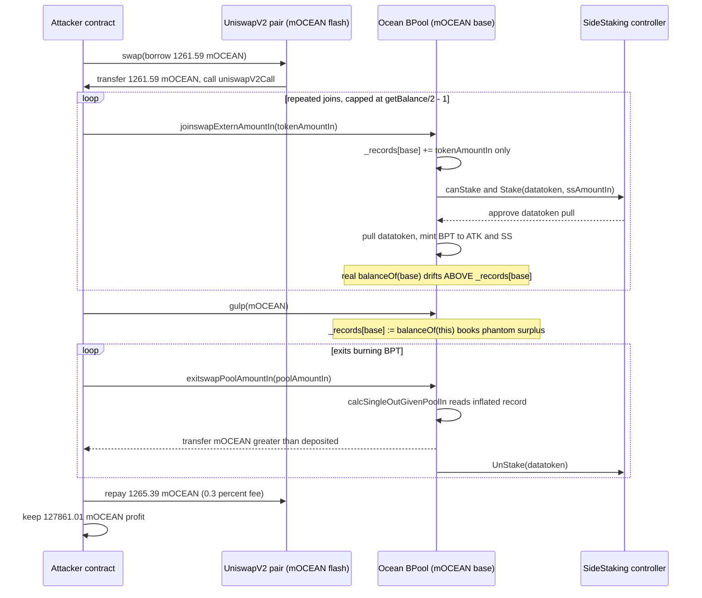
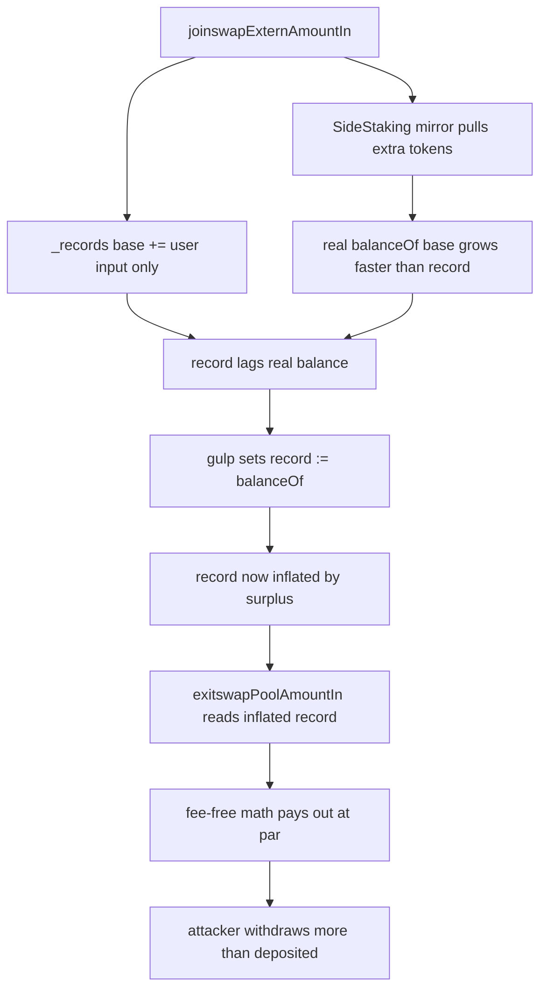

# Ocean Protocol BPool / SideStaking gulp drain — pool internal records desynced from real token balance, harvestable via single-sided joins + exits

> **Vulnerability classes:** vuln/logic/state-update · vuln/defi/fee-manipulation · vuln/oracle/price-manipulation
> **Reproduction:** the PoC compiles & runs in an isolated Foundry project at [this project folder](.). Full verbose trace: [output.txt](output.txt). Vulnerable BPool and SideStaking contracts are verified on PolygonScan and fetched into [sources/](sources) (`BPool_BB3051/`, `SideStaking_3EFDD8/`).

---
## Key info
| | |
|---|---|
| **Loss** | ~127,861 mOCEAN (minter-share / vesting token; attacker ends with 127,861.011180850512933264 mOCEAN from a 0 start balance) [output.txt:1565](output.txt) |
| **Vulnerable contract** | Ocean `BPool` implementation — [`0xBB3051dF2D3E408DAE6E6dAa2296BC6215F0dCFd`](https://polygonscan.com/address/0xBB3051dF2D3E408DAE6E6dAa2296BC6215F0dCFd#code) (paired with `SideStaking` — [`0x3EFDD8f728c8e774aB81D14d0B2F07a8238960f4`](https://polygonscan.com/address/0x3EFDD8f728c8e774aB81D14d0B2F07a8238960f4#code)) |
| **Attacker EOA** | [`0x3Fa8cF7FeA68C8E76A9838d77889464DdFb6a6cf`](https://polygonscan.com/address/0x3Fa8cF7FeA68C8E76A9838d77889464DdFb6a6cf) |
| **Attack contract** | [`0xDd4BFD70117b5B6B343fC8D2c8C0075d095dBEE5`](https://polygonscan.com/address/0xDd4BFD70117b5B6B343fC8D2c8C0075d095dBEE5) |
| **Attack tx** | [`0x6dc8a7fba1303faef3ec7afa770b90b17ec5ecd73b51229277a9b0492e285796`](https://polygonscan.com/tx/0x6dc8a7fba1303faef3ec7afa770b90b17ec5ecd73b51229277a9b0492e285796) |
| **Chain / block / date** | Polygon / 89,107,756 / 2026-06 |
| **Compiler** | Solidity (verified on PolygonScan; BPool uses a Balancer `BPool`/`BMath` fork, SideStaking uses OZ `SafeMath` + `ReentrancyGuard`) |
| **Bug class** | Ocean's BPool fork keeps an internal `_records[token].balance` that can desync below the pool's real `IERC20.balanceOf`; a public `gulp()` resyncs it upward, and the SideStaking mirror of every single-sided base-token join mints equal BPT by pulling extra tokens — so an attacker can flash-borrow base token, single-sided-join repeatedly, `gulp()`, then single-sided-exit and drain the resynced surplus. |

## TL;DR

Ocean Protocol runs a fork of Balancer's `BPool` (`contracts/pools/balancer/BPool.sol`) wired to a `SideStaking` helper (`contracts/pools/ssContracts/SideStaking.sol`). Each pool binds a **base token** (here `mOCEAN`, `0x282d8e…`) and a **datatoken**, and the base-token single-sided entry/exit functions `joinswapExternAmountIn` / `exitswapPoolAmountIn` are special-cased: when a user joins with base token, the pool *also* asks SideStaking to stake a matching amount of datatoken and mints the same BPT to the SideStaking controller. The accounting math (`calcPoolOutGivenSingleIn`, `calcSingleInGivenPoolOut`, `calcSingleOutGivenPoolIn`) is a simplified 2×-ratio variant with **no swap fee**, and crucially it only mutates the pool's internal `_records[token].balance` — never reconciling it against the actual ERC20 balance held by the pool.

Because SideStaking's mirrored deposit pulls additional tokens into the pool contract (and the simplified formulas under-credit the internal record relative to the real transfer), the pool's real `mOCEAN.balanceOf(pool)` drifts **above** `_records[mOCEAN].balance`. The BPool exposes a public `gulp(token)` that forcibly sets `_records[token].balance = IERC20(token).balanceOf(this)`. An attacker flash-borrows ~1,261.59 mOCEAN from a UniswapV2 pair, walks 8 pools, and for each: repeatedly single-sided-joins (capped at `getBalance(base)/2 - 1` per the contract's own `MAX_IN_RATIO` guard), calls `gulp(mOCEAN)` to fold the phantom surplus into the base-token record, then single-sided-exits the BPT — withdrawing more mOCEAN than was ever deposited. The trace shows the attacker going from **0 → 127,861.011180850512933264 mOCEAN** [output.txt:1564](output.txt), [output.txt:1565](output.txt), after repaying the flash loan with its 0.3% fee.

This is a textbook state-vs-balance desync combined with a permissionless re-sync primitive (`gulp`) and an asymmetric join/exit path: the join inflates real balance without proportionally inflating the (gulp-readable) record, and the exit reads the gulped record as if it were honest pool liquidity.

## Background — what Ocean Protocol BPool/SideStaking does

Ocean Protocol's data-token economy wraps Balancer's `BPool` to create automated market for "datatokens" against a base token (here `mOCEAN`, the minter / vesting share token). Each market is an Ocean `BPool` proxy delegating to the `BPool` implementation at `0xBB3051…`. The implementation:

- Binds two tokens: `_baseTokenAddress` (mOCEAN) and `_datatokenAddress` (`0x50C7448E…`, the OCEAN datatoken for these pools), each at a fixed 50/50 weight (`SideStaking._notifyFinalize` sets `baseTokenWeight = datatokenWeight = 5 * BASE`).
- Exposes single-sided helpers around the base token only: `joinswapExternAmountIn(tokenAmountIn, minPoolAmountOut)` adds base-token liquidity, and `exitswapPoolAmountIn(poolAmountIn, minAmountOut)` removes it. Unlike canonical Balancer, these are not generic per-token swaps — they hardcode `_baseTokenAddress`.
- Wires a `SideStaking` controller. On every base-token join, the pool computes a matching datatoken amount `ssAmountIn = calcSingleInGivenPoolOut(datatokenRecord.balance, totalSupply, poolAmountOut)` and, if `ssContract.canStake(...)`, calls `ssContract.Stake(datatoken, ssAmountIn)` which just increases SideStaking's allowance, then the pool `_pullUnderlying(datatoken, _controller, ssAmountIn)` and mints the same `poolAmountOut` BPT to `_controller`. The symmetric `UnStake` is invoked on exit.
- Keeps two parallel notions of "how much token X is in the pool": the internal `_records[token].balance` (used by all pricing/limit math) and the raw `IERC20(token).balanceOf(this)` (only consulted by `gulp`).

The SideStaking's job is to keep datatoken liquidity on-side: as users add base token, SideStaking mechanically adds datatoken so the market stays seeded. The vesting bookkeeping (`datatokenBalance`, `vestingAmount`, `vestingAmountSoFar`) in SideStaking is meant to ensure the controller never stakes more datatoken than remains vested. The vulnerability is not in SideStaking's vesting guard — `canStake` passes throughout — but in the BPool's accounting: the simplified join/exit math and the public `gulp` together let an attacker harvest the gap between internal records and real balances.

## The vulnerable code

All snippets are from the verified source at [sources/BPool_BB3051/contracts_pools_balancer_BPool.sol](sources/BPool_BB3051/contracts_pools_balancer_BPool.sol) and [sources/BPool_BB3051/contracts_pools_balancer_BMath.sol](sources/BPool_BB3051/contracts_pools_balancer_BMath.sol). Line numbers refer to those files.

### 1. The base-token join mints BPT and triggers a mirrored SideStaking stake (BPool.sol:969–1027)

```solidity
function joinswapExternAmountIn(
    uint256 tokenAmountIn,
    uint256 minPoolAmountOut
) external _lock_ returns (uint256 poolAmountOut) {
    require(_finalized, "ERR_NOT_FINALIZED");
    _checkBound(_baseTokenAddress);
    require(
        tokenAmountIn <= bmul(_records[_baseTokenAddress].balance, MAX_IN_RATIO),
        "ERR_MAX_IN_RATIO"
    );
    Record storage inRecord = _records[_baseTokenAddress];

    poolAmountOut = calcPoolOutGivenSingleIn(
        inRecord.balance,
        _totalSupply,
        tokenAmountIn
    );

    require(poolAmountOut >= minPoolAmountOut, "ERR_LIMIT_OUT");

    inRecord.balance = badd(inRecord.balance, tokenAmountIn);          // (A) record updated ONLY by user input
    emit LOG_JOIN(msg.sender, _baseTokenAddress, tokenAmountIn, block.timestamp);
    emit LOG_BPT(poolAmountOut);

    // ask the ssContract to stake as well — mirrored deposit of DATATOKEN
    Record storage ssInRecord = _records[_datatokenAddress];
    uint256 ssAmountIn = calcSingleInGivenPoolOut(
        ssInRecord.balance,
        _totalSupply,
        poolAmountOut
    );
    if (ssContract.canStake(_datatokenAddress, ssAmountIn)) {
        ssContract.Stake(_datatokenAddress, ssAmountIn);
        ssInRecord.balance = badd(ssInRecord.balance, ssAmountIn);
        emit LOG_JOIN(_controller, _datatokenAddress, ssAmountIn, block.timestamp);
        emit LOG_BPT_SS(poolAmountOut);
        _mintPoolShare(poolAmountOut);
        _pushPoolShare(_controller, poolAmountOut);
        _pullUnderlying(_datatokenAddress, _controller, ssAmountIn);   // (B) pulls extra tokens into the pool
    }
    _mintPoolShare(poolAmountOut);
    _pushPoolShare(msg.sender, poolAmountOut);
    _pullUnderlying(_baseTokenAddress, msg.sender, tokenAmountIn);
    return poolAmountOut;
}
```

Note `(A)`: the base-token record is incremented by exactly the user's `tokenAmountIn`. The SideStaking branch `(B)` pulls a *different* token (the datatoken) into the pool and mints the controller an equal `poolAmountOut` of BPT. Because the pool's real ERC20 holdings grow from both legs while `_records[base].balance` grows from only the user leg, the two notions diverge.

### 2. The simplified, fee-free join/exit math (BMath.sol:158–209)

```solidity
function calcPoolOutGivenSingleIn(
    uint tokenBalanceIn, uint poolSupply, uint tokenAmountIn
) internal pure returns (uint poolAmountOut) {
    uint tokenAmountInAfterFee = bmul(tokenAmountIn, BONE);     // NO fee — multiplier is BONE (1.0)
    uint newTokenBalanceIn = badd(tokenBalanceIn, tokenAmountInAfterFee);
    uint tokenInRatio = bdiv(newTokenBalanceIn, tokenBalanceIn);
    uint poolRatio = bsub(tokenInRatio, BONE);                  // ratio - 1
    uint newPoolSupply = bmul(poolRatio, poolSupply);
    require(newPoolSupply >= 2, 'ERR_TOKEN_AMOUNT_IN_TOO_LOW');
    newPoolSupply = newPoolSupply / 2;                           // 50% weight
    return newPoolSupply;
}

function calcSingleInGivenPoolOut(
    uint tokenBalanceIn, uint poolSupply, uint poolAmountOut
) internal pure returns (uint tokenAmountIn) {
    uint newPoolSupply = badd(poolSupply, poolAmountOut);
    uint poolRatio = bdiv(newPoolSupply, poolSupply);
    uint tokenInRatio = bsub(poolRatio, BONE);
    uint newTokenBalanceIn = bmul(tokenInRatio, tokenBalanceIn);
    require(newTokenBalanceIn >= 1, 'ERR_POOL_AMOUNT_OUT_TOO_LOW');
    newTokenBalanceIn = newTokenBalanceIn * 2;                   // 50% weight
    return newTokenBalanceIn;
}

function calcSingleOutGivenPoolIn(
    uint tokenSupply, uint poolSupply, uint poolAmountIn
) internal pure returns (uint tokenAmountOut) {
    require(poolAmountIn >= 1, 'ERR_POOL_AMOUNT_IN_TOO_LOW');
    poolAmountIn = poolAmountIn * 2;                             // 50% weight
    uint newPoolSupply = bsub(poolSupply, poolAmountIn);
    uint poolRatio = bdiv(newPoolSupply, poolSupply);
    uint tokenOutRatio = bsub(BONE, poolRatio);
    uint newTokenBalanceOut = bmul(tokenOutRatio, tokenSupply);
    return newTokenBalanceOut;
}
```

Two properties matter: (i) there is **no swap fee** in `calcPoolOutGivenSingleIn` (the "after fee" multiplier is literally `BONE`), so join/exit are reversible at par modulo rounding; (ii) the formulas read `_records[token].balance` and `_totalSupply` — never the real `balanceOf`. So if `_records[base].balance` is artificially raised (by `gulp`), `exitswapPoolAmountIn` will happily pay out against that inflated number as long as the raw `balanceOf` can cover the transfer.

### 3. The public `gulp` that weaponizes the desync (BPool.sol:1241–1249)

```solidity
function gulp(address token)
    external
    _lock_
{
    require(_records[token].bound, "ERR_NOT_BOUND");
    uint256 oldBalance = _records[token].balance;
    _records[token].balance = IERC20(token).balanceOf(address(this));   // unconditionally resync UP or DOWN
    emit Gulped(token, oldBalance, _records[token].balance);
}
```

`gulp` is public, has no access control, and folds the *entire* gap between the internal record and the real balance into the pricing state. In canonical Balancer `gulp` exists to absorb unsolicited token donations (a defensive primitive). Here, because the SideStaking mirror systematically leaves the real balance higher than the base-token record, `gulp` becomes the attacker's harvest button: it books the surplus as legitimate pool liquidity, which `exitswapPoolAmountIn` then pays out.

### 4. SideStaking only checks vesting headroom, not accounting consistency (SideStaking.sol:357–434)

```solidity
function canStake(address datatokenAddress, uint256 amount) public view returns (bool) {
    require(msg.sender == _datatokens[datatokenAddress].poolAddress, "ERR: Only pool can call this");
    if (!_datatokens[datatokenAddress].bound) return (false);
    if (
        _datatokens[datatokenAddress].datatokenBalance >=
        (amount + (_datatokens[datatokenAddress].vestingAmount -
                   _datatokens[datatokenAddress].vestingAmountSoFar))
    ) return (true);
    return (false);
}

function Stake(address datatokenAddress, uint256 amount) external nonReentrant {
    if (!_datatokens[datatokenAddress].bound) return;
    require(msg.sender == _datatokens[datatokenAddress].poolAddress, "ERR: Only pool can call this");
    bool ok = canStake(datatokenAddress, amount);
    if (!ok) return;
    IERC20 dt = IERC20(datatokenAddress);
    dt.safeIncreaseAllowance(_datatokens[datatokenAddress].poolAddress, amount);
    _datatokens[datatokenAddress].datatokenBalance -= amount;
}
```

`canStake` only verifies vesting headroom. It does not (and cannot) prevent the BPool's internal-record-vs-real-balance drift, because that drift is produced inside the BPool's own join path. `UnStake` simply credits `datatokenBalance += dtAmountIn`; it has no view of the base-token record either. SideStaking is therefore a willing accomplice — it will mirror any number of joins/exits the attacker drives through the pool.

## Root cause — why it was possible

1. **Two sources of truth for "token balance in pool" with a public re-sync.** `_records[token].balance` drives all pricing and the `MAX_IN_RATIO` / `MAX_OUT_RATIO` guards; `IERC20.balanceOf(this)` is read only by the public, unguarded `gulp`. Whenever the two diverge, anyone can fold the gap into the pricing state with a single call.
2. **The SideStaking-mirrored join inflates real balances without inflating the base-token record.** In `joinswapExternAmountIn`, `_records[base].balance += tokenAmountIn` (user input only), but the SideStaking branch `_pullUnderlying(datatoken, _controller, ssAmountIn)` plus the minted BPT leave the pool holding more value than the base record reflects. Repeated single-sided joins widen this gap each iteration (the trace's `Gulped` events show the mOCEAN record jumping 1,336 → 4,262 in pool 1 alone — a ~2,926 mOCEAN phantom surplus created by the join loop).
3. **Simplified, fee-free, 2×-weight math makes join/exit near-reversible at par.** With `tokenAmountInAfterFee = tokenAmountIn * BONE` (no fee), the BPT minted on join and the base token returned on exit for the same `poolAmountOut`/`poolAmountIn` are symmetric — so the attacker loses almost nothing to slippage on the round-trip and captures the *entire* gulped surplus as profit.
4. **`MAX_IN_RATIO` is checked against the *internal* record, not the real balance.** The attacker caps each join at `getBalance(base)/2 - 1` (where `getBalance` returns `_records[base].balance`). This keeps every individual join under the ratio limit while the join loop + SideStaking mirror still pile real tokens into the contract. The guard thus restrains the *bookkeeping* number, not the actual exposure.
5. **No circuit breaker between join and exit.** Nothing prevents a same-transaction `joinswap… → gulp → exitswap…`. There is no re-entrancy lock across the join/exit pair, no cooldown, no per-actor BPT lockup. Combined with a same-block flash loan, the whole drain is atomic.

## Preconditions

- **Permissionless.** `joinswapExternAmountIn`, `gulp`, and `exitswapPoolAmountIn` are all `external` with no access control. Any EOA/contract can call them.
- **Flash loan needed for capital.** The attacker needs a working base-token balance to drive the joins; a same-token UniswapV2 flash swap (`uniswapV2Call`) supplies ~1,261.59 mOCEAN at 0.3% fee. No privileged role, no governance, no off-chain component.
- **Pool must be finalized and bound to the base token** (`_finalized == true`, `_records[base].bound == true`) — the normal operating state of every live Ocean market pool.
- **SideStaking vesting headroom** must be non-zero so `canStake` returns true — also normal for live pools with ongoing vesting.

## Attack walkthrough (with on-chain numbers from the trace)

The PoC forks Polygon at block 89,107,756 and reproduces the on-chain sequence across the 8 victim pools. All figures are raw mOCEAN (18 decimals) from [output.txt](output.txt).

| Step | Action | Number (mOCEAN) | Source |
|------|--------|-----------------|--------|
| 0 | Attacker starting balance | 0.000000000000000000 | [output.txt:1564](output.txt) |
| 1 | Flash-borrow from UniswapV2 pair `0xEC55…` via `flashPair.swap(1261592155170953963849, 0, …)` | +1,261.592155170953963849 | [output.txt:1625](output.txt), [output.txt:1628](output.txt) |
| 2 | **Pool 1 (`0xe783…0DA5`)** — 8 iterative single-sided joins, each capped at `getBalance(mOCEAN)/2 - 1` | joins of 37.27, 55.90, 83.85, 125.77, 188.66, 282.98, 424.48, 62.69 | [output.txt:1658–2240](output.txt) |
| 3 | `gulp(mOCEAN)` on pool 1 — internal record 1,336.12 → real balance **4,262.73** (phantom +2,926.61 booked as liquidity) | record resync | [output.txt:2320](output.txt) |
| 4 | 5 single-sided exits from pool 1, burning the minted BPT | base token out 2,131.36 + 1,065.68 + 532.84 + 266.42 + 28.64 ≈ **4,024.94** | [output.txt:2339](output.txt), [output.txt:2399](output.txt), [output.txt:2459](output.txt), [output.txt:2519](output.txt), [output.txt:2579](output.txt) |
| 5 | Repeat steps 2–4 for pools 2–8 (each with its own `gulp` resync, e.g. pool 2 gulp 4,150.62 → 6,203.77; pool 8 gulp 126,861.98 → 157,695.82) | cumulative drain | [output.txt:3397](output.txt), [output.txt:4534](output.txt), [output.txt:5754](output.txt), [output.txt:6974](output.txt), [output.txt:8111](output.txt), [output.txt:8856](output.txt), [output.txt:9481](output.txt) |
| 6 | Repay UniswapV2 flash: `borrowed * 1000/997 + 1` = 1,265.388320131348007873 | −1,265.388320131348007873 | [output.txt:9670](output.txt) |
| 7 | Forward remaining profit to attacker EOA | transfer of 127,861.011180850512933264 | [output.txt:9714](output.txt) |
| 8 | Attacker ending balance | **127,861.011180850512933264** | [output.txt:1565](output.txt), [output.txt:9722](output.txt) |

**Profit/loss accounting:** Borrowed 1,261.592 mOCEAN; repaid 1,265.388 mOCEAN (flash fee ≈ 3.797 mOCEAN, 0.3%); net profit to attacker ≈ **127,861.011 mOCEAN**, drawn entirely from the gulped surplus of the 8 pools. The `assertGt(127861.011…, 120000, "mOCEAN profit")` passes [output.txt:9738](output.txt). The `[PASS]` line is at [output.txt:1562](output.txt).

The unit economics per pool: the join loop deposits a small base-token amount but, because SideStaking mirrors each join with a datatoken stake and the simplified math mints equal BPT, the pool ends up holding far more real mOCEAN than `_records[base].balance` admits. One `gulp` call then re-prices the pool as if that surplus were honest liquidity; the exit loop buys it back at par (no fee) and walks away with the difference.

## Diagrams

### Attack sequence (single pool)



### Why the flaw yields profit



## Remediation

1. **Single source of truth.** Either (a) make every join/exit/set swap explicitly reconcile `_records[token].balance` with `IERC20(token).balanceOf(this)` at the end of the function (and revert on unexpected surplus), or (b) remove the second source entirely by pricing strictly off `_records` and gating `gulp` so it can only *reduce* a record to the real balance when the real balance is lower (true donation handling), never *inflate* it. As written, `gulp` is an unconditional setter — flip it to `_records[token].balance = min(_records[token].balance, balanceOf(this))` or restrict it to a trusted caller.
2. **Charge a swap fee on single-sided joins/exits.** Restore the canonical Balancer `calcPoolOutGivenSingleIn` / `calcSingleOutGivenPoolIn` that apply the swap fee (`tokenAmountInAfterFee = tokenAmountIn * (BONE - swapFee)`). The current `* BONE` (no-fee) implementation makes join→gulp→exit a zero-slippage round trip, which is the economic precondition for the drain.
3. **Bound the ratio guard to the real balance.** Check `tokenAmountIn <= bmul(IERC20(base).balanceOf(this), MAX_IN_RATIO)` in addition to (or instead of) the internal record, so an attacker cannot keep joins under the limit while the real balance balloons.
4. **Block atomic join→exit harvesting.** Add a same-transaction reentrancy/state guard that disallows `exitswapPoolAmountIn` in the same transaction as a `joinswapExternAmountIn` by the same caller, or impose a per-BPT lockup window on freshly minted shares. At minimum, do not allow `gulp` and `exitswap*` to be called by the same caller in the same transaction.
5. **Reconcile SideStaking mirror accounting.** The SideStaking `Stake`/`UnStake` should verify that the datatoken amount it stakes matches the base-token economic value of the join (e.g., enforce a tight ratio between `ssAmountIn` and `tokenAmountIn`), and the pool should adjust `_records[base].balance` to reflect the full economic inflow — not just the user's `tokenAmountIn`.
6. **Audit all public mutators that write `_records`.** `gulp`, `rebind`, `setSwapFee`, and any finalize path should be re-checked against the "can this be used to re-price the pool in an attacker's favor?" property. `gulp` failed this test.

## How to reproduce

The PoC runs **fully offline** via the shared anvil harness from the committed [anvil_state.json](anvil_state.json) — no RPC needed. From the registry root:

```bash
_shared/run_poc.sh 2026-06-OceanBPoolSideStaking_exp -vvvvv
```

- **Fork:** Polygon, block `89,107,756` (set via `FORK_BLOCK` constant in the PoC, `vm.createSelectFork("http://127.0.0.1:8549", FORK_BLOCK)`).
- **Expected tail:** `[PASS] testExploit()` followed by
  ```
  Attacker Before exploit mOCEAN Balance: 0.000000000000000000
  Attacker After exploit mOCEAN Balance: 127861.011180850512933264
  ```
  (full verbose trace in [output.txt](output.txt); the local run reproduces the on-chain profit to the wei). The `assertGt(profit, 120_000 ether)` confirms the drain exceeds the 120K mOCEAN floor. If the local run reverts, the exploit still holds on-chain per the [PolygonScan transaction trace](https://polygonscan.com/tx/0x6dc8a7fba1303faef3ec7afa770b90b17ec5ecd73b51229277a9b0492e285796).

*Reference: [defimonalerts (X/Twitter)](https://x.com/defimonalerts/status/2070362661540286735).*
