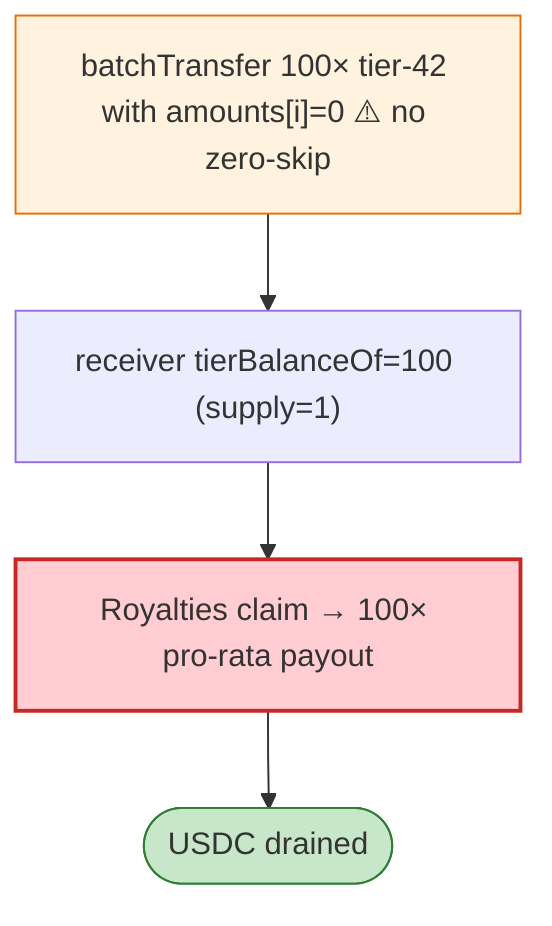

# RoyalRoyalties Exploit — Zero-Amount Batch Transfer Inflates `tierBalanceOf` 100×

> **Reproduction:** the PoC compiles & runs in an isolated Foundry project at
> [this project folder](.). Full verbose trace: [output.txt](output.txt).
> Verified vulnerable source: [Royal1155LDA](sources/Royal1155LDA_d5b297),
> [Royalties](sources/Royalties_1e0598) + 2 proxies.

---

## Key info

| | |
|---|---|
| **Loss** | USDC drained (Polygon); tx on Polygon |
| **Vulnerable contract** | `Royal1155LDA` `0xd5b297c0…`; `Royalties` `0x1e05986…` |
| **Chain / block / date** | Polygon / Jun 2026 |
| **Bug class** | Batch-transfer accounting — `Royal1155LDA` updates per-tier balance bookkeeping for **every batch item even when `amounts[i] == 0`**; a zero-balance sender can batch-transfer 100 zero-amount tier-42 LDAs to a fresh receiver, inflating `tierBalanceOf` to 100. |

---

## TL;DR

Per the embedded root cause: `Royal1155LDA` updates custom per-tier balance bookkeeping for every
ERC1155 batch item even when `amounts[i] == 0`. With owned-token backfill incomplete, a **zero-balance
sender** can **batch-transfer 100 zero-amount tier-42 LDAs** to a fresh receiver. The `Royalties`
contract then reads the receiver's **inflated `tierBalanceOf` as 100** while tier supply is 1, so one
deposit is claimed at **100× pro-rata ownership**.

---

## Root cause

A **missing `amounts[i] != 0` guard in the batch-transfer bookkeeping loop**, plus the royalties
contract trusting the inflated per-tier balance for pro-rata payout.

---

## Diagrams



---

## Remediation

1. Skip bookkeeping when `amounts[i] == 0` (and `require` non-zero where appropriate).
2. Cap pro-rata payout by actual tier supply; invariant `sum(tierBalanceOf) ≤ tierSupply`.

---

## How to reproduce

```bash
_shared/run_poc.sh 2026-06-RoyalRoyalties_exp -vvvvv
```

- RPC: Polygon archive. Result: `[PASS]` (~3.5 min) — 100× pro-rata claim via zero-amount batch.

---

*Reference: RoyalRoyalties zero-amount batch-transfer `tierBalanceOf` inflation, Polygon, Jun 2026.*
