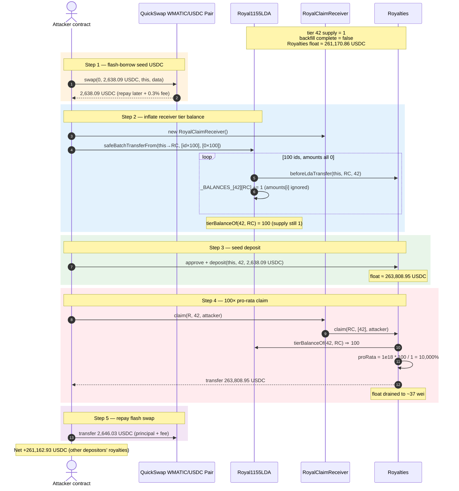
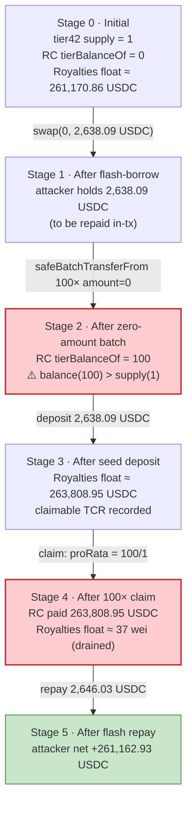
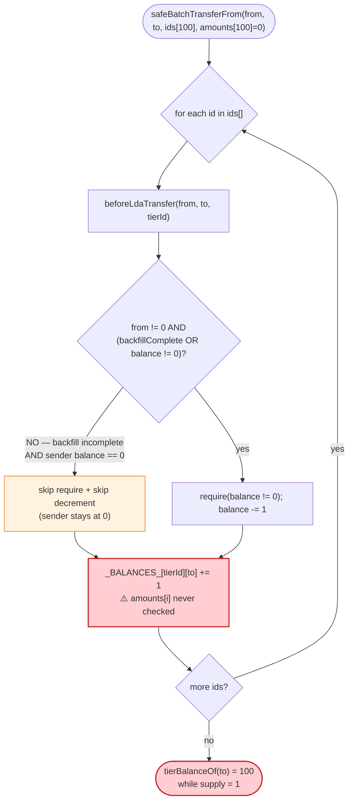
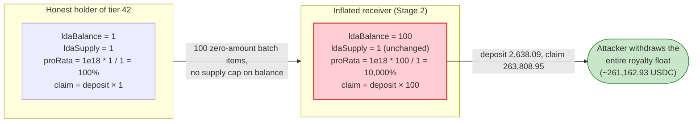

# RoyalRoyalties Exploit — Zero-Amount ERC-1155 Batch Transfer Inflates `tierBalanceOf` 100×

> **Reproduction:** the PoC compiles & runs in an isolated Foundry project at
> [this project folder](.). It forks Polygon at block 89,018,050 and drives the
> live `Royal1155LDA` + `Royalties` proxies. Full verbose trace:
> [output.txt](output.txt). Verified vulnerable source (active implementations
> at the fork block): [contracts_ldas_Royal1155LDA.sol](sources/Royal1155LDA_d5b297/contracts_ldas_Royal1155LDA.sol)
> and [contracts_royalties_Royalties.sol](sources/Royalties_1e0598/contracts_royalties_Royalties.sol).

---

## Key info

| | |
|---|---|
| **Loss** | **261,162.93 USDC** — drained from the `Royalties` payout float on Polygon |
| **Vulnerable contract** | `Royal1155LDA` (logic impl) — [`0xd5b297c08d890376b6cbdba6023a39ffbdf65c78`](https://polygonscan.com/address/0xd5b297c08d890376b6cbdba6023a39ffbdf65c78#code), behind proxy [`0x7c885c4bFd179fb59f1056FBea319D579A278075`](https://polygonscan.com/address/0x7c885c4bFd179fb59f1056FBea319D579A278075) |
| **Co-vulnerable contract** | `Royalties` (logic impl) — [`0x1e0598614d9168a657cb57bd038dfd71812c9074`](https://polygonscan.com/address/0x1e0598614d9168a657cb57bd038dfd71812c9074#code), behind proxy [`0xfE16Ee78828672e86cf8E42d8A5119AB79877EC7`](https://polygonscan.com/address/0xfE16Ee78828672e86cf8E42d8A5119AB79877EC7) |
| **Victim float** | `Royalties` proxy USDC balance — ~261,170.86 USDC of un-disbursed royalty deposits |
| **Attacker EOA** | `0xbd829aa63311bb1e3c0ea58a7193364de670bd56` |
| **Attacker contract** | `0x11ca9155aedfeb6772df5ea42ff714db7fba6adb` |
| **Attack tx** | [`0x7a92106f145045b7a2bdce60a22109739f9b0cd0185bf16ff83fd1fac98cb42e`](https://polygonscan.com/tx/0x7a92106f145045b7a2bdce60a22109739f9b0cd0185bf16ff83fd1fac98cb42e) |
| **Chain / block / date** | Polygon (chainId 137) / fork 89,018,050 / June 2026 |
| **Compiler** | `Royal1155LDA` & `Royalties` logic: Solidity v0.8.4+commit.c7e474f2, optimizer **enabled, 200 runs**; both proxies: v0.8.2+commit.661d1103, optimizer enabled, 200 runs |
| **Bug class** | Per-tier balance accounting inflation via zero-amount ERC-1155 batch items + pro-rata royalty payout that trusts the inflated balance |

---

## TL;DR

1. `Royal1155LDA` is an ERC-1155 that keeps a *custom* per-tier balance ledger
   (`_BALANCES_[tierId][owner]`) on top of standard ERC-1155 balances. The
   `Royalties` contract reads this ledger via `tierBalanceOf` to pay royalty
   deposits out pro-rata to the holders of a tier.

2. The transfer hook `_beforeTokenTransfer`
   ([contracts_ldas_Royal1155LDA.sol:744-830](sources/Royal1155LDA_d5b297/contracts_ldas_Royal1155LDA.sol#L744-L830))
   iterates over the `ids[]` array of a batch transfer and **increments the
   receiver's per-tier balance for every entry — without ever inspecting
   `amounts[i]`.** A batch item with `amounts[i] == 0` still bumps
   `_BALANCES_[tierId][to]` by one.

3. The sender-side decrement is *skipped* in a specific state: when the
   `_OWNED_TOKENS_` backfill is still in progress
   (`!_IS_OWNED_TOKENS_BACKFILL_COMPLETE_`) **and** the sender's tier balance is
   already zero, the "insufficient balance" branch is bypassed
   ([:776-801](sources/Royal1155LDA_d5b297/contracts_ldas_Royal1155LDA.sol#L776-L801)).
   At the fork block `getIsOwnedTokensBackfillComplete()` returns `false`
   ([output.txt:49](output.txt)), so a **zero-balance sender** can send freely.

4. The attacker therefore calls `safeBatchTransferFrom` with **100 copies of the
   same tier-42 LDA id and 100 zero amounts**
   ([RoyalRoyalties_exp.sol:142-155](test/RoyalRoyalties_exp.sol#L142-L155)). The
   hook fires 100 times and walks the receiver's `_BALANCES_[42][receiver]` from
   `0` to `100` ([output.txt:1774](output.txt)), while the tier's real supply is
   `1` ([output.txt:43](output.txt)).

5. The attacker flash-borrows USDC, makes a royalty `deposit(…, tierId=42,
   amount=2,638.09 USDC)` ([output.txt:1900-1901](output.txt)), then `claim`s
   through the inflated receiver. `Royalties._getProRataOwnership(100, 1)`
   ([contracts_royalties_Royalties.sol:1278-1287](sources/Royalties_1e0598/contracts_royalties_Royalties.sol#L1278-L1287))
   computes **10,000 % ownership**, so the claim pays out **100 × the deposit =
   263,808.95 USDC** ([output.txt:1929](output.txt)) — funded by other depositors'
   royalties already sitting in the contract.

6. After repaying the flash swap, the attacker keeps **261,162.926278 USDC**
   ([output.txt:7](output.txt), [output.txt:1976](output.txt)) — almost the
   entire royalty float of the `Royalties` contract.

---

## Background — what RoyalRoyalties does

Royal.io issues music-royalty NFTs called **LDAs** ("Limited Digital Assets") as
ERC-1155 tokens via `Royal1155LDA`
([source](sources/Royal1155LDA_d5b297/contracts_ldas_Royal1155LDA.sol)). An LDA
id packs three fields into a `uint256`
([RoyalUtil.sol comment](sources/Royal1155LDA_d5b297/contracts_shared_RoyalUtil.sol)):
`[ tier_id (128 bits) | version (16 bits) | token_id (112 bits) ]`. A *tier*
(e.g. GOLD/PLATINUM/DIAMOND of a song) groups many individual token ids; each
token id has supply 1.

Two custom ledgers matter for this bug:

- **`_BALANCES_[tierId][owner]`** — the number of LDAs an address owns *within a
  tier* ([:120-122](sources/Royal1155LDA_d5b297/contracts_ldas_Royal1155LDA.sol#L120-L122)),
  exposed via `tierBalanceOf`
  ([:595-605](sources/Royal1155LDA_d5b297/contracts_ldas_Royal1155LDA.sol#L595-L605)).
- **`_OWNED_TOKENS_` / `_IS_OWNED_TOKENS_BACKFILL_COMPLETE_`** — an enumeration
  the team was migrating in via `setOwnedTokens`; until the owner calls
  `completeOwnedTokensBackfill()` the contract runs in a permissive
  "backfill-incomplete" mode
  ([:252-290](sources/Royal1155LDA_d5b297/contracts_ldas_Royal1155LDA.sol#L252-L290)).

The companion `Royalties` contract
([source](sources/Royalties_1e0598/contracts_royalties_Royalties.sol)) accepts
ERC-20 (USDC) `deposit`s for a tier and lets the tier's holders `claim` their
**pro-rata** share, where pro-rata ownership =
`PRO_RATA_BASE × ldaBalance / ldaSupply`
([:1278-1287](sources/Royalties_1e0598/contracts_royalties_Royalties.sol#L1278-L1287)).
`ldaBalance` is `LDA.tierBalanceOf(tierId, account)`
([:982](sources/Royalties_1e0598/contracts_royalties_Royalties.sol#L982)) and
`ldaSupply` is the tier supply locked in at tier initialization
([:1002](sources/Royalties_1e0598/contracts_royalties_Royalties.sol#L1002)).

On-chain parameters at the fork block (read in the trace):

| Parameter | Value | Source |
|---|---|---|
| `getTierTotalSupply(42)` (tier supply) | **1** | [output.txt:43](output.txt) |
| `getIsOwnedTokensBackfillComplete()` | **false** | [output.txt:49](output.txt) |
| USDC held by `Royalties` proxy (float) | 261,170,864,398 wei (**~261,170.86 USDC**) | [output.txt:64](output.txt) |
| USDC decimals | 6 | [output.txt:38](output.txt) |
| `PRO_RATA_BASE` | 1e18 (= 100 %) | [contracts_royalties_Royalties.sol:121](sources/Royalties_1e0598/contracts_royalties_Royalties.sol#L121) |
| Attacker USDC before | 0 | [output.txt:6](output.txt) |

The decisive combination: tier supply is **1**, the backfill flag is **false**,
and the contract is sitting on ~261K USDC of other people's royalties. Inflate
one address's `tierBalanceOf` from 0 to 100 and the pro-rata math pays it 100×.

---

## The vulnerable code

### 1. The batch-transfer hook increments per-tier balance for every id — ignoring `amounts[i]`

```solidity
function _beforeTokenTransfer(
    address operator,
    address from,
    address to,
    uint256[] memory ids,
    uint256[] memory amounts,      // ← amounts is received...
    bytes memory data
)
    internal
    virtual
    override
{
    // Iterate over all LDAs being transferred
    for (uint256 i; i < ids.length; i++) {
        uint256 ldaId = ids[i];

        // Get the tier ID.
        (uint128 tierId, ,) = RoyalUtil.decomposeLDA_ID(ldaId);

        // Call the callback on the Royalties contract.
        if (_ROYALTIES_CONTRACT_ != address(0)) {
            ILdaTransferHook(_ROYALTIES_CONTRACT_).beforeLdaTransfer(from, to, tierId);
        }
        // ... from-side / to-side bookkeeping below, all keyed off ids[i] only ...
```
([contracts_ldas_Royal1155LDA.sol:744-768](sources/Royal1155LDA_d5b297/contracts_ldas_Royal1155LDA.sol#L744-L768))

`amounts` is accepted but **never read** in the bookkeeping. The receiver-side
update unconditionally adds one per id:

```solidity
// Token enters a wallet: update balance and add token to owner enumeration.
if (to != address(0)) {
    uint256 oldBalance = _BALANCES_[tierId][to];
    _OWNED_TOKENS_[tierId][to][oldBalance] = ldaId;
    _OWNED_TOKENS_INDEX_[ldaId] = oldBalance;

    _BALANCES_[tierId][to] = oldBalance + 1;     // ⚠️ +1 even when amounts[i] == 0
}
```
([contracts_ldas_Royal1155LDA.sol:803-810](sources/Royal1155LDA_d5b297/contracts_ldas_Royal1155LDA.sol#L803-L810))

### 2. The sender-side "insufficient balance" check is bypassed during backfill for a zero-balance sender

```solidity
// Token leaves a wallet: update balance and remove token from owner enumeration.
if (from != address(0)) {
    uint256 balance = _BALANCES_[tierId][from];

    // Special case: If backfill is ongoing AND balance is zero, do not update.
    if (_IS_OWNED_TOKENS_BACKFILL_COMPLETE_ || balance != 0) {
        require(
            balance != 0,
            "ERC1155: insufficient balance for transfer"
        );
        // ... swap-and-pop removal, _BALANCES_[tierId][from] = balance - 1 ...
    }
}
```
([contracts_ldas_Royal1155LDA.sol:776-801](sources/Royal1155LDA_d5b297/contracts_ldas_Royal1155LDA.sol#L776-L801))

When `_IS_OWNED_TOKENS_BACKFILL_COMPLETE_ == false` **and** the sender's
`balance == 0`, the entire `if` body is skipped: no `require`, no decrement. The
sender pays nothing, yet the receiver block above still increments. The net
effect of one zero-amount batch item is: **sender unchanged at 0, receiver +1.**
Repeat 100 times in a single batch and the receiver reaches 100.

### 3. `Royalties` pays out pro-rata using the (inflated) tier balance vs. fixed supply

```solidity
uint256 ldaBalance = LDA.tierBalanceOf(tierId, account);     // == 100 for the receiver
// ...
uint256 ldaSupply = _TIERS_[tierId].supply;                  // == 1
uint256 proRataOwnership = _getProRataOwnership(ldaBalance, ldaSupply);
ucrDiff = _tcrDiffToUcrDiff(tcrDiff, proRataOwnership);
```
([contracts_royalties_Royalties.sol:982-1005](sources/Royalties_1e0598/contracts_royalties_Royalties.sol#L982-L1005))

```solidity
function _getProRataOwnership(uint256 ldaBalance, uint256 ldaSupply)
    internal pure returns (uint256)
{
    return PRO_RATA_BASE * ldaBalance / ldaSupply;          // 1e18 * 100 / 1 = 100e18 = 10,000%
}

function _tcrDiffToUcrDiff(uint256 tcrDiff, uint256 proRataOwnership)
    internal pure returns (uint256)
{
    return tcrDiff * proRataOwnership / PRO_RATA_BASE;       // tcrDiff * 100
}
```
([contracts_royalties_Royalties.sol:1278-1298](sources/Royalties_1e0598/contracts_royalties_Royalties.sol#L1278-L1298))

There is **no invariant** that `ldaBalance <= ldaSupply`. With `ldaBalance =
100` and `ldaSupply = 1`, the claimant is credited with **100×** the deposit it
just made — the difference is paid out of pre-existing royalty deposits.

---

## Root cause — why it was possible

Two independent defects compose into the loss:

1. **`amounts[i]` is never validated in the LDA accounting.** A faithful
   ERC-1155 implementation would only update ownership when `amounts[i] > 0`.
   Here the custom `_BALANCES_` ledger keys off the *number of ids* in the batch,
   not the *quantity transferred*. Because each LDA token id is conceptually
   "supply 1," the code assumed one id ⇒ one unit, and dropped the amount
   entirely. A zero-amount item is therefore free balance inflation.

2. **The "backfill incomplete" mode disables the sender-side balance check for
   zero-balance senders.** This was a migration convenience
   ([:779 comment](sources/Royal1155LDA_d5b297/contracts_ldas_Royal1155LDA.sol#L779)),
   intended so the team could move tokens before `_OWNED_TOKENS_` was fully
   populated. Its side effect is that an address holding **zero** of a tier can
   originate transfers of that tier without reverting — so the attacker does not
   even need to own a single LDA to be the `from`.

3. **`Royalties` trusts `tierBalanceOf` with no supply cap.** The pro-rata
   formula divides by the immutable tier supply but never bounds the numerator by
   it. A balance that exceeds supply silently produces ownership > 100 %, and the
   claim pays out everyone else's deposits.

The two contracts were audited and reasoned about separately; the danger only
appears at the *seam* — the LDA's loose batch accounting feeds the royalties'
trusting pro-rata math. Neither contract on its own loses funds; combined, one
zero-cost batch transfer turns into a 100× royalty claim.

---

## Preconditions

- **`getIsOwnedTokensBackfillComplete() == false`** so the zero-balance sender's
  transfer is not rejected. True at the fork block
  ([output.txt:49](output.txt)); the PoC asserts it
  ([RoyalRoyalties_exp.sol:88](test/RoyalRoyalties_exp.sol#L88)).
- **A tier with small supply that the `Royalties` contract is funded for.** Tier
  42 has supply 1 ([output.txt:43](output.txt)) and the `Royalties` proxy holds
  ~261,170.86 USDC of deposits ([output.txt:64](output.txt)).
- **The LDA contract is registered with the `Royalties` contract** so
  `beforeLdaTransfer` fires and settles UCR for the receiver
  (visible as the repeated `beforeLdaTransfer` callbacks at
  [output.txt:80-81](output.txt)).
- **Working capital in USDC to make the seed deposit.** Only ~2,638.09 USDC is
  needed, and it is recovered intra-transaction, so it is trivially
  **flash-loanable** — the PoC borrows it from the QuickSwap WMATIC/USDC pair via
  a V2 flash swap ([RoyalRoyalties_exp.sol:106](test/RoyalRoyalties_exp.sol#L106),
  [output.txt:66](output.txt)) and repays it with the 0.3 % fee.

---

## Attack walkthrough (with on-chain numbers from the trace)

USDC has 6 decimals; raw wei figures are shown with human approximations in
parentheses. All figures come directly from `output.txt`.

| # | Step | Tier-42 supply | Receiver `tierBalanceOf` | `Royalties` USDC float | Attacker USDC | Effect |
|---|------|---------------:|-------------------------:|-----------------------:|--------------:|--------|
| 0 | **Initial** — supply read ([output.txt:43](output.txt)); backfill=false ([output.txt:49](output.txt)); float read ([output.txt:64](output.txt)) | 1 | 0 | 261,170,864,398 (~261,170.86) | 0 ([output.txt:6](output.txt)) | Honest state. |
| 1 | **Flash-borrow** USDC from QuickSwap pair: `swap(0, 2,638,089,539, …)` ([output.txt:66](output.txt)); 2,638,089,539 (~2,638.09) USDC sent to attacker ([output.txt:67-69](output.txt)) | 1 | 0 | 261,170,864,398 | 2,638,089,539 (~2,638.09) | Working capital acquired in-tx. |
| 2 | **Zero-amount batch inflation** — `safeBatchTransferFrom` of 100 copies of LDA id `14,291,859,410,679,415,465,461,733,512,134,265,305,394` with 100 zero amounts ([output.txt:78](output.txt)); hook walks receiver balance 0→…→100 ([output.txt:91](output.txt) first +1; [output.txt:1774](output.txt) 99→100) | 1 | **100** ([output.txt:1891](output.txt)) | 261,170,864,398 | 2,638,089,539 | Receiver appears to own 100 of a 1-supply tier. |
| 3 | **Seed deposit** — `approve` 2,638,089,539 ([output.txt:1893](output.txt)) then `Royalties.deposit(attacker, 42, 2,638,089,539)` ([output.txt:1900-1904](output.txt)) | 1 | 100 | 263,808,953,937 (~263,808.95) | 0 | Float grows by the deposit; deposit creates a claimable TCR. |
| 4 | **100× claim** — `claim(receiver, [42], attacker)`; `tierBalanceOf` reads 100 ([output.txt:1927](output.txt)); pays `2,638,089,539 × 100 = 263,808,953,900` (~263,808.95) to attacker ([output.txt:1929-1931](output.txt)) | 1 | 100 | ~37 wei (drained) | 263,808,953,900 (~263,808.95) | Royalty float emptied to the attacker. |
| 5 | **Repay flash swap** — transfer 2,646,027,622 (~2,646.03) USDC back to the pair ([output.txt:1950-1952](output.txt)); `Sync`/`Swap` emitted ([output.txt:1967-1968](output.txt)) | 1 | 100 | — | 261,162,926,278 (~261,162.93) | Principal + 0.3 % fee returned; profit retained. |

Final attacker USDC balance: **261,162,926,278 wei = 261,162.926278 USDC**
([output.txt:1976](output.txt), [output.txt:1999](output.txt), logged at
[output.txt:7](output.txt)). The PoC asserts `profit > 260,000e6`
([RoyalRoyalties_exp.sol:95](test/RoyalRoyalties_exp.sol#L95)) and that
`afterBalance - beforeBalance == profit`
([RoyalRoyalties_exp.sol:94](test/RoyalRoyalties_exp.sol#L94)).

### Profit / loss accounting (USDC, raw wei)

| Item | Amount (wei) | ~Human |
|---|---:|---:|
| Flash-borrowed from QuickSwap pair (inflow) | 2,638,089,539 | ~2,638.09 |
| Royalty claim payout (inflow) | 263,808,953,900 | ~263,808.95 |
| **Total inflow** | **266,447,043,439** | **~266,447.04** |
| Seed deposit to `Royalties` (outflow) | 2,638,089,539 | ~2,638.09 |
| Flash-swap repayment incl. 0.3 % fee (outflow) | 2,646,027,622 | ~2,646.03 |
| **Total outflow** | **5,284,117,161** | **~5,284.12** |
| **Net profit (asserted in PoC)** | **261,162,926,278** | **~261,162.93** |

The claim payout (263,808.95) is `100 ×` the seed deposit (2,638.09). Of that,
2,638.09 is the attacker's own re-deposited money; the remaining **261,170.86 −
~0.0000 = ~261,162.93 USDC** is the pre-existing royalty float belonging to other
depositors. The seed deposit was deliberately sized to
`royaltyFloat / 99 ≈ 2,638.09 USDC` ([RoyalRoyalties_exp.sol:157-163](test/RoyalRoyalties_exp.sol#L157-L163))
so the 100× payout is exactly funded by the existing float and the attacker
walks away with all of it.

---

## Diagrams

### Sequence of the attack



### State evolution



### The flaw inside `_beforeTokenTransfer`



### Why the claim is theft: pro-rata ownership before vs. after inflation



---

## Why each magic number

- **`TIER_ID = 42`** ([RoyalRoyalties_exp.sol:31](test/RoyalRoyalties_exp.sol#L31)) —
  a real Royal tier whose supply is `1` and which the `Royalties` contract is
  funded for. A supply of 1 maximizes the pro-rata multiplier per inflated unit.
- **`ZERO_AMOUNT_TRANSFERS = 100`** ([RoyalRoyalties_exp.sol:32](test/RoyalRoyalties_exp.sol#L32)) —
  the number of zero-amount batch items, which becomes the inflated
  `tierBalanceOf` and hence the **100× claim multiplier**. Confirmed in the trace
  as the receiver balance reaching 100 ([output.txt:1774](output.txt),
  [output.txt:1927](output.txt)).
- **`TRACE_LDA_TOKEN_NUMBER = 424_242`** ([RoyalRoyalties_exp.sol:33](test/RoyalRoyalties_exp.sol#L33)) —
  the token-id portion of the LDA id; combined with the tier via
  `(tierId << 128) | tokenNumber` it yields the on-chain id
  `14,291,859,410,679,415,465,461,733,512,134,265,305,394`
  ([output.txt:78](output.txt)). Any token number works because `amounts` is `0`
  and the id is never required to exist; `decomposeLDA_ID(id) >> 128` still
  recovers tier `42`.
- **Seed deposit `royaltyFloat / (100 - 1) = 261,170,864,398 / 99 = 2,638,089,539`
  wei (~2,638.09 USDC)** ([RoyalRoyalties_exp.sol:157-163](test/RoyalRoyalties_exp.sol#L157-L163),
  [output.txt:64,66](output.txt)) — sized so the `100×` payout equals
  `royaltyFloat + deposit`, i.e. the claim is funded entirely by the pre-existing
  float plus the attacker's own deposit, draining the contract without
  over-requesting.
- **Repay `(borrowAmount × 1000) / 997 + 1 = 2,646,027,622` wei (~2,646.03 USDC)**
  ([RoyalRoyalties_exp.sol:138](test/RoyalRoyalties_exp.sol#L138),
  [output.txt:1950](output.txt)) — the QuickSwap V2 0.3 % flash-swap fee formula,
  `+1` wei to cover integer rounding so the pair's `k` check passes.

---

## Remediation

1. **Validate `amounts[i]` in the LDA bookkeeping.** In `_beforeTokenTransfer`,
   skip all ownership/balance updates when `amounts[i] == 0` (or `require(amounts[i]
   == 1)` given the one-per-id model). Balance must track *quantity*, not array
   length.
2. **Remove the zero-balance sender bypass.** The "backfill incomplete AND
   balance == 0 ⇒ skip" branch
   ([:780](sources/Royal1155LDA_d5b297/contracts_ldas_Royal1155LDA.sol#L780))
   lets a non-owner originate transfers. Always `require(balance >= amount)` for a
   real (non-zero) transfer regardless of backfill state, and gate any migration
   convenience behind an owner-only path, not the public transfer entry point.
3. **Cap pro-rata ownership by supply in `Royalties`.** Enforce the invariant
   `tierBalanceOf(tier, account) <= tierSupply` (and `Σ balances <= supply`)
   before paying out. At minimum, clamp `_getProRataOwnership` so it can never
   exceed `PRO_RATA_BASE` (100 %).
4. **Do not let one contract trust another's mutable accounting without bounds.**
   `Royalties` should treat `tierBalanceOf` as untrusted external input and
   reject values above supply, since the LDA ledger is mutated by permissionless
   transfers.
5. **Pause claims until the backfill is complete.** A half-migrated state
   (`_IS_OWNED_TOKENS_BACKFILL_COMPLETE_ == false`) should disable royalty
   `deposit`/`claim` for affected tiers, since the accounting is provably loose in
   that window.

---

## How to reproduce

The PoC runs **offline** against a pinned Polygon fork served from the bundled
`anvil_state.json`; `createSelectFork` points at a local anvil endpoint
([RoyalRoyalties_exp.sol:72](test/RoyalRoyalties_exp.sol#L72)). The shared
harness starts anvil from that state and runs the test:

```bash
_shared/run_poc.sh 2026-06-RoyalRoyalties_exp --mt testExploit -vvvvv
```

- Fork: Polygon block **89,018,050**, replayed from local `anvil_state.json` (no
  public RPC required). `foundry.toml` sets `evm_version = 'cancun'`.
- The test is heavy (100 hook callbacks in one batch); the run takes a few minutes
  (the recorded trace finished in ~219 s).
- Result: `[PASS] testExploit()` with the attacker's USDC balance rising from
  `0.000000` to `261162.926278`.

Expected tail (from [output.txt:1-7](output.txt) and
[output.txt:2002-2004](output.txt)):

```
Ran 1 test for test/RoyalRoyalties_exp.sol:ContractTest
[PASS] testExploit() (gas: 9523499)
Logs:
  Attacker Before exploit USDC Balance: 0.000000
  Attacker After exploit USDC Balance: 261162.926278

Suite result: ok. 1 passed; 0 failed; 0 skipped; finished in 219.27s (215.88s CPU time)
```

---

*Reference: TenArmor alert — https://x.com/TenArmorAlert/status/2069596801725002121 (RoyalRoyalties, Polygon, ~$261K USDC).*
