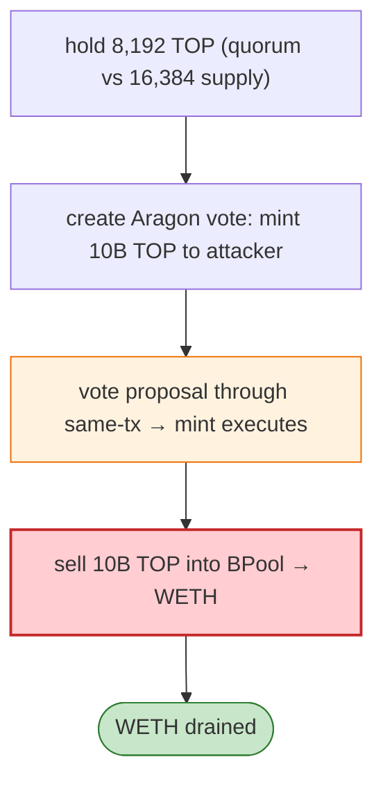

# TOP (TokenVote/TokenManager) Exploit — Aragon Governance Same-Tx Mint + BPool Dump

> **Reproduction:** the PoC compiles & runs in an isolated Foundry project at
> [this project folder](.). Full verbose trace: [output.txt](output.txt).
> Verified vulnerable source: [Voting](sources/Voting_b935c3),
> [TokenManager](sources/TokenManager_de3a93), [MiniMeToken (TOP)](sources/MiniMeToken_0EBD5e),
> [BPool](sources/BPool_0fa3E0) + 2 Aragon app proxies.

---

## Key info

| | |
|---|---|
| **Loss** | WETH drained from the Balancer BPool (mainnet); attacker `0xff8eF7bC…` |
| **Vulnerable contract** | Aragon `Voting` `0xb935c3d8…`, `TokenManager` `0xde3a9302…`; TOP token `0x0EBD5eC9…` |
| **Chain / block / date** | Ethereum mainnet / Jun 2026 |
| **Bug class** | Governance — the attacker held a quorum stake (8,192 TOP vs 16,384 snapshot supply), created an Aragon vote to **mint 10 billion TOP** to itself, **voted the proposal through in the same tx**, then sold the freshly minted TOP into the BPool for WETH. |

---

## TL;DR

Per the embedded analysis: the historical attack contract held 8,192.000001 TOP against a 16,384 TOP
snapshot supply. It created an Aragon vote to **mint 10 billion TOP** to itself, **voted the proposal
through in the same transaction**, then sold the newly minted TOP into the Balancer BPool for WETH.

---

## Root cause

An **instant-quorum Aragon governance** + `TokenManager.mint` that lets a snapshot-quorum holder pass a
mint proposal and execute in one tx, then dump the minted tokens into a thin BPool.

---

## Diagrams



---

## Remediation

1. Governance timelock between vote and execution; no same-tx mint+execute.
2. Snapshot-based quorum not bypassable by post-snapshot mint; cap mint magnitude.
3. BPool liquidity caps / TWAP against governance tokens.

---

## How to reproduce

```bash
_shared/run_poc.sh 2026-06-TOPBPool_exp -vvvvv
```

- RPC: mainnet archive. Result: `[PASS]` — mint 10B TOP, dump into BPool for WETH.

---

*Reference: TOP Aragon instant-mint governance + BPool dump, mainnet, Jun 2026.*
