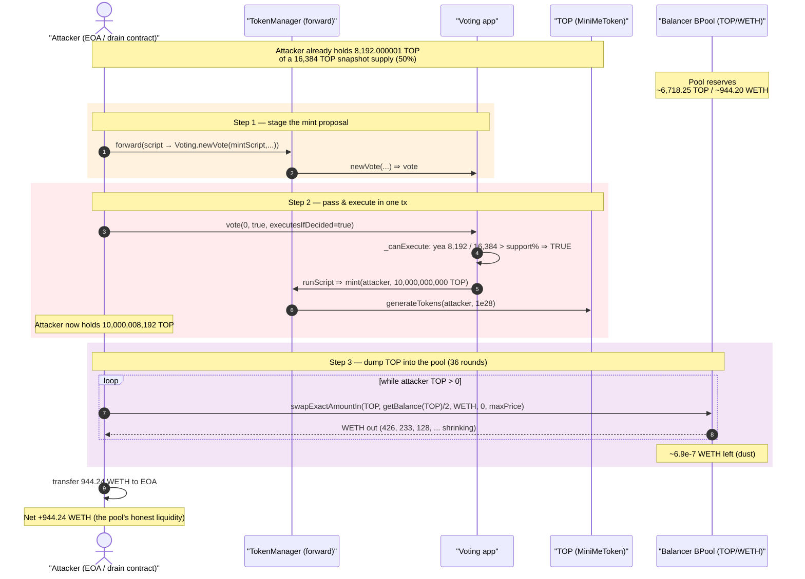
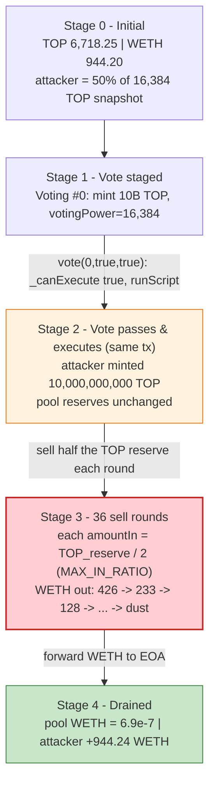
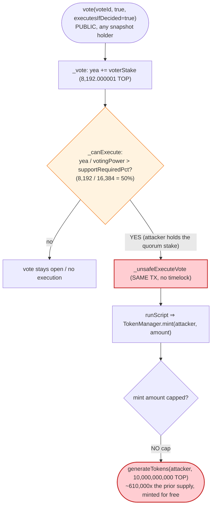
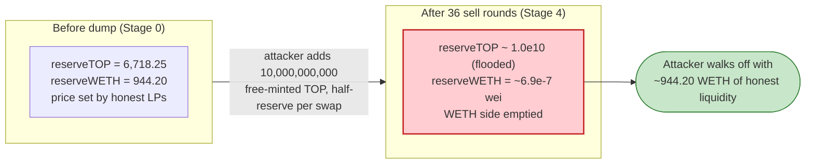

# TOP Exploit — Aragon Instant-Execution Governance Self-Mint + Balancer BPool Drain

> **Vulnerability classes:** vuln/governance/timelock-bypass · vuln/governance/proposal-manipulation

> **Reproduction:** the PoC compiles & runs in an isolated Foundry project at
> [this project folder](.). It forks Ethereum mainnet from a local anvil snapshot
> (`anvil_state.json`) at block 25,279,891.
> Full verbose trace: [output.txt](output.txt).
> Verified vulnerable sources: the Aragon
> [`Voting`](sources/Voting_b935c3/Voting.sol) implementation and the
> [`TokenManager`](sources/TokenManager_de3a93/TokenManager.sol) implementation
> (with their [`AppProxyUpgradeable`](sources/AppProxyUpgradeable_B501d2/AppProxyUpgradeable.sol)
> front proxies), the [`MiniMeToken`](sources/MiniMeToken_0EBD5e/MiniMeToken.sol) TOP token,
> and the victim [`BPool`](sources/BPool_0fa3E0/BPool.sol).

---

## Key info

| | |
|---|---|
| **Loss** | **944.195477215074054197 WETH** (~944.20 WETH) drained from the Balancer TOP/WETH BPool; attacker net profit **944.240475423275038145 WETH** ([output.txt:1540-1542](output.txt)) |
| **Vulnerable contract** | Aragon `Voting` impl [`0xb935c3d80229d5d92f3761b17cd81dc2610e3a45`](https://etherscan.io/address/0xb935c3d80229d5d92f3761b17cd81dc2610e3a45#code) (front proxy [`0xB501d26BA74eaB601576B62617Cf41042bEf6865`](https://etherscan.io/address/0xb501d26ba74eab601576b62617cf41042bef6865#code)) + `TokenManager` impl [`0xde3a93028f2283cc28756b3674bd657eafb992f4`](https://etherscan.io/address/0xde3a93028f2283cc28756b3674bd657eafb992f4#code) (front proxy [`0x3ac1856376C25A7AeBBAd1C2A10db63b5dbB7306`](https://etherscan.io/address/0x3ac1856376c25a7aebbad1c2a10db63b5dbb7306#code)) |
| **Victim pool** | Balancer `BPool` TOP/WETH — [`0x0fa3E014fA2E751F78e53Dca766faC2223327329`](https://etherscan.io/address/0x0fa3e014fa2e751f78e53dca766fac2223327329#code) |
| **Governance token** | TOP `MiniMeToken` — [`0x0EBD5eC91680d3B0CEDbb1d5BB61851154D3eDb6`](https://etherscan.io/address/0x0ebd5ec91680d3b0cedbb1d5bb61851154d3edb6#code) |
| **Attacker EOA** | [`0xff8eF7bC455a57e5893232203052Ce0232b39Fa2`](https://etherscan.io/address/0xff8eF7bC455a57e5893232203052Ce0232b39Fa2) |
| **Attacker contract** | `0x25c68C44A96518294f5B47D758f98309c6729A21` |
| **Attack tx** | [`0x967aa34c69b7775c718545c7f94d92e965eb5fc553c0f27f6f1a9c65c93ac156`](https://etherscan.io/tx/0x967aa34c69b7775c718545c7f94d92e965eb5fc553c0f27f6f1a9c65c93ac156) |
| **Chain / block / date** | Ethereum mainnet / 25,279,891 / Jun 2026 |
| **Compiler / optimizer** | `Voting` / `TokenManager` / `MiniMeToken`: Solidity v0.4.24, optimizer **enabled, 10,000 runs**; `BPool`: v0.5.12, optimizer **enabled, 2,000 runs** (from `_meta.json`) |
| **Bug class** | Governance — instant-execution (no timelock) self-mint via an unbounded `TokenManager.mint`, with voting power keyed off a *snapshot* that the attacker already satisfies, then dumping the minted supply into a thin AMM |

---

## TL;DR

1. TOP governance is built on **Aragon**: an `AppProxyUpgradeable`-fronted `Voting`
   app whose execution scripts run with the `TokenManager`'s `MINT_ROLE`, plus a
   `TokenManager` exposing `mint(receiver, amount)` with **no per-call amount cap**.

2. A vote passes the instant the yea-stake crosses `supportRequiredPct` of the
   vote's *snapshot* voting power — `Voting._canExecute` returns `true` immediately
   if `yea / votingPower > supportRequiredPct`, regardless of whether the voting
   window is still open ([Voting.sol#L2152-L2155](sources/Voting_b935c3/Voting.sol#L2152-L2155)).
   There is **no timelock** between approval and execution: `_vote` calls
   `_unsafeExecuteVote` in the very same transaction
   ([Voting.sol#L2120-L2123](sources/Voting_b935c3/Voting.sol#L2120-L2123)).

3. The attacker's historical contract already held **8,192.000001 TOP** against a
   **16,384 TOP** snapshot supply ([output.txt:1620-1621](output.txt),
   [output.txt:1647-1648](output.txt)) — i.e. **50.0000…%** of the snapshot. With
   `supportRequiredPct` configured below 50%, that single stake is enough to pass
   any vote alone.

4. Through `TokenManager.forward` (a token-holder forwarder) the attacker created a
   `Voting` vote whose execution script calls `TokenManager.mint(attacker, 10e9 TOP)`,
   then immediately cast its yea vote with `executesIfDecided = true`. The vote
   passed and executed in-line, **minting 10,000,000,000 TOP** to the attacker
   ([output.txt:1665-1695](output.txt)).

5. The attacker then sold the freshly minted TOP into the Balancer TOP/WETH `BPool`
   over **36 rounds** of `swapExactAmountIn` ([output.txt:1729](output.txt) onward),
   each round capped at the pool's `MAX_IN_RATIO` (= half the current TOP reserve).
   The 10B TOP overwhelmingly outweighs the pool's tiny ~6,718 TOP reserve, so each
   sell pulls out a large slice of WETH.

6. After the last round the pool's WETH balance is **693,488,898,486 wei
   (~6.9e-7 WETH)** ([output.txt:3468-3469](output.txt)) and the attacker forwards
   **944.240475423275038145 WETH** to the EOA ([output.txt:3456](output.txt)). The
   PoC asserts the attacker profit exceeds the pool's pre-attack WETH and that the
   pool was drained to less than one-billionth of its starting balance
   ([TOPBPool_exp.sol:99-100](test/TOPBPool_exp.sol#L99-L100)).

Net profit = **944.24 WETH** — essentially the pool's entire honest WETH liquidity.

---

## Background — what TOP does

TOP governance is a standard **Aragon DAO** stack:

- **`MiniMeToken` (TOP)** — a checkpointed ERC20 governance token. It records
  per-address and total-supply *snapshots* per block (`balanceOfAt`,
  `totalSupplyAt`), and exposes `generateTokens` (mint) only to its controller —
  the `TokenManager` ([MiniMeToken.sol](sources/MiniMeToken_0EBD5e/MiniMeToken.sol)).
- **`TokenManager`** (Aragon app behind proxy `0x3ac1…7306`) — the token
  controller. It exposes `mint(receiver, amount)` gated by `MINT_ROLE`
  ([TokenManager.sol#L1846-L1849](sources/TokenManager_de3a93/TokenManager.sol#L1846-L1849))
  and an Aragon `forward(evmScript)` forwarder that any token holder can use to run
  an EVM script with the manager's own permissions
  ([TokenManager.sol#L1998-L2012](sources/TokenManager_de3a93/TokenManager.sol#L1998-L2012)).
- **`Voting`** (Aragon app behind proxy `0xB501…6865`) — proposals carry an EVM
  execution script; voting power is the TOP snapshot at `block.number - 1` of
  proposal creation. The `MINT_ROLE` on `TokenManager` is granted to this `Voting`
  app, so an approved vote can mint.
- **Balancer `BPool`** — a weighted constant-product AMM holding the TOP/WETH
  liquidity. It is the value sink, not the buggy component.

On-chain parameters / state at the fork block (read directly from the trace):

| Parameter | Value | Source |
|---|---|---|
| Snapshot block (`block.number - 1`) | 25,279,891 | [output.txt:1620](output.txt) |
| TOP snapshot total supply (`totalSupplyAt`) | 16,384,000,000,000,000,000,000 wei = **16,384 TOP** | [output.txt:1620-1621](output.txt) |
| Attacker snapshot stake (`balanceOfAt`) | 8,192,000,001,000,000,000,000 wei = **8,192.000001 TOP** | [output.txt:1647-1648](output.txt) |
| Attacker stake / snapshot supply | **50.0000000061%** | derived |
| Mint amount requested in script | 10,000,000,000,000,000,000,000,000,000 wei = **10,000,000,000 TOP** | [output.txt:1665](output.txt) |
| Pool TOP balance before dump (`getBalance(TOP)`) | 6,718,249,519,763,079,176,371 wei = **~6,718.25 TOP** | [output.txt:1727-1728](output.txt) |
| Pool WETH balance before attack | 944,195,477,215,074,054,197 wei = **~944.20 WETH** | [output.txt:1541](output.txt) |
| `BPool` `MAX_IN_RATIO` | `BONE / 2` (½ of the in-token reserve per swap) | `sources/BPool_0fa3E0/BPool.sol` (`BConst.MAX_IN_RATIO`) |

The whole exploit hinges on the first two rows: an attacker who already holds half
the snapshot supply needs **no new tokens** to pass a vote, and the vote can mint an
**unbounded** amount with no delay before it executes.

---

## The vulnerable code

### 1. A vote becomes executable the instant yea-stake crosses support — no quorum-time wait

`Voting._canExecute` short-circuits to `true` as soon as the yea-stake exceeds
`supportRequiredPct` of the vote's recorded `votingPower`, **even while the vote is
still open**:

```solidity
function _canExecute(uint256 _voteId) internal view returns (bool) {
    Vote storage vote_ = votes[_voteId];

    if (vote_.executed) {
        return false;
    }

    // Voting is already decided
    if (_isValuePct(vote_.yea, vote_.votingPower, vote_.supportRequiredPct)) {
        return true;
    }
    ...
}
```
([Voting.sol#L2145-L2155](sources/Voting_b935c3/Voting.sol#L2145-L2155))

`_isValuePct` is a strict `>` comparison of `yea·PCT_BASE / total` against `_pct`
([Voting.sol#L2187-L2194](sources/Voting_b935c3/Voting.sol#L2187-L2194)). With the
attacker holding **50.0000000061%** of `votingPower`, any `supportRequiredPct`
configured below 50% is cleared by the attacker's stake alone.

### 2. Approval and execution happen in the *same transaction* — no timelock

When a yea vote is cast with `executesIfDecided = true`, `_vote` runs the execution
script in-line via `_unsafeExecuteVote`:

```solidity
    vote_.voters[_voter] = _supports ? VoterState.Yea : VoterState.Nay;

    emit CastVote(_voteId, _voter, _supports, voterStake);

    if (_executesIfDecided && _canExecute(_voteId)) {
        // We've already checked if the vote can be executed with `_canExecute()`
        _unsafeExecuteVote(_voteId);
    }
}
```
([Voting.sol#L2116-L2124](sources/Voting_b935c3/Voting.sol#L2116-L2124))

```solidity
function _unsafeExecuteVote(uint256 _voteId) internal {
    Vote storage vote_ = votes[_voteId];

    vote_.executed = true;

    bytes memory input = new bytes(0); // TODO: Consider input for voting scripts
    runScript(vote_.executionScript, input, new address[](0));

    emit ExecuteVote(_voteId);
}
```
([Voting.sol#L2134-L2143](sources/Voting_b935c3/Voting.sol#L2134-L2143))

There is no delay, queue, or timelock between the vote crossing threshold and the
arbitrary script running. The public `vote(voteId, supports, executesIfDecided)`
entry point exposes this path directly
([Voting.sol#L1974-L1977](sources/Voting_b935c3/Voting.sol#L1974-L1977)).

### 3. The minted amount is unbounded

The vote's script targets `TokenManager.mint`, which has **no cap** on `_amount` —
the only check is that the receiver is not the manager itself, and the only
balance ceiling (`maxAccountTokens`) was not configured to constrain this mint:

```solidity
function mint(address _receiver, uint256 _amount) external authP(MINT_ROLE, arr(_receiver, _amount)) {
    require(_receiver != address(this), ERROR_MINT_RECEIVER_IS_TM);
    _mint(_receiver, _amount);
}
```
([TokenManager.sol#L1846-L1849](sources/TokenManager_de3a93/TokenManager.sol#L1846-L1849))

```solidity
function _mint(address _receiver, uint256 _amount) internal {
    require(_isBalanceIncreaseAllowed(_receiver, _amount), ERROR_BALANCE_INCREASE_NOT_ALLOWED);
    token.generateTokens(_receiver, _amount); // minime.generateTokens() never returns false
}
```
([TokenManager.sol#L2063-L2066](sources/TokenManager_de3a93/TokenManager.sol#L2063-L2066))

`MINT_ROLE` is held by the `Voting` app, so any vote that the attacker can pass can
mint any amount they choose — here **10,000,000,000 TOP** against a 16,384 TOP
existing supply, a ~610,000× inflation.

### 4. New votes snapshot at `block - 1`, so the freshly minted supply doesn't dilute the attacker's own quorum

```solidity
function _newVote(bytes _executionScript, string _metadata, bool _castVote, bool _executesIfDecided)
    internal
    returns (uint256 voteId)
{
    uint64 snapshotBlock = getBlockNumber64() - 1; // avoid double voting in this very block
    uint256 votingPower = token.totalSupplyAt(snapshotBlock);
    require(votingPower > 0, ERROR_NO_VOTING_POWER);
    ...
    vote_.votingPower = votingPower;
    ...
}
```
([Voting.sol#L2065-L2081](sources/Voting_b935c3/Voting.sol#L2065-L2081))

The vote's quorum denominator is frozen at the *past* snapshot (16,384 TOP). The
mint the vote itself performs does not change that denominator, and it does not need
to — the attacker already controls 50% of the snapshot before voting.

---

## Root cause — why it was possible

Three independent design choices compose into total loss:

1. **Instant execution, no timelock.** `Voting._canExecute` returns `true` the
   moment yea-stake crosses `supportRequiredPct` of snapshot power, and `_vote`
   executes the script in the same call. There is no delay in which honest holders
   or a guardian could react, veto, or rage-quit. A timelock would have turned a
   one-transaction theft into a publicly-visible, cancellable proposal.

2. **An attacker who already holds the quorum stake.** The historical address held
   **8,192.000001 TOP** versus a **16,384 TOP** snapshot supply — exactly half plus
   one micro-TOP ([output.txt:1647-1648](output.txt)). Because voting power is the
   snapshot at `block - 1` and `_isValuePct` uses a strict `>` test, that stake
   alone clears any `supportRequiredPct` below 50%. No coalition, no token
   acquisition, no flash loan was required to pass the vote.

3. **An unbounded mint reachable from governance.** `TokenManager.mint` has no
   per-call or per-epoch amount cap, and `MINT_ROLE` is held by the `Voting` app.
   So the single thing a passed vote could do was mint **10 billion TOP** — six
   orders of magnitude more than the entire pre-existing supply — straight to the
   attacker.

The Balancer `BPool` is merely the exit liquidity. Once the attacker holds 10B TOP
against a ~6,718-TOP pool reserve, repeatedly selling TOP into the pool (each round
bounded by `MAX_IN_RATIO = ½` of the current TOP reserve) walks the pool's WETH
side down to dust. The AMM behaved exactly as designed; the failure is entirely on
the governance side that let one snapshot-quorum holder mint arbitrary supply with
zero delay.

---

## Preconditions

- **Attacker holds ≥ `supportRequiredPct` of the TOP snapshot supply.** At the fork
  block the attacker held 50.0000000061% of the 16,384 TOP snapshot
  ([output.txt:1620-1621](output.txt), [output.txt:1647-1648](output.txt)) — enough
  to pass a vote alone. This is a *historical position*, not something the PoC
  fabricates; the test simply forks the chain at the block where the attacker
  already held it.
- **`MINT_ROLE` on `TokenManager` granted to the `Voting` app**, so a passed vote can
  mint (confirmed by the `hasPermission` checks during execution,
  [output.txt:1671-1682](output.txt)).
- **`supportRequiredPct` configured at or below the attacker's stake fraction.** The
  vote crossed threshold and executed in the same transaction
  ([output.txt:1700](output.txt) `ExecuteVote`), proving the threshold was met.
- **A TOP/WETH pool with enough WETH to be worth draining.** The `BPool` held
  ~944.20 WETH ([output.txt:1541](output.txt)). No flash loan or external working
  capital is needed — the attacker pays with minted TOP it produces for free.

---

## Attack walkthrough (with on-chain numbers from the trace)

The entire exploit is one call to `TopBPoolDrain.drain()`
([output.txt:1575](output.txt)). Steps 1–2 mint the TOP; step 3 is a 36-round loop
that sells half the pool's current TOP reserve each iteration; step 4 forwards the
WETH out. All figures are raw wei with human approximations; TOP and WETH are both
18-decimal.

| # | Step | Pool TOP reserve | Pool WETH reserve | Effect |
|---|------|-----------------:|------------------:|--------|
| 0 | **Snapshot read** — `newVote` reads `totalSupplyAt(25279891) = 16,384e18` (~16,384 TOP); attacker `balanceOfAt = 8,192.000001e18` ([output.txt:1620-1621](output.txt), [output.txt:1647-1648](output.txt)) | 6,718,249,519,763,079,176,371 (~6,718.25) | 944,195,477,215,074,054,197 (~944.20) | Attacker = 50% of snapshot power. |
| 1 | **`TokenManager.forward(script)`** creates `Voting` vote #0 (`StartVote`) whose script calls `Voting.newVote` → mint script ([output.txt:1602](output.txt), [output.txt:1622-1625](output.txt)) | 6,718.25 | 944.20 | Mint proposal staged. |
| 2 | **`Voting.vote(0, true, true)`** — yea-stake 8,192.000001e18 > support%; `_canExecute` true; `ExecuteVote` runs the script → `TokenManager.mint(attacker, 1e28)` → `generateTokens` mints **10,000,000,000 TOP** ([output.txt:1641](output.txt), [output.txt:1665-1695](output.txt), [output.txt:1700](output.txt)) | 6,718.25 | 944.20 | Attacker TOP balance: 8,192.000001 → **10,000,008,192.000001** ([output.txt:1724](output.txt)). |
| 3.1 | **Sell round 1** — `getBalance(TOP)=6,718.25`; swap `amountIn=3,359.124759881539588185` (½ reserve) → **426.001312535224847646 WETH** out ([output.txt:1727-1733](output.txt)) | ~10,082 (6,718 + 3,359 in) | ~518.19 (944.20 − 426.00) | First sell pulls ~45% of the WETH. |
| 3.2 | **Sell round 2** — `amountIn=5,038.687139822309382278` → **233.798402585894027203 WETH** ([output.txt:1778-1782](output.txt)) | grows | ~284.40 | WETH side keeps bleeding. |
| 3.3 | **Sell round 3** — `amountIn=7,558.030709733464073417` → **128.313438112226374038 WETH** ([output.txt:1826-1830](output.txt)) | grows | ~156.08 | |
| 3.4 | **Sell round 4** — `amountIn=11,337.046064600196110125` → **70.421090213100993059 WETH** ([output.txt:1874-1878](output.txt)) | grows | ~85.66 | TOP reserve doubling each round. |
| … | **Rounds 5–35** — each `amountIn = getBalance(TOP)/2`, doubling as the TOP reserve fills; WETH out shrinks geometrically (e.g. round near end pulls 588,913,374,097 wei ≈ 5.9e-7 WETH, [output.txt:3366](output.txt)) | growing toward ~9.78e27 | shrinking toward dust | 36 swaps total ([output.txt](output.txt) `swapExactAmountIn` ×36). |
| 3.36 | **Final round** — attacker dumps its entire remaining 217,507,248,683,626,410,091,606,162 TOP (~2.175e8 TOP); pool gives **22,873,856,696 wei (~2.3e-8 WETH)** ([output.txt:3408-3414](output.txt)); attacker TOP balance → **0** ([output.txt:3451](output.txt)) | 9,999,990,000+ | **693,488,898,486 wei (~6.9e-7)** | WETH side emptied to dust. |
| 4 | **Forward WETH** — `WETH.balanceOf(attackContract)=944,240,475,423,275,038,145`; `transfer` to attacker EOA ([output.txt:3454-3456](output.txt)) | — | **693,488,898,486 (~6.9e-7)** | Attacker EOA receives **944.240475423275038145 WETH**. |

The pool's WETH is drained from **944.195477215074054197 WETH** to
**693,488,898,486 wei** ([output.txt:3468-3469](output.txt)) — a 1.36e9× reduction,
i.e. less than one-billionth remains.

### Profit / loss accounting (WETH, raw wei)

| Item | Amount (wei) | ~Human |
|---|---:|---:|
| Attacker WETH before attack | 0 (no pre-balance read; profit == final) | 0 |
| Attacker WETH after attack | 944,240,475,423,275,038,145 | ~944.24 |
| **Net profit (asserted in PoC)** | **944,240,475,423,275,038,145** | **~944.24** |
| Pool WETH before attack | 944,195,477,215,074,054,197 | ~944.195 |
| Pool WETH after attack | 693,488,898,486 | ~0.00000069 |
| **Pool WETH drained** | **944,195,476,521,585,155,711** | **~944.195** |

The attacker profit (944.240… WETH) slightly *exceeds* the pool's pre-attack WETH
(944.195… WETH) because the attack contract also held a tiny pre-existing WETH dust
balance that `drain()` forwards along with the swap proceeds
([TOPBPool_exp.sol:124-126](test/TOPBPool_exp.sol#L124-L126)). The PoC asserts
`attackerProfit > poolWethBefore` and `poolWethAfter < poolWethBefore / 1e9`
([TOPBPool_exp.sol:99-100](test/TOPBPool_exp.sol#L99-L100)) — both hold.

---

## Diagrams

### Sequence of the attack



### Pool state evolution



### The flaw inside `Voting.vote` / `_canExecute`



### Why the dump is theft: constant-product before vs. after



---

## Why each magic number

- **`mintAmount = 10_000_000_000 ether` (1e28 wei)**
  ([TOPBPool_exp.sol:130](test/TOPBPool_exp.sol#L130)): ~610,000× the entire prior
  16,384-TOP supply. It is sized to dwarf the pool's ~6,718-TOP reserve so that
  selling it walks the WETH side all the way to dust. Any value far above the pool's
  TOP reserve achieves the same drain; the round number is just convenient.
- **`votesLength()` as `voteId`** ([TOPBPool_exp.sol:107](test/TOPBPool_exp.sol#L107)):
  the next vote id is the current count, so the attacker knows in advance which id
  its `forward`-created vote will receive and can call `vote(voteId, true, true)`
  on it ([output.txt:1576-1584](output.txt), [output.txt:1641](output.txt)).
- **`buildEvmCallScript(...) = abi.encodePacked(uint32(1), target, uint32(len), data)`**
  ([TOPBPool_exp.sol:139-141](test/TOPBPool_exp.sol#L139-L141)): the Aragon EVM-script
  spec (`spec id 1`) — a flat list of `(20-byte target, 4-byte calldata length,
  calldata)` entries. The outer script forwards into `Voting.newVote`; the inner
  vote script calls `TokenManager.mint`.
- **`amountIn = IBPool(BPOOL).getBalance(TOP) / 2`** in the sell loop
  ([TOPBPool_exp.sol:117](test/TOPBPool_exp.sol#L117)): the `BPool` enforces
  `tokenAmountIn <= bmul(inRecord.balance, MAX_IN_RATIO)` with
  `MAX_IN_RATIO = BONE/2` (`sources/BPool_0fa3E0/BPool.sol`,
  `BPool.swapExactAmountIn` line 443). Selling exactly half the current TOP reserve
  is the largest single swap the pool will accept, which is why the dump takes 36
  rounds rather than one.
- **`minAmountOut = 0`, `maxPrice = type(uint256).max`**
  ([TOPBPool_exp.sol:120](test/TOPBPool_exp.sol#L120)): the attacker accepts any
  output at any price — it is dumping worthless free-minted TOP and only cares about
  emptying the WETH side, so no slippage bound is needed.

---

## Remediation

1. **Add a governance timelock.** Approval and execution must be separated by a
   non-trivial delay (a `_unsafeExecuteVote` queued behind a timelock controller),
   so an arbitrary-mint proposal is publicly visible and cancellable before it
   runs. Removing the same-tx `executesIfDecided` path for sensitive scripts
   (or for the `MINT_ROLE`-bearing forwarder) closes the instant-drain window.
2. **Bound the mint.** `TokenManager.mint` should cap a single mint (and a rolling
   per-epoch mint) to a small fraction of existing supply. A 10-billion-token mint
   against a 16,384-token supply should be impossible in one call regardless of
   governance outcome.
3. **Do not let a single snapshot holder unilaterally pass votes.** With one address
   holding 50% of the snapshot supply, `supportRequiredPct` below 50% is decorative.
   Either require super-majority support strictly above the largest holder's stake,
   enforce a minimum participation quorum measured over the voting window (not an
   instant snapshot threshold), or use quadratic / time-weighted voting so a single
   pre-positioned stake cannot self-approve.
4. **Re-validate quorum against live supply, or freeze mint scripts.** Snapshotting
   voting power at `block - 1` is correct for replay protection, but combined with an
   unbounded mint it means a vote can mint supply its own quorum math never accounted
   for. Mint-bearing proposals in particular should require a higher bar and a delay.
5. **Cap single-swap reserve impact on the AMM side.** Even with governance fixed, a
   pool that lets one actor add 10B tokens and round-trip out nearly all of the
   counter-asset is fragile. Pair the AMM with TWAP/oracle guards and per-tx
   reserve-impact limits so a sudden, enormous one-sided inflow cannot extract the
   honest liquidity.

---

## How to reproduce

The PoC runs fully offline against a local anvil snapshot (`anvil_state.json`); the
test's `createSelectFork` points at a local anvil port (`http://127.0.0.1:8545`),
not a public RPC ([TOPBPool_exp.sol:69-71](test/TOPBPool_exp.sol#L69-L71)). The
shared harness boots anvil from the snapshot and runs the test:

```bash
_shared/run_poc.sh 2026-06-TOPBPool_exp --mt testExploit -vvvvv
```

- **No public RPC needed.** State at block 25,279,891 is served from the bundled
  `anvil_state.json`; `foundry.toml` does not name an external endpoint.
- **EVM version:** `foundry.toml` sets `evm_version = 'cancun'`. The mixed-compiler
  sources (`Voting`/`TokenManager`/`MiniMeToken` at v0.4.24, `BPool` at v0.5.12) are
  verified bytecode loaded from the fork, so no recompilation of the victim
  contracts is required.
- **Result:** `[PASS] testExploit()` with the attacker draining ~944.24 WETH and the
  pool left with dust.

Expected tail (from [output.txt:1537-1542](output.txt) and
[output.txt:3479](output.txt)):

```
Ran 1 test for test/TOPBPool_exp.sol:ContractTest
[PASS] testExploit() (gas: 3159197)
Logs:
  Attacker WETH profit: 944.240475423275038145
  BPool WETH before: 944.195477215074054197
  BPool WETH after: 0.000000693488898486

Suite result: ok. 1 passed; 0 failed; 0 skipped; finished in 19.73s (18.47s CPU time)
```

---

*Reference: DefimonAlerts — https://x.com/DefimonAlerts/status/2064616112822583505 (TOP, Ethereum mainnet, ~944.20 WETH).*
