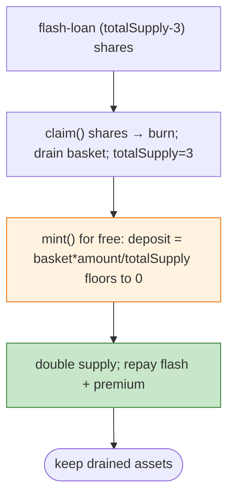

# ThetanutsFi Exploit — Integer Truncation in `mint()` After Vault Drained to ~0 totalSupply

> **Reproduction:** the PoC compiles & runs in an isolated Foundry project at
> [this project folder](.). Full verbose trace: [output.txt](output.txt).

---

## Key info

| | |
|---|---|
| **Loss** | vault assets drained (Ethereum); tx `0xbba9f138…`; post-mortem Jun 15 2026 |
| **Vulnerable contract** | Thetanuts index vault `0xc2c3ae0a…` (Ethereum) |
| **Chain / block / date** | Ethereum mainnet / 25,323,329 / Jun 15, 2026 |
| **Bug class** | Integer-division truncation in `mint()` — `share/deposit` floors to 0 once `totalSupply` is crushed to ~3 wei and residual basket backing ~1 wei, so the attacker mints shares without depositing. |

---

## TL;DR

Per the embedded root cause: `share/deposit required to mint = vaultBasketBalance * amount / totalSupply`.
Once `totalSupply` is crushed to 3 wei (residual basket ~1 wei), that division **floors to 0** for any
`amount < totalSupply`, so the attacker can **mint shares without depositing assets**.

Flow:
1. Flash-loan (totalSupply − 3) shares from the Aave-style pool holding them.
2. `claim()` those shares → burns them, draining the vault's basket to the attacker and leaving
   `totalSupply == 3`.
3. Repeatedly `mint()` shares for free (each deposit truncates to 0), doubling supply until enough to
   repay the flash loan + premium.

---

## Root cause

An **unchecked integer-division truncation in the share-mint math** at near-zero `totalSupply`, enabling
free minting — the canonical ERC4626 "first-deposit / donation" inflation class taken to an extreme by
first forcing `totalSupply` to dust.

---

## Diagrams



---

## Remediation

1. Round up the deposit-required math; require `deposit ≥ 1` asset per share minted.
2. Dead-share / first-deposit lock (mint 1e3 shares to the vault at creation, never drainable to 0).
3. Invariant: `totalSupply` cannot be driven to near-zero while `basketBalance > 1`.

---

## How to reproduce

```bash
_shared/run_poc.sh 2026-06-ThetanutsFi_exp -vvvvv
```

- RPC: mainnet archive (block 25,323,329). Result: `[PASS]` — free-mint after drain.

---

*Reference: ThetanutsFi index-vault mint-truncation inflation, mainnet, Jun 15 2026.*
