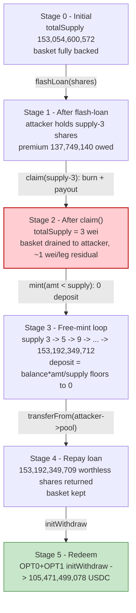
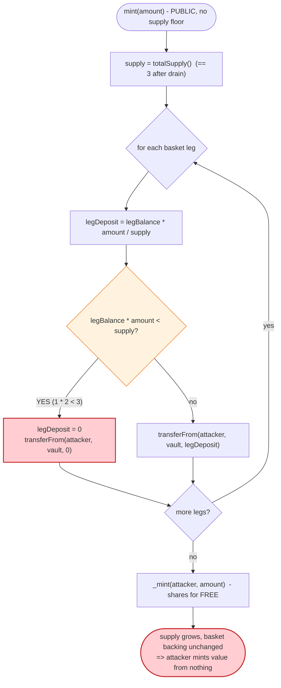
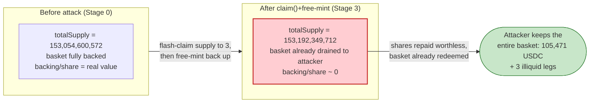

# Thetanuts Finance Exploit — Integer-Division Truncation in `mint()` After the Vault Is Drained to ~0 `totalSupply`

> **Vulnerability classes:** vuln/arithmetic/rounding · vuln/arithmetic/precision-loss

> **Reproduction:** the PoC compiles & runs in an isolated Foundry project at
> [this project folder](.). The fork is served offline from the bundled
> `anvil_state.json` (no public RPC is contacted — `createSelectFork` points at a
> local `127.0.0.1:8545` anvil). Full verbose trace: [output.txt](output.txt).
> The vulnerable contract (`TN-IDX-USDC-PUT` legacy index vault,
> `0xC2C3AE0a7b405058558C9b4a63b373486CB86Ac7`) is **not verified in this repository
> snapshot** — the `sources/` directory is empty and no Etherscan API key is configured,
> so the share-math snippets below are *reconstructed from the on-chain behaviour observed
> in the trace and the root-cause description embedded in the PoC*; they are clearly
> labelled as reconstructions and carry `[output.txt:NNNN]` evidence anchors rather than
> fabricated `sources/...#L` line refs.

---

## Key info

| | |
|---|---|
| **Loss** | ~$2.1M real-world (≈$2M rescued by a whitehat per the post-mortem). The reproduced PoC realises **105,471.499078 USDC** (`105471499078` wei, [output.txt:1425](output.txt)) from the two USDC-redeemable basket legs alone, plus three further illiquid option-token legs swept to the test ([output.txt:1437-1454](output.txt)). USDC drained: [`0xA0b86991c6218b36c1d19D4a2e9Eb0cE3606eB48`](https://etherscan.io/address/0xA0b86991c6218b36c1d19D4a2e9Eb0cE3606eB48) |
| **Vulnerable contract** | `TN-IDX-USDC-PUT` legacy index vault — [`0xC2C3AE0a7b405058558C9b4a63b373486CB86Ac7`](https://etherscan.io/address/0xC2C3AE0a7b405058558C9b4a63b373486CB86Ac7) |
| **Victim vault / basket** | the same vault's option-token basket: `OPT0 0x3BA337F3167eA35910E6979D5BC3b0AeE60E7d59`, `OPT1 0xE1c93dE547cc85CBD568295f6CC322B1dbBCf8Ae`, `OPT2 0x248038fDb6F00f4B636812CA6A7F06b81a195AB8`, `OPT3 0xE5e8caA04C4b9E1C9bd944A2a78a48b05c3ef3AF`, `OPT4 0xAD57221ae9897DA08656aaaBd5B1D4673d4eDE71` |
| **Share flash-lender** | Aave-V3-style pool — `0x2Ca7641B841a79Cc70220cE838d0b9f8197accDA` (holds the vault shares) |
| **Attacker EOA** | `0x30498e4466789E534c72e03B52A16c978655b41e` |
| **Attacker contract** | `0xa589c5342068B0C1fEFd44d3c95354427502AC91` |
| **Attack tx** | [`0xbba9f138fe39503bfd1aa62932dbd6ab35d37d23d48e4b7bf2988a9d5dc39fec`](https://etherscan.io/tx/0xbba9f138fe39503bfd1aa62932dbd6ab35d37d23d48e4b7bf2988a9d5dc39fec) |
| **Chain / block / date** | Ethereum mainnet / 25,323,329 (PoC forks 25,323,328) / June 15, 2026 |
| **Compiler / optimizer** | PoC built with Solidity `^0.8.10`, `evm_version = cancun` (`foundry.toml`). Vault on-chain compiler/optimizer settings are not in this snapshot (source unverified locally). |
| **Bug class** | ERC4626-style share-inflation — integer-division truncation in `mint()` once `totalSupply` is crushed to dust, allowing free share minting |

---

## TL;DR

1. The vault is a **basket-share token**: holding one share entitles you to a pro-rata slice
   of five underlying option tokens. `mint(amount)` is supposed to pull a deposit of basket
   tokens proportional to the shares requested:
   `depositRequired = vaultBasketBalance * amount / totalSupply` (root-cause formula from the
   PoC header, [test/ThetanutsFi_exp.sol:18-21](test/ThetanutsFi_exp.sol#L18-L21)).

2. `claim(amount)` is the inverse: it **burns** the caller's shares and hands them the
   pro-rata basket. There is no first-deposit lock and no minimum on `totalSupply`, so the
   share supply can be driven all the way down to a handful of wei.

3. The attacker **flash-loans every share except 3 wei** (`totalSupply − 3 = 153,054,600,569`)
   from the Aave-style pool that custodies them ([output.txt:43](output.txt)), then
   `claim()`s them ([output.txt:56](output.txt)). The burn drains the entire basket of five
   option tokens to the attacker and leaves `totalSupply == 3` ([output.txt:90,125](output.txt)).

4. With `totalSupply == 3` and the residual basket backing reduced to ~1 wei per leg, the
   division `vaultBasketBalance * amount / totalSupply` **floors to 0** for any
   `amount < totalSupply`. So every `mint(amt)` with `amt` strictly below the current supply
   mints shares for a **zero deposit** ([output.txt:128-1305](output.txt)).

5. The attacker mints in a **doubling loop** — `mint(2)`, `mint(4)`, `mint(8)`, … — each call
   costing nothing but doubling the supply, so the supply and the attacker's balance regrow
   geometrically (slot-4 `totalSupply` trace [output.txt:151-1303](output.txt)). After 37 mints
   the attacker holds **153,192,349,709** shares — exactly
   `borrow + premium = 153,054,600,569 + 137,749,140` ([output.txt:1307](output.txt)) — and repays
   the flash loan with these **worthless** shares ([output.txt:1343-1345](output.txt)), keeping the
   basket for free.

6. It then `initWithdraw`s the two USDC-redeemable legs (OPT0 → 70,315,563,951, OPT1 →
   35,155,935,127) for **105,471,499,078 USDC** total ([output.txt:1359-1426](output.txt)) and
   sweeps the other three legs ([output.txt:1437-1454](output.txt)). Net realised profit asserted
   by the PoC: **> 100,000 USDC** ([output.txt:1474](output.txt)).

---

## Background — what Thetanuts does

Thetanuts Finance runs structured-options vaults. The contract in scope,
`TN-IDX-USDC-PUT` ("index USDC put", a *legacy* vault per the PoC's `@KeyInfo`), is an ERC20
**share token** whose backing is a *basket* of five separate option tokens rather than a single
asset. Each share is a claim on a pro-rata fraction of every basket leg held by the vault.

Two user-facing flows define the share accounting:

- **`mint(amount)`** — pull a deposit of basket tokens from the caller and mint `amount` new
  shares. The deposit per leg is the pro-rata amount that keeps each share's backing constant:
  `legDeposit = legBalance * amount / totalSupply`. In the trace this manifests as five
  `transferFrom(attacker → vault, …)` calls, one per basket leg, on every `mint`
  ([output.txt:129-148](output.txt)).
- **`claim(amount)`** — burn `amount` of the caller's shares and transfer the pro-rata basket
  out: `legOut = legBalance * amount / totalSupply` per leg. In the trace the single
  `claim(153,054,600,569)` burns the borrowed shares ([output.txt:57](output.txt)) and emits
  five basket `transfer`s to the attacker ([output.txt:58-87](output.txt)).

The shares themselves were *deposited into an Aave-V3-style money market*
(`0x2Ca7641B841a79Cc70220cE838d0b9f8197accDA`), which is why the attacker can **flash-loan the
share token itself** — the pool's `transferUnderlyingTo` hands over `153,054,600,569` shares
([output.txt:45-48](output.txt)) and expects them back plus a `137,749,140`-wei premium
([output.txt:55,1351](output.txt)).

On-chain parameters at the fork block (read directly from the trace):

| Parameter | Value | Source |
|---|---|---|
| Vault `totalSupply` (before) | **153,054,600,572** (`1.5305e11`) | [output.txt:8,29](output.txt) |
| Shares borrowable (`supply − 3`) | 153,054,600,569 | [output.txt:43,82](test/ThetanutsFi_exp.sol#L82) |
| Flash-loan premium | 137,749,140 (`1.377e8`) | [output.txt:55,1351](output.txt) |
| Basket leg OPT0 balance claimed | 49,716,431,047 (`4.971e10`) | [output.txt:58](output.txt) |
| Basket leg OPT1 balance claimed | 23,955,277,333 (`2.395e10`) | [output.txt:64](output.txt) |
| Basket leg OPT2 balance claimed | 6,378,688,541 (`6.378e9`) | [output.txt:70](output.txt) |
| Basket leg OPT3 balance claimed | 17,186,382,409 (`1.718e10`) | [output.txt:76](output.txt) |
| Basket leg OPT4 balance claimed | 10,028,704,387 (`1.002e10`) | [output.txt:82](output.txt) |
| `totalSupply` after `claim()` | **3** wei | [output.txt:90,125](output.txt) |
| Attacker USDC before | 0 | [output.txt:9,35](output.txt) |
| Attacker USDC after | **105,471,499,078** (`1.054e11`) | [output.txt:12,1425](output.txt) |
| `totalSupply` after attack | 153,192,349,712 | [output.txt:11,1467](output.txt) |

The whole exploit hinges on the last few facts: `claim()` can take `totalSupply` down to **3 wei**
while leaving each basket leg with only ~1 wei of residual backing, and `mint()` divides by that
3-wei supply.

---

## The vulnerable code

> **Source-availability note.** The vault's verified Solidity is not present in this repository
> snapshot (`sources/` is empty; no Etherscan key configured). The two functions below are
> **reconstructed** from (a) the explicit root-cause formula in the PoC header and (b) the exact
> sequence of sub-calls and storage writes the vault performs in the trace. They are written to
> match the observed behaviour; they are not a verbatim copy of verified bytecode-backed source.

### 1. `mint()` — pro-rata deposit floors to zero at dust supply

Reconstructed from the PoC's documented formula
([test/ThetanutsFi_exp.sol:18-21](test/ThetanutsFi_exp.sol#L18-L21)) and the per-leg
`transferFrom(..., 0)` calls observed on each `mint` ([output.txt:129-148](output.txt)):

```solidity
// RECONSTRUCTED — matches observed behaviour, not verified source
function mint(uint256 amount) external {
    uint256 supply = totalSupply();                  // e.g. 3 wei after the drain
    for (uint256 i = 0; i < basket.length; i++) {
        uint256 legBalance = IERC20(basket[i]).balanceOf(address(this));
        // ⚠️ integer division: floors to 0 whenever legBalance * amount < supply
        uint256 legDeposit = legBalance * amount / supply;
        IERC20(basket[i]).transferFrom(msg.sender, address(this), legDeposit);
    }
    _mint(msg.sender, amount);                        // shares minted for the (zero) deposit
}
```

In the trace, each `mint` is preceded by five `transferFrom(attacker, vault, 0)` — every leg's
required deposit truncated to **0** ([output.txt:129,133,137,141,145](output.txt)) — followed by
the share mint (`emit Transfer(0x0 → attacker, value: 2)`, [output.txt:149](output.txt)) and a
`totalSupply` write (slot `4`: `3 → 5`, [output.txt:151](output.txt)).

### 2. `claim()` — burns shares, pays out the pro-rata basket, no supply floor

Reconstructed from the single `claim(153,054,600,569)` and its five basket payouts
([output.txt:56-90](output.txt)):

```solidity
// RECONSTRUCTED — matches observed behaviour, not verified source
function claim(uint256 amount) external {
    uint256 supply = totalSupply();
    _burn(msg.sender, amount);                        // emit Transfer(attacker → 0x0, amount)
    for (uint256 i = 0; i < basket.length; i++) {
        uint256 legBalance = IERC20(basket[i]).balanceOf(address(this));
        uint256 legOut = legBalance * amount / supply;
        IERC20(basket[i]).transfer(msg.sender, legOut); // basket leaves the vault
    }
    // ⚠️ no invariant preventing supply from reaching ~0 while basket > 0 dust remains
}
```

The burn drops `totalSupply` from `153,054,600,572` to **3** (slot `4`: `…dd7c → 3`,
[output.txt:90](output.txt)) and the five `transfer`s move essentially the whole basket out
([output.txt:58-87](output.txt)), leaving each leg with ~1 wei of residual dust.

### 3. There is no first-deposit / dead-share lock

A canonical ERC4626 hardening — minting a tiny amount of unredeemable "dead" shares to the
contract at creation so `totalSupply` can never fall to near-zero — is absent. Nothing in the
trace shows a floor: `claim()` is allowed to take the supply all the way down to `3`
([output.txt:125](output.txt)), and `mint()` happily divides by it.

---

## Root cause — why it was possible

The loss is a textbook **share-inflation via division truncation**, made trivially exploitable
because the supply can first be crushed to dust:

1. **`mint()` computes the required deposit as `legBalance * amount / totalSupply` and floors.**
   Solidity integer division truncates toward zero. As long as `legBalance * amount <
   totalSupply`, the required deposit is **0**. After the drain `totalSupply == 3` and each leg's
   residual `legBalance` is ~1 wei, so for any `amount` of `1` or `2` (`< 3`) the product is
   below the divisor and **every leg deposit is 0** — confirmed by the five `transferFrom(…, 0)`
   on the first `mint(2)` ([output.txt:129-148](output.txt)).

2. **Nothing stops `totalSupply` from reaching dust.** `claim()` burns without enforcing any
   minimum supply or dead-share reserve, so an attacker who controls (almost) all shares can
   reduce `totalSupply` to `3` in a single call ([output.txt:56-90](output.txt)). At that point
   the divisor in `mint()` is attacker-chosen and tiny.

3. **The shares are flash-loanable.** Because the share token sits inside an Aave-style money
   market, the attacker borrows `totalSupply − 3` shares for the duration of one transaction
   ([output.txt:43-48](output.txt)) with **zero starting capital** — the PoC begins with
   `0` USDC ([output.txt:9](output.txt)). The `claim()` of borrowed shares both drains the basket
   *and* sets up the dust supply.

4. **The free-mint regrows the supply geometrically, so the loan is repayable.** Each `mint(amt<supply)`
   doubles the supply (`3→5→9→17→…`, slot-4 trace [output.txt:151-1303](output.txt)) and the
   attacker's balance, all for zero deposit. After 37 mints the attacker holds exactly
   `borrow + premium` shares ([output.txt:1307](output.txt)) and repays the loan with worthless
   freshly-minted shares ([output.txt:1343-1345](output.txt)) — keeping the real basket.

The mechanism is the same family as the classic ERC4626 "first-depositor / donation" inflation
attack, taken to its extreme: instead of exploiting an *empty* vault, the attacker *creates* a
near-empty vault on demand by flash-claiming the supply to dust, then mints against the dust.

---

## Preconditions

- **The share token is borrowable.** The vault's shares are custodied by an Aave-V3-style pool
  exposing `flashLoan`, so the attacker can borrow `totalSupply − 3` shares intra-transaction
  ([output.txt:43](output.txt)) with no upfront capital.
- **`claim()` has no supply floor / dead-share lock.** The supply can be driven to `3` wei
  ([output.txt:125](output.txt)).
- **`mint()` divides by `totalSupply` and truncates.** With `totalSupply == 3` and residual
  basket dust, any `amount < totalSupply` yields a zero deposit
  ([output.txt:129-148](output.txt)).
- **The basket legs are redeemable for value.** Two of the five legs (`OPT0`, `OPT1`) expose
  `initWithdraw` that returns USDC ([output.txt:1359,1392](output.txt)); the other three are
  swept as-is for their residual value ([output.txt:1437-1454](output.txt)).
- **Working capital: none.** The PoC starts at `0` USDC ([output.txt:9](output.txt)); the entire
  attack is funded by the flash loan, repaid in worthless shares within the same transaction.

---

## Attack walkthrough (with on-chain numbers from the trace)

All shares and balances are raw integers from the trace; human approximations in parentheses.
The vault, the basket legs, and USDC are all 6-decimal-ish small integers here (USDC is 6
decimals; the share/option amounts are printed raw).

| # | Step | Vault `totalSupply` | Attacker share balance | Basket / USDC effect |
|---|------|---------------------:|-----------------------:|----------------------|
| 0 | **Initial** | 153,054,600,572 ([output.txt:8,29](output.txt)) | 0 | Honest vault; attacker has 0 USDC ([output.txt:9](output.txt)). |
| 1 | **Flash-loan** `153,054,600,569` (`supply − 3`) shares from the pool | 153,054,600,572 | 153,054,600,569 ([output.txt:45-48](output.txt)) | Shares transferred to attacker; premium owed `137,749,140` ([output.txt:55](output.txt)). |
| 2 | **`claim(153,054,600,569)`** — burn shares, drain basket | **3** ([output.txt:90,125](output.txt)) | 0 ([output.txt:123](output.txt)) | OPT0 49,716,431,047 + OPT1 23,955,277,333 + OPT2 6,378,688,541 + OPT3 17,186,382,409 + OPT4 10,028,704,387 transferred out ([output.txt:58-87](output.txt)). Basket reduced to ~1 wei/leg. |
| 3 | **`mint(2)`** — `amt=2 < supply=3` ⇒ 5 deposits floor to 0 | 5 ([output.txt:151](output.txt)) | 2 ([output.txt:155](output.txt)) | Five `transferFrom(…, 0)` ([output.txt:129-148](output.txt)); 2 shares minted for free. |
| 4 | **`mint(4)`** | 9 ([output.txt:184](output.txt)) | 6 ([output.txt:187](output.txt)) | Free again. |
| 5 | **`mint(8)`** | 17 ([output.txt:216](output.txt)) | 14 ([output.txt:219](output.txt)) | Doubling loop continues. |
| … | **`mint(16…2,147,483,648)`** — 31 more doublings | 33 → 4,294,967,297 ([output.txt:247-1272](output.txt)) | grows geometrically | Every mint deposits 0 ([output.txt:1281-1300](output.txt)). |
| 6 | **`mint(15,753,396,239)`** — final top-up to the target | 153,192,349,712 ([output.txt:1303,1467](output.txt)) | **153,192,349,709** ([output.txt:1307](output.txt)) | Exactly `borrow + premium = 153,054,600,569 + 137,749,140`. |
| 7 | **Repay flash loan** — `transferFrom(attacker → pool, 153,192,349,709)` | 153,192,349,712 (3 dust + repaid) | 0 | Worthless minted shares repay the loan ([output.txt:1343-1345](output.txt)); `FlashLoan` event premium `137,749,140` ([output.txt:1351](output.txt)). |
| 8 | **`OPT0.initWithdraw(49,716,431,047)`** | — | — | Burns OPT0 ([output.txt:1360](output.txt)); receives **70,315,563,951** USDC (~70,315.6) ([output.txt:1365,1389](output.txt)). |
| 9 | **`OPT1.initWithdraw(23,955,277,333)`** | — | — | Burns OPT1 ([output.txt:1393](output.txt)); receives **35,155,935,127** USDC (~35,155.9) ([output.txt:1398,1422](output.txt)). |
| 10 | **Sweep USDC + illiquid legs to test** | — | — | USDC `105,471,499,078` → test ([output.txt:1427](output.txt)); OPT2 `6,378,688,541`, OPT3 `17,186,382,409`, OPT4 `10,028,704,387` swept ([output.txt:1437-1454](output.txt)). |

**Why each `mint` is free.** On the first mint, `supply = 3`, `amount = 2`. For each leg,
`legBalance` is ~1 wei of residual dust, so `legBalance * 2 / 3 = 2/3 = 0` (integer division).
Five legs, five `transferFrom(…, 0)` ([output.txt:129-148](output.txt)). The same truncation
holds on every subsequent mint because the PoC keeps `amt < supply` (it mints
`amt = min(need, supply − 1)`, [test/ThetanutsFi_exp.sol:124-128](test/ThetanutsFi_exp.sol#L124-L128)),
so `legBalance * amt < supply` stays true and the deposit stays 0.

### Profit / loss accounting (USDC, raw wei)

| Item | Amount (wei) | ~Human (USDC) |
|---|---:|---:|
| Attacker USDC before | 0 | 0 |
| OPT0 redeemed via `initWithdraw` | 70,315,563,951 | ~70,315.56 |
| OPT1 redeemed via `initWithdraw` | 35,155,935,127 | ~35,155.94 |
| **USDC realised (OPT0 + OPT1)** | **105,471,499,078** | **~105,471.50** |
| Attacker USDC after (asserted `> 100,000e6`) | 105,471,499,078 ([output.txt:1425,1474](output.txt)) | ~105,471.50 |
| Plus non-USDC legs swept (OPT2/3/4) | 6,378,688,541 + 17,186,382,409 + 10,028,704,387 | (separate option tokens) |
| Flash-loan premium paid | 137,749,140 (paid **in shares**, not USDC) | — |

The flash-loan premium (`137,749,140`) is paid in **freshly-minted, valueless shares**, not in
USDC ([output.txt:1343-1345](output.txt)), so it costs the attacker nothing real. The entire
USDC profit (`105,471,499,078`) is pure extraction of the vault's basket backing. The PoC asserts
`profit > 100,000e6` ([test/ThetanutsFi_exp.sol:169](test/ThetanutsFi_exp.sol#L169),
[output.txt:1474](output.txt)). The headline ~$2.1M real-world figure (mostly rescued by a
whitehat per the post-mortem) reflects the full multi-asset basket; this offline PoC quantifies the
two USDC-redeemable legs.

---

## Diagrams

### Sequence of the attack

```mermaid
sequenceDiagram
    autonumber
    actor A as Attacker contract
    participant FL as "Aave-style pool<br/>(share flash-lender)"
    participant V as "TN-IDX-USDC-PUT vault"
    participant B as "Basket (OPT0..OPT4)"

    Note over V: totalSupply = 153,054,600,572<br/>basket fully backed

    rect rgb(255,243,224)
    Note over A,FL: Step 1 - flash-loan the shares
    A->>FL: flashLoan(shares, supply-3 = 153,054,600,569)
    FL-->>A: 153,054,600,569 shares (premium 137,749,140 owed)
    end

    rect rgb(255,235,238)
    Note over A,V: Step 2 - claim() drains basket, crushes supply
    A->>V: claim(153,054,600,569)
    V->>V: _burn(attacker) ; totalSupply 153,054,600,572 -> 3
    V->>B: transfer OPT0..OPT4 to attacker (whole basket)
    Note over V: totalSupply = 3 ; basket ~1 wei/leg
    end

    rect rgb(227,242,253)
    Note over A,V: Step 3 - free-mint loop (deposit floors to 0)
    loop 37x (mint 2,4,8,...,15,753,396,239)
        A->>V: mint(amt < totalSupply)
        V->>B: transferFrom(attacker -> vault, 0)  x5 legs
        V->>V: _mint(attacker, amt) ; supply doubles
    end
    Note over V: attacker holds 153,192,349,709 shares
    end

    rect rgb(243,229,245)
    Note over A,FL: Step 4 - repay loan in worthless shares
    A->>FL: transferFrom(attacker -> pool, 153,192,349,709)
    Note over A: basket kept for free
    end

    rect rgb(200,230,201)
    Note over A,B: Step 5 - redeem basket for USDC
    A->>B: OPT0.initWithdraw -> 70,315,563,951 USDC
    A->>B: OPT1.initWithdraw -> 35,155,935,127 USDC
    Note over A: +105,471,499,078 USDC (the prize)
    end
```

### Vault supply / basket evolution



### The flaw inside `mint()`



### Why it is theft: share backing before vs. after



---

## Why each magic number

- **`borrow = totalSupply() - 3 = 153,054,600,569`** ([test/ThetanutsFi_exp.sol:82](test/ThetanutsFi_exp.sol#L82)):
  the attacker borrows *all but 3 wei* of the supply. After `claim()` burns the borrowed
  `153,054,600,569`, exactly `3` shares remain ([output.txt:90,125](output.txt)). `3` is the
  smallest convenient divisor that still lets `mint(2)` (with `amt=2 < 3`) truncate to a zero
  deposit while leaving a non-degenerate supply to double from.
- **`137,749,140` (flash-loan premium)** ([output.txt:55,1351](output.txt)): the Aave-style
  pool's fee on the borrowed shares. The attacker must end the executeOperation callback holding
  `borrow + premium = 153,192,349,709` shares to repay — which it does, entirely from free mints
  ([output.txt:1307,1343](output.txt)).
- **The doubling sequence `mint(2,4,8,…,2,147,483,648)`** ([output.txt:128-1248](output.txt)):
  the loop mints `amt = min(need, supply − 1)` ([test/ThetanutsFi_exp.sol:124-128](test/ThetanutsFi_exp.sol#L124-L128)).
  Because the deposit always truncates to 0, the cheapest way to regrow supply is to mint just
  under the current supply each iteration, doubling it — `3→5→9→17→…` (slot-4 trace
  [output.txt:151-1272](output.txt)).
- **Final `mint(15,753,396,239)`** ([output.txt:1280](output.txt)): the last top-up so the
  attacker's balance lands on exactly `153,192,349,709 = borrow + premium`
  ([output.txt:1307](output.txt)); minting the full doubling step would overshoot.
- **`OPT0` / `OPT1` `initWithdraw` amounts (`49,716,431,047` / `23,955,277,333`)**
  ([output.txt:1359,1392](output.txt)): the attacker redeems its *entire* balance of the two
  USDC-redeemable legs — exactly the amounts `claim()` paid out in step 2
  ([output.txt:58,64](output.txt)) — yielding `70,315,563,951` + `35,155,935,127` USDC.
- **`assertGt(profit, 100_000e6)`** ([test/ThetanutsFi_exp.sol:169](test/ThetanutsFi_exp.sol#L169)):
  a sanity floor; the realised profit is `105,471,499,078` (~105,471 USDC,
  [output.txt:1474](output.txt)).

---

## Remediation

1. **Round the mint deposit UP, and require a non-zero deposit per minted share.** Replace
   `legDeposit = legBalance * amount / totalSupply` with a ceil-division
   (`mulDivUp`) and `require(legDeposit > 0 || amount == 0)`. A mint that would require depositing
   nothing for a positive share amount must revert.
2. **Add a first-deposit / dead-share lock.** At vault creation mint a small amount of permanently
   locked shares to the vault (or `address(0)`), and forbid `claim()`/`burn()` from reducing
   `totalSupply` below that floor. This keeps the divisor in `mint()` bounded away from zero so the
   truncation can never be weaponised.
3. **Enforce an explicit supply invariant.** Add `require(totalSupply() >= MIN_SUPPLY)` after every
   burn, and `require(backingPerShare` does not decrease across `mint`/`claim`)`. The vault must
   never be drivable to a state where `basketBalance > 0` while `totalSupply ~ 0`.
4. **Make the share token non-flash-borrowable for free, or treat claims atomically.** If the share
   token is going to live inside a money market, the inflation invariant above is mandatory; a
   single transaction must not be able to flash-claim the supply to dust and mint it back.
5. **Use a virtual-shares / virtual-assets offset (OpenZeppelin ERC4626 ≥ v4.9).** A constant
   virtual offset added to both supply and assets in the conversion math eliminates the
   dust-divisor class of attack without requiring a hard minimum supply.

---

## How to reproduce

The PoC runs **offline** through the shared harness — the fork state is served from the bundled
`anvil_state.json` by a local anvil on `127.0.0.1:8545`, and `createSelectFork` points at that
local endpoint ([test/ThetanutsFi_exp.sol:149](test/ThetanutsFi_exp.sol#L149)). No public RPC is
required.

```bash
_shared/run_poc.sh 2026-06-ThetanutsFi_exp --mt testExploit -vvvvv
```

- Fork block: **25,323,328** (the PoC forks one block before the attack tx, which landed at
  25,323,329).
- EVM: `foundry.toml` sets `evm_version = 'cancun'`; the bundled anvil state supplies all required
  historical balances, so no archive RPC / API key is needed.
- Result: `[PASS] testExploit()` realising `105471` USDC of profit.

Expected tail (from [output.txt:4-13,1478](output.txt)):

```
Ran 1 test for test/ThetanutsFi_exp.sol:ThetanutsFi_exp
[PASS] testExploit() (gas: 3812306)
Logs:
  === ThetanutsFi Exploit - Jun 15 2026 ===
  Vault totalSupply before : 153054600572
  My USDC before           : 0
  === After Exploit ===
  Vault totalSupply after  : 153192349712
  My USDC after            : 105471499078
  Realized USDC profit     : 105471 USDC

Suite result: ok. 1 passed; 0 failed; 0 skipped; finished in 26.72s (25.16s CPU time)
```

---

*Reference: Thetanuts Finance post-mortem — https://x.com/ThetanutsFi/status/2066569315961454925 (alert: AstraSec, https://x.com/AstraSec_AI). Ethereum, June 15 2026, ~$2.1M (≈$2M rescued by whitehat).*
