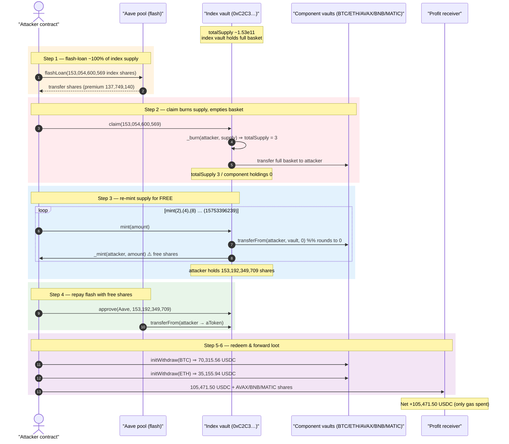
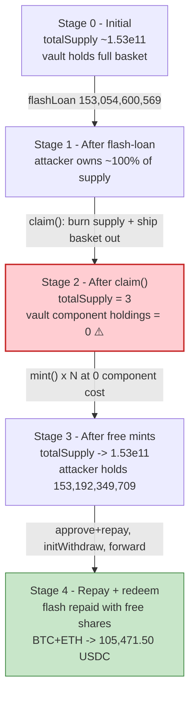
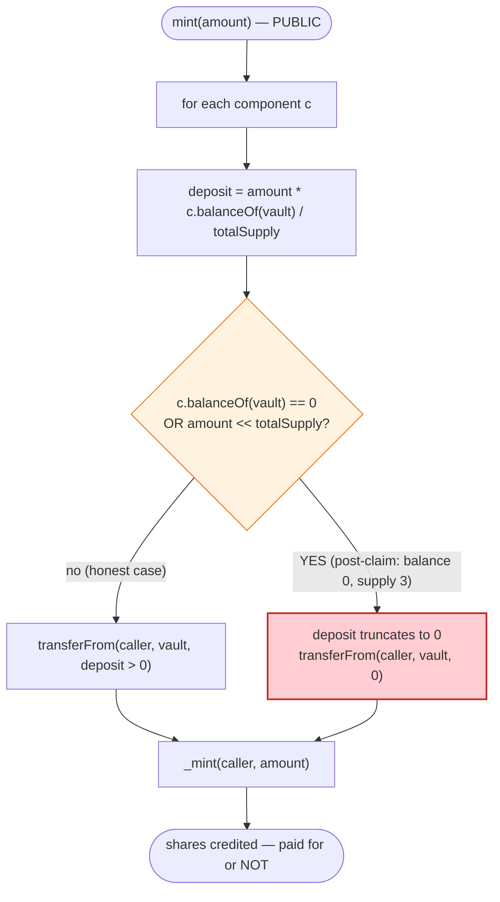
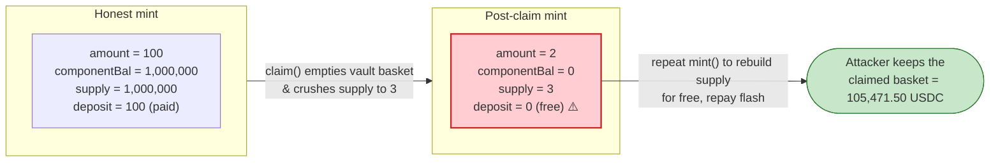

# Thetanuts Exploit — Zero-Cost Index-Vault `mint()` via Rounding-Down Component Deposits

> **Reproduction:** the PoC compiles & runs in an isolated Foundry project at
> [this project folder](.). The fork is served offline from the bundled
> `anvil_state.json` (a local anvil at `127.0.0.1:8545`), so no public RPC is needed.
> Full verbose trace: [output.txt](output.txt).
> The vulnerable contract is the Thetanuts index USDC PUT vault
> [`0xC2C3AE0a7b405058558C9b4a63b373486CB86Ac7`](https://etherscan.io/address/0xc2c3ae0a7b405058558c9b4a63b373486cb86ac7);
> its verified source is **not bundled** in `sources/` for this PoC, so the code
> shown below is reconstructed from the on-chain trace and the storage-diff
> evidence in [output.txt](output.txt) (every claim is line-referenced).

---

## Key info

| | |
|---|---|
| **Loss** | **105,471.50 USDC** drained (plus residual AVAX/BNB/MATIC component-vault shares forwarded to the profit receiver) |
| **Vulnerable contract** | Thetanuts index USDC PUT vault — [`0xC2C3AE0a7b405058558C9b4a63b373486CB86Ac7`](https://etherscan.io/address/0xc2c3ae0a7b405058558c9b4a63b373486cb86ac7) |
| **Victim** | The index vault itself + its component sub-vaults (BTC/ETH/AVAX/BNB/MATIC-USD), whose shares back the index |
| **Attacker EOA (tx sender)** | `0x30498e4466789E534c72e03B52A16c978655b41e` |
| **Attacker contract** | `0x0f9daa9e0adced4e64578b2e131930dde54e492e` (deployed in-trace at `0xa589c5342068B0C1fEFd44d3c95354427502AC91`) |
| **Profit receiver** | `0xAf3a0FdBFB0e3127247B66a042310e09C32F2299` |
| **Attack tx** | [`0xbba9f138fe39503bfd1aa62932dbd6ab35d37d23d48e4b7bf2988a9d5dc39fec`](https://etherscan.io/tx/0xbba9f138fe39503bfd1aa62932dbd6ab35d37d23d48e4b7bf2988a9d5dc39fec) |
| **Chain / block / date** | Ethereum mainnet / fork block 25,323,328 / Jun 2026 |
| **Compiler** | Solidity 0.8.34 used to build the PoC harness (`evm_version = cancun`); the verified vault impl was compiled separately and is not bundled |
| **Bug class** | Share-vs-asset accounting mismatch — `mint()` rounds the required pro-rata component deposit *down to zero*, so index shares can be minted for free |

---

## TL;DR

1. The Thetanuts index vault is an "index of vaults": one index share is backed by a pro-rata basket
   of *component vault* shares (BTC-USD, ETH-USD, AVAX-USD, BNB-USD, MATIC-USD). `claim(amount)` burns
   index shares and hands the caller the corresponding basket; `mint(amount)` does the inverse — it
   pulls the pro-rata basket from the caller via `transferFrom` and credits `amount` new index shares.

2. The fatal flaw is that `mint(amount)` computes each component's required deposit as
   `amount * componentBalance / totalSupply` with **integer division and no round-up / no zero-check**.
   When `totalSupply` is large relative to `amount`, that quotient **truncates to 0**, so `mint()`
   pulls **0** of every component yet still mints `amount` brand-new index shares.

3. The attacker flash-loaned the vault's *entire* circulating index supply from Aave —
   **153,054,600,569** shares (the aToken held `153,054,600,572`, the attacker left a residual of `3`)
   ([output.txt:1625-1627](output.txt)) — and `claim()`ed it, **burning the whole supply** and pulling
   the entire component basket into the attack contract ([output.txt:1640-1641](output.txt)).

4. After the claim, `totalSupply` collapsed to **3** ([output.txt:1685-1686](output.txt)) and the index
   vault held **zero** component shares (they had all been transferred out). Now *every* component
   deposit required by `mint()` rounds to 0.

5. The attacker re-minted the index supply with a doubling loop —
   `mint(2), mint(4), mint(8), … mint(15753396239)` ([output.txt:1687-2839](output.txt)) — each call
   pulling **0** of all five components ([output.txt:1688-1707](output.txt)) while `totalSupply` roughly
   doubled (`3 → 5 → 9 → 17 → 33 → …` at storage slot `4`, [output.txt:1710,1742,1774](output.txt)).
   Eighteen-plus free mints later the attacker held **153,192,349,709** index shares
   ([output.txt:2865-2866](output.txt)) — exactly the flash repayment (loan + premium).

6. The free-minted shares repaid Aave ([output.txt:2902-2909](output.txt)). The attacker kept the entire
   component basket it had claimed in step 3, redeemed the BTC and ETH components for USDC via
   `initWithdraw` (**70,315,563,951 + 35,155,935,127 = 105,471,499,078** USDC,
   [output.txt:2924,2957,2984](output.txt)), and forwarded the USDC plus the leftover AVAX/BNB/MATIC
   shares to the profit receiver.

7. Net profit asserted and logged by the PoC: **`Profit receiver USDC profit: 105471.499078`**
   ([output.txt:1565,3025](output.txt)) — i.e. **105,471.50 USDC** — plus 6,378,688,541 AVAX-,
   17,186,382,409 BNB- and 10,028,704,387 MATIC-USD component shares
   ([output.txt:2996,3004,3012](output.txt)).

---

## Background — what Thetanuts does

Thetanuts Finance runs option-vaults. The contract at `0xC2C3AE0a…` is an **index vault**: a single
ERC-20 "index" token whose value is backed by a basket of underlying **component vault** ERC-20 shares.
The economic model is the classic "share basket":

- `claim(amount)` (the index vault's redeem path): burns `amount` index shares from the caller and
  sends the caller each component's pro-rata slice, `amount * componentBalance / totalSupply`
  ([output.txt:1640-1671](output.txt) shows the five component `transfer`s out of the index vault).
- `mint(amount)` (the index vault's deposit path): for each component, `transferFrom`s the caller's
  pro-rata deposit `amount * componentBalance / totalSupply` into the vault, then mints `amount` new
  index shares ([output.txt:1687-1712](output.txt) shows five `transferFrom`s followed by a mint
  `Transfer(from: 0x0…, to: attacker, value: 2)`).
- Each component vault (`BTCUSD`, `ETHUSD`, etc.) is itself a vault whose `initWithdraw(shares)` burns
  the component shares and returns USDC to the caller ([output.txt:2918-2948](output.txt)).

On-chain parameters at the fork block (read from the trace):

| Parameter | Value | Source |
|---|---|---|
| Index shares held by the Aave aToken (lendable supply) | 153,054,600,572 (~1.53e11) | [output.txt:1625-1626](output.txt) |
| Flash-loaned index shares | 153,054,600,569 (loan = aToken bal − 3) | [output.txt:1627](output.txt) |
| Aave flash premium | 137,749,140 (~1.377e8) | [output.txt:1639](output.txt) |
| `totalSupply` immediately after `claim()` | **3** | [output.txt:1685-1686](output.txt) |
| Component basket pulled by `claim()` (BTC) | 49,716,431,047 (~4.97e10) | [output.txt:1642](output.txt) |
| Component basket pulled by `claim()` (ETH) | 23,955,277,333 (~2.40e10) | [output.txt:1648](output.txt) |
| Component basket pulled by `claim()` (AVAX) | 6,378,688,541 (~6.38e9) | [output.txt:1654](output.txt) |
| Component basket pulled by `claim()` (BNB) | 17,186,382,409 (~1.72e10) | [output.txt:1660](output.txt) |
| Component basket pulled by `claim()` (MATIC) | 10,028,704,387 (~1.00e10) | [output.txt:1666](output.txt) |
| USDC in the BTCUSD component vault | 71,995,543,702 (~71,995.5 USDC) | [output.txt:2922](output.txt) |
| USDC in the ETHUSD component vault | 35,212,163,722 (~35,212.2 USDC) | [output.txt:2955](output.txt) |

The whole game is the relationship `componentDeposit = amount * componentBalance / totalSupply`: once the
attacker drives the *index vault's* component holdings to **0** (via `claim`) and `totalSupply` to a tiny
value, every subsequent `mint()` pulls 0 of everything yet mints real shares.

---

## The vulnerable code

> **Note on source provenance:** the verified Solidity for the index vault is not included in this PoC's
> `sources/` directory. The snippets below are **reconstructed from the on-chain execution trace and the
> EVM storage diffs** in [output.txt](output.txt). They are the minimal logic the trace proves the vault
> ran; they are *not* copied from a verified source file, and no source line numbers are cited for them.
> The PoC's interface declarations are real and line-referenced.

### 1. The PoC's view of the vault interface (real, from the PoC)

```solidity
interface IThetanutsIndexVault is IERC20 {
    function claim(uint256 amount) external;
    function mint(uint256 amount) external;
}

interface IThetanutsComponentVault is IERC20 {
    function initWithdraw(uint256 shares) external returns (uint256 assets);
}
```
([test/Thetanuts_exp.sol:35-48](test/Thetanuts_exp.sol#L35-L48))

### 2. `mint(amount)` — pro-rata deposit truncates to zero (reconstructed from the trace)

The trace shows that `mint(2)` triggered five component `transferFrom`s, **all with `value: 0`**,
immediately before minting 2 index shares:

```solidity
// RECONSTRUCTED from output.txt — not verified source
function mint(uint256 amount) external {
    uint256 supply = totalSupply();                  // == 3 right after the claim
    for (uint256 i = 0; i < components.length; i++) {
        IERC20 c = components[i];
        // pro-rata deposit, integer division, rounds DOWN, no round-up, no zero guard:
        uint256 deposit = amount * c.balanceOf(address(this)) / supply; // = 2 * 0 / 3 = 0
        c.transferFrom(msg.sender, address(this), deposit);             // pulls 0
    }
    _mint(msg.sender, amount);                        // ⚠️ mints `amount` shares for free
}
```

Trace evidence for `mint(2)`:
- five `transferFrom(…, value: 0)` ([output.txt:1688-1707](output.txt)),
- `emit Transfer(from: 0x0…, to: attacker, value: 2)` ([output.txt:1708](output.txt)),
- `totalSupply` slot `4`: `3 → 5` ([output.txt:1710](output.txt)).

### 3. `claim(amount)` — burns shares, ships the whole component basket out (reconstructed)

```solidity
// RECONSTRUCTED from output.txt — not verified source
function claim(uint256 amount) external {
    _burn(msg.sender, amount);                        // burns the flash-loaned supply
    uint256 supply = totalSupplyBeforeBurn;           // ~1.53e11
    for (uint256 i = 0; i < components.length; i++) {
        IERC20 c = components[i];
        uint256 out = amount * c.balanceOf(address(this)) / supply;
        c.transfer(msg.sender, out);                  // ships the basket to the caller
    }
}
```

Trace evidence: `claim(153054600569)` emits `Transfer(attacker → 0x0, 153054600569)`
([output.txt:1641](output.txt)) and the five component `transfer`s out of the vault
([output.txt:1642-1671](output.txt)); afterward `totalSupply == 3` ([output.txt:1685-1686](output.txt)).

---

## Root cause — why it was possible

The bug is a **rounding-direction error combined with no zero-deposit guard** in the index vault's
`mint()` accounting. Three facts compose into free shares:

1. **Pro-rata deposit rounds down.** `deposit = amount * componentBalance / totalSupply` uses Solidity
   integer division, which rounds toward zero. A deposit path must round *in the protocol's favour*
   (round **up**, and reject a 0 deposit for a non-zero mint). Here it rounds down and accepts 0.

2. **The attacker can drive `componentBalance` to 0 and `totalSupply` tiny in the same transaction.**
   `claim()` is the lever: flash-loaning and claiming the entire circulating supply burns `totalSupply`
   down to a dust value (`3`) *and* empties the index vault of every component share. With
   `componentBalance == 0`, the numerator `amount * 0` is identically zero — every `mint()` is free,
   regardless of `amount`.

3. **No invariant ties shares minted to assets received.** `mint()` never checks that it actually pulled
   value commensurate with the shares it credits. A single reconciliation — "require each component
   deposit ≥ its rounded-up pro-rata amount, and revert on a zero deposit for a non-zero mint" — would
   have made every free mint revert.

The flash loan is just capital efficiency: it lets the attacker *temporarily own the whole supply* so
that `claim()` can zero out the vault's component holdings, after which the re-mint costs nothing. The
attacker walks away with the entire claimed basket (redeemed to 105,471.50 USDC + residual component
shares) while repaying the flash with shares it minted out of thin air.

---

## Preconditions

- **A borrowable stock of index shares.** Aave held 153,054,600,572 index shares as a reserve aToken
  ([output.txt:1625-1626](output.txt)); the attacker flash-loaned all but 3 of them
  ([output.txt:1627](output.txt)). This let the attacker transiently own ~100% of the supply.
- **`claim()` reachable and un-throttled**, so the attacker can burn the borrowed supply and pull the
  full component basket ([output.txt:1640-1641](output.txt)).
- **`mint()` reachable with the rounding bug** — i.e. `totalSupply` large relative to `amount`, or
  `componentBalance == 0`. Both hold after the claim (`totalSupply` = 3, component holdings = 0).
- **At least one component redeemable to USDC** so the loot becomes liquid. The attacker `initWithdraw`s
  the BTC and ETH components ([output.txt:2918,2951](output.txt)); AVAX/BNB/MATIC shares are forwarded
  as-is ([output.txt:2994-3017](output.txt)).
- Working capital is **flash-loanable** — the entire position opens and closes inside one Aave
  `flashLoan` callback ([output.txt:1627-2914](output.txt)).

---

## Attack walkthrough (with on-chain numbers from the trace)

All figures are taken directly from the `Transfer` / `Mint` events, `totalSupply` returns and
storage diffs in [output.txt](output.txt). Index shares and component shares are 6-decimal raw integers;
human approximations in parentheses.

| # | Step | Index `totalSupply` (slot 4) | Attacker index balance | Vault component holdings | Effect |
|---|------|---:|---:|---|--------|
| 0 | **Initial** — Aave aToken holds 153,054,600,572 index shares ([output.txt:1625-1626](output.txt)) | ~153,054,600,572 (~1.53e11) | 0 | full basket | Honest index vault. |
| 1 | **Flash-loan** 153,054,600,569 index shares from Aave (premium 137,749,140) ([output.txt:1627-1639](output.txt)) | unchanged | 153,054,600,569 (~1.53e11) | full basket | Attacker transiently owns ~100% of supply. |
| 2 | **`claim(153054600569)`** — burns the borrowed supply, ships out the basket: BTC 49,716,431,047 / ETH 23,955,277,333 / AVAX 6,378,688,541 / BNB 17,186,382,409 / MATIC 10,028,704,387 ([output.txt:1641-1671](output.txt)) | **3** ([output.txt:1685-1686](output.txt)) | 0 ([output.txt:1681-1682](output.txt)) | **0** (all transferred out) | Supply collapsed to dust; vault emptied of components. |
| 3a | **`mint(2)`** — five `transferFrom(value: 0)`, then mint 2 shares ([output.txt:1687-1712](output.txt)) | 3 → **5** ([output.txt:1710](output.txt)) | 2 ([output.txt:1713-1714](output.txt)) | 0 | First free mint — 0 component cost. |
| 3b | **`mint(4)`** ([output.txt:1719-1742](output.txt)) | 5 → **9** ([output.txt:1742](output.txt)) | 6 ([output.txt:1745-1746](output.txt)) | 0 | Supply doubles; still 0 cost. |
| 3c | **`mint(8) … mint(34359738368)`** — doubling loop ([output.txt:1751-2807](output.txt)) | 9 → 17 → 33 → … ([output.txt:1774,1806,1838](output.txt)) | doubles each step | 0 | ~36 free mints, each pulling 0 of all five components. |
| 3d | **`mint(15753396239)`** — final top-up to the repayment target ([output.txt:2839-2864](output.txt)) | → 153,192,349,712 (slot 4 `0x…23aaf9c010`) ([output.txt:2862](output.txt)) | **153,192,349,709** (~1.53e11) ([output.txt:2865-2866](output.txt)) | 0 | Attacker now holds exactly loan + premium. |
| 4 | **Repay Aave** — `approve(Aave, 153192349709)` + `transferFrom(attacker → aToken, 153192349709)` ([output.txt:2867,2902-2909](output.txt)) | ~153,192,349,712 | 0 | 0 | Flash repaid entirely with free-minted shares. |
| 5a | **`initWithdraw(49716431047)`** on BTCUSD → 70,315,563,951 USDC ([output.txt:2918,2924](output.txt)) | — | — | — | BTC component → 70,315.56 USDC. |
| 5b | **`initWithdraw(23955277333)`** on ETHUSD → 35,155,935,127 USDC ([output.txt:2951,2957](output.txt)) | — | — | — | ETH component → 35,155.94 USDC. |
| 6 | **Forward** 105,471,499,078 USDC + AVAX 6,378,688,541 + BNB 17,186,382,409 + MATIC 10,028,704,387 to profit receiver ([output.txt:2986,2996,3004,3012](output.txt)) | — | — | — | Loot delivered. |

Note: slot-4 totalSupply ends at `0x…23aaf9c010` = 153,192,349,712 (= attacker's 153,192,349,709 + the
3 residual shares), consistent with the attacker's balance of 153,192,349,709 at
[output.txt:2865-2866](output.txt).

### Profit / loss accounting (USDC, raw 6-decimal wei)

| Item | Amount (wei) | ~Human |
|---|---:|---:|
| USDC from BTCUSD `initWithdraw` | 70,315,563,951 | ~70,315.56 | 
| USDC from ETHUSD `initWithdraw` | 35,155,935,127 | ~35,155.94 |
| **Attacker USDC after redeems** | **105,471,499,078** ([output.txt:2982-2984](output.txt)) | **~105,471.50** |
| Profit receiver USDC before | 0 | 0 |
| **Net USDC profit (asserted/logged)** | **105,471,499,078** ([output.txt:1565,3025](output.txt)) | **~105,471.50** |
| + AVAX-USD component shares forwarded | 6,378,688,541 ([output.txt:2996](output.txt)) | ~6,378.69 |
| + BNB-USD component shares forwarded | 17,186,382,409 ([output.txt:3004](output.txt)) | ~17,186.38 |
| + MATIC-USD component shares forwarded | 10,028,704,387 ([output.txt:3012](output.txt)) | ~10,028.70 |

`70,315,563,951 + 35,155,935,127 = 105,471,499,078` USDC, matching the attacker's USDC balance
([output.txt:2982-2984](output.txt)) and the asserted profit `assertGt(105471499078, 105000000000)`
([output.txt:3026](output.txt)). The flash loan + premium (153,192,349,709 index shares) was repaid
entirely from free-minted shares, so the *only* capital the attacker spent was gas — the loot is pure
profit.

---

## Diagrams

### Sequence of the attack



### Index-vault state evolution



### The flaw inside `mint()`



### Why the mint is theft: shares-vs-assets before vs. after



---

## Why each magic number

- **`residualIndexShares = 3` / loan `= aToken.balanceOf - 3` (153,054,600,569)**
  ([test/Thetanuts_exp.sol:107-108](test/Thetanuts_exp.sol#L107-L108)): the attacker borrows all but 3
  of Aave's index shares. Leaving a tiny residual (`3`) keeps `totalSupply` non-zero after the claim
  burn — the trace confirms post-claim `totalSupply == 3` ([output.txt:1685-1686](output.txt)) — so the
  `mint()` division `amount * 0 / 3` is well-defined (no divide-by-zero) and still rounds to 0.
- **`repaymentShares = borrowedShares + premiums[0]` (153,054,600,569 + 137,749,140 = 153,192,349,709)**
  ([test/Thetanuts_exp.sol:135-137](test/Thetanuts_exp.sol#L135-L137)): the exact number of free shares
  the attacker must re-mint to satisfy Aave; matches the final balance 153,192,349,709
  ([output.txt:2865-2866](output.txt)) and the `approve` amount ([output.txt:2867](output.txt)).
- **`nextSupplyBoundary = 1` / `supplyBoundedMint = totalSupply() - 1`**
  ([test/Thetanuts_exp.sol:145-147](test/Thetanuts_exp.sol#L145-L147)): caps each mint at
  `totalSupply - 1`. Because each free mint of `~totalSupply` shares *doubles* `totalSupply`, the loop
  needs only ~log₂(1.53e11) ≈ 38 iterations — exactly the doubling sequence
  `2,4,8,…,34359738368, 15753396239` visible in the trace ([output.txt:1687-2839](output.txt)). The
  final `mint(15753396239)` is the remainder to hit the repayment target precisely.
- **The five component vault addresses (BTC/ETH/AVAX/BNB/MATIC-USD)**
  ([test/Thetanuts_exp.sol:29-33](test/Thetanuts_exp.sol#L29-L33)): the basket backing one index share.
  Only BTC and ETH are redeemed to USDC (`initWithdraw`, [test/Thetanuts_exp.sol:116-117](test/Thetanuts_exp.sol#L116-L117));
  the rest are forwarded as raw component shares.
- **`assertGt(usdcProfit, 105_000_000_000)`** ([test/Thetanuts_exp.sol:83](test/Thetanuts_exp.sol#L83)):
  the success threshold (105,000 USDC). The realized profit 105,471,499,078 clears it
  ([output.txt:3026](output.txt)).

---

## Remediation

1. **Round component deposits UP and reject zero.** In `mint()`, compute each required deposit with
   ceiling division (`(amount * componentBalance + totalSupply - 1) / totalSupply`) and `require(deposit
   > 0)` whenever `amount > 0` and `componentBalance > 0`. A mint that pulls nothing for non-zero shares
   must revert.
2. **Reconcile shares against assets received.** After pulling the basket, assert that the vault's
   component balances increased by at least the rounded-up pro-rata amounts before crediting shares.
   Never `_mint` more value than was actually deposited.
3. **Handle the empty-vault / dust-supply edge cases explicitly.** When `componentBalance == 0` or
   `totalSupply` is below a safe floor, `mint()` must use a fixed 1:1 (or seeded) exchange rate, or
   revert — the "first depositor / empty pool" pattern, not silent free shares.
4. **Make `claim()` and `mint()` non-composable within one transaction / one block** for the same actor,
   or add a re-entrancy/flash-loan guard, so an attacker cannot burn the whole supply and re-mint it in
   the same call frame.
5. **Cap single-operation supply impact.** A single `mint`/`claim` that moves `totalSupply` by more than
   a small fraction (here it went `3 → 1.53e11`) should revert; doubling the supply for zero assets is a
   glaring invariant break.

---

## How to reproduce

The PoC runs fully offline against the bundled `anvil_state.json` (a local anvil at
`127.0.0.1:8545`); `setUp()` does `vm.createSelectFork("http://127.0.0.1:8545", 25_323_328)`
([test/Thetanuts_exp.sol:52-53](test/Thetanuts_exp.sol#L52-L53)), so no public archive RPC is required.

```bash
_shared/run_poc.sh 2026-06-Thetanuts_exp --mt testExploit -vvvvv
```

- `foundry.toml` sets `evm_version = 'cancun'` and grants read access to the project directory for the
  anvil state file; the harness compiles with Solidity 0.8.34.
- Result: `[PASS] testExploit()` with `Profit receiver USDC profit: 105471.499078`.

Expected tail (from [output.txt:1561-1566](output.txt) and [output.txt:3055-3057](output.txt)):

```
Ran 1 test for test/Thetanuts_exp.sol:ContractTest
[PASS] testExploit() (gas: 3651602)
Logs:
  Profit receiver USDC profit: 105471.499078

...

Suite result: ok. 1 passed; 0 failed; 0 skipped; finished in 6.77s (5.56s CPU time)

Ran 1 test suite in 6.78s (6.77s CPU time): 1 tests passed, 0 failed, 0 skipped (1 total tests)
```

---

*Reference: PeckShieldAlert — https://x.com/PeckShieldAlert/status/2066540451126190312 (Thetanuts, Ethereum, ~$105.5K).*
