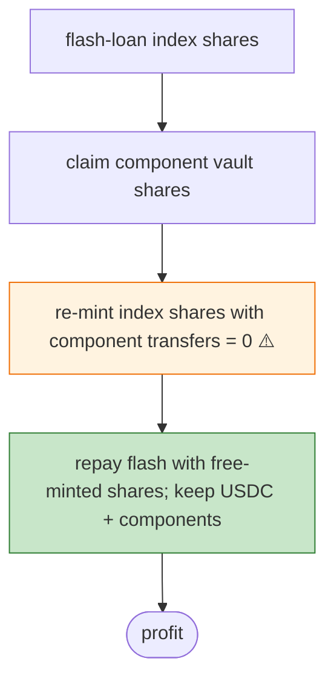

# Thetanuts Exploit — Flash-Loan Index Shares, Claim Components, Re-mint Index at Zero Transfer

> **Reproduction:** the PoC compiles & runs in an isolated Foundry project at
> [this project folder](.). Full verbose trace: [output.txt](output.txt).

---

## Key info

| | |
|---|---|
| **Loss** | USDC + residual component-vault shares (Ethereum); tx `0xbba9f138…` |
| **Vulnerable contract** | Thetanuts index vault `0xc2c3ae0a…` |
| **Attacker (tx sender)** | `0x30498e44…` |
| **Chain / block / date** | Ethereum mainnet / Jun 2026 |
| **Bug class** | Component-transfer accounting — flash-loan index shares, claim component-vault shares, then repeatedly re-mint index shares **while component transfer amounts stay at zero**, repaying the flash with free-minted shares. |

---

## TL;DR

Per the embedded analysis: the attacker flash-loaned Thetanuts index-vault shares, **claimed component
vault shares**, then repeatedly **minted replacement index shares while the component transfer amounts
stayed at zero**. The newly minted shares repaid Aave, leaving USDC and residual component-vault shares
for the profit receiver. (Variant of the ThetanutsFi mint-truncation class.)

---

## Root cause

The index `mint` path credits shares even when the underlying component transfers are zero — a
share-vs-asset accounting mismatch exploitable after positioning via flash-loaned + claimed components.

---

## Diagrams



---

## Remediation

1. Index `mint` must require each component transfer ≥ its pro-rata deposit (round up).
2. Reconcile shares minted against sum of assets received before crediting.

---

## How to reproduce

```bash
_shared/run_poc.sh 2026-06-Thetanuts_exp -vvvvv
```

- RPC: mainnet archive. Result: `[PASS]` — index shares minted at zero component transfer.

---

*Reference: Thetanuts index/component share-accounting exploit, mainnet, Jun 2026.*
