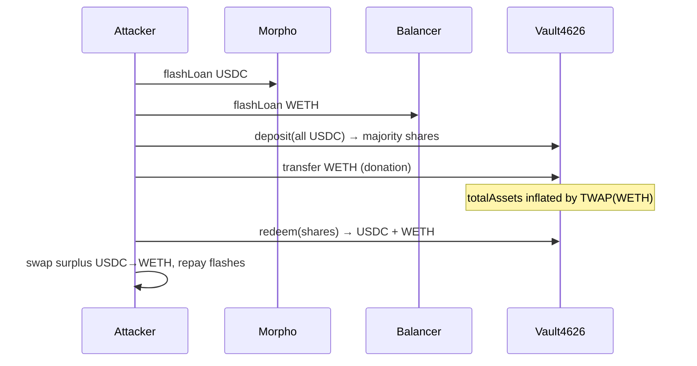

# Vault4626 — Donation of Non-Asset WETH Inflates totalAssets() and Is Paid Out on redeem()

> **Vulnerability classes:** vuln/defi/donation-attack · vuln/logic/incorrect-accounting · vuln/defi/flash-loan-attack

> **Reproduction:** offline Foundry project at [this folder](.). Trace: [output.txt](output.txt).
> Verified source: [src_Vault4626.sol](sources/Vault4626_D08579/src_Vault4626.sol) (implementation) behind
> proxy [`0x72dbAA8A…`](https://basescan.org/address/0x72dbaa8a09d71d09c6de0de439968e1e7c122020).

---

## Key info

| | |
|---|---|
| **Loss** | **~13.53 WETH** profit (`18366634484619156667 − 4837426434749649311 = 13529208039869487356` wei) |
| **Vulnerable contract** | `Vault4626` impl — [`0xD08579102fc28355C5839019b730Ce58F84E6a4d`](https://basescan.org/address/0xD08579102fc28355C5839019b730Ce58F84E6a4d#code) |
| **Vault proxy** | [`0x72dbAA8A09d71D09c6De0de439968e1E7c122020`](https://basescan.org/address/0x72dbaa8a09d71d09c6de0de439968e1e7c122020) |
| **Asset / non-asset** | USDC (`0x8335…2913`) / WETH (`0x4200…0006`) |
| **Attacker** | [`0xA27eAE743Cd8C03E9b7c25ebF43DADbBC6Df9bFA`](https://basescan.org/address/0xA27eAE743Cd8C03E9b7c25ebF43DADbBC6Df9bFA) |
| **Attack tx** | [`0x2f2e12fbdf541c28f3667153e5338f73a313096338dc5ca592453566debcd790`](https://basescan.org/tx/0x2f2e12fbdf541c28f3667153e5338f73a313096338dc5ca592453566debcd790) |
| **Chain / block** | Base / 47,958,574 / June 2026 |
| **Bug class** | `totalAssets()` quotes **donated idle non-asset WETH** into USDC value, while `redeem()` also **transfers that WETH** to the redeemer — double-counting donation as both share price and physical payout |

---

## TL;DR

1. `totalAssets()` ([Vault4626.sol:496-536](sources/Vault4626_D08579/src_Vault4626.sol#L496-L536)) returns idle USDC + LP value **plus** TWAP-quoted vault balances of the non-asset token (WETH):
   ```solidity
   vaultNonAssetQuoted = getQuoteAtTick(tick, vaultNonAsset, nonAssetToken, asset);
   return idle + assetInLP + quoted + vaultNonAssetQuoted;
   ```

2. `redeem()` ([Vault4626.sol:390-490](sources/Vault4626_D08579/src_Vault4626.sol#L390-L490)) sizes the USDC payout from `convertToAssets(shares)` (which uses inflated `totalAssets()`), then **additionally** transfers a pro-rata share of the vault's WETH to the redeemer.

3. Attack: Morpho-flash USDC → deposit for almost all shares → Balancer-flash WETH and **donate** it to the vault → redeem inflated shares → receive both overpriced USDC **and** the donated WETH → swap surplus USDC to WETH → repay flash loans → keep ~13.53 WETH.

4. Reproduced: attacker WETH `4.837 → 18.367` ([output.txt](output.txt)); vault `totalAssets` drops sharply.

---

## Vulnerable code

```solidity
// totalAssets — quotes donated WETH into share price
uint256 vaultNonAsset = IERC20(nonAssetToken).balanceOf(address(this));
uint256 vaultNonAssetQuoted = vaultNonAsset > 0
    ? VaultMathLib.getQuoteAtTick(tick, vaultNonAsset, nonAssetToken, address(asset)) : 0;
return idle + assetInLP + quoted + vaultNonAssetQuoted;

// redeem — pays USDC from convertToAssets (uses totalAssets) AND transfers WETH
assets = convertToAssets(shares);           // inflated by donation
...
_safeTransfer(nonAssetToken, receiver, nonAssetToSend);  // also pays the WETH
```

---

## Attack flow



---

## Recommendation

1. Do **not** count unsolicited non-asset balances in `totalAssets()` unless they are already reserved for a specific LP/fee accounting bucket that is **not** also transferred on redeem.
2. Prefer: only count strategy-reported balances; ignore raw `balanceOf(vault)` for non-asset tokens that redeem will pay out.
3. Donation-attack hardening: track accounting balances (not raw ERC20 balances) for share price.

---

## References

- Attack tx: https://basescan.org/tx/0x2f2e12fbdf541c28f3667153e5338f73a313096338dc5ca592453566debcd790
- Analysis: https://x.com/DefimonAlerts/status/2071495744071086510
