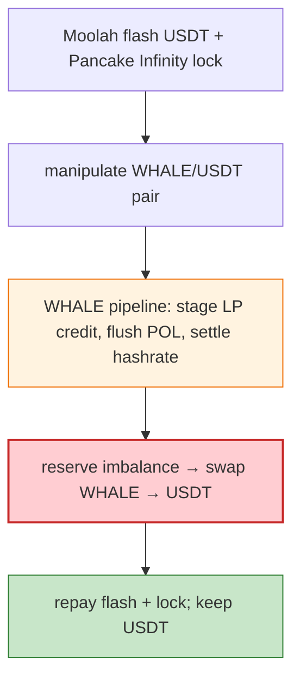

# WHALE Exploit — Transfer-Pipeline LP-Credit + POL Flush + Hashrate Reward Manipulation

> **Reproduction:** the PoC compiles & runs in an isolated Foundry project at
> [this project folder](.). Full verbose trace: [output.txt](output.txt).

---

## Key info

| | |
|---|---|
| **Loss** | USDT drained (BSC); tx `0xf8f431b3…`; attacker `0xA27eAE74…` |
| **Vulnerable contract** | WHALE token `0xABC79B7C…` (BSC, victim) |
| **Flash funding** | Moolah USDT flash + Pancake Infinity Vault lock |
| **Chain / block / date** | BSC / Jun 2026 |
| **Bug class** | Reserve/reward pipeline — WHALE's transfer pipeline staged LP credit, flushed POL liquidity, and settled hashrate rewards; the resulting reserve imbalance let the attacker swap a large WHALE balance out of the pair for USDT. |

---

## TL;DR

Per the embedded analysis: the attacker used a Moolah USDT flash loan plus a Pancake Infinity Vault
lock to manipulate the WHALE/USDT Pancake pair while **WHALE's transfer pipeline staged LP credit,
flushed POL liquidity, and settled hashrate rewards**. The final reserve imbalance let the attacker
swap a large WHALE balance out of the pair for USDT, repay both temporary funding sources, and forward
the remaining USDT to the attacker EOA.

---

## Root cause

A **multi-stage transfer/reward pipeline** (LP-credit staging + POL flush + hashrate settlement) whose
combined effect on the pair's reserves could be manipulated with flash-funded positions, leaving the
pair imbalanced so a large WHALE balance extracts USDT.

---

## Diagrams



---

## Remediation

1. Decouple transfer/reward pipeline from AMM reserves; settle rewards from committed balances only.
2. Fee-aware pair; `k` on received amounts; cap per-tx notional relative to reserves.
3. POL flush / hashrate settlement must not be manipulable by flash-funded LP credit.

---

## How to reproduce

```bash
_shared/run_poc.sh 2026-06-WHALE_exp -vvvvv
```

- RPC: BSC archive. Result: `[PASS]` — USDT drained via reserve-imbalance swap.

---

*Reference: WHALE transfer-pipeline / POL / hashrate manipulation, BSC, Jun 2026.*
