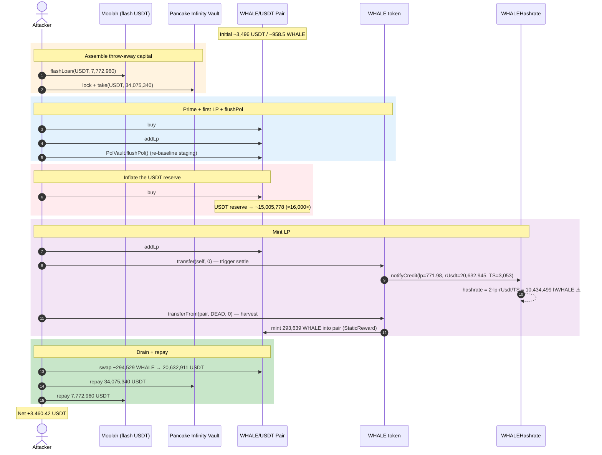
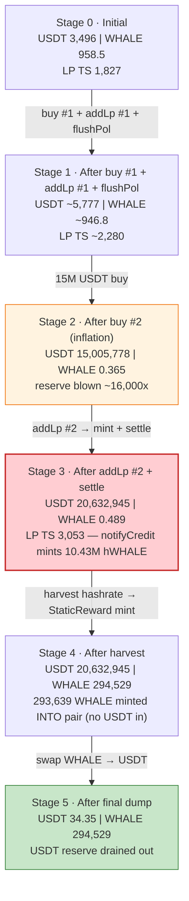
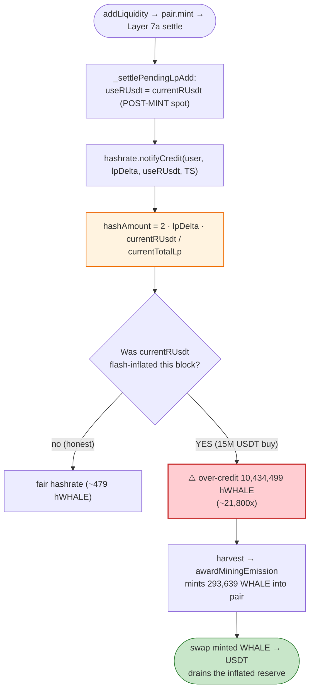
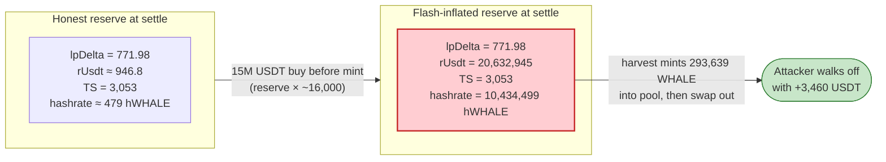

# WHALE Exploit — Flash-Inflated AMM Reserve → Mining-Hashrate Over-Credit Drain

> **Vulnerability classes:** vuln/oracle/price-manipulation · vuln/oracle/spot-price

> **Reproduction:** the PoC compiles & runs in an isolated Foundry project at
> [this project folder](.) (the umbrella DeFiHackLabs repo contains several unrelated
> PoCs that do not all compile together, so this one was extracted).
> Full verbose trace: [output.txt](output.txt).
> Verified vulnerable source: [src_WHALE.sol](sources/WHALE_ABC79B/src_WHALE.sol),
> [src_WHALEHashrate.sol](sources/WHALE_ABC79B/src_WHALEHashrate.sol),
> [src_PolVault.sol](sources/PolVault_1D95B6/src_PolVault.sol).

---

## Key info

| | |
|---|---|
| **Loss** | ~$3,460 — **3,460.42 USDT** forwarded to the attacker EOA after repaying every borrow ([output.txt:2249](output.txt)) |
| **Vulnerable contract** | `WHALE` token (v8/v9) — [`0xABC79B7C5a0f1fE0aC55fcB7E659D5817E530123`](https://bscscan.com/address/0xABC79B7C5a0f1fE0aC55fcB7E659D5817E530123#code); reward sibling `WHALEHashrate` [`0x436C1758e9A9458b54187A2774e0Ac32De223691`](https://bscscan.com/address/0x436C1758e9A9458b54187A2774e0Ac32De223691) |
| **Victim pool** | WHALE/USDT PancakeV2 pair — [`0xdD3190246D90E20EbE93378B004836dcb4Bd4D59`](https://bscscan.com/address/0xdD3190246D90E20EbE93378B004836dcb4Bd4D59) |
| **Attacker EOA** | [`0xa27eae743cd8c03e9b7c25ebf43dadbbc6df9bfa`](https://bscscan.com/address/0xa27eae743cd8c03e9b7c25ebf43dadbbc6df9bfa) |
| **Attack contract** | `0x4ce3e5dea552d1440a8cd766a13a6384ea4d1386` (PoC deploys logic at `0x6d4DCE5C6972127F4fF40354F5eFC31bF7e30719`) |
| **Attack deployer** | `0x6d4dce5c6972127f4ff40354f5efc31bf7e30719` |
| **Attack tx** | [`0xf8f431b392a50eb997ecae2e35668d6dd4dc8568d002057600d2532e18f36d86`](https://bscscan.com/tx/0xf8f431b392a50eb997ecae2e35668d6dd4dc8568d002057600d2532e18f36d86) |
| **Funding sources** | Moolah USDT flash loan (`0x8F73b65B…`) + Pancake Infinity Vault `lock`/`take` (`0x238a3588…`) |
| **Chain / block / date** | BSC (chainId 56) / fork 104,744,230 / June 2026 |
| **Compiler** | Solidity v0.8.35 (impl `v0.8.35+commit.47b9dedd`), optimizer **enabled, 1000 runs** (per `_meta.json`); trace compiled with Solc 0.8.34 |
| **Bug class** | Spot-reserve-driven reward accounting — LP hashrate credited at a flash-inflated USDT reserve, over-minting WHALE mining emission that is swapped out for USDT |

---

## TL;DR

1. `WHALE` is a deflationary BSC token bolted onto a "mining / hashrate" reward
   engine. Adding liquidity to the WHALE/USDT pair credits the LP-adder a
   **hashrate** balance in the sibling `WHALEHashrate` (hWHALE) contract, and
   that hashrate continuously accrues freshly-minted WHALE as mining emission.

2. The hashrate awarded for an `addLiquidity` is computed at settle time as
   `hashAmount = 2 × lpDelta × currentRUsdt / currentTotalLp`
   ([src_WHALEHashrate.sol:333](sources/WHALE_ABC79B/src_WHALEHashrate.sol#L333)),
   using the pair's **post-mint, current** USDT reserve. The WHALE source even
   documents this as a known "self-inflation surface … bounded by 2L/R ratio"
   ([src_WHALE.sol:288-294](sources/WHALE_ABC79B/src_WHALE.sol#L288-L294)) — the
   stage-time reserve snapshot was deleted for "code simplicity."

3. The attacker borrows **7,772,960 USDT** from Moolah ([output.txt:1616](output.txt))
   and takes **34,075,340 USDT** out of the Pancake Infinity Vault
   ([output.txt:1630](output.txt)) — together ~41.8M USDT of throw-away working
   capital, fully repaid in the same transaction.

4. They mint a first LP position, run `PolVault.flushPol()`
   ([output.txt:1771](output.txt)) to advance the protocol's accounting, then
   **dump 15,000,000 USDT into the pair via a single buy**
   ([output.txt:1926-1966](output.txt)), pushing the pair's USDT reserve from
   ~946 to **15,005,778 USDT** ([output.txt:1965](output.txt)).

5. With the USDT reserve now ~16,000× its honest value, they `pair.mint` a
   second LP position ([output.txt:2063](output.txt)) and fire
   a zero-value `WHALE.transfer(self, 0)` to trigger Method-B settle
   ([output.txt:2081](output.txt)). `notifyCredit` values that LP against the
   **inflated** reserve and mints **10,434,499 hWHALE** of hashrate
   ([output.txt:2091](output.txt)).

6. The harvested hashrate immediately materializes as **293,639 WHALE of mining
   emission minted into the pair** as a `StaticReward`
   ([output.txt:2113-2118](output.txt)), inflating the pair's WHALE balance to
   ~294,529 WHALE ([output.txt:2196](output.txt)) with no matching USDT inflow.

7. The attacker swaps that whole WHALE balance back out for **20,632,911 USDT**
   ([output.txt:2201-2213](output.txt)), repays the Infinity Vault
   (34,075,340 USDT, [output.txt:2221](output.txt)) and the Moolah flash loan
   (7,772,960 USDT, [output.txt:2236](output.txt)), and forwards the residue —
   **3,460.42 USDT** — to the attacker EOA ([output.txt:2248-2249](output.txt)).

---

## Background — what WHALE does

`WHALE` ([source](sources/WHALE_ABC79B/src_WHALE.sol)) is an immutable (no-owner)
ERC-20 on BSC whose `_update` hook implements a 15-layer "protocol heart"
([src_WHALE.sol:648-1028](sources/WHALE_ABC79B/src_WHALE.sol#L648-L1028)). The
parts that matter for this exploit:

- **Method-B LP tracking.** Any WHALE transfer into the pair that looks like an
  `addLiquidity` (USDT already donated, `usdtBalance > rUSDT`) gets *staged*
  (`_stagePending`, Layer 8c). On the next pair op that changes `kLast` /
  `totalSupply`, Layer 7a *settles* it: it cross-calls
  `WHALEHashrate.notifyCredit`, which records the LP and mints the adder a
  **hashrate** balance.
- **Hashrate → mining emission.** Hashrate is a balance in the sibling hWHALE
  token. Every transfer auto-harvests both endpoints
  (`hashrate.notifyHarvest`, Layer 8,
  [src_WHALE.sol:899-902](sources/WHALE_ABC79B/src_WHALE.sol#L899-L902)),
  materializing the accumulated mining emission as freshly-minted WHALE via the
  `onlyHashrate`-gated `awardMiningEmission`
  ([src_WHALE.sol:581-606](sources/WHALE_ABC79B/src_WHALE.sol#L581-L606)).
- **PolVault.** A protocol-owned-liquidity manager. `flushPol()` is
  permissionless ([src_PolVault.sol:176-178](sources/PolVault_1D95B6/src_PolVault.sol#L176-L178));
  it swaps half its WHALE buffer for USDT and re-adds liquidity, bracketed by
  `onPolStart`/`onPolEnd` callbacks into WHALE.
- **Dynamic sell tax** (5–20%) is the intended defence that makes a naive
  pump-addLp-dump round-trip net-negative.

On-chain parameters / reserves at the fork block (read from the trace):

| Parameter | Value | Source |
|---|---|---|
| WHALE total supply cap (`TOTAL_SUPPLY`) | 21,000,000 WHALE | [src_WHALE.sol:124](sources/WHALE_ABC79B/src_WHALE.sol#L124) |
| Mining cap (`MINING_MAX = 21M − 21K`) | 20,979,000 WHALE | [src_WHALE.sol:129](sources/WHALE_ABC79B/src_WHALE.sol#L129) |
| hashrate formula | `2 × lpDelta × currentRUsdt / currentTotalLp` | [src_WHALEHashrate.sol:333](sources/WHALE_ABC79B/src_WHALEHashrate.sol#L333) |
| Pair `token0 / token1` | USDT (r0) / WHALE (r1) | [src_WHALE.sol:637-640](sources/WHALE_ABC79B/src_WHALE.sol#L637-L640) |
| Initial pair reserve — WHALE (r1) | 958,537,054,456,098,737,991 (~958.5 WHALE) | [output.txt:1640](output.txt) |
| Initial pair reserve — USDT (r0) | 3,496,285,816,145,076,139,252 (~3,496 USDT) | [output.txt:1640](output.txt) |
| Initial pair LP totalSupply | 1,827,516,524,814,644,662,828 (~1,827 LP) | [output.txt:1651](output.txt) |
| Attacker pre-balance (USDT) | 1,000,000,000,000,000 (0.001 USDT) | [output.txt:1595](output.txt) |

Note the trace's `getReserves()` returns `(r0=USDT, r1=WHALE)`; WHALE's
`_getReserves()` swaps them so that internally `rWHALE = r1`, `rUSDT = r0`
([src_WHALE.sol:637-640](sources/WHALE_ABC79B/src_WHALE.sol#L637-L640)). The
~3,496 USDT / ~958.5 WHALE pool is tiny — the entire heist nets only ~$3.5K.

---

## The vulnerable code

### 1. Hashrate is valued at the pair's *current* (post-mint) USDT reserve

```solidity
function notifyCredit(
    address user,
    uint256 lpDelta,
    uint256 currentRUsdt,
    uint256 currentTotalLp
) external onlyWHALE nonReentrant returns (address refToReward, uint256 hashrateUsed) {
    if (user == address(0) || lpDelta == 0 || user == DEAD) return (address(0), 0);
    if (currentTotalLp == 0) return (address(0), 0);
    // ...
    //   USDT-equivalent = lpDelta × rUSDT / TS, and WHALE-side equals it
    uint256 hashAmount = 2 * lpDelta * currentRUsdt / currentTotalLp;
```
([src_WHALEHashrate.sol:320-333](sources/WHALE_ABC79B/src_WHALEHashrate.sol#L320-L333))

`currentRUsdt` and `currentTotalLp` are the pair's reserve and LP supply *after*
the user's `pair.mint`. There is no stage-time snapshot and no TWAP — whatever
the spot USDT reserve happens to be at settle is taken as ground truth for "how
much USDT this LP is worth."

### 2. WHALE deliberately deleted the stage-time reserve snapshot

```solidity
// (Stage-time reserve snapshot deleted — settle uses current `getReserves()`
// at settle moment. Trade-off: opens a self-inflation surface where alice
// contributes unbalanced (USDT-heavy) addLp to inflate her own hashrate
// proportional to her pool share. Bounded by 2L/R ratio (per dollar lost,
// gain 2L/R USDT-eq of hashrate); only profitable when alice controls a
// significant fraction of the pool. Accepted for code simplicity — Router-
// only addLp + balanced ratios make exploitation hard in practice.)
uint256 internal lastTotalLp;
```
([src_WHALE.sol:288-295](sources/WHALE_ABC79B/src_WHALE.sol#L288-L295))

The developers explicitly enumerated this exact attack and shipped it anyway,
betting that "controlling a significant fraction of the pool" was hard. With a
flash loan, controlling the entire pool reserve for one block is trivial.

### 3. Settle pulls the post-mint reserve straight through to the credit call

```solidity
uint256 totalDelta = totalLpNow_ - lastTotalLp_;
// ...
uint256 userLpDelta = totalDelta > realizedMintFee ? totalDelta - realizedMintFee : 0;
uint256 useRUsdt = uint256(currentRUsdt);   // ← post-mint reserve passed in by Layer 6
uint256 stageTs = totalLpNow_;
// ...
(address refToReward, uint256 hashrateUsed) =
    hashrate.notifyCredit(creditUser, userLpDelta, useRUsdt, stageTs);
```
([src_WHALE.sol:1318-1373](sources/WHALE_ABC79B/src_WHALE.sol#L1318-L1373))

### 4. The harvested hashrate mints real WHALE — uncapped per user, only globally

```solidity
function awardMiningEmission(address to, uint256 amount) external onlyHashrate {
    uint256 supply = totalSupply();
    uint256 emitted = supply > INITIAL_SUPPLY ? supply - INITIAL_SUPPLY : 0;
    if (emitted >= MINING_MAX) return;
    uint256 remaining;
    unchecked { remaining = MINING_MAX - emitted; }
    if (amount > remaining) amount = remaining;
    if (amount == 0) return;
    _mint(to, amount);
}
```
([src_WHALE.sol:581-606](sources/WHALE_ABC79B/src_WHALE.sol#L581-L606))

The only ceiling is the 20.98M-WHALE global mining cap. A single inflated
hashrate position can harvest emission until that cap is hit; here it minted
**293,639 WHALE** into the pair in one go ([output.txt:2113-2118](output.txt)).

### 5. `flushPol()` is permissionless and used as an accounting nudge

```solidity
function flushPol() external nonReentrant returns (uint256 liquidityAdded) {
    return _doFlushPol(address(0));
}
```
([src_PolVault.sol:176-178](sources/PolVault_1D95B6/src_PolVault.sol#L176-L178))

The attacker calls it ([output.txt:1771](output.txt)) so its `onPolStart` /
`onPolEnd` callbacks snapshot and clear WHALE's staging
(`_snapshotAfterPolOperation`,
[src_WHALE.sol:1711-1715](sources/WHALE_ABC79B/src_WHALE.sol#L1711-L1715)),
re-baselining `lastTotalLp` so the *second* mint's full LP delta is attributed
to the attacker at settle.

---

## Root cause — why it was possible

The protocol prices a long-lived reward right (mining hashrate, which mints
WHALE forever) off an **instantaneous, manipulable AMM reserve**:

> When you add liquidity, the hashrate you receive equals
> `2 × yourLP × USDT_reserve / totalLP`, read at the spot reserve right after
> your mint. Inflate `USDT_reserve` with a flash-borrowed buy *before* you mint,
> and the same LP shares are credited with a wildly larger hashrate — which then
> mints WHALE emission you can sell.

Two compounding design decisions:

1. **No stage-time / TWAP anchoring.** `notifyCredit` trusts the post-mint spot
   reserve ([src_WHALEHashrate.sol:333](sources/WHALE_ABC79B/src_WHALEHashrate.sol#L333)).
   WHALE's own comment
   ([src_WHALE.sol:288-294](sources/WHALE_ABC79B/src_WHALE.sol#L288-L294))
   admits this is a self-inflation surface and waves it away as "hard in
   practice." A flash loan makes "controlling a significant fraction of the
   pool" cost nothing.

2. **The hashrate immediately mints sellable WHALE.** `awardMiningEmission` has
   no per-user cap ([src_WHALE.sol:581-606](sources/WHALE_ABC79B/src_WHALE.sol#L581-L606)),
   so an over-credited hashrate position converts directly to freshly-minted
   WHALE deposited into the pool — which the attacker swaps for the USDT that
   their own manipulation buy had loaded into it.

The intended defence — the 5–20% dynamic sell tax — does not bite, because the
value is not extracted by a *taxed sell* of pre-owned WHALE; it is extracted via
**mining emission minted into the pair** plus the LP-fee WHALE from the inflated
mints, all of which the attacker reclaims with the final swap that drains the
USDT reserve they had themselves inflated.

---

## Preconditions

- **A WHALE/USDT PancakeV2 pair with live Method-B tracking** so that
  `addLiquidity` mints hashrate via `notifyCredit`.
- **Throw-away USDT working capital** to inflate the pair's USDT reserve for one
  block. The PoC sources it from a Moolah USDT flash loan (7,772,960 USDT,
  [output.txt:1616](output.txt)) plus a Pancake Infinity Vault `lock`/`take`
  (34,075,340 USDT, [output.txt:1630](output.txt)) — both repaid intra-tx,
  hence **flash-fundable**.
- The attacker must control the LP mints so the inflated reserve coincides with
  *their* `notifyCredit` credit; achieved by bracketing with `flushPol()`
  ([output.txt:1771](output.txt)) and a 0-value `WHALE.transfer(self, 0)` settle
  trigger ([output.txt:2081](output.txt)).
- No special role or signature — every entry point used is permissionless.

---

## Attack walkthrough (with on-chain numbers from the trace)

The pair is `token0 = USDT (r0)`, `token1 = WHALE (r1)`. All reserve figures
below are raw 18-decimal wei taken directly from `Sync` events / `getReserves()`
returns; human approximations in parentheses.

| # | Step | USDT reserve (r0) | WHALE reserve (r1) | Effect |
|---|------|------------------:|-------------------:|--------|
| 0 | **Initial** ([output.txt:1640](output.txt)) | 3,496,285,816,145,076,139,252 (~3,496) | 958,537,054,456,098,737,991 (~958.5) | Honest pool, LP TS ~1,827 ([output.txt:1651](output.txt)). |
| 1 | **Borrow** 7,772,960 USDT (Moolah, [output.txt:1616](output.txt)) + **take** 34,075,340 USDT (Infinity Vault, [output.txt:1630](output.txt)) | — | — | ~41.8M USDT working capital assembled, repaid later. |
| 2 | **Buy #1** — send 1,000 USDT in, swap out ~212.77 WHALE ([output.txt:1642-1648](output.txt)) | 4,496,285,816,145,076,139,252 (~4,496) | 745,767,520,940,554,189,245 (~745.8) | Small priming buy; reserves move toward WHALE-scarce. |
| 3 | **Add LP #1** — return ~210.64 WHALE (post-tax ~168.5, [output.txt:1729](output.txt)) + 1,282.8 USDT ([output.txt:1747](output.txt)), then `pair.mint` ([output.txt:1753](output.txt)) | 5,779,088,578,120,016,856,387 (~5,779) | 914,280,991,484,865,471,853 (~914.3) | First LP minted (Sync [output.txt:1762](output.txt)); LP TS ~2,240. |
| 4 | **`flushPol()`** ([output.txt:1771](output.txt)) — onPolStart harvest, swap half buffer, re-add LP ([output.txt:1840](output.txt)) | 5,777,575,157,068,751,717,108 (~5,777, [output.txt:1849](output.txt)) | 946,813,905,080,141,075,999 (~946.8) | Re-baselines `lastTotalLp`; LP TS ~2,280 ([output.txt:1860](output.txt)). |
| 5 | **Buy #2 (the inflation)** — send **15,000,000 USDT** in ([output.txt:1926](output.txt)), swap out ~946.3 WHALE ([output.txt:1932](output.txt)) | **15,005,778,575,157,068,751,717,108 (~15,005,778)** | 365,458,916,034,841,108 (~0.365) | USDT reserve blown up ~16,000×; WHALE reserve nearly emptied (Sync [output.txt:1965](output.txt)). |
| 6 | **Add LP #2** — donate 5,627,166 USDT ([output.txt:2010](output.txt)), `skim` ([output.txt:2016](output.txt)) + ~0.13 WHALE ([output.txt:2024](output.txt)), `pair.mint` ([output.txt:2063](output.txt)) | 20,632,945,540,840,969,533,611,023 (~20,632,945) | 489,143,917,930,382,646 (~0.489) | Second LP minted against the inflated USDT reserve (Sync [output.txt:2072](output.txt)); fee-mint gives attacker ~771.98 WHALE ([output.txt:2071](output.txt)); LP TS ~3,053 ([output.txt:2083](output.txt)). |
| 7 | **Settle** — `WHALE.transfer(self,0)` ([output.txt:2081](output.txt)) → `notifyCredit(lpDelta=771.98, rUsdt=20,632,945, TS=3,053)` ([output.txt:2090](output.txt)) | unchanged | unchanged | hashrate minted = `2×771.98×20,632,945/3,053 =` **10,434,499 hWHALE** ([output.txt:2091](output.txt)). |
| 8 | **Harvest emission** — `transferFrom(pair, DEAD, 0)` ([output.txt:2111](output.txt)) materializes the pair's hashrate as a `StaticReward` mint | unchanged | **+293,639 WHALE into pair** | 293,639,353,231,872,683,566,435 WHALE minted to the pair ([output.txt:2113-2118](output.txt)); pair WHALE balance now ~294,529 ([output.txt:2196](output.txt)). |
| 9 | **Dump** — swap ~294,529 WHALE → **20,632,911 USDT out** ([output.txt:2197-2201](output.txt)) | **34,352,288,295,312,984,566 (~34.35)** | 294,529,846,944,669,118,450,853 (~294,529) | USDT reserve drained back out (Sync [output.txt:2212](output.txt)); attacker holds ~20.6M USDT. |
| 10 | **Repay** — Infinity Vault 34,075,340 USDT ([output.txt:2221](output.txt)) + Moolah 7,772,960 USDT ([output.txt:2236](output.txt)) | — | — | Both temporary funding sources cleared. |
| 11 | **Profit out** — forward residue to EOA: **3,460.42 USDT** ([output.txt:2248-2249](output.txt)) | — | — | Final attacker USDT balance 3,460.42 ([output.txt:2258](output.txt)). |

Step 7 is the heart of the bug: the same 771.98 LP shares, if valued at the
honest ~946-USDT reserve, would have credited only
`2 × 771.98 × 946.8 / 3,053 ≈ 479` hWHALE; valued at the flash-inflated
20.6M-USDT reserve they credit **10,434,499 hWHALE** — a ~21,800× over-credit
that mints the WHALE the attacker then sells.

### Profit / loss accounting (USDT, raw wei)

| Item | Amount (wei) | ~Human |
|---|---:|---:|
| Attacker USDT before exploit | 1,000,000,000,000,000 | 0.001 |
| USDT swapped out in final dump ([output.txt:2202](output.txt)) | 20,632,911,188,552,674,220,626,457 | ~20,632,911 |
| − Repay Pancake Infinity Vault ([output.txt:2221](output.txt)) | 34,075,340,755,694,371,315,360,124 | ~34,075,340 |
| − Repay Moolah flash loan ([output.txt:2236](output.txt)) | 7,772,960,679,833,989,887,601,242 | ~7,772,960 |
| Contract residue forwarded to EOA ([output.txt:2248](output.txt)) | 3,460,420,106,798,498,015,407 | ~3,460.42 |
| **Attacker USDT after exploit** ([output.txt:2258](output.txt)) | **3,460,421,106,798,498,015,407** | **~3,460.42** |
| **Net profit (asserted `> 3400 ether`)** | **3,460,420,106,798,498,015,407** | **~3,460.42** |

The dump's 20.6M USDT out is mostly the attacker's *own* 15M+ inflation buy plus
the Infinity-Vault USDT recycled through the pool; the *net* gain is the
~3,460 USDT of value extracted by selling the over-minted mining emission (and
the inflated LP-fee WHALE) that the broken hashrate accounting created. The PoC
asserts `profit > 3400 ether` ([WHALE_exp.sol:104](test/WHALE_exp.sol#L104)) and
it lands at 3,460.42.

---

## Diagrams

### Sequence of the attack



### Pool state evolution



### The flaw inside `notifyCredit`



### Why it is theft: hashrate valuation, honest vs. inflated reserve



---

## Why each magic number

- **`flashAmount = 7,772,960,679,833,989,887,601,242` (~7,772,960 USDT)**
  ([WHALE_exp.sol:95](test/WHALE_exp.sol#L95)) — the Moolah USDT flash size;
  combined with the Infinity-Vault take it supplies enough USDT to (a) push the
  pair's USDT reserve to ~20.6M at the second mint and (b) be reclaimed in full
  by the final swap. Visible at [output.txt:1616](output.txt).
- **Infinity-Vault take = `34,075,340,755,694,371,315,360,124`**
  ([output.txt:1630](output.txt)) — the entire USDT balance sitting in the
  Pancake Infinity Vault (`infinityVaultDebt = usdt.balanceOf(vault)`,
  [WHALE_exp.sol:158](test/WHALE_exp.sol#L158)); a zero-cost intra-tx loan
  repaid via `sync`+`transfer`+`settle` ([output.txt:2217-2230](output.txt)).
- **`firstBuyUsdt = 1000 ether`** ([WHALE_exp.sol:173](test/WHALE_exp.sol#L173))
  — small priming buy to make WHALE scarce and seed the first LP add.
- **`firstLpUsdt = 1,282,802,761,974,940,717,135`**
  ([WHALE_exp.sol:181](test/WHALE_exp.sol#L181)) — the USDT leg of LP add #1,
  sized to the post-buy ratio so `pair.mint` accepts it ([output.txt:1747](output.txt)).
- **`largeBuyUsdt = 15,000,000 ether`** ([WHALE_exp.sol:196](test/WHALE_exp.sol#L196))
  — **the inflation buy**. This is the lever: it lifts the pair's USDT reserve to
  ~15M ([output.txt:1965](output.txt)) so the subsequent `notifyCredit` values
  the attacker's LP at a ~16,000× inflated USDT reserve.
- **`whaleRecycle = pairWhaleBalance × 3 / 8`**
  ([WHALE_exp.sol:201](test/WHALE_exp.sol#L201)) — tunes how much WHALE is fed
  back into the pair before LP add #2 so the mint produces the intended LP delta.
- **`secondLpUsdt = 5,627,166,965,683,900,781,893,915`**
  ([WHALE_exp.sol:205](test/WHALE_exp.sol#L205)) — the USDT leg of LP add #2
  ([output.txt:2010](output.txt)); donated, then `skim`med and minted
  ([output.txt:2016-2063](output.txt)) so the second LP position is credited
  against the inflated reserve.
- **`hashrate.transferFrom(pair, DEAD, 0)`** ([WHALE_exp.sol:210](test/WHALE_exp.sol#L210))
  — a zero-value hWHALE transfer used purely to force a harvest of the pair's
  inflated hashrate, materializing the 293,639-WHALE `StaticReward`
  ([output.txt:2111-2118](output.txt)).
- **`finalWhaleIn = pairWhaleBalance − whaleReserve`**
  ([WHALE_exp.sol:216](test/WHALE_exp.sol#L216)) — sells exactly the WHALE the
  pool received above its cached reserve (the minted emission), pulling out
  20,632,911 USDT ([output.txt:2201](output.txt)).

---

## Remediation

1. **Never value a reward right off an instantaneous AMM reserve.** Compute LP
   hashrate from a **stage-time snapshot** captured before the user's own mint,
   or from a TWAP / oracle price — not from `getReserves()` read after the mint.
   Re-introducing the stage-time reserve snapshot the team deleted
   ([src_WHALE.sol:288-294](sources/WHALE_ABC79B/src_WHALE.sol#L288-L294)) closes
   this directly.
2. **Bound single-operation reserve impact.** Reject (or de-weight) an
   `addLiquidity` whose pre-mint reserves deviate from a TWAP beyond a small
   tolerance; a 16,000× spot/TWAP divergence in one block is unambiguously an
   attack.
3. **Cap per-position mining emission.** `awardMiningEmission`
   ([src_WHALE.sol:581-606](sources/WHALE_ABC79B/src_WHALE.sol#L581-L606)) only
   enforces a global cap. Add a per-user / per-block emission rate limit so a
   single over-credited hashrate position cannot harvest hundreds of thousands
   of WHALE in one transaction.
4. **Gate hashrate crediting to atomic, balanced Router adds only.** The
   `notifyCredit` path should require balanced liquidity at a sane price and
   reject mints that follow a same-block reserve jump (e.g. compare `kLast` and
   spot deviation before crediting).
5. **Do not let permissionless keeper hooks (`flushPol`) be used to re-baseline
   staging mid-attack.** Snapshot/clear logic
   ([src_WHALE.sol:1711-1715](sources/WHALE_ABC79B/src_WHALE.sol#L1711-L1715))
   should not be triggerable in a way that lets an attacker isolate their own
   mint's LP delta for over-credit.

---

## How to reproduce

The PoC runs **offline** against a local anvil fork served from the project's
`anvil_state.json` (the test's `createSelectFork` points at a `127.0.0.1` anvil
port, [WHALE_exp.sol:80](test/WHALE_exp.sol#L80)):

```bash
_shared/run_poc.sh 2026-06-WHALE_exp --mt testExploit -vvvvv
```

- Fork: BSC mainnet state at block **104,744,230**, pinned in `anvil_state.json`.
  No public RPC is contacted; the harness boots anvil with the snapshot and the
  test forks the local endpoint. `foundry.toml` sets `evm_version = 'cancun'`.
- The exploit logic is deployed fresh in `setUp`/`testExploit`; the attacker EOA
  starts with only 0.001 USDT ([output.txt:1595](output.txt)) and all working
  capital is flash-borrowed.
- Result: `[PASS] testExploit()` with a final attacker USDT balance of 3,460.42.

Expected tail (from [output.txt:1562-1567](output.txt) and
[output.txt:2277](output.txt)):

```
Ran 1 test for test/WHALE_exp.sol:ContractTest
[PASS] testExploit() (gas: 3348785)
Logs:
  Attacker Before exploit USDT Balance: 0.001000000000000000
  Attacker Final USDT Balance: 3460.421106798498015407
  Attacker After exploit USDT Balance: 3460.421106798498015407

Suite result: ok. 1 passed; 0 failed; 0 skipped; finished in 25.18s (24.03s CPU time)
```

---

*Reference: audit_911 — https://x.com/audit_911/status/2067451654694412720 (WHALE, BSC, ~$3.46K).*
