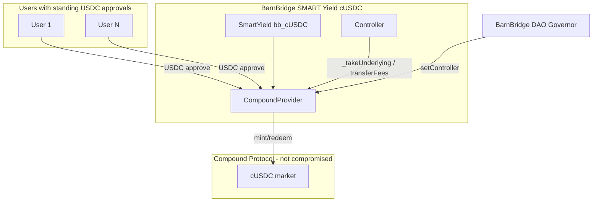

# BarnBridge SMART Yield — DAO Controller Swap → CompoundProvider Approval Drain

> **Vulnerability classes:** vuln/governance/proposal-manipulation · vuln/dependency/upgradeable-contract · vuln/access-control/broken-logic · vuln/logic/missing-allowance

> **Reproduction:** the PoC compiles & runs in an isolated Foundry project at
> [this project folder](.). The fork is served offline from the bundled
> `anvil_state.json` (local anvil replays Ethereum state at block `25535119`), so no
> public RPC is required.
> Full verbose trace: [output.txt](output.txt).
> Verified on-chain sources: [CompoundProvider.sol](sources/CompoundProvider_0xdaa037/CompoundProvider_DAA037/contracts_providers_CompoundProvider.sol)
> (BarnBridge SMART Yield cUSDC provider at `0xDAA0…8310` — **not** Compound Protocol core).

<!-- non-defihacklabs -->

---

## Key info

| | |
|---|---|
| **Loss** | **776,575.547933 USDC** (~**$776K**) across two drain batches |
| **PoC scope** | Full USDC path: batch1 **774,943.379409** + batch2 **1,632.168524** USDC |
| **Protocol** | BarnBridge SMART Yield (bb_cUSDC) — **not** Compound Protocol |
| **CompoundProvider** | [`0xDAA037F99d168b552c0c61B7Fb64cF7819D78310`](https://etherscan.io/address/0xDAA037F99d168b552c0c61B7Fb64cF7819D78310#code) |
| **SmartYield** | [`0x4B8d90D68F26DEF303Dcb6CFc9b63A1aAEC15840`](https://etherscan.io/address/0x4B8d90D68F26DEF303Dcb6CFc9b63A1aAEC15840) (`bb_cUSDC`) |
| **Old controller** | [`0x41Ab25709e0C3EDf027F6099963fE9AD3EBaB3A3`](https://etherscan.io/address/0x41Ab25709e0C3EDf027F6099963fE9AD3EBaB3A3) |
| **Attacker controller proxy** | [`0x66c6f3b4B4b458e6d764759Ecf122484ebEf7580`](https://etherscan.io/address/0x66c6f3b4B4b458e6d764759Ecf122484ebEf7580) |
| **Malicious impl** | [`0x769a9fa1e2414db14b35c46e4095d6e8f1694565`](https://etherscan.io/address/0x769a9fa1e2414db14b35c46e4095d6e8f1694565) (unverified) |
| **DAO Governor** | [`0x4cae362d7f227e3d306f70ce4878e245563f3069`](https://etherscan.io/address/0x4cae362d7f227e3d306f70ce4878e245563f3069) |
| **Attacker EOA** | [`0xF908610E9174c7cd6e9dfD371e238be4511297A1`](https://etherscan.io/address/0xF908610E9174c7cd6e9dfD371e238be4511297A1) |
| **Drain #1** | [`0xd191fead…5afb`](https://etherscan.io/tx/0xd191fead1b9a2244f2837560f35d4fc865404914d229bfcb0172d1a7a9895afb) (block `25535120`) |
| **Drain #2** | [`0x7d722637…d238`](https://etherscan.io/tx/0x7d722637a58a7117dbca0182ec26d74e2be0c1052ac319f0150bc056e528d238) (block `25535160`) |
| **Chain / fork / date** | Ethereum mainnet / fork `25535119` (post-`upgradeTo`, pre-drain) / ~2026-07-15 |
| **Compiler** | Solidity `0.7.6` (CompoundProvider) |
| **Bug class** | DAO-authorized `setController` → attacker proxy → malicious `upgradeTo` → privileged `_takeUnderlying` sweeps standing USDC approvals |

---

## TL;DR

1. BarnBridge SMART Yield’s `CompoundProvider` trusts its `controller` for privileged
   pulls: `_takeUnderlying` is gated only by `onlySmartYieldOrController` and will
   `transferFrom` any `from_` that still approves the provider
   ([CompoundProvider.sol:132-143](sources/CompoundProvider_0xdaa037/CompoundProvider_DAA037/contracts_providers_CompoundProvider.sol#L132-L143)).

2. `setController` is callable by the current controller **or the DAO**
   ([CompoundProvider.sol:106-118](sources/CompoundProvider_0xdaa037/CompoundProvider_DAA037/contracts_providers_CompoundProvider.sol#L106-L118)).
   The attacker used BarnBridge governance to point the provider at an
   **attacker-deployed proxy** whose admin is the attacker EOA.

3. After the DAO swap landed, the attacker `upgradeTo`’d a malicious implementation
   that batch-calls `_takeUnderlying(user, amount)` for ~50+ residual USDC approvers,
   then `transferFees()` which pays the entire provider USDC balance to
   `controller.feesOwner()` (hard-coded attacker)
   ([CompoundProvider.sol:208-221](sources/CompoundProvider_0xdaa037/CompoundProvider_DAA037/contracts_providers_CompoundProvider.sol#L208-L221)).

4. **Clarification (ExVul):** this is **BarnBridge infrastructure**, not a Compound
   Protocol core bug. The name `CompoundProvider` only means the provider integrates
   Compound’s cUSDC market as a yield venue.

5. This PoC forks **post-upgrade** (block `25535119`) and replays both historical
   drain calldatas for the **exact** on-chain profit **776,575.547933 USDC**.

---

## Background

### Protocol model



Users historically approved `CompoundProvider` so senior/junior bond flows could
pull USDC. Those approvals remained after the product went quiet — latent surface
for any entity that becomes `controller`.

### Privileged entry points

| Function | Guard | Effect |
|----------|-------|--------|
| `_takeUnderlying(from, amt)` | `onlySmartYieldOrController` | `USDC.transferFrom(from, provider, amt)` — **no check that `from` is a legitimate depositor** |
| `transferFees()` | **none** (public) | redeem fee cTokens if any; `USDC.transfer(controller.feesOwner(), balance)` |
| `setController(new)` | `onlyControllerOrDao` | rewires trust root; updates COMP allowance to new controller |

---

## Root cause

### 1. Governance can rewire the controller

```solidity
// CompoundProvider.sol
function setController(address newController_)
  external override
  onlyControllerOrDao
{
  // ... revoke COMP allowance on old controller ...
  controller = newController_;
  updateAllowances();
}
```

Whoever controls the DAO (or the current controller) can install an arbitrary
address as `controller`. There is no allowlist, timelock-on-provider, or two-step
acceptance by the new controller.

### 2. Controller is fully trusted for user pulls

```solidity
function _takeUnderlying(address from_, uint256 underlyingAmount_)
  external override
  onlySmartYieldOrController
{
    IERC20(uToken).safeTransferFrom(from_, address(this), underlyingAmount_);
    // balance delta check only
}
```

Once the attacker’s proxy is `controller`, it can pull **any** residual USDC
allowance to the provider — the original product intent (deposit plumbing) becomes
an approval drain.

### 3. `transferFees` is a permissionless forwarder to `feesOwner`

```solidity
function transferFees() external override {
  _withdrawProviderInternal(underlyingFees, 0);
  underlyingFees = 0;
  uint256 fees = IERC20(uToken).balanceOf(address(this));
  address to = CompoundController(controller).feesOwner();
  IERC20(uToken).safeTransfer(to, fees);
}
```

After `_takeUnderlying` aggregates USDC on the provider, a single `transferFees()`
ships the balance to whatever `feesOwner()` the malicious controller returns
(attacker EOA).

---

## Attack path (on-chain chronology)

| Block | Action |
|------:|--------|
| `25472222` | Attacker deploys controller **proxy** `0x66c6…` with **initial impl = old legitimate controller** `0x41ab…`, **admin = attacker** |
| `25472231` | `propose(...)` on BarnBridge DAO to `setController(0x66c6…)` (and related wiring) |
| `25507914` | `castVote` |
| `25508121` | `queue` (+ abrogation proposal started — did not stop execution) |
| `25535097` | DAO execution: `CompoundProvider.controller` flips `0x41ab…` → `0x66c6…` |
| `25535106` | Attacker deploys **malicious impl** `0x769a…` |
| `25535107` | `upgradeTo(0x769a…)` on the proxy (admin = attacker) |
| `25535120` | Drain batch 1 — **774,943.379409 USDC** (~50 victims) |
| `25535160` | Drain batch 2 — **1,632.168524 USDC** (~42 victims) |

Malicious entrypoint (selector `0xe321fa05`) roughly:

```text
drain(provider, address[] users, uint256[] amounts):
  for i in users:
    if amounts[i] != 0:
      provider._takeUnderlying(users[i], amounts[i])
  provider.transferFees()   // → feesOwner = attacker
```

---

## PoC notes

- **Scope:** post-upgrade fork at `25535119`; historical calldata replay of both
  drain transactions (governance + `upgradeTo` already mined — heavy to re-simulate
  full DAO voting, and the economic impact is entirely in the pull phase).
- **Assertion:** attacker USDC delta == `776_575_547_933` (6 decimals).
- **Offline:** `anvil_state.json` + `createSelectFork("http://127.0.0.1:8545", 25535119)`.

```bash
# offline (after warm)
bash _shared/run-poc/run_poc.sh 2026-07-BarnBridgeSmartYield_exp -vv
```

---

## Mitigations (retrospective)

1. **Two-step controller rotation** with explicit accept by the new controller, plus
   a delay / guardian veto on `setController`.
2. **Expire or scope user approvals** — pull only during an active deposit session;
   do not leave unlimited USDC allowances on a product that is winding down.
3. **Bound `_takeUnderlying`** to known bond/deposit accounting (msg.sender path must
   match a live position), not arbitrary `(from, amount)`.
4. **Gate `transferFees`** to controller/DAO and separate fee accrual from arbitrary
   provider balances created by `_takeUnderlying`.
5. **DAO hygiene** — low-activity governance on legacy products is an attack surface;
   renounce or freeze controller changes when TVL is residual approvals only.

---

## References

* Phalcon: https://x.com/Phalcon_xyz/status/2077243530280587721
* ExVul (CompoundProvider allowance sweep; **not Compound Protocol**): https://x.com/exvulsec/status/2077253565438194108
* Phalcon explorer: https://app.blocksec.com/phalcon/explorer/tx/eth/0xd191fead1b9a2244f2837560f35d4fc865404914d229bfcb0172d1a7a9895afb
* Drain 1: https://etherscan.io/tx/0xd191fead1b9a2244f2837560f35d4fc865404914d229bfcb0172d1a7a9895afb
* Drain 2: https://etherscan.io/tx/0x7d722637a58a7117dbca0182ec26d74e2be0c1052ac319f0150bc056e528d238
