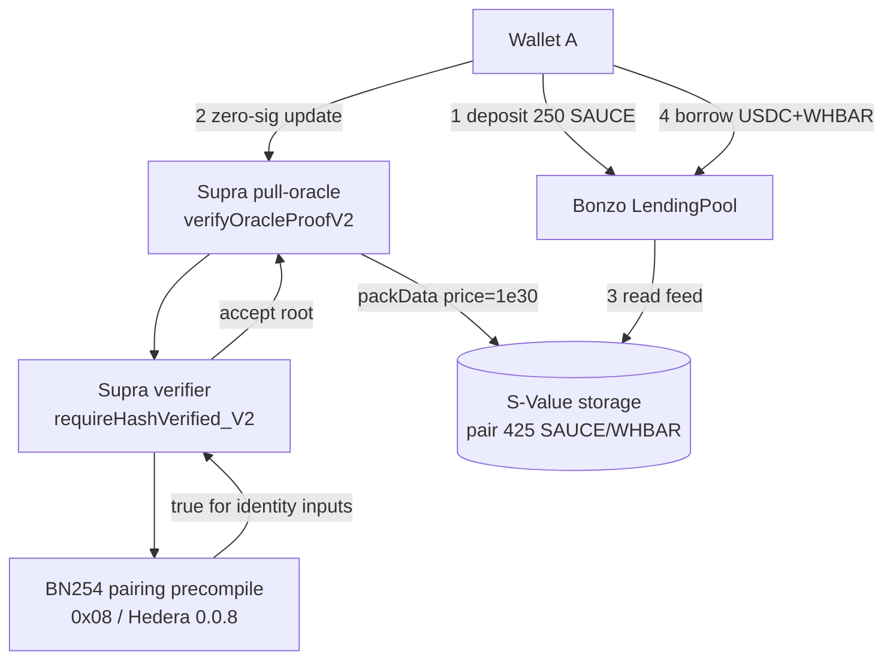
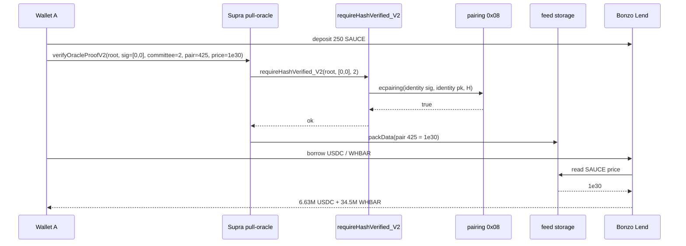
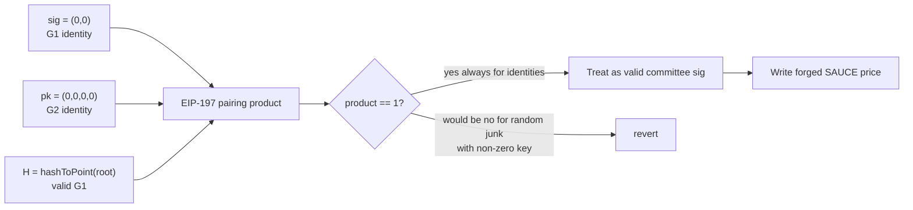

# Bonzo Lend / Supra Oracle — BLS Zero-Signature Price Forgery

> **Vulnerability classes:** vuln/auth/signature-validation · vuln/oracle/missing-validation · vuln/oracle/price-manipulation · vuln/input-validation/missing-validation

> **Reproduction:** the PoC compiles & runs in an isolated Foundry project at
> [this project folder](.). The fork is served offline from the bundled
> `anvil_state.json` (local anvil serves a mainnet-shaped snapshot at block
> `22800000` solely for the BN254 pairing precompile; the vulnerable stack is
> **deployed in-test** as a portable pure-EVM model of Supra + Bonzo), so no
> public RPC is required.
> Full verbose trace: [output.txt](output.txt).
> Reconstructed verifier / pull / mini-lend sources:
> [VulnerableBLSOracle.sol](sources/SupraBLS_reconstructed/VulnerableBLSOracle.sol)
> (RECONSTRUCTED from BlockSec + Bonzo Finance public reports; Hedera bytecode
> is not fully forkable under Foundry today — see tooling notes).

<!-- non-defihacklabs -->

---

## Key info

| | |
|---|---|
| **Loss (campaign)** | ~**$9.05M** Wallet A principal (BlockSec / Bonzo Finance; excludes ~$1.0M white-hat Wallet B) |
| **PoC scope** | **6,634,528.202695 USDC** — historical Wallet A USDC borrow against 250 SAUCE after forged feed (WHBAR leg not modelled) |
| **Vulnerable locus** | Supra BLS verifier `requireHashVerified_V2` / `BLS.verifySingle` — Hedera `0.0.4323006`, attack-time impl [`0x63e0a27bc77ca817c89f5231d568c4e58100fbf0`](https://hashscan.io/mainnet/contract/0.0.4323006) |
| **Pull oracle** | Supra pull [`0x41ab2059baa4b73e9a3f55d30dff27179e0ea181`](https://hashscan.io/mainnet/contract/0.0.4323024) (`0.0.4323024`) |
| **Lending consumer** | Bonzo LendingPool [`0x236897c518996163E7b313aD21D1C9fCC7BA1afc`](https://hashscan.io/mainnet/contract/0.0.7308459) (`0.0.7308459`) — **correct** given a forged feed |
| **Attacker EOA** | Wallet A [`0x9A4966152F6e10b33Cb7a37975e8619816d6a494`](https://hashscan.io/mainnet/account/0.0.10633526) (`0.0.10633526`) |
| **Attack tx (oracle)** | [`0xd50c55e24eb8483ec55bf74e84fc9853d0f0fe36f64abdb812a2d9afa2a10a60`](https://hashscan.io/mainnet/transaction/0.0.995584-1783731093-686041919) (Hedera `0.0.995584-1783731093-686041919`, block `97504678`) |
| **Borrow txs** | USDC [`0xa62a9b…a4a7`](https://hashscan.io/mainnet/transaction/0.0.995584-1783731103-632042789) · WHBAR [`0xf45426…7eb8`](https://hashscan.io/mainnet/transaction/0.0.995584-1783731109-865868387) |
| **Chain / date** | **Hedera** mainnet (EVM chainId **295**) / **2026-07-11** · PoC runs as pure-EVM teaching model |
| **Compiler** | Solidity `0.8.15` (PoC) |
| **Bug class** | BLS / pairing input validation missing — identity signature + identity committee key accepted as a valid committee signature |

---

## TL;DR

1. Bonzo Lend prices ecosystem collateral (including `SAUCE`) from **Supra**'s
   on-chain pull-oracle feed. It does **not** re-verify committee signatures; it
   reads the latest stored value.

2. Supra's update path calls `verifyOracleProofV2` → `requireRootVerified` →
   `requireHashVerified_V2` → `BLS.verifySingle`, which hands a pairing product
   to Hedera's BN254 precompile (`0.0.8` / EIP-197 `0x08`).

3. The verifier **never rejected the G1/G2 identity (zero) points**. Wallet A
   submitted pair **425 (`SAUCE`/`WHBAR`)** with **committee ID 2** and
   **signature `[0,0]`**. Committee pubkey[2] was also the identity. The pairing
   product of identity inputs is mathematically 1, so the precompile returned
   **true** — not because a real signature existed, but because the equation
   held for the wrong inputs.

4. The forged root was accepted; `packData` wrote price **`10**30`**. Eight
   seconds later Wallet A borrowed **~6.63M USDC** and **~34.5M WHBAR** against
   **250 SAUCE** collateral. Headline loss **~$9.05M**.

5. This is a **smart-contract cryptographic validation bug** (missing zero-point
   checks), **not** a compromised oracle key (contrast Ostium). Supra deployed a
   fixed implementation after the incident (`0x02ebd8…` at latest).

---

## Background

### Protocol model



### Historical call parameters (oracle update)

Decoded from attack tx `0xd50c55…0a60` input selector `0x03a02dfd`:

| Field | Value |
|-------|--------|
| Root / committeeHash | `0xd4e6b48aef731cc8cd74b25fbaec267ff8a6269aea1f4be4ee19dda5ecbf3f7f` |
| BLS signature | `[0, 0]` |
| Committee ID | `2` |
| Pair ID | `425` (`SAUCE`/`WHBAR`) |
| Price field | `10**30` (integer “1” + thirty zeros) |

---

## The vulnerable code

**RECONSTRUCTED** teaching model
([sources/SupraBLS_reconstructed/VulnerableBLSOracle.sol](sources/SupraBLS_reconstructed/VulnerableBLSOracle.sol)),
matching the BlockSec snippet for `requireHashVerified_V2` and the Bonzo Finance
incident report. Live Hedera sources were not fully recoverable into a Foundry
fork (see tooling notes).

```solidity
function requireHashVerified_V2(
    bytes32 _message,
    uint256[2] calldata _signature,
    uint256 committee_id
) public view {
    bool callSuccess;
    bool checkSuccess;
    (checkSuccess, callSuccess) = BLS.verifySingle(
        _signature,
        committee_public_key[committee_id],
        BLS.hashToPoint(domain, abi.encode(_message)),
        blsPrecompileGasCost
    );
    if (!callSuccess) {
        revert BLSInvalidPublicKeyorSignaturePoints();
    }
    if (!checkSuccess) {
        revert BLSIncorrectInputMessaage();
    }
    // MISSING: reject signature == (0,0), reject pubkey == identity,
    //          reject off-subgroup points before trusting checkSuccess.
}
```

PoC library path (pairing call with **no** zero-point gate)
([VulnerableBLSOracle.sol:70-103](sources/SupraBLS_reconstructed/VulnerableBLSOracle.sol#L70-L103)):

```solidity
function verifySingle(
    uint256[2] memory signature,
    uint256[4] memory pubkey,
    uint256[2] memory message
) internal view returns (bool checkSuccess, bool callSuccess) {
    // ... build 12-limb EIP-197 input from sig / nG2 / H(m) / pk ...
    assembly {
        callSuccess := staticcall(gas(), 0x08, input, 0x180, out, 0x20)
    }
    checkSuccess = out[0] != 0;
}
```

When `signature = (0,0)` and `pubkey = (0,0,0,0)`, the pairing product is the
multiplicative identity. Offline trace
([output.txt:1598-1601](output.txt#L1598-L1601)):

```
PRECOMPILES::ecpairing([0, 0, nG2…], [1, 2, 0, 0, 0, 0]) → true
requireHashVerified_V2(root, [0,0], 2) ACCEPTED
```

---

## Root cause

| Layer | What went wrong |
|-------|-----------------|
| **Crypto API misuse** | Pairing precompile answers “does this product equal 1?” — not “was this signed by the committee?” Identity inputs make the product 1. |
| **Missing input validation** | No rejection of zero/identity G1 signature, zero/identity G2 pubkey, or off-subgroup points **before** treating `checkSuccess` as authentication. |
| **Committee key state** | Committee ID 2’s on-chain public key was the G2 identity at the time of the attack (Bonzo report), so the zero-signature path had a zero key to pair against. |
| **Consumer trust** | Bonzo Lend correctly trusted the feed; the security boundary failed **upstream** in Supra’s verifier. |

This is **not** key compromise: no legitimate committee secret was needed.

---

## Preconditions

1. Supra verifier missing zero-point checks (pre-fix implementation
   `0x63e0a27b…fbf0`).
2. Committee public key for ID 2 is the G2 identity (or otherwise pairable to
   identity with a zero signature under the buggy path).
3. Pull-oracle allows unauthenticated submitters to call `verifyOracleProofV2`
   (permissionless update path with proof).
4. A lending protocol (Bonzo) that reads the stored feed without a secondary
   sanity/circuit-breaker on `SAUCE` magnitude.

---

## Attack walkthrough

| Step | Action | Evidence |
|------|--------|----------|
| 0 | Pairing precompile accepts all-zero 12-limb input | [output.txt:1594-1596](output.txt#L1594-L1596) `pairing(0..0) => 1` |
| 1 | `requireHashVerified_V2(forgedRoot, [0,0], 2)` does **not** revert | [output.txt:1598-1601](output.txt#L1598-L1601) |
| 2 | Deposit **250 SAUCE** collateral | [output.txt:1607-1618](output.txt#L1607-L1618) `depositSauce(250e18)` |
| 3 | `verifyOracleProofV2` writes pair **425** price **1e30** | [output.txt:1620-1631](output.txt#L1620-L1631) |
| 4 | `maxBorrowUSDC` ≫ historical borrow | [output.txt:1633-1636](output.txt#L1633-L1636) |
| 5 | `borrowUSDC(6_634_528.202695e6)` | [output.txt:1637-1649](output.txt#L1637-L1649) |
| 6 | Attacker USDC profit **6,634,528.202695** | [output.txt:1662](output.txt#L1662) / `[PASS]` [output.txt:1542](output.txt#L1542) |

Historical Hedera timeline (UTC, 2026-07-11): deposit 00:39 → forged update
00:51:39 → USDC borrow 00:51:47 → WHBAR borrow 00:51:57 → legitimate feed
restore ~01:36 → Bonzo pause 01:41.

---

## Diagrams





---

## Remediation

1. **Reject identity / zero points** for both signature (G1) and public key (G2)
   before any pairing call; also enforce subgroup checks.
2. **Never treat precompile `true` as authentication** without those checks —
   mathematical validity ≠ cryptographic authenticity.
3. **Committee key hygiene**: refuse to configure or leave a zero/identity
   committee public key in production storage.
4. **Consumer circuit-breakers**: lending protocols should bound price
   deviations / max collateral factors for thin ecosystem feeds, even when the
   oracle is “verified.”
5. Supra’s post-incident fix (new implementation `0x02ebd8…` on the same proxy)
   should be independently reviewed for the full BLS validation checklist.

---

## Hedera tooling notes (honest)

| Observation | Detail |
|-------------|--------|
| JSON-RPC | Public `https://mainnet.hashio.io/api` serves `eth_chainId = 0x127` (295) and historical `eth_getBlockByNumber` for the attack block. |
| Pairing precompile | `eth_call` to `0x08` with 384 zero bytes returns `0x01` on Hashio **and** on local anvil — same EIP-197 identity behaviour. |
| Anvil fork | `anvil --fork-url hashio --fork-block-number 97504677 --chain-id 295` **starts**, but `eth_getCode` for long-zero entity addresses and several pull-oracle paths returns **empty** in the fork cache. Full historical state replay of Supra + Bonzo + HTS tokens is **not reliable** under current Foundry/anvil. |
| Proxy impl | EIP-1967 slot at attack: `0x63e0a27b…fbf0` (vulnerable); latest: `0x02ebd8…0526` (fixed). |
| Registry chains.conf | Added `hedera 8560 295` for future tooling; **this PoC uses mainnet port 8545** as a pure-EVM host for the teaching model. |

**PoC strategy chosen:** portable pure-EVM reconstruction that (a) proves the
pairing identity acceptance, (b) proves `requireHashVerified_V2` accepts
`[0,0]` for committee 2 with zero pubkey, (c) writes pair 425 at `1e30`, and
(d) borrows the historical **USDC** principal against 250 SAUCE. WHBAR leg and
HTS nuances are documented but not executed.

---

## How to reproduce

```bash
cd ~/RustroverProjects/audits/evm-hack-registry
_shared/run_poc.sh 2026-07-BonzoLend_exp -vvvvv
# → [PASS] testExploit() ; Attacker USDC profit: 6634528.202695
```

No public RPC required when `anvil_state.json` is present.

---

*Reference: [BlockSec weekly — Summer.fi / Bonzo Lend](https://blocksec.com/blog/web3-security-summerfi-bonzo-lend-exploits) · [Bonzo Finance incident report](https://bonzo.finance/blog/bonzo-lend-incident-report-oracle-provider-exploit)*
