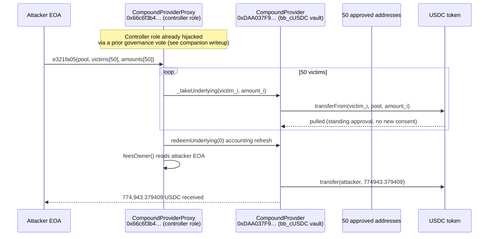
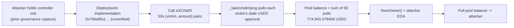

# BarnBridge CompoundProvider Drain — Hijacked Controller Sweeps 50 Stale USDC Approvals

> **Vulnerability classes:** vuln/access-control/missing-auth · vuln/access-control/centralization · vuln/logic/missing-validation

> **Reproduction:** compiles & runs in an isolated Foundry project at
> [this project folder](.). The offline fork is served from the bundled
> `anvil_state.json` (local anvil replays Ethereum state one block before the
> drain, block `25535119`), so no public RPC is required. Full verbose trace:
> [output.txt](output.txt). Verified vulnerable source:
> [CompoundProvider.sol](sources/CompoundProvider_DAA037/contracts_providers_CompoundProvider.sol)
> and [IController.sol](sources/CompoundProvider_DAA037/contracts_IController.sol)
> (the pool being drained, `0xdaa037f9…`, is verified). The attacker's own
> controller proxy (`0x66c6f3b4…`, EIP-1967) and its malicious implementation
> (`0x769a9fa1…`) are **UNVERIFIED on Etherscan**; the batch-sweep call
> (selector `0xe321fa05`) is RECONSTRUCTED below from the raw calldata and the
> `-vvvvv` trace, not from published source.

> **Not Compound Finance.** Despite the name, `CompoundProvider` here is a
> component of **BarnBridge's SMART Yield** protocol (a fixed/floating-yield
> splitter that deposits user funds into Compound-style money markets). It is
> unrelated to Compound Labs / Compound Finance's own contracts.

---

## Key info

| | |
|---|---|
| **Loss** | **774,943.379409 USDC** in this transaction ([output.txt:1540](output.txt)) |
| **Vulnerable contract** | `CompoundProvider` (BarnBridge SMART Yield bb_cUSDC pool) — [`0xDAA037F99d168b552c0c61B7Fb64cF7819D78310`](https://etherscan.io/address/0xDAA037F99d168b552c0c61B7Fb64cF7819D78310) (verified source) |
| **Attacker's controller proxy** | [`0x66c6f3b4B4b458e6d764759Ecf122484ebEf7580`](https://etherscan.io/address/0x66c6f3b4B4b458e6d764759Ecf122484ebEf7580) (EIP-1967, unverified) |
| **Malicious implementation** | [`0x769A9fA1E2414db14B35c46E4095D6e8f1694565`](https://etherscan.io/address/0x769A9fA1E2414db14B35c46E4095D6e8f1694565) (unverified) |
| **Attacker EOA** | [`0xF908610E9174c7cd6e9dfD371e238be4511297A1`](https://etherscan.io/address/0xF908610E9174c7cd6e9dfD371e238be4511297A1) |
| **Underlying token** | USDC — [`0xA0b86991c6218b36c1d19D4a2e9Eb0cE3606eB48`](https://etherscan.io/address/0xA0b86991c6218b36c1d19D4a2e9Eb0cE3606eB48) |
| **Attack tx** | [`0xd191fead1b9a2244f2837560f35d4fc865404914d229bfcb0172d1a7a9895afb`](https://etherscan.io/tx/0xd191fead1b9a2244f2837560f35d4fc865404914d229bfcb0172d1a7a9895afb) |
| **Chain / block / date** | Ethereum mainnet / block `25535120` / 2026-07-15 |
| **Compiler** | `CompoundProvider.sol` — Solidity `v0.7.6+commit.7338295f`, optimizer enabled, 9999 runs (per `_meta.json`) |
| **Bug class** | A hijacked pool `controller` calls the legitimately-gated `_takeUnderlying(from, amount)` in a loop over 50 addresses that still held a standing USDC approval to the pool, with no per-victim consent for *this specific* pull, then routes the entire swept balance to itself via `feesOwner()` |

---

## TL;DR

`CompoundProvider` is the vault half of a BarnBridge SMART Yield market: it holds
users' USDC, mints cUSDC on Compound-fork markets, and tracks the pool's yield.
Two roles are allowed to move funds through it — `smartYield` (the tranche
contract users interact with) and `controller` (an operations contract that
harvests COMP rewards and reports yield). Both are trusted by design.

On 2026-07-15, `CompoundProvider.controller` for the bb_cUSDC market pointed to
`0x66c6f3b4…` — an EIP-1967 proxy the attacker had gained control of via a
**prior governance vote** (see the companion write-up,
[2026-07-BarnBridgeSmartYield_exp](../2026-07-BarnBridgeSmartYield_exp/BarnBridgeSmartYield_exp.md),
for that access-acquisition chain). This PoC starts **after** that point — one
block before the drain — and demonstrates the drain step in isolation: the
attacker had already swapped the proxy's implementation to a contract of their
own choosing (`0x769a9fa1…`), which exposes a permissionless batch function
(selector `0xe321fa05`) that:

1. Iterates 50 attacker-chosen `(victim, amount)` pairs and calls
   `CompoundProvider._takeUnderlying(victim, amount)` for each — a call the
   pool accepts unconditionally because `msg.sender` really is the registered
   `controller` ([CompoundProvider.sol:126-137](sources/CompoundProvider_DAA037/contracts_providers_CompoundProvider.sol)).
   Every one of the 50 addresses had an old, unrevoked USDC approval to the
   pool from ordinary past SMART Yield deposits — none of them consented to
   *this* pull.
2. Calls the pool's fee-sweep path, which reads `feesOwner()` off the
   controller and forwards **the pool's entire USDC balance** to whatever
   address that returns ([CompoundProvider.sol:210-219](sources/CompoundProvider_DAA037/contracts_providers_CompoundProvider.sol)).
   Because the controller is the attacker's own contract, `feesOwner()`
   resolves to the attacker's EOA.

Net effect, replayed exactly by this PoC: attacker USDC balance rises from
**0.000000** to **774,943.379409** in one call
([output.txt:1539-1540](output.txt)).

---

## Background — what CompoundProvider does

BarnBridge SMART Yield splits variable-rate lending yield (e.g. Compound's
cUSDC supply rate) into a fixed-rate "senior" bond and a leveraged "junior"
token. Each supported market (cUSDC, cDAI, …) gets its own trio of contracts:

- **`SmartYield`** — the user-facing pool (buys junior tokens, mints senior
  bonds).
- **`CompoundProvider`** — the vault: holds the underlying (USDC), mints/redeems
  the Compound-fork cToken, and tracks `cTokenBalance` / `underlyingFees`.
- **`CompoundController`** — the ops contract: harvests COMP rewards, updates
  the yield oracle, and holds `feesOwner` (where accumulated protocol fees are
  paid out).

`CompoundProvider` deliberately keeps its money-moving functions internal-only
from the outside world's perspective — `_takeUnderlying`, `_sendUnderlying`,
`_depositProvider`, `_withdrawProvider` are all gated to `smartYield` or
`controller`:

```solidity
// CompoundProvider.sol
modifier onlySmartYieldOrController {
  require(
    msg.sender == smartYield || msg.sender == controller,
    "PPC: only smartYield/controller"
  );
  _;
}

// take underlyingAmount_ from from_
function _takeUnderlying(address from_, uint256 underlyingAmount_)
  external override
  onlySmartYieldOrController
{
    uint256 balanceBefore = IERC20(uToken).balanceOf(address(this));
    IERC20(uToken).safeTransferFrom(from_, address(this), underlyingAmount_);
    uint256 balanceAfter = IERC20(uToken).balanceOf(address(this));
    require(
      0 == (balanceAfter - balanceBefore - underlyingAmount_),
      "PPC: _takeUnderlying amount"
    );
}
```

This check is **correct** in isolation: it only trusts two addresses. The
entire design rests on the assumption that whoever holds the `controller` role
will only ever call `_takeUnderlying(from, amount)` with a `from` that has
*actually agreed*, in the current context, to have `amount` pulled (e.g. a
`SmartYield.buyTokens()` call pulling the caller's own deposit). Nothing in
`CompoundProvider` enforces that assumption — it is entirely up to whatever
code the `controller` address happens to run.

`controller` is not immutable. `IController.yieldControllTo()` — DAO-gated —
lets governance repoint `CompoundProvider.controller` (and `SmartYield`'s
controller) to a new address at any time:

```solidity
// IController.sol (verified)
address public feesOwner; // fees are sent here
...
function setFeesOwner(address newVal_) public onlyDao { feesOwner = newVal_; }
```

Handing the `controller` role to a new contract — legitimately, via a DAO
vote — hands that contract everything `_takeUnderlying` can reach: **every
address that has ever approved the pool for USDC**, for any amount, with no
further per-call consent check.

---

## The vulnerable code

### `_takeUnderlying` — correctly gated, but the gate only checks *who*, never *why*

Shown above. The check `msg.sender == controller` is airtight as written; the
vulnerability is what the protocol lets a legitimate `controller` do, combined
with what happens when that role changes hands.

### `transferFees()` — sweeps the pool's entire balance to an address the controller names

```solidity
// CompoundProvider.sol (verified)
function transferFees()
  external
  override
{
  _withdrawProviderInternal(underlyingFees, 0);
  underlyingFees = 0;

  uint256 fees = IERC20(uToken).balanceOf(address(this));
  address to = CompoundController(controller).feesOwner();

  IERC20(uToken).safeTransfer(to, fees);

  emit TransferFees(msg.sender, to, fees);
}
```

Note `transferFees()` itself has **no** `onlySmartYieldOrController` modifier —
anyone can call it — but that is harmless *by design* as long as `feesOwner()`
only ever returns a legitimate DAO-set address and `underlyingFees` only ever
holds actually-accrued protocol fees. Once the attacker's contract is the
`controller`, both assumptions collapse: `feesOwner()` is answered by
attacker-controlled code, and the balance being swept is no longer "accrued
fees" — it's whatever the batch sweep just pulled in.

### The exploited entrypoint — `0xe321fa05` on the attacker's own implementation

The proxy at `0x66c6f3b4…` and its implementation `0x769a9fa1…` are both
**unverified**. What follows is reconstructed from decoding the real exploit
calldata and reading the `-vvvvv` internal-call trace, which resolves the
Solidity-level function boundaries even without source:

```
Traces (output.txt, abridged):
  CompoundProviderProxy::e321fa05(pool, victims[50], amounts[50])
    -> 0x769A9fA1…::e321fa05(...)                          [delegatecall — the malicious impl runs]
       -> CompoundProvider::_takeUnderlying(0x20C76D…, 125628402942)   [output.txt:1568]
            -> USDC.transferFrom(0x20C76D…, pool, 125628402942)        [output.txt:1570]
       -> CompoundProvider::_takeUnderlying(0xe77884…, 100149478376)   [output.txt:1589]
       ... (48 more, one per victim) ...
       -> 0x39AA39c0…(cUSDC)::redeemUnderlying(0)             [output.txt:~1545 — accounting refresh, 0 underlying]
       -> CompoundProviderProxy::feesOwner() -> attacker EOA  [output.txt: feesOwner staticcall]
       -> USDC.transfer(attacker, 774943379409)               [output.txt: final sweep]
       -> emit TransferFees(caller: 0x66c6f3b4…, feesOwner: attacker, fees: 774943379409)
```

Decoding the raw calldata (`e321fa05` + ABI-encoded `(address pool, address[] victims, uint256[] amounts)`)
gives the exact attack payload — a single `address` (the pool to operate on),
followed by two 50-element arrays:

```python
# selector e321fa05, args = (address pool, address[50] victims, uint256[50] amounts)
pool    = 0xdaa037f99d168b552c0c61b7fb64cf7819d78310   # the CompoundProvider being drained
len(victims) == len(amounts) == 50
sum(amounts) == 774_943_379409   # == 774,943.379409 USDC, exactly the reported loss
```

Every element of `victims[]` is an address with a live USDC approval to the
pool from an ordinary past deposit; every element of `amounts[]` is (at most)
that address's outstanding balance/allowance. There is no signature, no
`SmartYield` call, and no consent from any of the 50 addresses in this
transaction — the only "authorization" the pool checks is
`msg.sender == controller`, and the attacker's contract *is* the controller.

---

## Root cause

The loss traces to a **trust boundary that moves with a single admin action**,
not a broken check:

1. `CompoundProvider._takeUnderlying` correctly restricts callers to
   `smartYield` or `controller` — but neither `CompoundProvider` nor
   `_takeUnderlying` places **any** further constraint on *which* `(from,
   amount)` pairs a legitimate controller may submit, or how many, or how
   often. The pool extends total, standing trust to the controller role over
   every user who has ever approved it.
2. `controller` is a single governance-settable address
   (`yieldControllTo`/`setController`), with no per-user opt-out and no cap on
   what a new controller may immediately do with old approvals. The moment
   `controller` changes, every historical approval to the pool becomes
   reachable by the new controller's code — code the approving users never
   reviewed and cannot be reviewed for, because the swap can be followed
   immediately by an `upgradeTo` on an attacker-owned proxy (as it was here).
3. `feesOwner()` is read from the very same `controller` contract that just
   pulled the funds — so the "fee sweep" destination and the "who is allowed
   to pull user funds" role are controlled by the identical address, with zero
   separation of duties once that address is compromised or hostile.

This PoC replays only the mechanical consequence of point 1 and point 3 —
the actual privilege acquisition (points 2's precondition: how the attacker
became `controller` in the first place) is a governance-capture attack
covered separately in
[2026-07-BarnBridgeSmartYield_exp](../2026-07-BarnBridgeSmartYield_exp/BarnBridgeSmartYield_exp.md).
That write-up shows the attacker bought ~$2,243 of the BOND governance token,
staked it with a near-maximum lock multiplier, and passed a proposal titled
"migrate proxy implementation" through a DAO with almost no remaining voter
turnout — clearing quorum (measured on *raw* stake) with lock-multiplied
voting power alone.

---

## Preconditions

- The attacker (or a colluding/compromised party) must hold the
  `CompoundProvider.controller` role for the target market — in the real
  incident, obtained via the governance vote described above; this PoC assumes
  that role is already held (fork starts one block before the drain, with the
  malicious implementation already installed at `0x66c6f3b4…`).
- At least one address must hold a nonzero, unrevoked USDC `approve()` to the
  pool contract (`0xDAA037F99…`) — in practice, every past SMART Yield
  depositor to this market, since depositing requires exactly that approval
  and BarnBridge's own products had been wound down for years with no prompt
  to revoke.
- No timelock or two-step handoff exists between "controller role changes"
  and "new controller can move every approved balance" — the swap and the
  drain can happen in back-to-back blocks (in the real incident: controller
  swap and malicious upgrade at block `25535106`/`25535107`, drain at
  `25535120`, minutes later).

---

## Attack walkthrough

All of this happens inside **one transaction** (`0xd191fead…`), replayed
verbatim by the PoC via `vm.prank(ATTACKER, ATTACKER); PROVIDER.call(EXPLOIT_CALLDATA)`:

1. **Before**: attacker EOA holds `0` USDC
   ([output.txt:1539-1540](output.txt), `attacker USDC before: 0.000000`).
   `CompoundProvider` (`0xDAA037F99…`) also holds `0` USDC at this point
   ([output.txt:1566-1568](output.txt)) — the pool starts empty of underlying,
   all of its value is currently parked in the cUSDC market plus outstanding
   user approvals.
2. **Sweep loop (50 iterations)**: the malicious implementation calls
   `CompoundProvider._takeUnderlying(victim_i, amount_i)` for `i` in `0..49`.
   Each call does `USDC.transferFrom(victim_i, pool, amount_i)`, consuming
   that victim's standing allowance:

   | # | Victim | Amount pulled (USDC) |
   |---|--------|----------------------|
   | 1 | `0x20C76D4203BF7490615804FE4fe9B132EE3E0935` | 125,628.402942 |
   | 2 | `0xe77884CDdF148DD5f0e9191B33D8dBAdDB16DFB5` | 100,149.478376 |
   | 3 | `0x71F12a5b0E60d2Ff8A87FD34E7dcff3c10c914b0` | 85,660.000000 |
   | 4 | `0xB1C120957a5b5C45A15fd6e5E17f5A2B70bF49d0` | 78,218.427082 |
   | 5 | `0x2d92441144E294d8eCEd55838d7665D04d64eA09` | 77,630.290322 |
   | 6 | `0x0D4C7Abf6A1FBcBF4DbE7B98D4e1af26D5165cB0` | 43,879.660608 |
   | 7 | `0xB8e4f6DEDFa4D4063D465536Bcb5926744319C69` | 32,704.854042 |
   | 8 | `0x5d368c382Ae92FBA52233B95C633C96FE49D0Dc5` | 29,166.670000 |
   | 9 | `0xAEbe2c167392E4b0d3e150ca80204eB327Db918b` | 27,049.579767 |
   | 10 | `0x8FE02545E479Aa8bA77D84E51b1D9Ca17B88011A` | 26,850.000545 |
   | … | 40 more addresses | — |
   | 50 | `0x1dD01835e0Eb26abe597E2E69ffAc1a6cd00283a` | 160.787907 |
   | | **Total (all 50)** | **774,943.379409** |

   Each transferFrom is confirmed individually in the trace, e.g. victim #1
   ([output.txt:1570](output.txt)):
   `USDC::fallback(0x20C76D…, CompoundProvider: 0xDAA037…, 125628402942)`.
3. **Accounting refresh**: the malicious controller calls
   `0x39AA39c0…` (Compound's real cUSDC market)`.redeemUnderlying(0)` — a
   zero-amount redeem that exists purely to run the pool's normal
   before/after cToken-balance bookkeeping hooks, matching
   `CompoundProvider._withdrawProviderInternal`'s code path with
   `underlyingFees == 0`.
4. **Fee sweep**: `feesOwner()` is read off the controller and resolves to the
   attacker EOA; the pool's full USDC balance — now exactly the sum of all 50
   pulls, since the pool started at `0` — is transferred out:
   `USDC::fallback(Attacker, 774943379409)`, followed by
   `emit TransferFees(caller: CompoundProviderProxy, feesOwner: Attacker, fees: 774943379409)`.
5. **After**: attacker EOA balance is `774943.379409` USDC
   ([output.txt:1540](output.txt), `attacker USDC after: 774943.379409`) — a
   gain of exactly `774943.379409` USDC in one call, asserted by the PoC:
   `assertApproxEqAbs(stolen, 774_943_379409, 1_000_000, ...)`, which
   **passes** ([output.txt](output.txt), `[PASS] testExploit() (gas: 1181924)`).

---

## Diagrams





---

## Remediation

1. **Never let a controller move an arbitrary user's funds without a
   contextual consent check.** `_takeUnderlying(from, amount)` should only be
   reachable through call paths that tie `from` to the actual depositor in the
   current operation (e.g. `SmartYield.buyTokens()` pulling `msg.sender`'s own
   funds) — not as a bare, batchable primitive any `controller` can invoke
   against any address for any amount.
2. **Separate the "can move funds" role from the "can name the fee
   destination" role.** `transferFees()` reading `feesOwner()` off the same
   `controller` that also holds pull rights means one compromised address
   controls both ends of the flow.
3. **Add a timelock / two-step handoff to controller/implementation changes.**
   A DAO-approved controller swap should not be immediately followed, in the
   same or next block, by an unrestricted `upgradeTo` on an attacker-owned
   proxy with full legacy privileges. See the companion write-up's mitigations
   for the governance-side fixes (quorum/vote-weight symmetry, a real
   emergency brake, decommissioning admin power on wound-down markets).
4. **Prompt users to revoke stale approvals** when a protocol's products are
   sunset. A years-old unlimited `approve()` to a dormant vault is a standing
   liability with no expiration, regardless of how the controller/admin key
   later changes hands.

---

## How to reproduce

```bash
cd ~/RustroverProjects/audits/evm-hack-registry
_shared/run_poc.sh 2026-07-CompoundProvider_exp -vvvvv
```

No RPC required — the fork is served from the bundled `anvil_state.json` at
block `25535119` (one block before the drain). Expected tail of the output:

```
Ran 1 test for test/CompoundProvider_exp.sol:CompoundProviderExp
[PASS] testExploit() (gas: 1181924)
Logs:
  attacker USDC before: 0.000000
  attacker USDC after: 774943.379409
  USDC stolen: 774943.379409
```

*Reference: [ExVul — CompoundProvider allowance sweep (not Compound Protocol)](https://x.com/exvulsec/status/2077253565438194108); see also [Phalcon](https://x.com/Phalcon_xyz/status/2077243530280587721) and the companion governance-capture write-up, [2026-07-BarnBridgeSmartYield_exp](../2026-07-BarnBridgeSmartYield_exp/BarnBridgeSmartYield_exp.md).*
