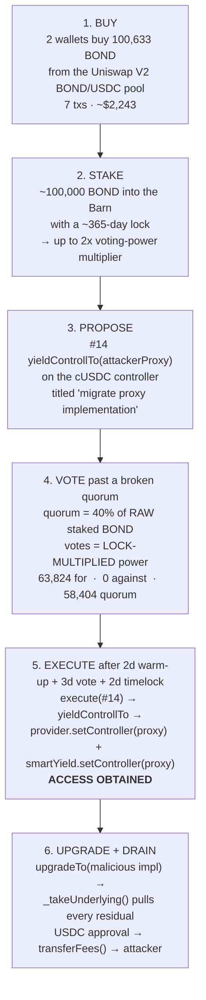
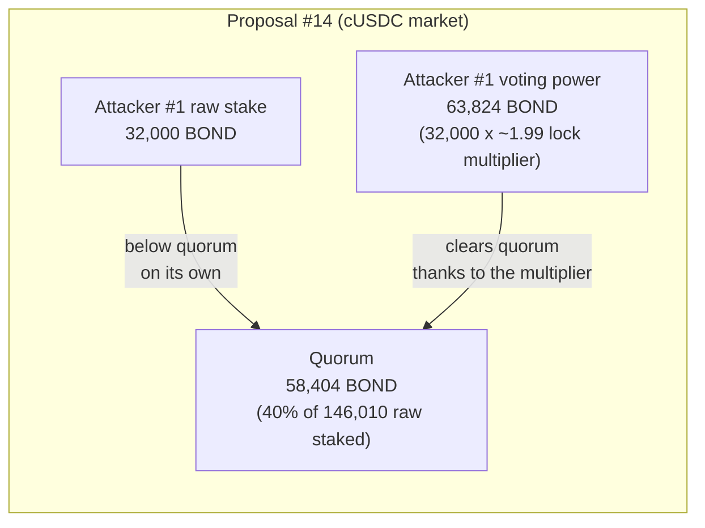

# BarnBridge SMART Yield — Governance Capture of an Abandoned DAO → Controller Swap → Approval Drain

> **Vulnerability classes:** vuln/governance/quorum-manipulation · vuln/governance/vote-weight-vs-quorum-asymmetry · vuln/access-control/live-admin-power-on-dormant-protocol · vuln/logic/leftover-approvals

> **Reproduction:** compiles & runs in an isolated Foundry project at
> [this project folder](.). The offline fork is served from the bundled
> `anvil_state.json` (local anvil replays Ethereum state at block `25535096`, one
> block **before** the DAO proposal executed), so no public RPC is required.
> Full verbose trace: [output.txt](output.txt).
> Verified sources: [CompoundProvider.sol](sources/CompoundProvider_0xdaa037/CompoundProvider_DAA037/contracts_providers_CompoundProvider.sol),
> [Governance.sol](sources/governance/Governance.sol),
> [BarnFacet.sol](sources/governance/BarnFacet.sol),
> [IController.sol](sources/governance/IController.sol) (holds `yieldControllTo`).

<!-- non-defihacklabs -->

---

## The important part: obtaining access, not the drain

The money left through the **front door of the DAO**. This was not a Solidity bug in
the drain path — it was a **governance takeover of an abandoned protocol**. The whole
attack is the *access acquisition*; the drain is a formality that follows once the
attacker owns the vault's controller.



**Capture economics:** ~**$2,243** of BOND bought → **$774,943** drained from proposal
#14 alone — a **~345x** return. A dormant protocol that still holds live token approvals
and live admin power is not retired; it is a bug bounty with no expiration date.

---

## Key info

| | |
|---|---|
| **Loss (PoC scope)** | **776,575.547933 USDC** (drain #1 `774,943.379409` + drain #2 `1,632.168524`) |
| **Capture cost** | ~**$2,243** (100,633.53 BOND bought across 7 Uniswap txs) |
| **BOND token** | [`0x0391D2021f89DC339F60Fff84546EA23E337750f`](https://etherscan.io/address/0x0391D2021f89DC339F60Fff84546EA23E337750f) (10,000,000 supply) |
| **Uniswap V2 BOND/USDC pool** | [`0x6591c4bcd6d7a1eb4e537da8b78676c1576ba244`](https://etherscan.io/address/0x6591c4bcd6d7a1eb4e537da8b78676c1576ba244) |
| **Barn (staking / voting power)** | [`0x10e138877df69Ca44Fdc68655f86c88CDe142D7F`](https://etherscan.io/address/0x10e138877df69Ca44Fdc68655f86c88CDe142D7F) |
| **DAO Governance** | [`0x4cAE362D7F227e3d306f70ce4878E245563F3069`](https://etherscan.io/address/0x4cAE362D7F227e3d306f70ce4878E245563F3069) |
| **Old (legit) cUSDC controller** | [`0x41Ab25709e0C3EDf027F6099963fE9AD3EBaB3A3`](https://etherscan.io/address/0x41Ab25709e0C3EDf027F6099963fE9AD3EBaB3A3) — proposal #14 target |
| **Attacker controller proxy** | [`0x66c6f3b4B4b458e6d764759Ecf122484ebEf7580`](https://etherscan.io/address/0x66c6f3b4B4b458e6d764759Ecf122484ebEf7580) (admin = attacker #1) |
| **Malicious impl** | [`0x769a9fa1e2414db14b35c46e4095d6e8f1694565`](https://etherscan.io/address/0x769a9fa1e2414db14b35c46e4095d6e8f1694565) (unverified) |
| **CompoundProvider (bb_cUSDC)** | [`0xdaa037f99d168b552c0c61b7fb64cf7819d78310`](https://etherscan.io/address/0xdaa037f99d168b552c0c61b7fb64cf7819d78310) — **BarnBridge, NOT Compound core** |
| **SmartYield (bb_cUSDC)** | [`0x4B8d90D68F26DEF303Dcb6CFc9b63A1aAEC15840`](https://etherscan.io/address/0x4B8d90D68F26DEF303Dcb6CFc9b63A1aAEC15840) |
| **Attacker #1 (prop #14)** | [`0xf908610e9174c7cd6e9dfd371e238be4511297a1`](https://etherscan.io/address/0xf908610e9174c7cd6e9dfd371e238be4511297a1) |
| **Attacker #2 (prop #15)** | [`0xa8ce49a57400445c6a4118ae3460ed4e46c815b8`](https://etherscan.io/address/0xa8ce49a57400445c6a4118ae3460ed4e46c815b8) |
| **Propose #14** | [`0x07ff84e9…7009`](https://etherscan.io/tx/0x07ff84e9372b9166f54f3de69b92371c113a370f08b1bef1e116c10ee48b7009) (block `25472231`, 2026-07-06) |
| **Execute #14** | inside a throwaway contract-creation ([`0x2e28e0b1…`](https://etherscan.io/tx/0x2e28e0b1dda3fe40c2), block `25535097`, 2026-07-15 02:35:11 UTC) |
| **Drain #1** | [`0xd191fead…5afb`](https://etherscan.io/tx/0xd191fead1b9a2244f2837560f35d4fc865404914d229bfcb0172d1a7a9895afb) (block `25535120`) |
| **Drain #2** | [`0x7d722637…d238`](https://etherscan.io/tx/0x7d722637a58a7117dbca0182ec26d74e2be0c1052ac319f0150bc056e528d238) (block `25535160`) |
| **Chain / fork / date** | Ethereum mainnet / fork `25535096` (pre-execute) / 2026-07-15 |
| **Compiler** | Solidity `0.7.6` (BarnBridge Governance/Barn/providers) |

---

## The governance parameters (verified on-chain)

Read live from the Governance/Barn at the time of the attack:

| Parameter | Value | Meaning |
|-----------|-------|---------|
| `warmUpDuration` | 172,800 s (**2 days**) | delay from proposal creation to the vote snapshot |
| `activeDuration` | 259,200 s (**3 days**) | voting window |
| `queueDuration` | 172,800 s (**2 days**) | timelock before execution |
| `gracePeriodDuration` | 345,600 s (**4 days**) | window in which a queued proposal may execute |
| `acceptanceThreshold` | **60** (%) | `forVotes` must be ≥ 60% of votes cast |
| `minQuorum` | **40** (%) | turnout must reach 40% of **raw staked BOND** |
| `ACTIVATION_THRESHOLD` | 400,000 BOND | one-time DAO activation gate (`isActive` has been `true` since launch, so `propose` no longer checks it) |
| Barn `MAX_LOCK` | 365 days | a full-year lock yields the maximum **2x** voting-power multiplier |

The two load-bearing facts, straight from the source:

```solidity
// Governance.sol — quorum is measured against RAW, UNMULTIPLIED staked BOND:
function _getQuorum(Proposal storage p) internal view returns (uint256) {
    return barn.bondStakedAtTs(_getSnapshotTimestamp(p)).mul(p.parameters.minQuorum).div(100);
}
// ...but votes are LOCK-MULTIPLIED voting power:
uint256 votes = barn.votingPowerAtTs(msg.sender, _getSnapshotTimestamp(proposal));
```

```solidity
// BarnFacet.sol — a max lock DOUBLES voting power, quorum sees none of it:
function _stakeMultiplier(Stake memory s, uint256 t) internal view returns (uint256) {
    if (t >= s.expiryTimestamp) return BASE_MULTIPLIER;              // 1e18
    uint256 diff = s.expiryTimestamp - t;
    if (diff >= MAX_LOCK) return BASE_MULTIPLIER.mul(2);            // 2e18 at full lock
    return BASE_MULTIPLIER.add(diff.mul(BASE_MULTIPLIER).div(MAX_LOCK));
}
```

That asymmetry — **quorum on raw stake, votes on multiplied stake** — is the root cause,
and it is catastrophic once participation drains away from an abandoned DAO.

---

## The capture, with the real numbers



- **Attacker #1** bought 32,795 BOND, staked **32,000** with a near-max lock. `balanceAtTs`
  at the #14 snapshot = **32,000** raw BOND; `votingPowerAtTs` = **63,824.17** (≈1.99x).
  Quorum for #14 = **58,404.32** (40% of the 146,010.80 BOND staked at snapshot). So the
  attacker's *raw stake alone was below quorum*, but the lock multiplier pushed their
  vote *above* it. Proposal #14 passed **63,824.17 for, 0 against**.
- **Attacker #2** bought 67,838 BOND across 5 txs, staked **67,838** → **135,659.35**
  voting power at the #15 snapshot. Together the two wallets held ≈**199,216** voting
  power ≈ **92.6%** of the 213,848.80 BOND staked — for a token nobody else wanted.

Only ~**2.14%** of BOND's 10M supply was staked, because holders had no reason to keep
staking in a protocol whose products were wound down after a 2023 SEC settlement. Quorum
tied to live stake collapses as the room empties out.

---

## The disguised proposal & the trust hand-over

Proposal #14 carried a **single** action, titled the routine-sounding *"migrate proxy
implementation"*, decoded from the on-chain `propose` calldata:

```
target      = 0x41Ab… (the old cUSDC controller)
signature   = "yieldControllTo(address)"          // selector 0x5bb78d55
calldata    = abi.encode(0x66c6…)                 // the attacker's proxy
```

`yieldControllTo` is `onlyDao`, which is *exactly* why the attacker had to capture
governance — there is no other way to call it:

```solidity
// IController.sol (BarnBridge SMART Yield controller)
function yieldControllTo(address newController_) public onlyDao {
    IProvider(pool).setController(newController_);        // CompoundProvider now trusts the proxy
    ISmartYield(smartYield).setController(newController_);
}
```

The proxy `0x66c6…` was deployed by the attacker with its **initial implementation set to
the legitimate controller**, so the proposal looked benign right up to execution. `execute`
was buried inside a throwaway contract's **constructor** (tx `0x2e28e0b1…`, block
`25535097`) — which is why no top-level `execute` appears in the Governance tx list.
The instant it ran, `CompoundProvider.controller` flipped `0x41Ab… → 0x66c6…`.

Only *after* the vote landed did the attacker `upgradeTo` a malicious implementation
(`0x769a…`) and drain. The provider trusts its controller unconditionally:

```solidity
// CompoundProvider.sol
function _takeUnderlying(address from_, uint256 amount_) external onlySmartYieldOrController {
    IERC20(uToken).safeTransferFrom(from_, address(this), amount_);   // ANY residual approval
}
function transferFees() external {
    // ...
    address to = CompoundController(controller).feesOwner();          // malicious impl → attacker
    IERC20(uToken).safeTransfer(to, IERC20(uToken).balanceOf(address(this)));
}
```

---

## On-chain chronology (verified)

| Block | UTC | Actor | Action |
|------:|-----|-------|--------|
| 25467881 / 25468111 | 07-05 | Attacker #1 | buys 32,795 BOND from the Uniswap V2 pool |
| 25472195 | 07-06 08:08 | Attacker #1 | stakes 32,000 BOND with a ~365-day lock |
| 25472231 | 07-06 08:15 | Attacker #1 | `propose(#14)` → `yieldControllTo(0x66c6…)` on `0x41Ab…` |
| 25493552–25506508 | 07-09..07-11 | Attacker #2 | buys 67,838 BOND (5 txs); stakes 67,838 |
| 25494106 | 07-09 09:24 | Attacker #2 | `propose(#15)` → 10 actions (the other 10 markets' controllers) |
| 25507914 | 07-11 07:35 | Attacker #1 | `castVote(#14, true)` — 63,824.17 voting power |
| 25508121 | 07-11 08:16 | Attacker #1 | `queue(#14)` (+ `startAbrogationProposal` — did not stop it) |
| 25527946 / 25529980 | 07-14 | Attacker #2 | `castVote(#15)` (135,659) + `queue(#15)` |
| **25535097** | **07-15 02:35** | Attacker #1 | **`execute(#14)`** via constructor → controller flips → **ACCESS** |
| 25535106 / 25535107 | 07-15 02:37 | Attacker #1 | deploy malicious impl `0x769a…` + `upgradeTo` |
| 25535120 | 07-15 02:39 | Attacker #1 | **drain #1** — 774,943.379409 USDC (50 approvers) |
| 25535160 | 07-15 02:47 | Attacker #1 | **drain #2** — 1,632.168524 USDC (42 approvers) |
| 25544335 | 07-16 09:28 | Attacker #2 | `execute(#15)` → 10 more markets (USDC/DAI/USDT/GUSD/RAI, Compound+Aave) |
| 25540060 / 25541984 / 25544750 | 07-15..16 | various | aftermath: proposal #16 (attacker grabs Barn+pools), #17/#18 ("rescue") |

---

## The four stacked failures

1. **Quorum tied to live stake, with a vote-weight vs quorum-weight asymmetry.** Quorum
   is 40% of *raw* staked BOND; votes count *lock-multiplied* power (up to 2x). In a
   depopulated DAO a few thousand dollars of BOND, staked with a max lock, clears a
   supermajority.
2. **Live administrative power over contracts that still hold value.** Winding down the
   products never severed the DAO's ability to `yieldControllTo` a new controller.
3. **Leftover approvals.** Users' years-old, unrevoked USDC allowances to the providers
   are what the hijacked controller inherited. Without them the vault was empty.
4. **No emergency brake that could actually fire.** Abrogation needs a majority of *all*
   voting power — unreachable when the attacker already controls the active stake. No
   guardian, no security-council veto.

---

## PoC

**`testExploit()` (offline, bundled):** forks block `25535096` — one block *before* the
real execute of proposal #14, with the attacker's BOND already bought+staked and the
proposal already voted+queued in fork state. It then:

1. Asserts the **capture economics** from real chain state:
   `raw stake 32,000 < quorum 58,404.32 < lock-multiplied voting power 63,824.17`.
2. `execute(#14)` on-chain → asserts `CompoundProvider.controller` flips `0x41Ab… → 0x66c6…`
   (**ACCESS OBTAINED**).
3. Upgrades the proxy to a minimal malicious controller and replays the two historical
   drain batches for the **exact** on-chain profit **776,575.547933 USDC**.

**`test_CaptureFromScratch()` (live-RPC only; set `BB_LIVE_RPC`):** forks a *pre-attack*
block and reconstructs the ENTIRE access acquisition with a fresh wallet — buy BOND on
Uniswap → stake with a max lock → propose → warp past the 2-day warm-up → vote → queue →
warp past the timelock → execute → assert the vault's controller is handed to the attacker.

```bash
# offline (bundled state, no RPC)
bash _shared/run-poc/run_poc.sh 2026-07-CompoundProvider_exp -vv

# full from-scratch capture reconstruction (needs a mainnet archive RPC)
BB_LIVE_RPC=$MAINNET_RPC_URL forge test --match-test test_CaptureFromScratch -vv
```

---

## Mitigations

1. **Fix the quorum/vote asymmetry:** measure quorum against the *same* multiplied voting
   power used to count votes, and add an absolute quorum floor that does not fall to zero
   as stake leaves.
2. **Decommission deliberately:** when winding a protocol down, neutralize or renounce any
   admin power that can still move funds (e.g. freeze `yieldControllTo` / controller
   rotation once TVL is residual approvals only).
3. **Get users to revoke approvals** as part of sunsetting; a live allowance to a dormant
   contract is standing risk. Prefer session-scoped pulls over unlimited standing approvals.
4. **A real emergency brake:** a guardian / security-council veto or a cancel path that
   does not require out-voting an attacker who already owns the active stake.
5. **Two-step controller rotation** with explicit acceptance + delay, so a single vote
   cannot silently repoint a live vault at an attacker-controlled proxy.

---

## References

* Blockful write-up (governance attack on an abandoned DAO): https://x.com/blockful_io
* Phalcon: https://x.com/Phalcon_xyz/status/2077243530280587721
* ExVul (CompoundProvider allowance sweep; **not Compound Protocol**): https://x.com/exvulsec/status/2077253565438194108
* Drain #1: https://etherscan.io/tx/0xd191fead1b9a2244f2837560f35d4fc865404914d229bfcb0172d1a7a9895afb
* Drain #2: https://etherscan.io/tx/0x7d722637a58a7117dbca0182ec26d74e2be0c1052ac319f0150bc056e528d238
* Propose #14: https://etherscan.io/tx/0x07ff84e9372b9166f54f3de69b92371c113a370f08b1bef1e116c10ee48b7009
