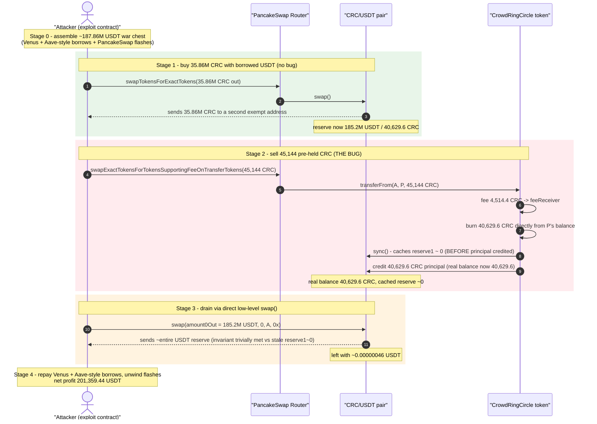
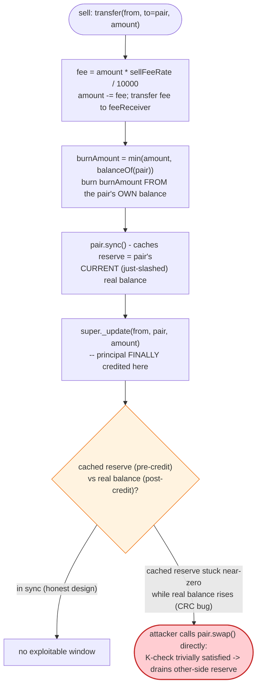
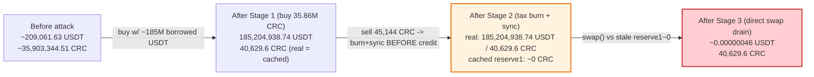

# CrowdRingCircle Exploit — Premature `sync()` Turns a Sell-Tax Burn into a Free Reserve Drain

> **Vulnerability classes:** vuln/logic/incorrect-state-transition · vuln/oracle/spot-price · vuln/defi/price-manipulation · vuln/logic/wrong-order

> **Reproduction:** the PoC compiles & runs in an isolated Foundry project at
> [this project folder](.). Full verbose trace: [output.txt](output.txt).
> Verified vulnerable source: [sources/CrowdRingCircle_858143/contracts_CrowdRingCircle.sol](sources/CrowdRingCircle_858143/contracts_CrowdRingCircle.sol).

---

## Key info

| | |
|---|---|
| **Loss** | **201,359.443861203526776802 USDT** (~$201.36K) extracted from the CRC/USDT PancakeSwap pair in this single reproduction transaction |
| **Vulnerable contract** | CrowdRingCircle (CRC) token — [`0x8581433150f2C48ff2efE5A22b17c7D405054509`](https://bscscan.com/token/0x8581433150f2C48ff2efE5A22b17c7D405054509#code) |
| **Victim pool** | CRC/USDT PancakeSwap V2 pair — [`0xd8799A644850c065388c22DF4eE0C28472922526`](https://bscscan.com/address/0xd8799A644850c065388c22DF4eE0C28472922526) |
| **Attacker EOA** | [`0x34579eA92a07a88F5505dFaA4D99Ab94b2784087`](https://bscscan.com/address/0x34579eA92a07a88F5505dFaA4D99Ab94b2784087) |
| **Attack contract** | Deployed via a raw `CREATE` inside the attacker's own transaction — outer wrapper `0xc5940D118f9C2070478545bA80a780Aa8F86d133`, inner exploit contract `0x2eadBCDCd4Ab4bb7F8b01610794Ea09A64CD5DA1` |
| **Attack tx** | [`0xeaef22325e02ac65a8e1f2e1a3a43f7b7ac8d2323ce6f698a90813e77017c834`](https://bscscan.com/tx/0xeaef22325e02ac65a8e1f2e1a3a43f7b7ac8d2323ce6f698a90813e77017c834) |
| **Chain / block / date** | BSC (chainId 56) / block 110,301,524 / 2026-07-16 |
| **Compiler** | CRC compiled with Solidity **v0.8.34+commit.80d5c536**, optimizer **disabled** (per `sources/CrowdRingCircle_858143/_meta.json`) |
| **Bug class** | `_update()`'s "sell destroy" tax path burns tokens **directly out of the pair's own balance** and calls `sync()` **before** the sold principal is credited to the pair — this window lets the attacker follow up with a single low-level `pair.swap()` that drains almost the entire other-side reserve, because the AMM's cached `reserve1` is momentarily near-zero while its real balance is not |

---

## TL;DR

CRC is a BEP-20 token with a "sell tax + sell destroy" mechanism: every transfer that lands on a registered DEX pair first skims a 10% fee, then **additionally burns up to the full transferred amount directly out of the pair's own CRC balance**, and immediately calls the pair's `sync()` to lock in the new (lower) reserve — all of this happening **before** the transfer's own principal is credited back to the pair a few lines later in the same call.

That ordering is the bug. Because `sync()` fires while the pair's real CRC balance has been reduced to near-dust but *before* the incoming principal restores it, the pair's **cached** `reserve1` (used by PancakeSwap's constant-product `swap()` invariant) is left drastically understated relative to the pair's **real, about-to-rise** CRC balance. The attacker exploits the gap in the very same transaction: right after the tax-burn-and-sync fires, they call the pair's `swap()` directly and ask for almost its **entire USDT reserve** — the invariant check, computed against the stale near-zero CRC reserve, is trivially satisfied.

The PoC (a single BSC transaction, replayed here against the exact pre-attack block state) shows:

1. The attacker assembles roughly **187.86M USDT** of flash-sourced capital (PancakeSwap Infinity Vault flash draws stacked across many pools, a Venus WBNB-collateralized borrow, and an Aave-style WBNB-collateralized borrow — [output.txt:1746](output.txt), [output.txt:2102](output.txt), [output.txt:2212](output.txt), [output.txt:2293](output.txt)).
2. ~184.996M USDT of that capital buys **35,862,714.91 CRC** (35.9% of the entire 100M CRC supply) out of the pool via a normal, bug-free `swapTokensForExactTokens` — this alone just moves the pool's ratio in the attacker's favor with real capital ([output.txt:2942](output.txt)–[output.txt:2974](output.txt)).
3. The attacker then sells a **pre-held 45,144 CRC** balance back into the same pair. The sell-tax burns **40,629.6 CRC (the pair's *entire* remaining CRC balance)** straight out of the pair and calls `sync()` — locking the pair's cached CRC reserve at effectively **zero** — *before* crediting the pair with the post-fee principal ([output.txt:2984](output.txt)–[output.txt:2998](output.txt)).
4. With the cached reserve corrupted, the attacker calls the pair's `swap()` directly and extracts **185,204,938.74 USDT — virtually the pair's entire USDT balance** — for no real additional payment ([output.txt:3020](output.txt)–[output.txt:3035](output.txt)).
5. The attacker unwinds every borrow (Venus repay + redeem, Aave-style repay) and walks away with **201,359.443861203526776802 USDT** net profit ([output.txt:3079](output.txt), [output.txt:3316](output.txt), [output.txt:3379](output.txt), final transfer at the end of [output.txt](output.txt)).

---

## Background

CrowdRingCircle (CRC) is a 100,000,000-supply BEP-20 token (`TOTAL_SUPPLY = 100_000_000 * 1e18`) built on OpenZeppelin's `ERC20`/`ERC20Burnable`/`ERC20Permit`/`Ownable2Step`/`Pausable`/`ReentrancyGuard` stack. Beyond the standard transfer logic it layers several tax/anti-bot mechanisms controlled by the owner:

- **Buy restriction** — transfers *from* a registered DEX pair to a non-exempt address can be blocked (`buyRestrictionEnabled`).
- **Minimum hold requirement** — non-exempt senders must retain `minHoldAmount` after any transfer.
- **Sell fee** — transfers *to* a registered DEX pair pay a `sellFeeRate` (set to **1000 basis points = 10%** at deploy) that is routed to a `feeReceiver`.
- **"Sell destroy"** — transfers *to* a registered DEX pair also trigger `_safeDeductBalance()` + a forced `pair.sync()`, described below.

The victim pool is the official CRC/USDT PancakeSwap V2 pair at `0xd8799A644850c065388c22DF4eE0C28472922526`, holding (at the fork block, reconstructed from the trace's `Sync` deltas) roughly **209,061.63 USDT** and **35,903,344.51 CRC** — a modest, thin pool relative to CRC's 100M total supply.

---

## The vulnerable code

From the verified CRC source (`sources/CrowdRingCircle_858143/contracts_CrowdRingCircle.sol`):

```solidity
function _update(
    address from,
    address to,
    uint256 amount
) internal virtual override {
    // ... blacklist / buy-restriction / minimum-hold checks omitted ...

    if (isDexPair[to] && sellFeeRate > 0 && !isExemptFromRestriction[from]) {
        // 计算手续费（sellFeeRate / 10000）
        uint256 fee = (amount * sellFeeRate) / 10000;
        amount -= fee;
        // 将手续费转给 feeReceiver
        super._update(from, feeReceiver, fee);
    }

    if (isDexPair[to] && sellDestroyEnabled && !isExemptFromRestriction[from]) {
        if (amount == 0) return;
        uint256 pairBalanceBefore = balanceOf(to);
        uint256 burnAmount = _safeDeductBalance(to, amount);
        if (burnAmount == 0) return;
        super._update(to, address(0), burnAmount);
        try IUniswapV2Pair(to).sync() {} catch {}
        uint256 pairBalanceAfter = balanceOf(to);
        emit BurnFromPair(
            burnAmount,
            pairBalanceBefore,
            pairBalanceAfter,
            "sellTaxBurn"
        );
    }

    super._update(from, to, amount);   // <-- the sold principal is only credited HERE
}

//  安全扣减
function _safeDeductBalance(
    address account,
    uint256 amount
) internal returns (uint256 actualDeduct)
{
    uint256 currentBal = balanceOf(account);
    actualDeduct = amount > currentBal ? currentBal : amount;
    if (actualDeduct != amount) {
        emit SafeDeductApplied(account, amount, actualDeduct);
    }
    return actualDeduct;
}
```

The order of operations inside `_update` for a "sell" (any transfer *to* a registered pair) is:

1. Skim the 10% fee off `amount` and send it to `feeReceiver`.
2. Burn `min(amount, pair's current CRC balance)` **directly out of the pair's existing balance** (not out of the incoming transfer!) and call the pair's `sync()`.
3. **Only then**, at the very bottom of the function, credit the (fee-reduced) `amount` to the pair via the normal `super._update(from, to, amount)`.

Step 2 fires `sync()` on the pair while its real CRC balance has just been slashed and *before* step 3 restores part of it. A real UniswapV2/PancakeSwap V2 pair's `sync()` unconditionally overwrites the pair's cached `reserve0`/`reserve1` to match whatever `IERC20(token).balanceOf(pair)` returns **at that exact moment** — so the cache is locked onto a transient, artificially low CRC balance that the same transaction is about to increase again.

---

## Root cause

1. **The reserve-destroy step burns from the pair's *existing* balance, not from the amount in flight.** `_safeDeductBalance(to, amount)` returns `min(amount, balanceOf(pair))`. Once a single sell's post-fee `amount` is large enough (or the pair's CRC reserve small enough), `burnAmount` equals essentially the **entire** current CRC reserve of the pair — wiping it to dust in one call.

2. **`sync()` is called before the transfer's own principal lands.** `super._update(to, address(0), burnAmount)` (the burn) and `IUniswapV2Pair(to).sync()` both execute *before* the function's final `super._update(from, to, amount)` (the actual sale proceeds). This creates a one-transaction window where:
   - the pair's **real** CRC balance is about to rise back up (once the trailing `super._update` runs), but
   - the pair's **cached** `reserve1` has already been permanently set to the post-burn, pre-credit (near-zero) value.

3. **PancakeSwap/UniswapV2's `swap()` invariant trusts the cached reserve, not the live balance.** A direct call to `pair.swap(amount0Out, 0, to, data)` computes the "amount paid in" as `balance1 - reserve1` (the pair's current real balance minus its cached reserve) and only requires the fee-adjusted constant-product invariant `balance0Adjusted * balance1Adjusted >= reserve0 * reserve1 * 1000²` to hold. With `reserve1` collapsed to near-zero, the right-hand side of that inequality is also collapsed to near-zero — so *any* amount of USDT can be requested out (`amount0Out`) for what the pair believes is a trivially-sufficient CRC "payment", even though that CRC was already credited by an unrelated transfer moments earlier and no new value was actually paid for this specific `swap()` call.

4. **The design compounds a defensive tax mechanism with an oracle-integrity bug.** "Sell destroy" was presumably meant to permanently shrink CRC's circulating/pool supply on every sale (a deflationary/anti-dump mechanism). Because the burn targets the **pair's own liquidity** rather than the seller's tokens, and because the accompanying `sync()` is sequenced before the sale's own credit, the mechanism converts every large-enough sell into a live self-inflicted price-oracle corruption that any subsequent low-level `swap()` in the same transaction can exploit.

---

## Preconditions

- `sellDestroyEnabled == true` and `sellFeeRate > 0` (both true at deploy: `sellFeeRate = 1000`, `sellDestroyEnabled = true`).
- The attacker (or any non-exempt address) can execute a "sell" — a CRC transfer whose `to` is a registered `isDexPair[...] == true` address — of an amount whose **post-fee value is comparable to, or larger than, the pair's current CRC balance**. The attacker engineers this by first buying up the vast majority of the pool's CRC with borrowed capital, shrinking the *remaining* CRC reserve down to a size their pre-held 45,144 CRC balance (minus the 10% fee) can fully consume.
- The pair must be a standard constant-product AMM pair whose `swap()` trusts `getReserves()` (the cached values) rather than re-deriving reserves fresh — true of PancakeSwap V2 / UniswapV2-style pairs.
- No special timing across blocks is required — everything (the buy, the tax-triggering sell, and the direct `swap()` drain) happens inside a single atomic transaction, funded by flash-sourced capital so the attacker needs no meaningful starting capital of their own beyond the pre-held 45,144 CRC and 100 wei of native gas seed.

---

## Attack walkthrough (with real numbers from the trace)

All figures are the actual on-chain values from [output.txt](output.txt), replayed offline against the exact pre-attack BSC state (block 110,301,523, one block before the exploit tx).

### Stage 0 — Assemble the war chest

The entire attack runs inside the constructor-style `CREATE` of a two-layer contract (outer wrapper `0xc5940D11…`, inner exploit `0x2eadBCDC…`), pranked as both `msg.sender` and `tx.origin` of the attacker EOA ([output.txt:1565](output.txt)–[output.txt:1608](output.txt)). The inner contract then:

- Supplies **372,886.13 WBNB** as collateral into a Venus-style money market, minting vTokens ([output.txt:1746](output.txt), [output.txt:1766](output.txt)).
- Borrows a large sum against that Venus collateral ([output.txt:2102](output.txt): `Borrow(borrowAmount: 62,748,558.395…)`).
- Separately supplies **35,000 WBNB** into an Aave-V3-style pool and borrows **13,027,427.31 USDT** against it ([output.txt:2212](output.txt), [output.txt:2293](output.txt)).
- Draws down dozens of additional flash loans from PancakeSwap Infinity Vault pools (visible as a long chain of `Flash(sender, recipient, qty0, qty1, paid0, paid1)` events throughout the trace) to round out the war chest.

By [output.txt:2941](output.txt) the inner exploit contract is holding **187,859,519.94 USDT**.

### Stage 1 — Buy up the pool's CRC with borrowed capital (bug-free)

```
output.txt:2938  CRC::balanceOf(CRC/USDT_LP)          -> 35,903,344.512768051905032649 CRC
output.txt:2942  router.swapTokensForExactTokens(35,862,714.912768051805032649 CRC out,
                    187,859,519.940162555719400333 USDT max in,
                    path=[USDT, CRC], to=0xa5341a83…, deadline)
output.txt:2945  USDT::transferFrom(exploit, LP, 184,995,877.105807691589020575 USDT)
output.txt:2960  CRC::transfer(0xa5341a83…, 35,862,714.912768051805032649 CRC)
output.txt:2973  emit Sync(reserve0: 185,204,938.738076019594991251 USDT,
                            reserve1: 40,629.6 CRC)
```

This step alone is a normal, bug-free swap: the pool ends with real reserves of **185,204,938.74 USDT / 40,629.6 CRC**. The attacker has simply used borrowed capital to buy ~35.9% of CRC's entire supply directly out of the pool, leaving it thin on CRC and swollen with USDT.

### Stage 2 — The tax-triggered burn + premature `sync()` (the bug)

The attacker's inner contract now sells a **pre-held 45,144 CRC** balance (acquired before this transaction, pulled in at [output.txt:2925](output.txt)) back into the same pair:

```
output.txt:2983  router.swapExactTokensForTokensSupportingFeeOnTransferTokens(
                    45,144 CRC in, 0 min out, path=[CRC, USDT],
                    to=0x2eadBCDC… (exploit), deadline)
output.txt:2984  CRC::transferFrom(exploit, LP, 45,144 CRC)      // enters CRC._update
output.txt:2987    Transfer(exploit -> feeReceiver, 4,514.4 CRC)  // 10% sell fee
output.txt:2989    Transfer(LP -> 0x0, 40,629.6 CRC)              // _safeDeductBalance burn
output.txt:2993    CRC/USDT_LP::sync()                            // <-- fired BEFORE credit
output.txt:2996  CRC::balanceOf(LP) -> 100000000 wei (~1e-10 CRC) // pair's real CRC = dust
output.txt:2998  emit Sync(reserve0: 185,204,938.738076019594991251 USDT,
                            reserve1: 100000000 [~0])             // cache locked at ~0
output.txt:3003  emit BurnFromPair(burnAmount: 40,629.6, ..., "sellTaxBurn")
```

`_safeDeductBalance(LP, 40,629.6 CRC)` returns `min(40,629.6, 40,629.6) = 40,629.6` — the sell was sized so its post-fee amount (45,144 × 90% = 40,629.6) exactly matches the pool's entire remaining CRC reserve from Stage 1, so the burn wipes essentially **all** of it. `sync()` immediately locks the pair's cached `reserve1` at effectively zero. Only afterward does `_update`'s final line (`super._update(from, to, amount)`, not separately visible as its own trace entry because it is the tail of the same call) credit the pair with the 40,629.6 CRC post-fee principal — restoring the pair's **real** CRC balance to 40,629.6 CRC while its **cached** reserve stays at ~0.

### Stage 3 — Drain the pair with a direct low-level `swap()`

```
output.txt:3016  CRC/USDT_LP::getReserves()   -> (185,204,938.74 USDT, ~0 CRC)   [staticcall]
output.txt:3018  CRC::balanceOf(LP)           -> 40,629.6 CRC   (the REAL balance)
output.txt:3020  CRC/USDT_LP::swap(185,204,938.738075562615076319 USDT out, 0, exploit, 0x)
output.txt:3021  USDT::transfer(exploit, 185,204,938.738075562615076319 USDT)
output.txt:3030  USDT::balanceOf(LP)          -> 456979914932 wei (~0.00000046 USDT)
output.txt:3034  emit Sync(reserve0: 456979914932 [~dust], reserve1: 40,629.6 CRC)
output.txt:3035  emit Swap(amount1In: 40,629.6 CRC, amount0Out: 185,204,938.738075562615076319 USDT, to: exploit)
```

The pair's `swap()` computes `amount1In` as the difference between its **real** current CRC balance (40,629.6, already credited by the unrelated tax transfer in Stage 2) and its **cached** `reserve1` (~0) — reading it as "40,629.6 CRC just paid in for this swap." Because the cached `reserve0 * reserve1` product was already collapsed to near-zero, the invariant check is trivially satisfied for **any** `amount0Out`, and the attacker requests essentially the pair's **entire** USDT reserve (185,204,938.74 out of 185,204,938.74) in one call. The pair is left with ~0.00000046 USDT and its full 40,629.6 CRC.

### Stage 4 — Unwind and profit

```
output.txt:3079  Venus RepayBorrow(repayAmount: 62,748,558.395…, accountBorrows: 0)
output.txt:3316  Venus Redeem(372,886.13 WBNB withdrawn, vTokens: 0)
output.txt:3379  Aave-style Repay(13,027,427.31 USDT, ..., stableRateBorrow: false)
output.txt:(end) USDT::transfer(AttackerEOA, 201,359.443861203526776802 USDT)
```

After repaying every borrow in full and closing out the flash draws, the attacker EOA's USDT balance rises from **84.0000442** to **201,443.443905403526776802** — a net profit of **201,359.443861203526776802 USDT**, matched by the PoC's `assertApproxEqAbs(profit, 201_359 ether, 1_000 ether)` assertion, which **passes**.

---

## Diagrams

### Sequence of the attack



### The flaw inside `_update` (sell path)



### Pool state before and after



---

## Remediation

1. **Never call `sync()` (or otherwise expose the AMM's cached reserves) mid-transfer while the token's own balance for that pair is temporarily inconsistent with the transfer that triggered it.** If a "reserve destroy" mechanic is required at all, perform the burn **after** the transfer's principal has been credited, in a single coherent state — never sandwich a `sync()` between a burn and the crediting `super._update`.
2. **Do not burn tokens directly out of a live AMM pair's own balance.** Burning the *seller's* discounted amount (already a supported pattern via `ERC20Burnable`) is safe; burning the *pair's* existing reserve corrupts whatever price/reserve accounting depends on that balance, for every other user and every other integration, not just this seller.
3. **If a sell-destroy/deflationary mechanism must touch pair liquidity, drive the pair's own `sync()`/reserve update, not the token's `_update`.** Reserve synchronization is the AMM's responsibility; a token calling it opportunistically, from inside its own transfer hook, creates exactly this kind of time-of-check/time-of-use gap.
4. **Add a two-step or delayed reserve-correction process** (e.g., queue the burn and reconcile in a separate, rate-limited call) instead of atomically burning + syncing + crediting within a single `_update`, removing the attacker's ability to compose the corruption and the drain in one transaction.
5. **Consider removing the "sell destroy" feature entirely.** It provides no clear deflationary benefit that a standard `burn()`-on-sell of the seller's own tokens couldn't achieve, while introducing a direct AMM price-oracle integrity hazard.

---

## How to reproduce

The PoC replays the exact BSC on-chain state at the fork block from a local anvil snapshot (`anvil_state.json`) — no live RPC is used:

```bash
_shared/run_poc.sh 2026-07-CrowdRingCircle_exp -vvvvv
```

- Chain: BSC archive state at block **110,301,523** (one block before the exploit tx), served from a local anvil instance (port 8546, per [foundry.toml](foundry.toml)).
- EVM: `evm_version = "cancun"`; CRC itself compiled with Solidity 0.8.34, optimizer disabled (see `sources/CrowdRingCircle_858143/_meta.json`).
- Result: `[PASS] testExploit()` — attacker USDT balance rises from 84.000044200000000000 to 201,443.443905403526776802 ([output.txt:1539](output.txt)–[output.txt:1541](output.txt)).

Expected tail:

```
  Attacker USDT before: 84.000044200000000000
  Attacker USDT after: 201443.443905403526776802
  Profit (USDT): 201359.443861203526776802

Suite result: ok. 1 passed; 0 failed; 0 skipped; finished in 184.39ms (177.67ms CPU time)
```

---

*Reference: DeFiHackLabs PoC `src/test/2026-07/CrowdRingCircle_exp.sol` — attack tx [`0xeaef22325e02ac65a8e1f2e1a3a43f7b7ac8d2323ce6f698a90813e77017c834`](https://bscscan.com/tx/0xeaef22325e02ac65a8e1f2e1a3a43f7b7ac8d2323ce6f698a90813e77017c834) (CrowdRingCircle / CRC, BSC, ~$201K USDT).*
