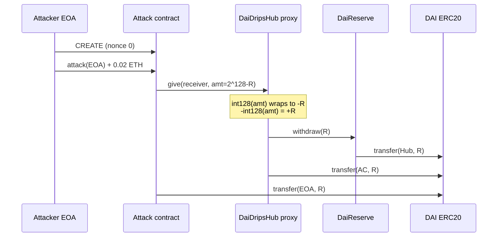
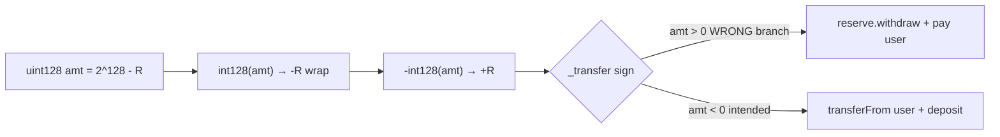

# Drips Network DaiDripsHub `give()` — `uint128 → int128` cast flips fund flow

> **Vulnerability classes:** vuln/arithmetic/overflow · vuln/input-validation/boundary · vuln/logic/missing-validation

> **Reproduction:** the PoC compiles & runs in an isolated Foundry project at
> [this project folder](.). The fork is served offline from the bundled
> `anvil_state.json` (local anvil replays Ethereum state at block `25529926`), so no
> public RPC is required.
> Full verbose trace: [output.txt](output.txt).
> Verified vulnerable source: [DaiDripsHub.sol](sources/DaiDripsHub.sol)
> (implementation `0x8d32…f697`), [DaiReserve.sol](sources/DaiReserve.sol).

<!-- non-defihacklabs -->

---

## Key info

| | |
|---|---|
| **Loss** | **24,882.995421947667857715 DAI** (full DaiReserve balance at attack block) |
| **Vulnerable contract** | `DaiDripsHub` proxy — [`0x73043143e0A6418cc45d82D4505B096b802FD365`](https://etherscan.io/address/0x73043143e0A6418cc45d82D4505B096b802FD365#code) |
| **Implementation** | [`0x8d321e80487356c846f34456d31ce761776ef697`](https://etherscan.io/address/0x8d321e80487356c846f34456d31ce761776ef697#code) (`DaiDripsHub`, solc `0.8.7`) |
| **DaiReserve (victim funds)** | [`0xF9BBb2dF44cfe46e501cf91c99B2f8FeF9D9d44A`](https://etherscan.io/address/0xF9BBb2dF44cfe46e501cf91c99B2f8FeF9D9d44A) |
| **Attacker EOA** | [`0x84dA7a5e2315Eb798f04B75554AeB15047269CCE`](https://etherscan.io/address/0x84dA7a5e2315Eb798f04B75554AeB15047269CCE) |
| **Attack contract** | [`0x00c64B5a926ba1fceC30EfaD88C344c619F54F12`](https://etherscan.io/address/0x00c64B5a926ba1fceC30EfaD88C344c619F54F12) (CREATE, attacker nonce 0, same block) |
| **Attack tx** | [`0xc38a6e2259a85ced94238a0b0a49697992f2a6b8140c28f3fd2343d3d8434130`](https://etherscan.io/tx/0xc38a6e2259a85ced94238a0b0a49697992f2a6b8140c28f3fd2343d3d8434130) |
| **CREATE tx** | [`0x00615e8ee6f7b77e32fe62c3767d6dd08458b55fec32e78bd70d4b2be2a80a6a`](https://etherscan.io/tx/0x00615e8ee6f7b77e32fe62c3767d6dd08458b55fec32e78bd70d4b2be2a80a6a) |
| **Chain / block / date** | Ethereum mainnet / fork `25529926` (attack in `25529927`) / 2026-07-15 |
| **Compiler** | Solidity `0.8.7+commit.e28d00a7` (verified Hub + Reserve) |
| **Bug class** | `uint128 amt` cast to `int128` without `amt ≤ type(int128).max`; large `amt` wraps negative so `-int128(amt)` becomes a **positive** signed transfer → reserve pays the caller |

---

## TL;DR

1. Drips Network’s DAI hub lets any user call `give(receiver, amt)` to gift DAI stream
   collectable balance to a receiver. Accounting debits the giver via a **signed**
   `_transfer(user, -int128(amt))`.

2. There is **no bound check** that `amt ≤ type(int128).max` (≈ `1.7e38`) before the
   cast. A `uint128` above that limit wraps to a **negative** `int128`.

3. Negating that wrapped value flips the sign: `-int128(amt)` becomes **positive**, so
   `ERC20DripsHub._transfer` takes the **withdraw** branch — pull DAI from `DaiReserve`
   and send it to the caller — instead of the intended `transferFrom` deposit path.

4. The attacker crafts `amt = 2^128 − reserveBalance`, which makes
   `-int128(amt) = +reserveBalance`, draining the entire reserve (**24,882.99 DAI**)
   in one `give()`.

---

## Background

Drips Network (historically Radicle Drips) is a continuous-funding
protocol: users configure per-second drips and one-off “gives” denominated in an
underlying ERC-20 (here DAI). Funds sit in a dedicated **`DaiReserve`** that only the
hub may `withdraw` / `deposit`. The hub is an upgradeable
`ManagedDripsHubProxy` pointing at `DaiDripsHub`.

Intended `give` semantics:

- Credit `receiverStates[receiver].collectable += amt`
- Debit the giver: pull `amt` DAI from the giver into the hub, then `reserve.deposit`

The debit is implemented as a **signed net flow** shared with collect/setDrips:

```text
_transfer(user, -int128(amt))   // negative signed amt ⇒ user pays reserve
```

That design is correct **only if** `amt` always fits in `int128`.

---

## The vulnerable code

### Public entry — no bound on `amt`

```solidity
// sources/DaiDripsHub.sol (flattened from verified impl 0x8d32…f697)
function give(address receiver, uint128 amt) public whenNotPaused {
    _give(_userOrAccount(msg.sender), receiver, amt);
}
```

### `_give` — unsafe cast + signed transfer

```solidity
function _give(
    UserOrAccount memory userOrAccount,
    address receiver,
    uint128 amt
) internal {
    _storage().receiverStates[receiver].collectable += amt;
    // ... emit Given ...
    _transfer(userOrAccount.user, -int128(amt)); // ← no amt <= type(int128).max
}
```

### `_transfer` — sign selects deposit vs withdraw

```solidity
function _transfer(address user, int128 amt) internal override {
    IERC20Reserve erc20Reserve = reserve();
    require(address(erc20Reserve) != address(0), "Reserve unset");
    if (amt > 0) {
        // POSITIVE: withdraw from reserve → pay user  (intended for collect())
        uint256 withdraw = uint128(amt);
        erc20Reserve.withdraw(withdraw);
        erc20.transfer(user, withdraw);
    } else if (amt < 0) {
        // NEGATIVE: take from user → deposit to reserve  (intended for give/setDrips)
        uint256 deposit = uint128(-amt);
        erc20.transferFrom(user, address(this), deposit);
        erc20Reserve.deposit(deposit);
    }
}
```

When `int128(amt)` wraps to `−R`, then `−int128(amt) = +R > 0`, so the **collect /
withdraw** branch runs for a call that should have been a **deposit**.

---

## Root cause

Two coupled mistakes:

1. **Missing range validation** on a value that crosses a signed/unsigned type
   boundary (`uint128` → `int128`). Safe max is `2^127 − 1`; the parameter allows up
   to `2^128 − 1`.

2. **Sign-overloaded transfer API**: a single `int128` both *moves* funds and
   *selects direction*. Any wrap that flips the sign silently reverses economic
   intent with no secondary auth (no allowance needed on the withdraw path —
   `DaiReserve.withdraw` trusts the hub).

Exact on-chain cast (reserve `R = 24882995421947667857715`):

| Expression | Value |
|---|---|
| `amt = 2^128 − R` | `340282366920938438580379185484100353741` (`0xffff…fabb1711cb7fa2193ecd`) |
| `int128(amt)` (wrap) | `−R` |
| `−int128(amt)` | `+R` → withdraw `R` DAI from reserve to caller |

---

## Preconditions

- Hub not paused (`paused() == false` at fork block).
- `DaiReserve` holds liquid DAI (`R > 0`).
- Caller can invoke `give` (permissionless when not paused).
- No DAI balance or allowance required on the exploit path (withdraw branch).
- Attack contract optional: a direct `hub.give(receiver, amt)` from any EOA/contract
  also drains (clean path in `testCleanGiveCast`).

---

## Attack walkthrough

Historical sequence in block `25529927` (PoC forks `25529926`):

1. **CREATE** attack contract at `0x00c64…` (attacker nonce 0; initcode from
   `0x00615e8e…`).
2. Attacker calls `attack(beneficiary)` with `0.02 ETH` value
   (`0xc38a6e22…`, selector `0xd018db3e`).
3. Attack contract calls `hub.give(0x962f…, amt)` with
   `amt = 2^128 − R`.
4. Hub emits `Given` with the huge `uint128` amt; `_transfer` withdraws `R` from
   reserve → hub → attack contract.
5. Attack contract transfers full DAI profit to the attacker EOA and forwards the
   `0.02 ETH` tip (observed to Lido EL rewards vault in the verbose trace).

Offline PoC numbers ([output.txt](output.txt)):

```
Attacker Before exploit DAI Balance: 0
Attacker DAI profit:                 24882.995421947667857715
Reserve DAI after:                   0
[PASS] testExploit()
```

Token flow in the trace:

```text
DaiReserve  --withdraw R-->  Hub  --transfer R-->  AttackContract  --transfer R-->  Attacker EOA
```

---

## Diagrams





---

## Remediation

1. **Bound check before cast** (minimal fix):

```solidity
require(amt <= uint128(uint256(int256(type(int128).max))), "amt too large");
_transfer(userOrAccount.user, -int128(amt));
```

   Or use OZ `SafeCast.toInt128(uint256(amt))` which reverts on overflow.

2. **Separate deposit/withdraw APIs** so a type error cannot reverse fund flow.

3. **Cap `give` amounts** to realistic DAI ranges far below `2^127`.

4. **Defense in depth on reserve**: rate-limit / governance-gated large
   `withdraw`s; monitor for single-tx full-balance drains.

---

## How to reproduce

```bash
cd ~/RustroverProjects/audits/evm-hack-registry
_shared/run_poc.sh 2026-07-DripsDaiHub_exp --match-test testExploit -vvvvv
# Offline: loads anvil_state.json @ block 25529926, no RPC required.
# Expected: [PASS] and Attacker DAI profit 24882.995421947667857715
```

PoC source: [test/DripsDaiHub_exp.sol](test/DripsDaiHub_exp.sol) — historical CREATE
replay of the on-chain attack contract, plus `testCleanGiveCast` for a direct
`hub.give` reproduction.

---

*Reference: [SlowMist TI alert](https://x.com/SlowMist_Team/status/2077232524955423144) · project [@dripsnetwork](https://x.com/dripsnetwork)*
