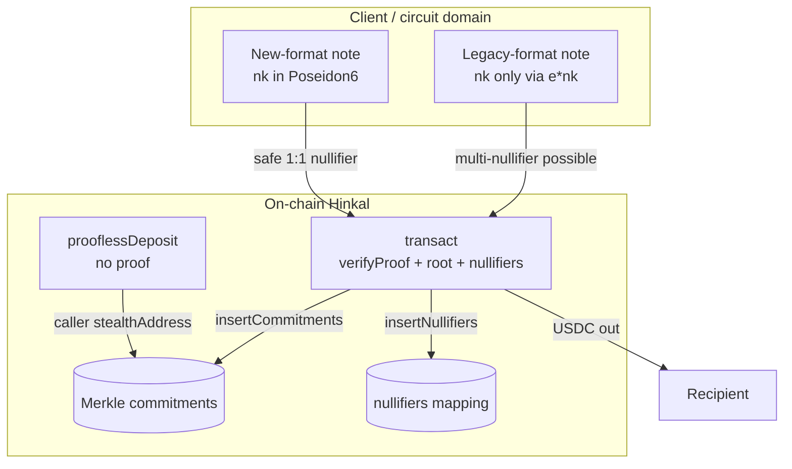
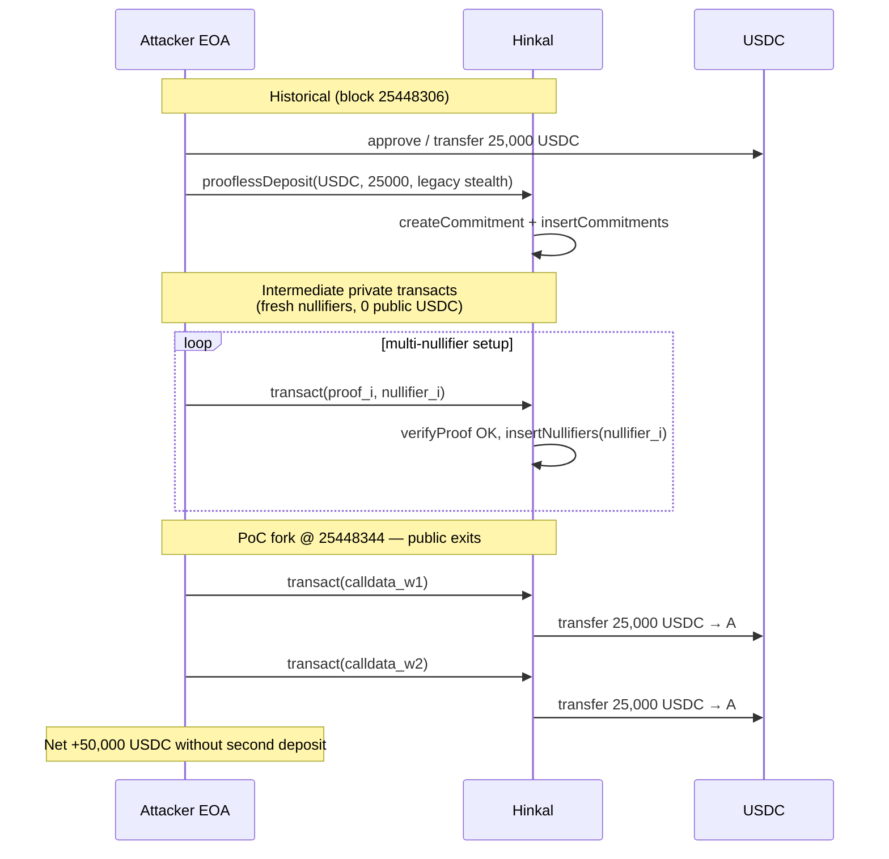

# Hinkal Shielded Pool — Legacy Note Multi-Nullifier Double-Spend

> **Vulnerability classes:** vuln/logic/missing-check · vuln/logic/incorrect-state-transition · vuln/auth/signature-validation · vuln/input-validation/missing-validation

> **Reproduction:** the PoC compiles & runs in an isolated Foundry project at
> [this project folder](.). The fork is served offline from the bundled
> `anvil_state.json` (local anvil replays Ethereum state at block `25448344`), so no
> public RPC is required.
> Full verbose trace: [output.txt](output.txt).
> Verified on-chain sources: [Hinkal.sol](sources/HinkalProxy_0x25e5e8/contracts/Hinkal.sol)
> (proxy code at `0x25e5…a826`), [HinkalBase.sol](sources/HinkalProxy_0x25e5e8/contracts/HinkalBase.sol).
> Circuits are **closed-source**; the PoC is a **historical calldata replay** of two
> accepted `transact()` withdrawals that should have been exclusive-or.

<!-- non-defihacklabs -->

---

## Key info

| | |
|---|---|
| **Loss (campaign)** | ~**$800K–$822K USDC** (+ other assets) drained from Hinkal privacy pool(s) |
| **PoC scope** | **50,000 USDC** — two consecutive public `transact()` exits of **25,000 USDC** each after a single **25,000 USDC** legacy `prooflessDeposit` |
| **Vulnerable contract** | `Hinkal` proxy — [`0x25e5e82f5702A27C3466fE68f14abDbbAdFca826`](https://etherscan.io/address/0x25e5e82f5702a27c3466fe68f14abdbbadfca826#code) |
| **Logic impl (delegate)** | `HinkalInLogic` — [`0x94c88fbf1a756012d405057ee6f3ea8578f28de1`](https://etherscan.io/address/0x94c88fbf1a756012d405057ee6f3ea8578f28de1#code) |
| **Attacker EOA** | [`0xbB3f01a1b1C68F3DEB36C55342b5F5706c32fc20`](https://etherscan.io/address/0xbB3f01a1b1C68F3DEB36C55342b5F5706c32fc20) |
| **Helper / early path** | [`0x105aD144e8952236144DfE2e135ceD7812e3D7C0`](https://etherscan.io/address/0x105aD144e8952236144DfE2e135ceD7812e3D7C0) (100 USDC probe deposits) |
| **25k legacy deposit** | [`0xbf7252af56be8867a12e27cc332f85e8f39e906756e559d6a076dc8bd9d50008`](https://etherscan.io/tx/0xbf7252af56be8867a12e27cc332f85e8f39e906756e559d6a076dc8bd9d50008) (block `25448306`) |
| **Public exit #1** | [`0x93aeb876ebb375fe04d5d1fde3bb1a0fcb9335c232e819deb021ad302aa1edc9`](https://etherscan.io/tx/0x93aeb876ebb375fe04d5d1fde3bb1a0fcb9335c232e819deb021ad302aa1edc9) (block `25448345`, +25k USDC) |
| **Public exit #2** | [`0x009e268bea351ff8a35b4051c104ac025d8ea2fda6eb00d2448ba17de52f2046`](https://etherscan.io/tx/0x009e268bea351ff8a35b4051c104ac025d8ea2fda6eb00d2448ba17de52f2046) (block `25448346`, +25k USDC) |
| **Chain / fork / date** | Ethereum mainnet / fork `25448344` / ~2026-07-02 |
| **Compiler** | Solidity `0.8.17` (verified Hinkal) |
| **Bug class** | Legacy note format fails to bind commitment ↔ unique nullifier; on-chain layer only enforces nullifier *set* membership, not leaf exclusivity |

---

## TL;DR

1. Hinkal is a shielded pool: deposits become **commitments** in an on-chain Merkle
   tree; spends present a ZK proof plus a **nullifier**. The contract records each
   nullifier and rejects *reuse of that exact value* — it does **not** link a
   nullifier to a unique leaf
   ([HinkalBase.sol:155-171](sources/HinkalProxy_0x25e5e8/contracts/HinkalBase.sol#L155-L171)).

2. `prooflessDeposit()` accepts tokens and inserts commitments from
   caller-supplied `StealthAddressStructure` **without a ZK proof**
   ([Hinkal.sol:199-238](sources/HinkalProxy_0x25e5e8/contracts/Hinkal.sol#L199-L238)).
   Public analysis (BlockSec + client de-obfuscation): the legacy format packs
   `isNewStyle=0` in bit 255 of `extraRandomization` and only binds the nullifying
   key `nk` via the product `e*nk`, so many `(e,nk)` pairs can share one commitment
   while producing **different nullifiers**.

3. `transact()` verifies a proof, checks the Merkle root, applies balance-diff
   rules, then `insertNullifiers` + `insertCommitments`
   ([Hinkal.sol:40-196](sources/HinkalProxy_0x25e5e8/contracts/Hinkal.sol#L40-L196)).
   Every individually valid proof with a fresh nullifier settles as a normal
   withdrawal.

4. Attacker flow: legacy `prooflessDeposit(25_000 USDC)` → many intermediate private
   `transact()` ops (0-value public ERC-20 logs) that mint spendable notes via the
   multi-nullifier defect → repeated public `transact()` exits of **25,000 USDC**
   each. Campaign ~**$800K USDC**; this PoC replays **two** public exits for
   **50,000 USDC**.

5. Circuits are closed-source. The PoC proves the **on-chain acceptance class**:
   historical calldata that the live verifier already accepted, re-executed on a
   fork one block before the first public 25k exit, still pays twice.

---

## Background

### Protocol model



### Entry points

| Function | Proof? | Role |
|----------|--------|------|
| `prooflessDeposit(erc20s, amounts, tokenIds, stealth[])` | **No** | Pull tokens; `createCommitment` from caller stealth fields; `insertCommitments` |
| `transact(a,b,c, dimensions, circomData)` | **Yes** | Universal deposit / transfer / withdraw path |

Commitment for ERC-20 notes
([HinkalBase.sol:67-86](sources/HinkalProxy_0x25e5e8/contracts/HinkalBase.sol#L67-L86)):

```solidity
commitment = hash4(
    utxo.amount,
    uint256(uint160(utxo.erc20Address)),
    utxo.stealthAddressStructure.stealthAddress,
    utxo.timeStamp
);
```

`StealthAddressStructure` is four field elements only — `extraRandomization`,
`stealthAddress`, `H0`, `H1`
([StealthAddressStructure.sol](sources/HinkalProxy_0x25e5e8/contracts/types/StealthAddressStructure.sol)).
There is **no** on-chain rejection of legacy packing in `prooflessDeposit`.

### Nullifier check (on-chain)

```155:171:sources/HinkalProxy_0x25e5e8/contracts/HinkalBase.sol
    function insertNullifiers(
        uint256[][] calldata inputNullifiers,
        bool[] calldata onChainCreation
    ) internal {
        for (uint256 i = 0; i < inputNullifiers.length; i++) {
            for (uint256 j = 0; j < inputNullifiers[i].length; j++) {
                if (onChainCreation[i] == true) break;
                if (inputNullifiers[i][j] != 0) {
                    require(
                        !nullifiers[inputNullifiers[i][j]],
                        "Nullifier cannot be reused"
                    );
                    nullifiers[inputNullifiers[i][j]] = true;
                    emit Nullified(inputNullifiers[i][j]);
                }
            }
        }
    }
```

This is correct *as a set* — but **solvency** requires the circuit to guarantee
that each leaf yields **exactly one** admissible nullifier. That guarantee failed
for legacy notes.

---

## Root cause

### Where the bug lives

| Layer | Status |
|-------|--------|
| On-chain nullifier set | Works as designed (no reuse of *same* nullifier) |
| On-chain proof verify | Accepts proofs the verifier circuit allows |
| On-chain `prooflessDeposit` format gate | **Missing** — legacy notes enter the tree |
| Circuit nullifier binding (legacy) | **Likely defective** (closed-source; inferred from client + on-chain multi-spend) |

Inferred legacy construction (BlockSec / de-obfuscated client):

- Legacy: `H0 = e·Base8`, `H1 = (e·nk)·Base8`, stealth = Poseidon3(signs, H0y, H1y)
- New: `H1 = nk·H0`, stealth = Poseidon6(…, nk, spk…)
- Nullifier ≈ Poseidon2(commitment, Poseidon2(nk, commitment))

If `nk` is only constrained through the product `e·nk`, alternate factorizations
keep the same commitment while changing `nk` → **new nullifier, same leaf**.

### Attack path (this PoC)



Selectors:

| Function | Selector |
|----------|----------|
| `prooflessDeposit` | `0x0ed4a94e` |
| `transact` | `0x979a77a8` |

---

## PoC strategy & scope

**Why calldata replay.** The SNARK proving key / circuit for `transact` is not
public. Regenerating valid proofs offline is not feasible. Replaying historical
inputs that mainnet already accepted is the standard teaching approach for this
class (same pattern as AztecEscapeHatch proof replay in this registry).

**Scope honesty.**

- Full campaign: ~30× 25k USDC public exits after the consolidated legacy deposit
  (~750k USDC from this phase alone) plus earlier 100-USDC probe phase → ~$800K.
- This PoC: **exactly two** public exits → **50,000 USDC** profit, enough to show
  the multi-exit invariant failure after a single 25k deposit.

**Fork:** block `25448344` (after deposit + private setup; before first public 25k
exit at `25448345`).

**Offline result** ([output.txt](output.txt)):

```
[PASS] testExploit()
Attacker USDC profit: 50000.000000
Hinkal pool USDC lost: 50000.000000
```

---

## Mitigations

1. **Disable legacy note path** in circuits and reject `isNewStyle == 0` in
   `prooflessDeposit` / deposit builders.
2. Circuit audit: prove **1 commitment ↔ 1 nullifier** for every format still
   accepted.
3. Optional on-chain defense-in-depth: commitment tagging by format; rate limits;
   pause (already used post-incident).

---

## References

- CertiK Alert: https://x.com/CertiKAlert/status/2072856656099324255
- BlockSec weekly: https://blocksec.com/blog/web3-security-hinkal-double-spend
- Hinkal whitepaper: https://hinkal.pro/Whitepaper.pdf
- Circuit docs (public): https://hinkal-team.gitbook.io/hinkal/technical-description/circuits/swapper-m
- Client enclave (de-obfuscation reference): https://github.com/Hinkal-Protocol/Hinkal-API-Enclave

---

## Taxonomy tags

`vuln/logic/missing-check` · `vuln/logic/incorrect-state-transition` ·
`vuln/auth/signature-validation` · `vuln/input-validation/missing-validation` ·
`vuln/bridge/missing-validation` (settlement trusts circuit for value conservation)
