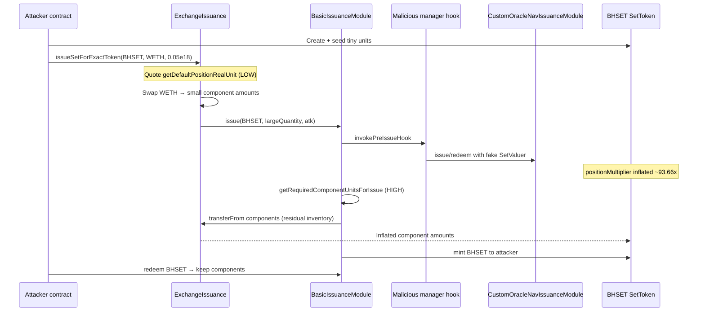
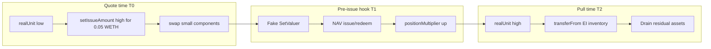

# Index Coop ExchangeIssuance TOCTOU — Unlocked SetToken Units + Malicious Manager Hook Drain Residual Inventory

<!-- non-defihacklabs: Crypto Training original detection & analysis (Twitter hack alerting) -->

> **Vulnerability classes:** vuln/logic/incorrect-state-transition · vuln/logic/missing-validation · vuln/dependency/unsafe-external-call · vuln/reentrancy/cross-contract

> **Reproduction:** the PoC compiles & runs in an isolated Foundry project at
> [this project folder](.). Full verbose trace: [output.txt](output.txt).
> Verified sources:
> [ExchangeIssuance.sol](sources/ExchangeIssuance_c8c85a/ExchangeIssuance.sol),
> [BasicIssuanceModule.sol](sources/BasicIssuanceModule_d8EF3c/BasicIssuanceModule.sol),
> [CustomOracleNavIssuanceModule](sources/CustomOracleNavIssuanceModule_ab63c9/).

---

## Key info

| | |
|---|---|
| **Loss** | **~\$9.6K USD** (SlowMist TI). PoC drains residual EI inventory including **~436.70 LINK** and **~425.11 UNI** ([output.txt:464](output.txt)-[465](output.txt)) plus AAVE, MKR, WBTC, WETH, BIT, USDC, … |
| **Vulnerable contract** | `ExchangeIssuance` — [`0xc8C85A3b4d03FB3451e7248Ff94F780c92F884fD`](https://etherscan.io/address/0xc8c85a3b4d03fb3451e7248ff94f780c92f884fd#code) |
| **Issuance module** | `BasicIssuanceModule` — [`0xd8EF3cACe8b4907117a45B0b125c68560532F94D`](https://etherscan.io/address/0xd8ef3cace8b4907117a45b0b125c68560532f94d#code) |
| **NAV module (abuse path)** | `CustomOracleNavIssuanceModule` — [`0xab63c9A4A89fbd87F61463E90e635b111d6cCB04`](https://etherscan.io/address/0xab63c9a4a89fbd87f61463e90e635b111d6ccb04#code) |
| **Malicious SetToken** | `BHSET` ("Batch Hooked Set") — [`0xf7c2d0a2bf81bf803ed6e1d97c89fe3b30b06948`](https://etherscan.io/address/0xf7c2d0a2bf81bf803ed6e1d97c89fe3b30b06948) |
| **Malicious Manager / pre-issue hook** | [`0x8f449d85f728c1dd6596880ba28a0b80b6a26c58`](https://etherscan.io/address/0x8f449d85f728c1dd6596880ba28a0b80b6a26c58) |
| **Attacker EOA** | [`0x0736930aE35EAfEfa789f11Edf41d7B799e7c99d`](https://etherscan.io/address/0x0736930ae35eafefa789f11edf41d7b799e7c99d) |
| **Attacker contract** | [`0x388a3Da33825E1F44Ac71b8FD543523cdF994802`](https://etherscan.io/address/0x388a3da33825e1f44ac71b8fd543523cdf994802) |
| **Primary attack tx** | [`0x7f45428df558fba1d19ab115effef8ecd1e6e05b491f02202b0815e47b8d658b`](https://etherscan.io/tx/0x7f45428df558fba1d19ab115effef8ecd1e6e05b491f02202b0815e47b8d658b) |
| **Deploy tx** | [`0x769db73b90da801c18c4a3862cf2366165d3b447c98074454c75df0a3a9bb7de`](https://etherscan.io/tx/0x769db73b90da801c18c4a3862cf2366165d3b447c98074454c75df0a3a9bb7de) |
| **Chain / block / date** | Ethereum mainnet / **25,644,620** (pre-attack fork) · exploit block **25,644,621** / **2026-07-30** |
| **Compiler (victim)** | Solidity **v0.6.10+commit.00c0fcaf** (`ExchangeIssuance`) |
| **Bug class** | **TOCTOU / untrusted SetToken state**: quote uses live `getDefaultPositionRealUnit` without locking; manager pre-issue hook inflates `positionMultiplier` before `transferFrom` |

---

## TL;DR

1. Index Coop `ExchangeIssuance` lets anyone call `issueSetForExactToken` for **any** controller-registered SetToken. It reads that SetToken's component real units to size swaps, buys components, then calls `BasicIssuanceModule.issue` — **without freezing SetToken state between quote and pull**.

2. The attacker creates a **malicious SetToken** (`BHSET`) with components matching **stale residual balances** sitting on `ExchangeIssuance` (LINK, UNI, AAVE, MKR, WBTC, … from years of Index product activity).

3. Units are **seeded tiny**. Quoting with 0.05 WETH therefore sizes a large `setIssueAmount` and only buys a small amount of each component.

4. Inside `BasicIssuanceModule.issue`, the configured **manager pre-issue hook** runs **before** `getRequiredComponentUnitsForIssue`. The hook uses **NAV issue/redeem with a fake SetValuer** to inflate `positionMultiplier` by **~93.66×**.

5. `transferFrom` then pulls the **inflated** component amounts from `ExchangeIssuance` (residual inventory + freshly swapped crumbs) into BHSET. The attacker redeems BHSET and keeps the loot.

6. Offline PoC reproduces the drain: **EI LINK −436.70**, **EI UNI −425.11** ([output.txt:464](output.txt)-[465](output.txt)), `[PASS]` at [output.txt:453](output.txt).

---

## Background

**Set Protocol** issues ERC-20 "SetTokens" whose supply is backed by a basket of component tokens. Real unit for each component is:

```text
realUnit = virtualUnit * positionMultiplier / 1e18
```

**BasicIssuanceModule** `issue` deposits components (via `transferFrom` the issuer) and mints SetTokens. Optionally a **manager issuance hook** runs first (`invokePreIssueHook`).

**CustomOracleNavIssuanceModule** can issue/redeem against a reserve using a **SetValuer**. Issue/redeem paths call `editPositionMultiplier` when fees / NAV rebalancing adjust units.

**ExchangeIssuance** (Index Coop helper, not a Set module) is a convenience router: user supplies ETH/WETH/ERC20 → contract swaps into the Set's components → calls `basicIssuanceModule.issue`. It holds **residual dust / leftover component balances** after historical issues, refunds, and rounding — enough inventory for a multi-thousand-dollar drain when units are inflated.

---

## The vulnerable code

### 1. Quote units, then issue — no lock

```solidity
// sources/ExchangeIssuance_c8c85a/ExchangeIssuance.sol
function _issueSetForExactWETH(
    ISetToken _setToken,
    uint256 _minSetReceive,
    uint256 _totalEthAmount
) internal returns (uint256) {
    address[] memory components = _setToken.getComponents();
    (
        uint256 setIssueAmount,
        uint256[] memory amountEthIn,
        Exchange[] memory exchanges
    ) = _getSetIssueAmountForETH(_setToken, components, _totalEthAmount); // reads live units

    require(setIssueAmount > _minSetReceive, "ExchangeIssuance: INSUFFICIENT_OUTPUT_AMOUNT");

    for (uint256 i = 0; i < components.length; i++) {
        _swapExactTokensForTokens(exchanges[i], WETH, components[i], amountEthIn[i]);
    }

    // Units may have changed — no re-check, no lock
    basicIssuanceModule.issue(_setToken, setIssueAmount, msg.sender); // L1912
    return setIssueAmount;
}
```

`_getAmountETHForIssuance` sizes components via **current** `getDefaultPositionRealUnit` ([ExchangeIssuance.sol:2022](sources/ExchangeIssuance_c8c85a/ExchangeIssuance.sol#L2022)).

### 2. Pre-issue hook runs before unit snapshot for transferFrom

```solidity
// sources/BasicIssuanceModule_d8EF3c/BasicIssuanceModule.sol
function issue(ISetToken _setToken, uint256 _quantity, address _to) external ... {
    require(_quantity > 0, "Issue quantity must be > 0");

    address hookContract = _callPreIssueHooks(_setToken, _quantity, msg.sender, _to); // L1900

    (address[] memory components, uint256[] memory componentQuantities) =
        getRequiredComponentUnitsForIssue(_setToken, _quantity); // L1905 — AFTER hook

    for (uint256 i = 0; i < components.length; i++) {
        transferFrom(IERC20(components[i]), msg.sender, address(_setToken), componentQuantities[i]); // L1910
    }
    _setToken.mint(_to, _quantity);
}
```

`getRequiredComponentUnitsForIssue` multiplies **post-hook** real units by quantity ([BasicIssuanceModule.sol:2022](sources/BasicIssuanceModule_d8EF3c/BasicIssuanceModule.sol#L2022)).

### 3. Public entry trusts any SetToken

```solidity
function issueSetForExactToken(
    ISetToken _setToken,
    IERC20 _inputToken,
    uint256 _amountInput,
    uint256 _minSetReceive
)
    isSetToken(_setToken) // only checks controller registration — not trustworthiness
    external
    nonReentrant
    returns (uint256)
{
    _inputToken.safeTransferFrom(msg.sender, address(this), _amountInput);
    uint256 amountEth = address(_inputToken) == WETH ? _amountInput : _swapTokenForWETH(_inputToken, _amountInput);
    return _issueSetForExactWETH(_setToken, _minSetReceive, amountEth);
}
```

Anyone can register a SetToken via `SetTokenCreator` and pass it here.

---

## Root cause

**Time-of-check / time-of-use on mutable external SetToken state.**

| Phase | What is read | When |
|---|---|---|
| **Check (quote)** | `getDefaultPositionRealUnit` (low, after seed) | Before swaps in `_issueSetForExactWETH` |
| **Use (pull)** | Same units after manager hook mutates `positionMultiplier` | Inside `BIM.issue` after `_callPreIssueHooks` |

The manager is trusted by Set Protocol design for **its own** SetToken, but `ExchangeIssuance` incorrectly treats **arbitrary** SetTokens as if their state were immutable for the duration of issue. Combined with:

- residual component inventory on EI, and  
- NAV + fake valuer ability to **inflate** `positionMultiplier` inside the pre-issue hook,

the result is an **over-pull** of ~93.66× quoted component amounts from EI.

---

## Preconditions

1. **Residual balances** of the target components on `ExchangeIssuance` (pre-attack LINK ~4.367e20 wei, etc.).
2. Ability to **create** a SetToken with those components + enable `BasicIssuanceModule` + `CustomOracleNavIssuanceModule`.
3. Ability to set a **malicious manager issuance hook** and a **malicious SetValuer** for NAV.
4. Flash liquidity (Balancer WETH) to seed components and fund the 0.05 WETH `issueSetForExactToken` payment.
5. Uniswap/Sushi pairs for EI's component acquisition path (or `Exchange.None` for WETH component).

---

## Attack walkthrough

Reproduced offline in [test/IndexCoopExchangeIssuanceTOCTOU_exp.sol](test/IndexCoopExchangeIssuanceTOCTOU_exp.sol) by replaying historical attacker payloads ([src/HistoricalAttackPayloads.sol](src/HistoricalAttackPayloads.sol)).

| Step | Action | Evidence |
|---|---|---|
| 0 | Fork Ethereum @ **25,644,620** | [test file](test/IndexCoopExchangeIssuanceTOCTOU_exp.sol) `FORK_BLOCK` |
| 1 | Deploy historical attack engine (CREATE) | `attack()` L110; same bytecode as `0x388a3da3` |
| 2 | `approveTokens` init | `HistoricalAttackPayloads.init()` |
| 3 | Create BHSET, seed tiny units, Balancer flash-loan WETH, buy seed components | Primary exploit calldata `exp1` |
| 4 | Transfer **0.05 WETH** into EI → `issueSetForExactToken(BHSET, WETH, 0.05e18, …)` | On-chain transfer pattern in attack tx |
| 5 | EI quotes low units → swaps small component amounts | EI buys ~4.71e18 LINK vs later pulls ~4.41e20 |
| 6 | `BIM.issue` → **pre-issue hook** inflates `positionMultiplier` ~**93.66×** via NAV + fake valuer | SlowMist root cause; ratio matches residual/seed |
| 7 | `transferFrom` drains EI residuals into BHSET | PoC: LINK drained **436.702983239438376590** ([output.txt:464](output.txt)) |
| 8 | Redeem BHSET → attacker holds components; repay flash loan; optional further baskets / sell | `exp2`/`exp3`/`sell` legs |

Primary on-chain sequence in block **25,644,621**:

1. Deploy — `0x769db73b…`
2. Init — `0xd0060866…` (`approveTokens`)
3. Drain — `0x7f45428d…` (this PoC's `exp1`)
4. Additional drains / sell in the same block and later (`0x234e7c39…`, `0x1fb5b25b…`, …)

---

## Diagrams





---

## Remediation

1. **Do not trust arbitrary SetTokens** in ExchangeIssuance: maintain an allowlist of Index-approved Sets, or require Sets without custom manager hooks / with immutable units for the call.
2. **Snapshot units once** and enforce the same snapshot in `BIM.issue` (pass explicit component quantities; reject if live units diverge).
3. **Re-read and re-validate** component requirements after hooks; or **disable manager hooks** for any issue path funded by ExchangeIssuance residual inventory.
4. **Sweep / withdraw residual** ERC-20 balances from ExchangeIssuance so inventory cannot bankroll TOCTOU over-pulls.
5. Treat **manager hooks + NAV + custom valuers** as a combined trust surface: untrusted managers must not be able to change `positionMultiplier` during third-party issue flows.

---

## How to reproduce

```bash
# Offline (anvil serves anvil_state.json — no RPC keys required)
cd /path/to/evm-hack-registry
_shared/run_poc.sh 2026-07-IndexCoopExchangeIssuanceTOCTOU_exp -vvvvv
# expect: [PASS] testExploit
```

PoC layout: [test/IndexCoopExchangeIssuanceTOCTOU_exp.sol](test/IndexCoopExchangeIssuanceTOCTOU_exp.sol) deploys the historical attack bytecode and replays init + primary drain (+ optional follow-ups). Fork block **25,644,620**, chain port **8545** (mainnet).

---

*Reference: [SlowMist TI Alert](https://x.com/SlowMist_Team/status/2082767887245410320)*
