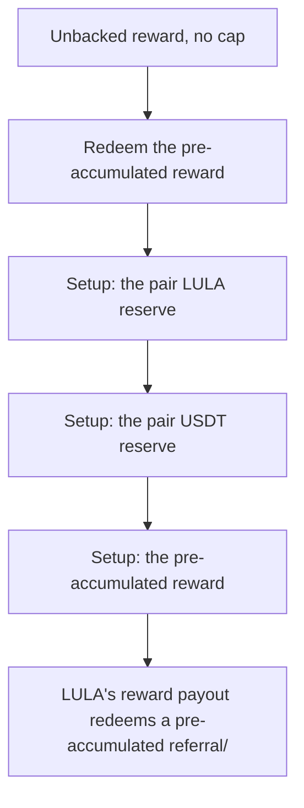

# LULA: pre-accumulated reward redeemed against a manipulable pool

<!-- source-defihacklabs: https://github.com/SunWeb3Sec/DeFiHackLabs/pull/1209 (LULA_exp.sol) -->
<!-- defihacklabs-sol: https://github.com/SunWeb3Sec/DeFiHackLabs/blob/main/src/test/2026-07/LULA_exp.sol -->

> **Vulnerability classes:** vuln/logic · vuln/access-control

> **Reproduction:** a self-contained, faithful reconstruction of the incident's core
> bug — local deploy, **no fork** — both gates green (registry `forge test` PASS +
> browser Playground `VERDICT: PASS`). Basis: [DeFiHackLabs PR #1209](https://github.com/SunWeb3Sec/DeFiHackLabs/pull/1209)
> ([`LULA_exp.sol`](https://github.com/SunWeb3Sec/DeFiHackLabs/blob/main/src/test/2026-07/LULA_exp.sol), the upstream fork replay).

---

## Key info

| | |
|---|---|
| **Loss** | ~578,295 USDT |
| **Chain** | BNB Chain |
| **Vulnerable contract** | `0xbd4fd5a3…` (Finding #2026: LulaReward) |
| **Bug class** | Finding #2026: LulaReward |

---

## Root cause

LULA's reward payout redeems a pre-accumulated referral/team reward credit by SELLING the credited LULA into the LULA/USDT pair for USDT at the live spot, with no cap and no TWAP. Weeks earlier the attacker accumulated a large reward credit for free; redeeming it against the pool pays out far more USDT than was ever deposited, draining the pair (~578,295 USDT). In the live tx the attacker also flash-loaned USDT to sweep LULA out of the pair first, maximising the pool deflation and the payout. Every step is a public function driven by attacker-controlled on-chain state - no owner key, no privileged signer.

```solidity
    // @> VULN: redeems the (free, pre-accumulated) reward by dumping the credited
```

## Why it's exploitable here

LULA's reward payout redeems a pre-accumulated referral/team reward credit by SELLING the credited LULA into the LULA/USDT pair for USDT at the live spot, with no cap and no TWAP. Weeks earlier the attacker accumulated a large reward credit for free; redeeming it against the pool pays out far more USDT than was ever deposited, draining the pair (~578,295 USDT). In the live tx the attacker also flash-loaned USDT to sweep LULA out of the pair first, maximising the pool deflation and the payout. Every step is a public function driven by attacker-controlled on-chain state - no owner key, no privileged signer.

## Attack path



## Marked-line walkthrough (Playground)

The EVM Playground pins each step to the exact executed source line:

1. **L74** — Unbacked reward, no cap: The reward vault redeems a pre-accumulated credit by dumping the credited LULA into the pair - no cap, no TWAP.
2. **L75** — Redeem the pre-accumulated reward: Root cause: claimReward sells the free, pre-accumulated reward LULA into the LULA/USDT pair at the live spot, so an oversized unbacked credit drains the pair's USDT.
3. **L87** — Setup: the pair LULA reserve: Setup: the LULA/USDT pair's pre-attack reserves the reward redemption drains.
4. **L88** — Setup: the pair USDT reserve: Setup: ~600K USDT backs the pair - the asset the attacker walks away with.
5. **L89** — Setup: the pre-accumulated reward: Setup: ~12 days of prior referral/team accrual credited to the attacker for free.

## PoC

Registry (Foundry, local deploy — faithful reconstruction + harm-asserting test):

```bash
cd 2026-07-LULA_exp
forge test -vvv
```

The browser Playground replays the same synthetic opcode-for-opcode and measures the
harm. Both gates are green (registry `forge test` PASS + Playground `_verify-poc`
**VERDICT: PASS**).

## Sources

- **Basis / upstream PoC:** [DeFiHackLabs PR #1209 — LULA_exp.sol](https://github.com/SunWeb3Sec/DeFiHackLabs/blob/main/src/test/2026-07/LULA_exp.sol) (fork replay of the on-chain tx).
- DeFiHackLabs incident collection: [SunWeb3Sec/DeFiHackLabs](https://github.com/SunWeb3Sec/DeFiHackLabs).
