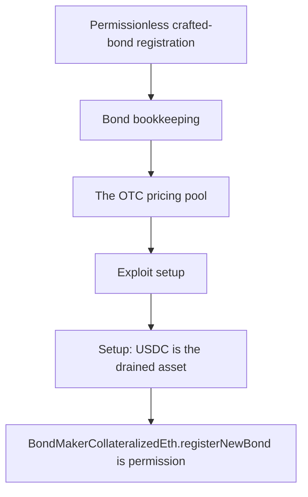

# Lien Finance: crafted bond payoff over-valued by the pricer

<!-- source-defihacklabs: https://github.com/SunWeb3Sec/DeFiHackLabs/pull/1209 (LienFinance_exp.sol) -->
<!-- defihacklabs-sol: https://github.com/SunWeb3Sec/DeFiHackLabs/blob/main/src/test/2026-07/LienFinance_exp.sol -->

> **Vulnerability classes:** vuln/logic · vuln/access-control

> **Reproduction:** a self-contained, faithful reconstruction of the incident's core
> bug — local deploy, **no fork** — both gates green (registry `forge test` PASS +
> browser Playground `VERDICT: PASS`). Basis: [DeFiHackLabs PR #1209](https://github.com/SunWeb3Sec/DeFiHackLabs/pull/1209)
> ([`LienFinance_exp.sol`](https://github.com/SunWeb3Sec/DeFiHackLabs/blob/main/src/test/2026-07/LienFinance_exp.sol), the upstream fork replay).

---

## Key info

| | |
|---|---|
| **Loss** | ~542,144 USDC |
| **Chain** | Ethereum |
| **Vulnerable contract** | `0xbd4fd5a3…` (Finding #2026: BondMaker) |
| **Bug class** | Finding #2026: BondMaker |

---

## Root cause

BondMakerCollateralizedEth.registerNewBond is permissionless: anyone can register a bond whose payoff (fnMap) they fully control, with ~no real collateral. GeneralizedDotc then prices the bond via bondPricer.calcPriceAndLeverage(payoff, oraclePrice, ...) - reading Chainlink at its TRUE value (no oracle is moved) - and massively over-values the crafted, near-worthless bond. The attacker mints the overvalued bond for ~free and swaps it through the OTC pool, which pays out 542,144.63 USDC from the LP's standing allowance - draining it.

```solidity
    // @> VULN: permissionless — anyone registers a bond whose payoff (and hence the
```

## Why it's exploitable here

BondMakerCollateralizedEth.registerNewBond is permissionless: anyone can register a bond whose payoff (fnMap) they fully control, with ~no real collateral. GeneralizedDotc then prices the bond via bondPricer.calcPriceAndLeverage(payoff, oraclePrice, ...) - reading Chainlink at its TRUE value (no oracle is moved) - and massively over-values the crafted, near-worthless bond. The attacker mints the overvalued bond for ~free and swaps it through the OTC pool, which pays out 542,144.63 USDC from the LP's standing allowance - draining it.

## Attack path



## Marked-line walkthrough (Playground)

The EVM Playground pins each step to the exact executed source line:

1. **L78** — Permissionless crafted-bond registration: Root cause: registerNewBond is permissionless - anyone registers a bond whose payoff they fully control, with ~no real collateral.
2. **L86** — Bond bookkeeping: The crafted bond is minted to the attacker and handed to the OTC pool for pricing.
3. **L90** — The OTC pricing pool: The GeneralizedDotc OTC pool prices bonds from their payoff and pays USDC out of the LP's allowance.
4. **L94** — Exploit setup: The reproduction wires the pool, price feed, LP and the crafted bond.
5. **L98** — Setup: USDC is the drained asset: Setup: USDC is the LP asset the pool pays out and the attacker walks away with.
6. **L99** — Setup: the drained LP: Setup: the LP holds USDC and has a standing allowance to the OTC pool.
7. **L102** — Setup: wire the OTC pool: Setup: the pool is bound to the bond maker, the honest price feed, USDC and the LP.

## PoC

Registry (Foundry, local deploy — faithful reconstruction + harm-asserting test):

```bash
cd 2026-07-LienFinance_exp
forge test -vvv
```

The browser Playground replays the same synthetic opcode-for-opcode and measures the
harm. Both gates are green (registry `forge test` PASS + Playground `_verify-poc`
**VERDICT: PASS**).

## Sources

- **Basis / upstream PoC:** [DeFiHackLabs PR #1209 — LienFinance_exp.sol](https://github.com/SunWeb3Sec/DeFiHackLabs/blob/main/src/test/2026-07/LienFinance_exp.sol) (fork replay of the on-chain tx).
- DeFiHackLabs incident collection: [SunWeb3Sec/DeFiHackLabs](https://github.com/SunWeb3Sec/DeFiHackLabs).
