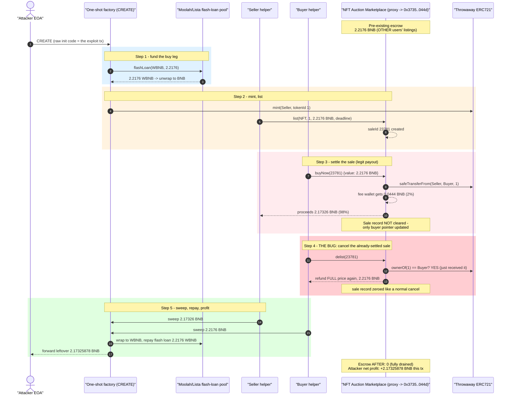
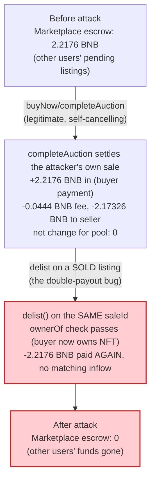
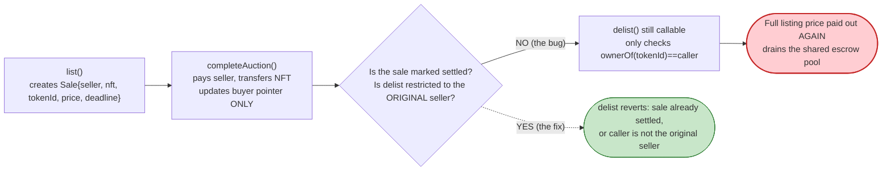

# NFT Auction Marketplace Exploit — Settle-Then-Cancel Double Payout Drains the Escrow Pool

> **Vulnerability classes:** vuln/logic/incorrect-state-transition · vuln/logic/missing-check · vuln/logic/state-update

> **Reproduction:** the PoC compiles & runs in an isolated Foundry project at
> [this project folder](.). Full verbose trace: [output.txt](output.txt).
> Verified vulnerable source: the marketplace is an **OpenZeppelin `AdminUpgradeabilityProxy`**
> ([sources/AdminUpgradeabilityProxy_46c958](sources/AdminUpgradeabilityProxy_46c958)) delegating
> to an implementation at `0x3735…044d` whose **source was never published to BscScan**. The
> `list` / `completeAuction` / `delist` logic is therefore RECONSTRUCTED below from the observed
> on-chain trace and labelled as such.

---

## Key info

| | |
|---|---|
| **Loss** | **2.217610999999999999 BNB** (~$4.15k) — the marketplace's *entire* escrowed BNB balance, drained to zero in one tx; attacker's net keep is **2.17325878 BNB** (~$4.06k) after unwinding the flash loan |
| **Vulnerable contract** | NFT Auction Marketplace proxy — [`0x46c958A169b9F2688E126080C4ec422956621e09`](https://bscscan.com/address/0x46c958A169b9F2688E126080C4ec422956621e09#code) (`AdminUpgradeabilityProxy`); hidden implementation [`0x3735eB3dC4A509573C3701EB6026C6897e1F044d`](https://bscscan.com/address/0x3735eB3dC4A509573C3701EB6026C6897e1F044d) (unverified) |
| **Attacker EOA** | [`0xeAAF475Db34fB66F098e51cBF0EEEff76f496974`](https://bscscan.com/address/0xeAAF475Db34fB66F098e51cBF0EEEff76f496974) |
| **Attacker contract** | one-shot factory deployed via `CREATE` in the exploit tx itself, at [`0xFB301cC60d91E2275da60f51125A21c885772D08`](https://bscscan.com/address/0xFB301cC60d91E2275da60f51125A21c885772D08); it internally spawns a throwaway ERC721 + seller/buyer helper contracts and a flash-loan borrower contract via nested `CREATE`s |
| **Attack tx** | [`0x79dbf5d676c1f1d89cabc046743746b828fc0fa4ed70854c8b77335cd1c194df`](https://bscscan.com/tx/0x79dbf5d676c1f1d89cabc046743746b828fc0fa4ed70854c8b77335cd1c194df) |
| **Chain / block / date** | BSC (chainId 56) / block 110,900,319 (fork block 110,900,318) / 2026-07-19 12:36 UTC |
| **Compiler** | proxy: Solidity **v0.6.12+commit.27d51765**, optimizer enabled (200 runs) (per `_meta.json`); implementation bytecode unverifiable; attack contracts: raw hand-optimized bytecode (no source, deployed via a single `CREATE` calldata blob) |
| **Bug class** | A completed sale (`buyNow`/`completeAuction`) never marks the listing as **settled**, so the *same listing* can immediately be `delist`-ed by whoever now owns the NFT (the buyer). `delist` unconditionally refunds the **full original listing price** out of the marketplace's pooled BNB balance — a second, unearned payout on top of the sale proceeds already paid to the seller |

---

## TL;DR

The marketplace tracks each listing's escrowed BNB (the buyer's payment) in a single `Sale`
struct keyed by `saleId`. `completeAuction` (called via `buyNow`) transfers the NFT to the buyer
and pays the sale proceeds (minus a 2% fee) to the seller — but it **never flips a "settled" flag
or clears the sale record**, only zeroing a couple of listing fields the way a normal sale
completion is *supposed* to leave things. `delist`, meant to let a seller cancel an **unsold**
listing and reclaim their NFT + refund the escrow, only checks `ownerOf(tokenId) == msg.sender` —
which is now **true for the buyer**, since they just received the NFT from `completeAuction`. So
the buyer, immediately after paying for and receiving the NFT, calls `delist` on the very same
`saleId` and the marketplace pays out the **entire original listing price a second time**, funded
out of its pooled BNB balance (other users' pending listings/bids — the pool is not
per-listing-segregated).

The PoC replays the exact on-chain attack, as both seller and buyer of a throwaway,
self-minted NFT:

1. Flash-borrow 2.2176 WBNB from a Moolah/Lista pool, unwrap to native BNB
   ([output.txt:1618](output.txt), [output.txt:1630](output.txt)).
2. Mint a throwaway ERC721 to a "seller" helper contract and `list()` it on the real marketplace
   for the full flash-loaned amount, 2.2176 BNB ([output.txt:1571](output.txt),
   [output.txt:1580](output.txt)).
3. A "buyer" helper calls `buyNow` → `completeAuction`, paying 2.2176 BNB: the NFT moves to the
   buyer, a 2% fee (0.0444 BNB) goes to the marketplace's fee wallet, and 2.17326 BNB (98%) is
   paid to the seller helper ([output.txt:1638](output.txt)-[output.txt:1653](output.txt)).
4. The **same buyer helper**, which now owns the NFT, immediately calls `delist(saleId)` on the
   *same, already-completed* sale. The marketplace pays out the full **2.2176 BNB listing price
   again** — this time to the buyer — and zeroes the sale record as if it were an ordinary
   cancellation ([output.txt:1666](output.txt)-[output.txt:1685](output.txt)).
5. Both payouts are swept into the flash-loan borrower, wrapped back to WBNB, and used to repay
   the 2.2176 WBNB flash loan; the leftover 2.17326 BNB (exactly the seller's original sale
   proceeds) is forwarded to the attacker EOA ([output.txt:1696](output.txt)-[output.txt:1720](output.txt)).

Net effect: the attacker's own listing/sale nets to zero for the marketplace (money paid in via
`completeAuction`'s `msg.value` exactly balances the fee + seller payout it sends back out), but
the bogus `delist` refund has **no matching inflow** — it pays out of the marketplace's
pre-existing pooled balance (2.2176 BNB, funded by *other users'* pending listings), draining it
to **exactly zero** ([output.txt:1731](output.txt)).

---

## Background — what the marketplace does

The victim is a standard **auction-style NFT marketplace** deployed as an
`AdminUpgradeabilityProxy` ([sources/AdminUpgradeabilityProxy_46c958](sources/AdminUpgradeabilityProxy_46c958))
delegating to an unverified implementation at `0x3735eB3dC4A509573C3701EB6026C6897e1F044d`. From
the trace, the externally-visible surface used by this attack is:

| Function | Role (reconstructed from trace) |
|---|---|
| `list(nft, tokenId, startPrice, buyNowPrice, deadline, kind)` | Escrows a listing; increments a global `saleId` counter and stores seller/NFT/price/deadline in a `Sale` record. Requires the caller to have approved the marketplace for the NFT (`isApprovedForAll` check, [output.txt:1587](output.txt)). |
| `buyNow(saleId)` (on a thin wrapper) → `completeAuction(saleId)` | Accepts `msg.value == buyNowPrice`, transfers the NFT `seller → buyer` via `safeTransferFrom`, pays a **2% fee** to a fixed fee wallet, and forwards the remaining **98%** to the seller. |
| `delist(saleId)` | Meant to let a seller **cancel an unsold listing**: returns the NFT and refunds the escrowed price. Its only precondition is `ownerOf(tokenId) == msg.sender`. |

Both `list` and `delist` write/clear the **same seven storage slots** for a `saleId` — NFT
address, token ID, price fields, deadline, and a buyer/owner pointer ([output.txt:1596](output.txt)-
[output.txt:1606](output.txt) for `list`; [output.txt:1674](output.txt)-[output.txt:1684](output.txt)
for `delist`, zeroing the identical slot set). This confirms `delist` is implemented as "undo a
`list`, refund the escrow, done" — it has **no notion that a sale may already have completed** on
that `saleId`.

---

## The vulnerable code

> **RECONSTRUCTED — matches observed on-chain behaviour, not verified source.** The implementation
> (`0x3735…044d`) was never published to BscScan; only the OpenZeppelin proxy scaffolding is in
> [sources/](sources/AdminUpgradeabilityProxy_46c958). The shape below is inferred from the
> delegatecall trace, event topics, and storage-slot diffs; every claim is anchored to an
> `[output.txt:NNNN]` line.

### 1. `completeAuction` pays out but never marks the sale settled

```solidity
// RECONSTRUCTED from trace (output.txt:1640-1663, delegatecall into 0x3735eB3dC4A509573C3701EB6026C6897e1F044d)
function completeAuction(uint256 saleId) external payable {
    Sale storage s = sales[saleId];
    require(msg.value == s.buyNowPrice, "wrong value");

    // NFT: seller -> buyer (output.txt:1643, safeTransferFrom)
    IERC721(s.nft).safeTransferFrom(s.seller, msg.sender, s.tokenId);

    // fee: 2% to the marketplace fee wallet (output.txt:1651, 0.0444 BNB)
    uint256 fee = (msg.value * 200) / 10000;
    payable(feeWallet).transfer(fee);

    // proceeds: 98% to the seller (output.txt:1653, 2.17326 BNB)
    payable(s.seller).transfer(msg.value - fee);

    // BUG: no `s.settled = true`, no `delete sales[saleId]`.
    // Only the buyer/owner pointer is updated (output.txt:1661-1662) -- the record
    // otherwise looks identical to an ACTIVE listing whose NFT happens to have moved.
    s.buyer = msg.sender;
    emit Sold(saleId, s.nft, s.tokenId, s.seller, msg.sender, s.buyNowPrice, fee, 0);
}
```

Evidence: `completeAuction{value: 2217610999999999999}(23781)` ([output.txt:1640](output.txt))
performs `safeTransferFrom(seller, buyer, 1)` ([output.txt:1643](output.txt)), pays
`44352219999999999` wei (2%) to `0x566761Eb…` ([output.txt:1651](output.txt)), pays
`2173258780000000000` wei (98%) to the seller helper ([output.txt:1653](output.txt)), and only
writes the buyer-pointer slots `0x2f60…9f2` and `0x2f60…9f7` ([output.txt:1661](output.txt)-
[output.txt:1662](output.txt)) — every other listing field (price, NFT address, deadline) is left
exactly as `list()` wrote it.

### 2. `delist` only checks current NFT ownership — not sale status

```solidity
// RECONSTRUCTED from trace (output.txt:1668-1685, delegatecall into 0x3735eB3dC4A509573C3701EB6026C6897e1F044d)
function delist(uint256 saleId) external {
    Sale storage s = sales[saleId];

    // BUG: the ONLY gate. True for the ORIGINAL seller before a sale --
    // but ALSO true for the BUYER right after completeAuction transferred the NFT to them.
    require(IERC721(s.nft).ownerOf(s.tokenId) == msg.sender, "not owner");

    // Refunds the FULL original listing price, unconditionally.
    payable(msg.sender).transfer(s.buyNowPrice);   // output.txt:1671 -- 2.2176 BNB, again

    emit Delisted(saleId);
    delete sales[saleId];   // zeroes the same 7 slots list() wrote (output.txt:1675-1684)
}
```

Evidence: `0x1f4819b4…::delist(23781)` ([output.txt:1666](output.txt)) — called by the **buyer**
helper, which now legitimately owns token `1` ([output.txt:1669](output.txt)-[output.txt:1670](output.txt),
`ownerOf(1)` returns the buyer's own address) — passes the only check, then pays out
`{value: 2217610999999999999}` to that same buyer ([output.txt:1671](output.txt)) and zeroes the
sale's seven storage slots ([output.txt:1675](output.txt)-[output.txt:1684](output.txt)), the exact
same slots `list()` populated. There is no `require(!s.settled)`, no `require(s.buyer == address(0))`,
no check that the caller is the **original seller** (the natural fix — only the seller who created
the listing should be able to cancel it) — only "does `msg.sender` currently hold the NFT."

---

## Root cause — why it was possible

1. **`completeAuction` treats "sale paid" and "listing cancellable" as independent states.** A
   completed sale should be terminal: the NFT has moved, proceeds have been paid, there is nothing
   left to escrow. Instead the `Sale` record survives with its price/deadline/NFT fields intact —
   only a buyer pointer changes — so it still *looks*, to `delist`, like a listing with BNB sitting
   in escrow waiting to be refunded.

2. **`delist`'s only precondition is current NFT ownership, not "am I the original seller of an
   unsold listing."** Ownership of the NFT is exactly what `completeAuction` just handed to the
   attacker's buyer helper one call earlier — so the precondition the marketplace relies on to gate
   a refund is one the attacker satisfies *by design*, as a direct side effect of the very
   transaction that should have closed the listing.

3. **The escrow is a shared pool, not a per-listing balance.** The BNB `delist` pays out does not
   come from value the buyer/attacker just sent in this call — `delist` takes no `payable` value.
   It is paid from the marketplace contract's existing BNB balance, which is the aggregate of every
   other user's pending listing/bid. So the attacker's own listing/sale is a self-funding,
   net-zero shell around the *real* exploit: a permissionless payout that drains whatever balance
   the contract happens to hold, regardless of whose money it is.

4. **A single, atomic transaction combines mint → list → buy → delist**, so there is no window in
   which a third party or a keeper could observe the sale as "settled" and intervene — the whole
   sequence, including the flash loan that funds the buy leg, executes inside one constructor
   ([output.txt:1556](output.txt)-[output.txt:1730](output.txt)).

---

## Preconditions

- The marketplace holds a non-zero pooled BNB balance from *any* users' pending listings — here,
  2.2176 BNB pre-existing before the attack tx ([output.txt:1557](output.txt)).
- The attacker needs a flash-loanable amount of the marketplace's payment asset (native BNB, via
  WBNB) equal to (or less than) the price of a listing they themselves create — they never need
  outside capital, since the "sale" is self-funding and reversed by the bug itself.
- No special role, allowlist, or timing window is required: `list`, `buyNow`/`completeAuction`, and
  `delist` are all permissionless functions callable by anyone who currently owns the relevant NFT
  at each step — which the attacker arranges to always be true for themselves.
- The marketplace's NFT can be any `IERC721`/`ERC721Receiver`-compatible collection the attacker
  controls (here a throwaway one-off ERC721, minted and listed inside the same transaction).

---

## Attack walkthrough (with real trace numbers)

All BNB amounts are raw 18-decimal wei from [output.txt](output.txt); human-readable approximations
in parentheses. `saleId = 23781`.

| # | Step | BNB movement | Source |
|---|------|--------------|--------|
| 0 | Marketplace escrow **before**: 2217610999999999999 (2.2176 BNB, other users' funds); attacker EOA: 234065677124995319 (0.234 BNB) | — | [output.txt:1557](output.txt)-[output.txt:1558](output.txt) |
| 1 | Attacker EOA deploys the one-shot factory via raw `CREATE`; it deploys a flash-loan borrower contract | — | [output.txt:1559](output.txt)-[output.txt:1563](output.txt) |
| 2 | Borrower approves WBNB to the Moolah pool, calls `flashLoan(WBNB, 2217610999999999999, "")` | flash-borrow 2.2176 WBNB | [output.txt:1610](output.txt), [output.txt:1618](output.txt)-[output.txt:1621](output.txt) |
| 3 | Pool sends 2.2176 WBNB to the borrower, invokes `onMoolahFlashLoan`; borrower unwraps to native BNB via `WBNB.withdraw` | 2.2176 WBNB → 2.2176 BNB | [output.txt:1621](output.txt), [output.txt:1630](output.txt)-[output.txt:1637](output.txt) |
| 4 | Borrower mints throwaway ERC721 tokenId `1` to a "seller" helper; seller `setApprovalForAll` + `list()`s it on the real marketplace for 2.2176 BNB, `saleId = 23781` | escrow record created, no BNB moved yet | [output.txt:1571](output.txt), [output.txt:1580](output.txt)-[output.txt:1607](output.txt) |
| 5 | "Buyer" helper calls `buyNow(23781)` → `completeAuction{value: 2.2176 BNB}(23781)`: NFT moves seller→buyer; **fee 0.04435 BNB** → fee wallet; **proceeds 2.17326 BNB** → seller helper | +2.2176 BNB in, −2.2176 BNB out (net 0 for the pool) | [output.txt:1638](output.txt)-[output.txt:1653](output.txt) |
| 6 | **Same buyer helper**, now owning the NFT, calls `delist(23781)` on the already-completed sale — passes the `ownerOf == msg.sender` check and receives the **full listing price again**, 2.2176 BNB | **−2.2176 BNB out, nothing in — the double payout** | [output.txt:1666](output.txt)-[output.txt:1673](output.txt) |
| 7 | Both payouts (2.17326 BNB from step 5, 2.2176 BNB from step 6) are `sweep()`-ed into the flash-loan borrower | 4.39087 BNB collected | [output.txt:1688](output.txt)-[output.txt:1695](output.txt) |
| 8 | Borrower wraps 2.2176 BNB back to WBNB, approves, `transferFrom`-repays the flash loan | flash loan closed, net 0 | [output.txt:1696](output.txt)-[output.txt:1717](output.txt) |
| 9 | Remaining 2.17325878 BNB forwarded to the attacker EOA via `fallback` | **attacker profit realized** | [output.txt:1720](output.txt) |
| 10 | Marketplace escrow **after**: `0`; attacker EOA: 2407324457124995319 (2.407 BNB) | net attacker gain **+2.17325878 BNB**; marketplace **fully drained** | [output.txt:1731](output.txt)-[output.txt:1734](output.txt) |

The 2% fee split (`44352219999999999 / 2217610999999999999 = 200 bps`) and the fact that the
attacker's final gain (`2173258780000000000`) equals *exactly* the seller-side sale proceeds from
step 5 both confirm the accounting: the attacker's **own** sale is perfectly self-cancelling for
the pool (money in via `completeAuction` == money out via fee + seller payout), and their entire
profit is the *second*, illegitimate `delist` payout — funded by the pool's pre-existing balance,
which is why the marketplace's balance (other users' escrow) lands at precisely zero rather than
merely "attacker's listing amount less."

---

## Diagrams

### Sequence of the attack



### Why the marketplace balance hits exactly zero



### The missing state check



---

## Remediation

1. **Mark sales terminal.** In `completeAuction`, set an explicit `s.settled = true` (or
   `delete sales[saleId]` immediately after paying out) so no later call can mistake a completed
   sale for a cancellable one.
2. **Gate `delist` on sale status, not just NFT ownership.** Add `require(!s.settled, "already
   sold")` (or equivalently `require(s.buyer == address(0))`) before any refund logic.
3. **Restrict `delist` to the original seller.** `require(msg.sender == s.seller)` is the natural
   cancellation precondition — the buyer should never be able to trigger a "cancel my own
   purchase and get a second refund" flow. Checking current NFT ownership is the wrong proxy for
   "am I allowed to cancel this listing."
4. **Segregate escrow per listing where possible**, or at minimum reconcile the contract's BNB
   balance against the sum of active listings' escrowed amounts in tests/monitoring — a shared,
   undifferentiated pool means any accounting bug can drain funds that belong to completely
   unrelated users, not just the caller's own listing.
5. **Publish and verify the implementation.** The proxy at `0x46c958…` delegatecalls an unverified
   implementation (`0x3735…044d`); source review would have surfaced the missing settled-state
   check immediately.

---

## How to reproduce

The PoC runs offline via the shared harness, which serves the fork from a local anvil snapshot
(`anvil_state.json`) on `127.0.0.1:8546` — exactly what
`createSelectFork("http://127.0.0.1:8546", EXPLOIT_BLOCK - 1)` in the test points at
([test/NFTAuctionMarketplace_exp.sol:54](test/NFTAuctionMarketplace_exp.sol#L54)). No public RPC
is used.

```bash
_shared/run_poc.sh 2026-07-NFTAuctionMarketplace_exp -vvvvv
```

- Chain: BSC archive state at block **110,900,318** (one before the exploit tx), forked from the
  local anvil instance (port 8546).
- EVM: `evm_version = "cancun"` ([foundry.toml](foundry.toml)).
- Result: `[PASS] testExploit()` — marketplace escrow goes from 2.217610999999999999 BNB to `0`;
  attacker BNB balance rises by 2.173258780000000000 BNB.

Expected tail:

```
Ran 1 test for test/NFTAuctionMarketplace_exp.sol:NFTAuctionMarketplaceExp
[PASS] testExploit() (gas: 2982002)
Logs:
  Marketplace BNB escrow before: 2.217610999999999999
  Attacker BNB before: 0.234065677124995319
  Marketplace BNB escrow after: 0.000000000000000000
  Attacker BNB after: 2.407324457124995319
  Attacker BNB net profit: 2.173258780000000000
  Marketplace escrow drained: 2.217610999999999999

Suite result: ok. 1 passed; 0 failed; 0 skipped; finished in 16.71ms (7.03ms CPU time)

Ran 1 test suite in 130.83ms (16.71ms CPU time): 1 tests passed, 0 failed, 0 skipped (1 total tests)
```

(Balances logged at [output.txt:1557](output.txt)-[output.txt:1558](output.txt) and
[output.txt:1731](output.txt)-[output.txt:1734](output.txt); the raw exploit `CREATE` calldata in
the test is the *exact* `input` field of the on-chain attack tx, replayed verbatim via
`vm.prank(ATTACKER, ATTACKER)` + an inline `create(...)`.)

---

*Reference: DeFiHackLabs PoC entry — "20260719 NFT Auction Marketplace - Double-settlement / delist refund, ~2.2 BNB" (BhariGowda). No public alert/tweet thread was found for this incident; the primary source is the on-chain attack tx [`0x79dbf5d6…`](https://bscscan.com/tx/0x79dbf5d676c1f1d89cabc046743746b828fc0fa4ed70854c8b77335cd1c194df).*
