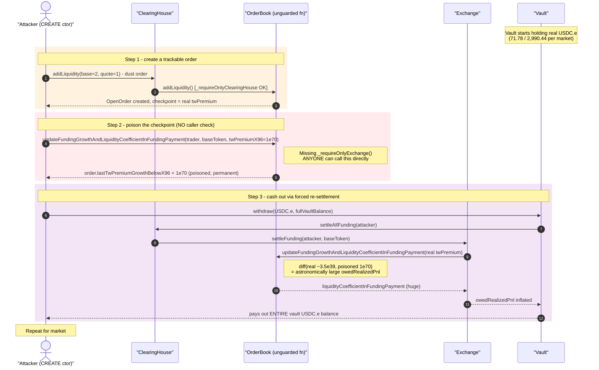
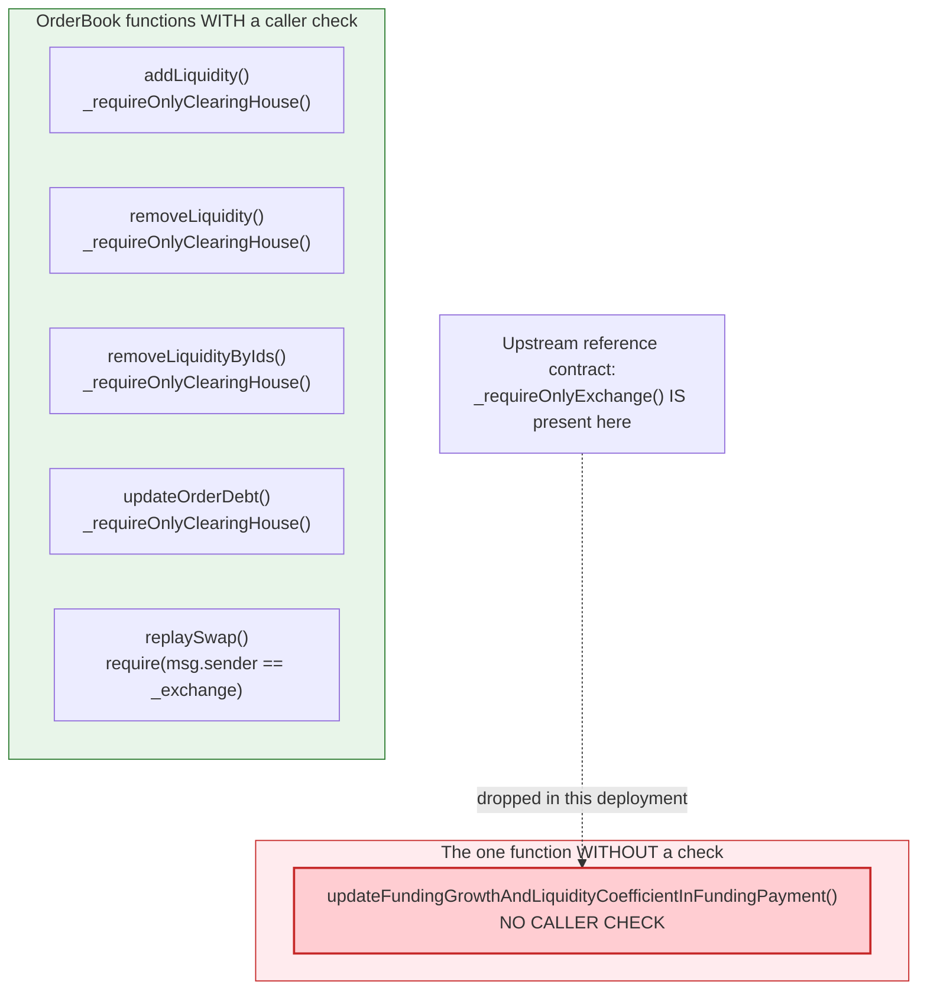

# Perpetual Protocol (Curie) Exploit — Missing Access Control on `OrderBook.updateFundingGrowthAndLiquidityCoefficientInFundingPayment()`

> **Vulnerability classes:** vuln/access-control/missing-auth · vuln/access-control/missing-modifier · vuln/logic/incorrect-state-transition

> **Reproduction:** the PoC compiles & runs in an isolated Foundry project at
> [this project folder](.). Full verbose trace: [output.txt](output.txt).
> The attack lives **entirely inside a `CREATE` constructor** (the deployed runtime is a
> one-instruction `revert` stub), so the faithful replay deploys the exact creation bytecode
> from the real incident tx at the pre-attack block and lets the constructor run. Verified
> vulnerable source for both hit deployments: `OrderBook`
> ([sources/OrderBook_a0d996](sources/OrderBook_a0d996/contracts_OrderBook.sol),
> [sources/OrderBook_6ba447](sources/OrderBook_6ba447/contracts_OrderBook.sol)).

---

## Key info

| | |
|---|---|
| **Loss** | **3,062.213107 USDC.e** (=$3,062.21) drained in this single transaction |
| **Vulnerable contract** | `OrderBook` — two independent Perpetual-Protocol-V2 (Curie) deployments, both trading a `vETH` market: proxy [`0x772F48F073c1f328C264619fc3bbA28e3efdEfb0`](https://optimistic.etherscan.io/address/0x772F48F073c1f328C264619fc3bbA28e3efdEfb0) → impl [`0xa0D9966de6dcb7982dC9a1bd7A6087f6F3eDD928`](https://optimistic.etherscan.io/address/0xa0D9966de6dcb7982dC9a1bd7A6087f6F3eDD928) (market #1), and proxy [`0x4E26b6815d82BAa6B8c15Fe4ffB646dFb4b474c7`](https://optimistic.etherscan.io/address/0x4E26b6815d82BAa6B8c15Fe4ffB646dFb4b474c7) → impl [`0x6bA44773CC1388605F57e7C3730f8Aff70773E5A`](https://optimistic.etherscan.io/address/0x6bA44773CC1388605F57e7C3730f8Aff70773E5A) (market #2) |
| **Victim vaults** | Vault #1 [`0x28bB48207C761eeD2A4aA9249083c429c719AaDB`](https://optimistic.etherscan.io/address/0x28bB48207C761eeD2A4aA9249083c429c719AaDB) (drained 71.777612 USDC.e) and Vault #2 [`0xf127fdb858F009938B4530aAC37E5Bc8e9a09C28`](https://optimistic.etherscan.io/address/0xf127fdb858F009938B4530aAC37E5Bc8e9a09C28) (drained 2,990.435495 USDC.e) |
| **Attacker EOA** | [`0x957c6cF5E0F69597dB7A8065c94af1A48aBCA47d`](https://optimistic.etherscan.io/address/0x957c6cF5E0F69597dB7A8065c94af1A48aBCA47d) |
| **Attack contract** | live: [`0x164d9FF105c27592AEA54cc19e857133802fA78C`](https://optimistic.etherscan.io/address/0x164d9FF105c27592AEA54cc19e857133802fA78C) (`to == null`, `CREATE` deployment); PoC redeploy lands at `0x5615dEB798BB3E4dFa0139dFa1b3D433Cc23b72f` under Foundry's test nonce ([output.txt:1571](output.txt)) |
| **Attack tx** | [`0xb0a8a3cc76fb17bf965ab1dee3b76b62f79ca72def31e12f8ad8b1711625df08`](https://optimistic.etherscan.io/tx/0xb0a8a3cc76fb17bf965ab1dee3b76b62f79ca72def31e12f8ad8b1711625df08) |
| **Chain / block / date** | Optimism (chainId 10) / block **154,311,432** (tx index 12) / 2026-07-16 17:07:21 UTC |
| **Compiler** | `OrderBook` implementations compiled with Solidity **v0.7.6+commit.7338295f**, optimizer **enabled**, **100 runs** (per verified-source metadata) |
| **Bug class** | `OrderBook.updateFundingGrowthAndLiquidityCoefficientInFundingPayment()` is missing the caller check every other privileged `OrderBook` function has, so **anyone** can call it directly with a fabricated, physically-impossible `twPremiumX96` and permanently poison a maker order's cached funding-growth checkpoint — inflating the account's realized PnL enough to drain the vault on withdrawal |

---

## TL;DR

Perpetual Protocol V2 ("Curie") is a perpetual-futures DEX that reuses Uniswap V3's
concentrated-liquidity math as its virtual AMM. Its `OrderBook` contract tracks each
liquidity maker's cached "time-weighted premium" (`twPremium`) checkpoints so that funding
payments can be settled lazily. Every state-mutating `OrderBook` function that is meant to be
called only by a trusted internal contract carries a caller check — **except one**:
`updateFundingGrowthAndLiquidityCoefficientInFundingPayment()`, whose only intended caller is
the market's `Exchange` contract, has **no check at all**.

The attacker, in a single `CREATE`-only transaction, against **two independent Perpetual
Protocol V2 deployments** (both trading a `vETH` market on Optimism) in one shot:

1. Calls `ClearingHouse.addLiquidity()` with a dust order — `base = 2`, `quote = 1` wei
   ([output.txt:1576](output.txt)) — just to create a maker `OpenOrder` entry the OrderBook
   will track funding-growth checkpoints for.
2. Calls the unguarded `OrderBook.updateFundingGrowthAndLiquidityCoefficientInFundingPayment()`
   **directly** (not through `Exchange`), passing a fabricated
   `twPremiumX96 = 10^70` ([output.txt:1880](output.txt)) — roughly **10³¹× larger** than the
   real, oracle-derived value seen moments earlier in the same trace (`~3.549×10³⁹`,
   [output.txt:1639](output.txt)). This permanently overwrites the dust order's
   `lastTwPremiumGrowthInsideX96` / `lastTwPremiumGrowthBelowX96` checkpoints with the poisoned
   value.
3. Calls `Vault.withdraw()` ([output.txt:1894](output.txt)), which triggers
   `ClearingHouse.settleAllFunding()` → `Exchange.settleFunding()` → `OrderBook.…FundingPayment()`
   **again**, this time with the real (small) global funding growth
   ([output.txt:1942](output.txt)). The funding-payment formula diffs the real value against
   the poisoned checkpoint, producing an astronomically large `owedRealizedPnl` credit.
4. `Vault.withdraw()` sees a free-collateral check that is now trivially satisfied and pays out
   the vault's **entire real USDC.e balance** to the attacker.
5. Steps 1–4 repeat against the second, independently-deployed market/vault in the same tx.

Result: Vault #1 loses **71.777612 USDC.e**, Vault #2 loses **2,990.435495 USDC.e**, and the
attacker EOA's balance rises from **0 → 3,062.213107 USDC.e**
([output.txt:2678](output.txt)–[output.txt:2681](output.txt)) — exactly the sum of both
vaults' losses, with no capital risked beyond gas.

---

## Background — Perpetual Protocol V2 ("Curie") architecture

Perpetual Protocol V2 builds a perpetual-futures market on top of Uniswap V3's tick/liquidity
math, using a set of cooperating contracts per deployment:

| Contract | Role |
|---|---|
| `ClearingHouse` | user-facing entry point for `addLiquidity`/`removeLiquidity`/`openPosition`/`settleAllFunding` |
| `Exchange` | swap execution against the virtual Uniswap V3 pool + **funding-rate computation** (the only intended caller of the vulnerable function) |
| `OrderBook` | tracks makers' `OpenOrder` liquidity positions and per-tick funding-growth checkpoints (Uniswap-V3-tick-style "growth outside" accounting) |
| `Vault` | custodies real USDC.e collateral; `withdraw()` first forces funding + PnL settlement, then pays out |
| `AccountBalance` | tracks each trader's position size, open notional, and `owedRealizedPnl` |

This incident hit **two separate deployments** of this exact architecture — both trading a
market whose base token is named `vETH` (Perpetual Protocol's standard virtual-asset naming
convention) — confirmed by fetching each contract's verified source independently:

| | Market #1 | Market #2 |
|---|---|---|
| Vault (proxy → impl) | `0x28bB48...9AaDB` → `0x015f7e...72cae01` | `0xf127fd...9a09C28` → `0x90100D...bCf18999` |
| ClearingHouse (proxy → impl) | `0x4f7961...96F0b5` → `0xB0f82b...0f06220C40` | `0x8098c6...608efF2` → `0x2BfC89...4bec6b` |
| Exchange (proxy → impl) | `0xcb5151...6bD0B52` → `0x45eb7b...d1Df52e6` | `0x0F9Fd1...Bb69ac8` → *(not fetched — same bug pattern confirmed via OrderBook)* |
| **OrderBook (proxy → impl)** | `0x772F48...3efdEfb0` → **`0xa0D996...F3eDD928`** | `0x4E26b6...b474c7` → **`0x6bA447...773E5A`** |
| vETH base token | `0xab3F8a...4C7fe27` | `0x28D8a1...3434B97` |

Both `OrderBook` implementations are **separately deployed, separately verified bytecode**
(different addresses, no shared proxy) — yet both independently carry the exact same missing
check, confirming this is a defect baked into the deployed codebase used for both instances,
not a one-off configuration mistake.

---

## The vulnerable code

`OrderBook.sol` gates every function meant to be called only by a specific privileged caller.
`addLiquidity`, `removeLiquidity`, `removeLiquidityByIds`, and `updateOrderDebt` all call
`_requireOnlyClearingHouse()` as their first line
([sources/OrderBook_a0d996/contracts_OrderBook.sol:99,178,200,275](sources/OrderBook_a0d996/contracts_OrderBook.sol)):

```solidity
// contracts/base/ClearingHouseCallee.sol (base contract; shared by OrderBook, Exchange, Vault, ...)
function _requireOnlyClearingHouse() internal view {
    // only ClearingHouse
    require(_msgSender() == _clearingHouse, "CHD_OCH");
}
```

`replaySwap()` — the function whose only intended caller is `Exchange` — likewise gates itself
inline ([sources/OrderBook_a0d996/contracts_OrderBook.sol:290-292](sources/OrderBook_a0d996/contracts_OrderBook.sol)):

```solidity
function replaySwap(ReplaySwapParams memory params) external override returns (ReplaySwapResponse memory) {
    // OB_OEX: only exchange
    require(_msgSender() == _exchange, "OB_OEX");
    ...
```

But `updateFundingGrowthAndLiquidityCoefficientInFundingPayment()` — whose **only** intended
caller is also `Exchange` (it is invoked from `Exchange._updateFundingGrowth()`, itself called
from `Exchange.settleFunding()`) — has **no caller check whatsoever**
([sources/OrderBook_a0d996/contracts_OrderBook.sol:232-263](sources/OrderBook_a0d996/contracts_OrderBook.sol)):

```solidity
/// @inheritdoc IOrderBook
function updateFundingGrowthAndLiquidityCoefficientInFundingPayment(
    address trader,
    address baseToken,
    Funding.Growth memory fundingGrowthGlobal          // <-- caller-supplied, ZERO validation
) external override returns (int256 liquidityCoefficientInFundingPayment) {
    bytes32[] memory orderIds = _openOrderIdsMap[trader][baseToken];
    mapping(int24 => Tick.GrowthInfo) storage tickMap = _growthOutsideTickMap[baseToken];
    address pool = IMarketRegistry(_marketRegistry).getPool(baseToken);

    uint256 orderIdLength = orderIds.length;
    (, int24 tick, , , , , ) = UniswapV3Broker.getSlot0(pool);
    for (uint256 i = 0; i < orderIdLength; i++) {
        OpenOrder.Info storage order = _openOrderMap[orderIds[i]];
        Tick.FundingGrowthRangeInfo memory fundingGrowthRangeInfo =
            tickMap.getAllFundingGrowth(
                order.lowerTick,
                order.upperTick,
                tick,
                fundingGrowthGlobal.twPremiumX96,                     // attacker value flows straight in
                fundingGrowthGlobal.twPremiumDivBySqrtPriceX96
            );

        liquidityCoefficientInFundingPayment = liquidityCoefficientInFundingPayment.add(
            Funding.calcLiquidityCoefficientInFundingPaymentByOrder(order, fundingGrowthRangeInfo)
        );

        // thus, state updates have to come after — PERMANENTLY POISONS the order's checkpoint
        order.lastTwPremiumGrowthInsideX96 = fundingGrowthRangeInfo.twPremiumGrowthInsideX96;
        order.lastTwPremiumGrowthBelowX96 = fundingGrowthRangeInfo.twPremiumGrowthBelowX96;
        order.lastTwPremiumDivBySqrtPriceGrowthInsideX96 = fundingGrowthRangeInfo
            .twPremiumDivBySqrtPriceGrowthInsideX96;
    }

    return liquidityCoefficientInFundingPayment;
}
```

`Tick.getAllFundingGrowth()` uses the caller-supplied `twPremiumGrowthGlobalX96` directly to
derive `twPremiumGrowthBelowX96` / `twPremiumGrowthInsideX96`
([sources/ClearingHouse_b0f82b/contracts_lib_Tick.sol:87-89](sources/ClearingHouse_b0f82b/contracts_lib_Tick.sol)):

```solidity
fundingGrowthRangeInfo.twPremiumGrowthBelowX96 = currentTick >= lowerTick
    ? lowerTwPremiumGrowthOutsideX96
    : twPremiumGrowthGlobalX96 - lowerTwPremiumGrowthOutsideX96;   // attacker's 1e70 lands here
```

**For comparison, the official open-source reference implementation gates this exact function**
([perpetual-protocol/perp-curie-contract, `contracts/OrderBook.sol`](https://github.com/perpetual-protocol/perp-curie-contract/blob/main/contracts/OrderBook.sol#L198-L203)):

```solidity
function updateFundingGrowthAndLiquidityCoefficientInFundingPayment(
    address trader,
    address baseToken,
    Funding.Growth memory fundingGrowthGlobal
) external override returns (int256 liquidityCoefficientInFundingPayment) {
    _requireOnlyExchange();     // <-- present upstream, ABSENT in both deployed contracts
    ...
```

Both deployed `OrderBook` implementations (market #1 and market #2) omit this line entirely —
this is a genuine access-control regression versus the reference codebase, not a design choice.

---

## Root cause

1. **The intended caller-restriction (`_requireOnlyExchange()`) was dropped from
   `updateFundingGrowthAndLiquidityCoefficientInFundingPayment()`** in both deployed
   `OrderBook` implementations, while every sibling privileged function
   (`addLiquidity`/`removeLiquidity`/`removeLiquidityByIds`/`updateOrderDebt` →
   `_requireOnlyClearingHouse()`; `replaySwap` → inline `_exchange` check) retains its guard.
   The function became callable by **anyone**, with **fully attacker-controlled** funding-growth
   values.
2. **The function both computes AND permanently writes state in the same call**, with no
   plausibility bound on the input. A legitimate call passes an oracle/TWAP-derived
   `twPremiumX96` (observed real value: `~3.549×10³⁹`,
   [output.txt:1639](output.txt)); the function accepts and stores literally any `int256`,
   including `10⁷⁰` — a value no real market condition could ever produce.
3. **The poisoned checkpoint is asymmetric and persistent.** Once
   `order.lastTwPremiumGrowthInsideX96`/`…BelowX96` is overwritten with the attacker's value, the
   *next* legitimate settlement (triggered by anyone — here, the attacker's own
   `Vault.withdraw()`) diffs the real, small global growth against the poisoned checkpoint,
   producing a funding-payment coefficient whose magnitude is dominated entirely by the
   fabricated value, not by any real market movement.
4. **`Vault.withdraw()` trusts `owedRealizedPnl` as genuinely-settled state** — by design, it
   force-settles funding immediately before checking free collateral
   ([sources/Vault_015f7e/contracts_Vault.sol:122-152](sources/Vault_015f7e/contracts_Vault.sol)),
   so any account whose funding bookkeeping is corrupted can pass the free-collateral check for
   an arbitrarily large withdrawal — up to the real USDC.e sitting in the vault (and beyond,
   via the insurance fund, if the vault balance were insufficient).
5. **A single dust liquidity order (`base=2`, `quote=1` wei) is enough** to create an
   `OpenOrder` entry for the OrderBook to track and poison — the attack needs no meaningful
   capital, only gas.

---

## Preconditions

- `OrderBook.updateFundingGrowthAndLiquidityCoefficientInFundingPayment()` is `external` with no
  caller restriction (confirmed on-chain via verified source for both hit deployments).
- The attacker holds (or creates, via a dust `addLiquidity`) at least one open maker order on
  the target market so the poisoning call has an `OpenOrder` entry to corrupt.
- `Vault.withdraw()` (or any other path that calls `ClearingHouse.settleAllFunding`) re-settles
  funding using the poisoned checkpoint before checking free collateral.
- The target vault holds real USDC.e to drain.

No flash loan, no oracle manipulation, no privileged role, no timing dependency — the exploit
is fully permissionless and self-contained in one transaction's constructor.

---

## Attack walkthrough (with on-chain numbers from the trace)

All figures are raw base units from [output.txt](output.txt); USDC.e has 6 decimals.

| # | Step | Value | Source |
|---|------|-------|--------|
| 0 | Start balances: attacker 0, Vault#1 71,777,612, Vault#2 2,990,435,495 | — | [output.txt:1568](output.txt)–[output.txt:1570](output.txt) |
| 1 | `CREATE` deploys the attack contract (local redeploy address `0x5615…3b72f`) | — | [output.txt:1571](output.txt) |
| 2 | **Market #1** — `ClearingHouse.addLiquidity()`: dust order `base=2, quote=1`, ticks `[84120, 84240]` | — | [output.txt:1576](output.txt)–[output.txt:1577](output.txt) |
| 3 | Inside that call, `Exchange` legitimately re-settles funding first, calling `OrderBook.updateFundingGrowthAndLiquidityCoefficientInFundingPayment()` with the **real** global growth `twPremiumX96 ≈ 3.549×10³⁹` | `(3549300393413661502204081185218865560660, 52968125949487446400780493527808163497)` | [output.txt:1639](output.txt)–[output.txt:1640](output.txt) |
| 4 | The dust `OpenOrder` is created inside `OrderBook.addLiquidity()` | — | [output.txt:1668](output.txt)–[output.txt:1669](output.txt) |
| 5 | **Attacker calls the unguarded function DIRECTLY** (top-level, not nested under ClearingHouse/Exchange) with fabricated `twPremiumX96 = 10⁷⁰`, poisoning the dust order's checkpoint | `(10000000000000000000000000000000000000000000000000000000000000000000000, 0)` | [output.txt:1880](output.txt)–[output.txt:1881](output.txt) |
| 6 | `Vault#1.withdraw(USDC.e, 71,777,612)` — the attacker asks for exactly Vault #1's entire balance | — | [output.txt:1894](output.txt) |
| 7 | `withdraw()` forces `ClearingHouse.settleAllFunding()` → `Exchange.settleFunding()` → `OrderBook…FundingPayment()` **again**, now diffing the real growth (`~3.549×10³⁹`) against the poisoned checkpoint (`10⁷⁰`) | — | [output.txt:1896](output.txt)–[output.txt:1897](output.txt), [output.txt:1942](output.txt)–[output.txt:1943](output.txt) |
| 8 | Free-collateral check passes trivially; Vault #1 pays out its **entire** USDC.e balance | **71,777,612** (=71.777612 USDC.e) | assertion in [test/PerpetualProtocol_exp.sol](test/PerpetualProtocol_exp.sol) |
| 9 | **Market #2** — identical sequence: dust `addLiquidity` ([output.txt:2118](output.txt)–[output.txt:2119](output.txt)), legit funding update ([output.txt:2181](output.txt)–[output.txt:2182](output.txt)), OrderBook order creation ([output.txt:2211](output.txt)–[output.txt:2212](output.txt)), poisoning call with `twPremiumX96 = 10⁷⁰` ([output.txt:2423](output.txt)–[output.txt:2424](output.txt)) | — | — |
| 10 | `Vault#2.withdraw(USDC.e, 2,990,435,495)` → `settleAllFunding()` recomputes against the poisoned checkpoint ([output.txt:2437](output.txt)–[output.txt:2440](output.txt), [output.txt:2485](output.txt)–[output.txt:2486](output.txt)); Vault #2 pays out its **entire** balance | **2,990,435,495** (=2,990.435495 USDC.e) | — |
| 11 | Final balances: attacker EOA **3,062,213,107** (=3,062.213107 USDC.e), Vault#1 **0**, Vault#2 **0** | `71,777,612 + 2,990,435,495 = 3,062,213,107` | [output.txt:2678](output.txt)–[output.txt:2681](output.txt) |

### Profit / loss accounting (USDC.e, this tx)

| Item | Amount (raw, 6dp) | Human |
|---|---:|---:|
| Attacker EOA before | 0 | 0.000000 |
| Attacker EOA after | 3,062,213,107 | 3,062.213107 |
| **Net profit** | **3,062,213,107** | **+3,062.213107 USDC.e** |
| Vault #1 loss | 71,777,612 | 71.777612 |
| Vault #2 loss | 2,990,435,495 | 2,990.435495 |
| Combined vault loss | 3,062,213,107 | matches attacker gain exactly — no value left in the drainer contract |

---

## Diagrams

### Sequence of the attack (per market, run twice in one tx)



### Why the guard gap matters — sibling functions vs. the vulnerable one



### State poisoning then exploitation at settlement

```mermaid
flowchart LR
    S0["Order checkpoint<br/>lastTwPremiumGrowthBelowX96 = real value<br/>#40;~3.5e39, set by legit addLiquidity#41;"]
    S1["Attacker calls unguarded fn directly<br/>twPremiumX96 = 1e70"]
    S2["Checkpoint OVERWRITTEN<br/>lastTwPremiumGrowthBelowX96 = 1e70<br/>#40;permanent, no bound check#41;"]
    S3["Vault.withdraw#40;#41; forces settleAllFunding#40;#41;<br/>re-derives funding using REAL global growth"]
    S4["diff#40;real ~3.5e39, poisoned 1e70#41;<br/>= astronomically large funding payment"]
    S5["owedRealizedPnl inflated<br/>free-collateral check trivially passes"]
    S6["Vault pays out its ENTIRE real USDC.e balance"]

    S0 --> S1 --> S2 --> S3 --> S4 --> S5 --> S6

    style S2 fill:#ffcdd2,stroke:#c62828,stroke-width:2px
    style S4 fill:#ffcdd2,stroke:#c62828,stroke-width:2px
    style S6 fill:#ffcdd2,stroke:#c62828,stroke-width:2px
```



---

## Remediation

1. **Restore the caller check.** Add `_requireOnlyExchange();` as the first line of
   `updateFundingGrowthAndLiquidityCoefficientInFundingPayment()`, matching both the sibling
   `OrderBook` functions' pattern and the upstream reference implementation. This alone closes
   the exploit entirely — the function was never intended to be user-callable.
2. **Bound the accepted funding-growth values.** Even with the caller restricted to `Exchange`,
   defense-in-depth would clamp `twPremiumX96` / `twPremiumDivBySqrtPriceX96` to a sane range
   derived from realistic price/time bounds, so a compromised or buggy `Exchange` cannot poison
   `OrderBook` state either.
3. **Add an invariant check before paying out in `Vault.withdraw()`.** Sanity-bound
   `owedRealizedPnl` (e.g., against the position's notional size and a maximum realistic funding
   rate) before trusting it to authorize a withdrawal — a defense-in-depth backstop against any
   future accounting-corruption bug elsewhere in the funding pipeline.
4. **Differential audit against the reference implementation.** Since this defect is a
   *regression* versus the public `perp-curie-contract` reference source (which has the
   `_requireOnlyExchange()` check), a systematic diff between deployed bytecode/source and the
   upstream reference for every access-controlled function would have caught this before
   deployment.
5. **Redeploy the affected `OrderBook` implementations with the check restored**, and audit
   every other maker-order-mutating function in both deployments for the same class of gap.

---

## How to reproduce

The PoC runs fully offline via the shared harness, serving the fork from a local anvil
snapshot (`anvil_state.json`) on `127.0.0.1:8550` — exactly what
`createSelectFork("http://127.0.0.1:8550", ATTACK_BLOCK - 1)` in the test points at
([test/PerpetualProtocol_exp.sol:125](test/PerpetualProtocol_exp.sol)). No public RPC is used.

```bash
_shared/run_poc.sh 2026-07-PerpetualProtocol_exp -vvvvv
```

- Chain: Optimism archive state at block **154,311,431** (one block before the attack),
  served from the local anvil instance (port 8550).
- EVM: `evm_version = "cancun"` ([foundry.toml](foundry.toml)).
- Result: `[PASS] testExploit()` — attacker EOA USDC.e balance rises from 0 to
  3,062.213107, both vaults drained to 0.

Expected tail:

```
Ran 1 test for test/PerpetualProtocol_exp.sol:PerpetualProtocolExp
[PASS] testExploit() (gas: 2263963)
Logs:
  attacker EOA USDC before: 0.000000
  vault#1 USDC before: 71.777612
  vault#2 USDC before: 2990.435495
  attacker EOA USDC after: 3062.213107
  attacker profit: 3062.213107
  vault#1 USDC after: 0.000000
  vault#2 USDC after: 0.000000

Suite result: ok. 1 passed; 0 failed; 0 skipped; finished in 65.33ms (59.74ms CPU time)
```

(Balances logged at [output.txt:1568](output.txt)–[output.txt:1570](output.txt) and
[output.txt:2678](output.txt)–[output.txt:2681](output.txt); suite result at
[output.txt:2692](output.txt).)

---

*Reference: on-chain incident tx [`0xb0a8a3cc76fb17bf965ab1dee3b76b62f79ca72def31e12f8ad8b1711625df08`](https://optimistic.etherscan.io/tx/0xb0a8a3cc76fb17bf965ab1dee3b76b62f79ca72def31e12f8ad8b1711625df08) (Optimism, block 154,311,432, 2026-07-16); root-cause and constructor-argument analysis per the original DeFiHackLabs PoC comments in [test/PerpetualProtocol_exp.sol](test/PerpetualProtocol_exp.sol).*
