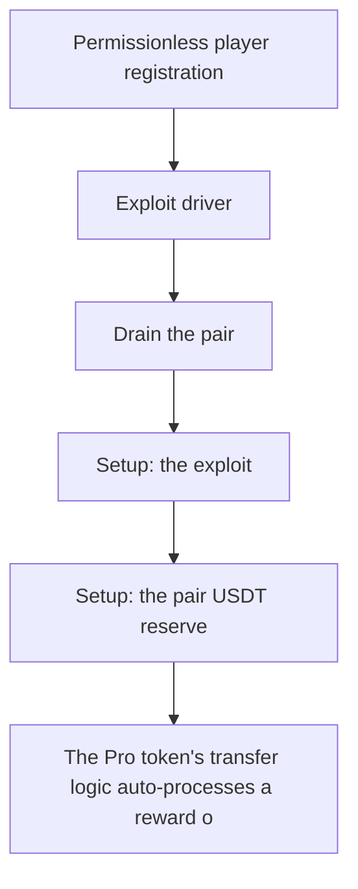

# Pro Token: transfer-hook reward-swap self-dealing drains the pair

<!-- source-defihacklabs: https://github.com/SunWeb3Sec/DeFiHackLabs/pull/1209 (ProToken_exp.sol) -->
<!-- defihacklabs-sol: https://github.com/SunWeb3Sec/DeFiHackLabs/blob/main/src/test/2026-07/ProToken_exp.sol -->

> **Vulnerability classes:** vuln/logic · vuln/access-control

> **Reproduction:** a self-contained, faithful reconstruction of the incident's core
> bug — local deploy, **no fork** — both gates green (registry `forge test` PASS +
> browser Playground `VERDICT: PASS`). Basis: [DeFiHackLabs PR #1209](https://github.com/SunWeb3Sec/DeFiHackLabs/pull/1209)
> ([`ProToken_exp.sol`](https://github.com/SunWeb3Sec/DeFiHackLabs/blob/main/src/test/2026-07/ProToken_exp.sol), the upstream fork replay).

---

## Key info

| | |
|---|---|
| **Loss** | ~605K USDT (~$8.2M cumulative) |
| **Chain** | BNB Chain |
| **Vulnerable contract** | `0xce01759b…` (Finding #2026: ProToken) |
| **Bug class** | Finding #2026: ProToken |

---

## Root cause

The Pro token's transfer logic auto-processes a reward on transfers involving a registered player: it swaps Pro into USDT through the USDT/Pro pair and forwards that USDT straight to an attacker-controlled winner address. By looping a dust Pro transfer out of an attacker player clone, the helper repeatedly triggers the reward swap, each pass shipping USDT out of the pair to the attacker until the pair's USDT reserve is drained (~605K USDT per tx; ~$8.2M cumulative over ~13 txs). Any address can register as a player and drive the loop - nothing is privileged.

```solidity
    // @> VULN: a player transfer auto-triggers a reward swap that ships USDT from
```

## Why it's exploitable here

The Pro token's transfer logic auto-processes a reward on transfers involving a registered player: it swaps Pro into USDT through the USDT/Pro pair and forwards that USDT straight to an attacker-controlled winner address. By looping a dust Pro transfer out of an attacker player clone, the helper repeatedly triggers the reward swap, each pass shipping USDT out of the pair to the attacker until the pair's USDT reserve is drained (~605K USDT per tx; ~$8.2M cumulative over ~13 txs). Any address can register as a player and drive the loop - nothing is privileged.

## Attack path



## Marked-line walkthrough (Playground)

The EVM Playground pins each step to the exact executed source line:

1. **L74** — Permissionless player registration: Root cause: any address can register as a player; a player transfer then auto-triggers a reward that swaps Pro into USDT and forwards it to an attacker-controlled winner.
2. **L94** — Exploit driver: The reproduction registers the attacker as both player and winner and loops dust transfers.
3. **L95** — Drain the pair: Each looped player transfer ships USDT out of the pair to the attacker until it is drained.
4. **L97** — Setup: the exploit: Setup: the exploit deploys USDT, the pair and the Pro token.
5. **L98** — Setup: the pair USDT reserve: Setup: the USDT/Pro pair holds ~700K USDT, the reserve the reward swaps drain.
6. **L100** — Setup: reward size per pass: Setup: each reward pass sells a fixed slice of Pro into the pair for USDT.
7. **L101** — Setup: the loop count: Setup: ~13 on-chain txs are modelled as one looped tx of reward passes.

## PoC

Registry (Foundry, local deploy — faithful reconstruction + harm-asserting test):

```bash
cd 2026-07-ProToken_exp
forge test -vvv
```

The browser Playground replays the same synthetic opcode-for-opcode and measures the
harm. Both gates are green (registry `forge test` PASS + Playground `_verify-poc`
**VERDICT: PASS**).

## Sources

- **Basis / upstream PoC:** [DeFiHackLabs PR #1209 — ProToken_exp.sol](https://github.com/SunWeb3Sec/DeFiHackLabs/blob/main/src/test/2026-07/ProToken_exp.sol) (fork replay of the on-chain tx).
- DeFiHackLabs incident collection: [SunWeb3Sec/DeFiHackLabs](https://github.com/SunWeb3Sec/DeFiHackLabs).
