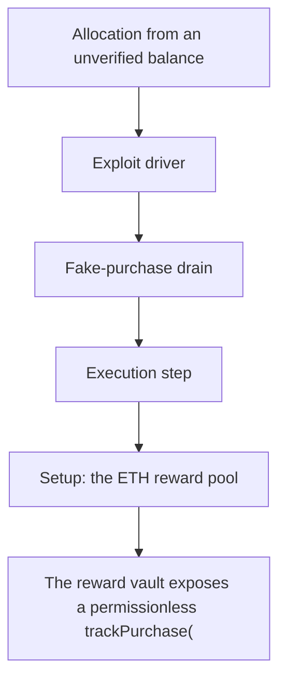

# Projekt Reward Vault: fake-purchase allocation from an unverified balance delta

<!-- source-defihacklabs: https://github.com/SunWeb3Sec/DeFiHackLabs/pull/1209 (ProjektRewardVault_exp.sol) -->
<!-- defihacklabs-sol: https://github.com/SunWeb3Sec/DeFiHackLabs/blob/main/src/test/2026-07/ProjektRewardVault_exp.sol -->

> **Vulnerability classes:** vuln/logic · vuln/access-control

> **Reproduction:** a self-contained, faithful reconstruction of the incident's core
> bug — local deploy, **no fork** — both gates green (registry `forge test` PASS +
> browser Playground `VERDICT: PASS`). Basis: [DeFiHackLabs PR #1209](https://github.com/SunWeb3Sec/DeFiHackLabs/pull/1209)
> ([`ProjektRewardVault_exp.sol`](https://github.com/SunWeb3Sec/DeFiHackLabs/blob/main/src/test/2026-07/ProjektRewardVault_exp.sol), the upstream fork replay).

---

## Key info

| | |
|---|---|
| **Loss** | ~301.7 ETH |
| **Chain** | Ethereum |
| **Vulnerable contract** | `0xce01759b…` (Finding #2026: RewardVault) |
| **Bug class** | Finding #2026: RewardVault |

---

## Root cause

The reward vault exposes a permissionless trackPurchase(buyer) that credits an ETH allocation sized from the buyer's memecoin token-balance DELTA, but never checks that any real ETH was spent to acquire those tokens. The attacker manufactures a large balance delta for free (flash-borrow WETH, push it through Uniswap V2 memecoin pairs and skim the tokens back), calls trackPurchase to register the inflated allocation, then massWithdraw() pays it out - draining 301.70468 ETH from the vault's reward pool.

```solidity
    // @> VULN: permissionless. Credits an ETH allocation from the buyer's memecoin
```

## Why it's exploitable here

The reward vault exposes a permissionless trackPurchase(buyer) that credits an ETH allocation sized from the buyer's memecoin token-balance DELTA, but never checks that any real ETH was spent to acquire those tokens. The attacker manufactures a large balance delta for free (flash-borrow WETH, push it through Uniswap V2 memecoin pairs and skim the tokens back), calls trackPurchase to register the inflated allocation, then massWithdraw() pays it out - draining 301.70468 ETH from the vault's reward pool.

## Attack path



## Marked-line walkthrough (Playground)

The EVM Playground pins each step to the exact executed source line:

1. **L54** — Allocation from an unverified balance: Root cause: trackPurchase credits an ETH allocation from the buyer's memecoin balance DELTA, with no proof that any ETH was ever paid to acquire the tokens.
2. **L68** — Exploit driver: The reproduction manufactures a free memecoin balance and redeems it as a fake purchase.
3. **L70** — Fake-purchase drain: The attacker registers the inflated allocation, then massWithdraw() pays out the ETH reward pool.
4. **L71** — Execution step: The reward vault exposes a permissionless trackPurchase(buyer) that credits an ETH allocation sized from the buyer's memecoin token-balance DELTA, but never checks that any real ETH was spent to acquire those tokens. The attacker manufactures a large balance delta for free (flash-borrow WETH, push it through Uniswap V2 memecoin pairs and skim the tokens back), calls trackPurchase to register the inflated allocation, then massWithdraw() pays it out - draining 301.70468 ETH from the vault's reward pool.
5. **L73** — Setup: the ETH reward pool: Setup: the vault's ~400 ETH reward pool (modelled as WETH) is the drained asset.
6. **L76** — Setup: WETH is the reward asset: Setup: WETH stands in for the vault's ETH reward pool.
7. **L77** — Setup: the manufactured token: Setup: the memecoin whose balance delta the vault trusts as a 'purchase'.

## PoC

Registry (Foundry, local deploy — faithful reconstruction + harm-asserting test):

```bash
cd 2026-07-ProjektRewardVault_exp
forge test -vvv
```

The browser Playground replays the same synthetic opcode-for-opcode and measures the
harm. Both gates are green (registry `forge test` PASS + Playground `_verify-poc`
**VERDICT: PASS**).

## Sources

- **Basis / upstream PoC:** [DeFiHackLabs PR #1209 — ProjektRewardVault_exp.sol](https://github.com/SunWeb3Sec/DeFiHackLabs/blob/main/src/test/2026-07/ProjektRewardVault_exp.sol) (fork replay of the on-chain tx).
- DeFiHackLabs incident collection: [SunWeb3Sec/DeFiHackLabs](https://github.com/SunWeb3Sec/DeFiHackLabs).
