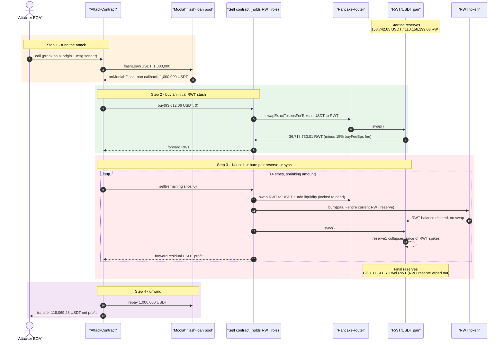
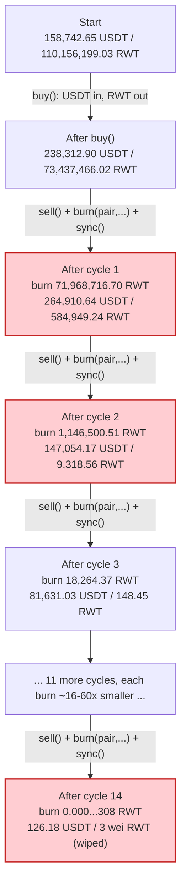
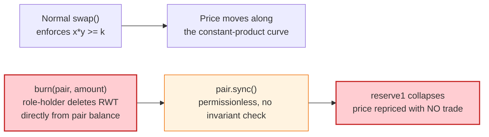

# RWT Token Exploit — Owner-Gated `burn()` Lets a Role-Holder Delete an AMM Pair's Own Reserve

> **Vulnerability classes:** vuln/oracle/price-manipulation · vuln/access-control/broken-logic · vuln/logic/incorrect-state-transition

> **Reproduction:** the PoC compiles & runs fully offline in an isolated Foundry project at
> [this project folder](.). Full verbose trace: [output.txt](output.txt).
> Verified vulnerable source: the RWT token
> ([sources/RWT_f8A367/RWT_RWT.sol](sources/RWT_f8A367/RWT_RWT.sol)) and the standard
> PancakeSwap V2 pair ([sources/PancakePair_C1c2ef/PancakePair.sol](sources/PancakePair_C1c2ef/PancakePair.sol))
> are both verified on BscScan. The attack contract and the "sell" contract that actually calls
> `burn()` are **unverified** — their exact internal logic below is reconstructed from the observed
> on-chain trace, and is labelled as such.

---

## Key info

| | |
|---|---|
| **Loss** | ~118,069.28 USDT extracted in this reproduction (`assertApproxEqAbs` target ~118,000 USDT); the RWT/USDT pair's USDT reserve dropped **158,616.47 USDT** and its RWT reserve was collapsed from ~110.16M down to **3 wei** (functionally zero) |
| **Vulnerable contract** | RWT token — [`0xf8A36777415C09fEAfF3dC78DcBb3ed00ce989Cd`](https://bscscan.com/token/0xf8A36777415C09fEAfF3dC78DcBb3ed00ce989Cd#code) (verified); its `burn(address,uint256)` is `onlyOwner`-gated but the "owner" check is really a multi-address `role` mapping that can be handed out to any contract |
| **Victim pool** | RWT/USDT PancakeSwap V2 pair — [`0xC1c2ef25372f12CE18d35044446064B720C4aA27`](https://bscscan.com/address/0xC1c2ef25372f12CE18d35044446064B720C4aA27) |
| **Attacker EOA** | [`0x84DD3A5D4DE44c8ad0CE032BeAb8bc3f01D1dcf7`](https://bscscan.com/address/0x84DD3A5D4DE44c8ad0CE032BeAb8bc3f01D1dcf7) |
| **Attack contract** | [`0x7ed953Ff42509568f620aa340a33A9373447f4CE`](https://bscscan.com/address/0x7ed953Ff42509568f620aa340a33A9373447f4CE) (unverified) |
| **Role-holding "sell" contract** | [`0x8812bB5fB89D69D35Ac84D2C37B55769395b9f90`](https://bscscan.com/address/0x8812bB5fB89D69D35Ac84D2C37B55769395b9f90) (unverified; holds the RWT `role` that authorizes `burn()`) |
| **Attack tx** | [`0x22300140e7c44899c2602382a6e7a4a34a70f47f9736721744bc6434c07171dc`](https://bscscan.com/tx/0x22300140e7c44899c2602382a6e7a4a34a70f47f9736721744bc6434c07171dc) |
| **Chain / block / date** | BSC (chainId 56) / block **110,827,952** / ~2026-07-19 |
| **Compiler** | RWT token: Solc **v0.8.34+commit.80d5c536**, optimizer enabled, 200 runs; PancakePair: Solc **v0.5.16+commit.9c3226ce** |
| **Bug class** | A "deflationary" token exposes `burn(address _From, uint256 _amount)` gated by a broad, admin-managed `role` mapping (not a bounded, automatic mechanism). Whoever holds that role can incinerate tokens directly out of **any** address's balance — including the AMM pair's own reserve — with no consent, no allowance, and no trade. Following the burn with the pair's permissionless `sync()` instantly bakes the deleted balance into the pool's cached reserves, repricing RWT upward with **no swap ever occurring**, so a subsequent real (and tiny) sell of RWT redeems for wildly outsized USDT. |

---

## TL;DR

RWT ([`0xf8A3…`](https://bscscan.com/token/0xf8A36777415C09fEAfF3dC78DcBb3ed00ce989Cd#code)) ships a
custom `burn(address _From, uint256 _amount) external onlyOwner` that calls `_burn(_From, _amount)`
directly — no allowance check, no restriction on `_From`. Its `onlyOwner` modifier does not actually
check the single `_owner` address; it checks a `role` mapping that the owner can hand out to any
contract via `setRole()`. The unverified "sell" contract
[`0x8812bb…`](https://bscscan.com/address/0x8812bB5fB89D69D35Ac84D2C37B55769395b9f90) holds that role.

The attacker:

1. Flash-loans **1,000,000 USDT** from a Moolah-style lending pool
   ([output.txt:1607](output.txt), callback `onMoolahFlashLoan` at [output.txt:1616](output.txt)).
2. Buys **36,718,733.01 RWT** for 93,612.06 USDT through the "sell" contract's `buy()`
   (which itself charges a 15% `buyFeeBps` fee, [output.txt:1641](output.txt)–[output.txt:1699](output.txt)).
3. Calls `sell()` **14 times** with a shrinking slice of the RWT stash. Each call genuinely swaps a
   little RWT back to USDT via PancakeRouter, quietly adds a small matched-liquidity deposit locked to
   the dead address, deposits a slice into a dividend-style distributor — and then, as a side effect
   completely disconnected from "selling my tokens", calls `RWT.burn(pair, hugeAmount)` to erase almost
   the **entire current RWT reserve held by the pair itself**, followed by `pair.sync()` to lock the
   collapsed balance in as the new AMM reserve ([output.txt:1910](output.txt)–[output.txt:1928](output.txt)
   for the first cycle; 14 total, last at [output.txt:4289](output.txt)–[output.txt:4307](output.txt)).
4. Repays the 1,000,000 USDT flash loan ([output.txt:4312](output.txt)) and forwards the residual
   **118,069.281571404198479027 USDT** profit to the attacker EOA ([output.txt:4324](output.txt)).

No swap ever removed 110 million RWT from the pool — the tokens were simply **incinerated** by an
owner-privileged call, and the AMM's cached reserves were resynced to match. The pair's real USDT
liquidity (158,616.47 USDT) was drained into the attacker's pocket by riding the artificially inflated
RWT price the burns created.

---

## Background

RWT is a standard `ERC20` (OpenZeppelin base) with a custom `Ownable`-like access-control layer and a
transfer-tax/whitelist system layered on top ([sources/RWT_f8A367/RWT_RWT.sol](sources/RWT_f8A367/RWT_RWT.sol)).
Its constructor deploys a PancakeSwap V2 pair against USDT and mints 100,000,000 RWT to the deployer.
The RWT/USDT pair is a completely standard, unmodified PancakeSwap V2 pair
([sources/PancakePair_C1c2ef/PancakePair.sol](sources/PancakePair_C1c2ef/PancakePair.sol)) — its `sync()`
is public, guarded only by a reentrancy `lock`, and simply overwrites the cached `reserve0`/`reserve1`
with `IERC20(token0).balanceOf(address(this))` / `IERC20(token1).balanceOf(address(this))`. That is
completely standard AMM plumbing; the bug is entirely on the RWT token side.

At the fork block the pair held **158,742.65 USDT** and **110,156,199.03 RWT** — the deployer had
clearly minted well beyond the constructor's initial 100M supply using the also-`onlyOwner`-gated
`mint()` function at some point.

---

## The vulnerable code

### RWT's role-gated `burn()` — no consent, no allowance, arbitrary target

```solidity
// sources/RWT_f8A367/RWT_RWT.sol
contract Ownable is Context {
    address private _owner;
    mapping(address => bool) internal role; // user -> true

    constructor() {
        address msgSender = _msgSender();
        _owner = msgSender;
        role[address(this)] = true;
        role[msgSender] = true;
        role[tx.origin] = true;
        emit OwnershipTransferred(address(0), msgSender);
    }

    modifier onlyOwner() {
        require(hasRole(_msgSender()), "Ownable: caller is not the owner");
        _;
    }

    function hasRole(address addr) public view returns (bool) {
        return role[addr];
    }

    function setRole(address addr, bool t) public onlyOwner {
        role[addr] = t;
    }
    // ...
}

contract RWT is ERC20, Ownable {
    // ...
    function mint(address _to, uint256 _amount) external onlyOwner {
        _mint(_to, _amount);
    }

    function burn(address _From, uint256 _amount) external onlyOwner {
        _burn(_From, _amount);
    }
    // ...
}
```

Two design defects compound here:

1. **`onlyOwner` is not actually "owner-only".** The modifier checks `hasRole(msg.sender)`, i.e.
   membership in the `role` mapping — a set that the owner can freely grow via `setRole(addr, true)`.
   Any address the deployer has ever granted a role to (in this case the "sell" contract
   [`0x8812bb…`](https://bscscan.com/address/0x8812bB5fB89D69D35Ac84D2C37B55769395b9f90)) can call
   `burn()` — and `mint()` — exactly as if it were the owner.
2. **`burn(address _From, uint256 _amount)` takes an arbitrary target and destroys tokens straight out
   of that address's balance** with no allowance check (`_burn` bypasses `transferFrom`/allowance
   entirely) and no upper bound tied to anything the caller previously deposited, earned, or was owed.
   There is nothing that restricts `_From` to the caller itself, to a treasury, or to any address that
   consented to the burn. Passing the **AMM pair's own address** works exactly as well as any other.

### The standard, unmodified PancakePair `sync()`

```solidity
// sources/PancakePair_C1c2ef/PancakePair.sol (standard PancakeSwap V2 pair)
function sync() external lock {
    _update(IERC20(token0).balanceOf(address(this)), IERC20(token1).balanceOf(address(this)), reserve0, reserve1);
}
```

`sync()` is intentionally permissionless in every Uniswap-V2-family pair — it exists so anyone can
reconcile the cached reserves after a direct token transfer into the pair (e.g. a fee-on-transfer quirk).
It was never designed to be paired with a privileged, unbounded, targeted `burn()` on one of the two
reserve tokens: calling `burn(pair, almostEverything)` then `sync()` recalibrates the constant-product
price with **no trade, no `swap()` call, and no `x·y ≥ k` check whatsoever** — the invariant that
protects every other interaction with the pool simply does not apply to a direct balance mutation
followed by `sync()`.

---

## Root cause

1. **Overbroad admin surface disguised as `onlyOwner`.** The `role` mapping lets the owner delegate
   full mint/burn power to any contract, and the delegate's power is exactly as strong as the deployer's
   — nothing scopes it to a bounded "burn my own tokens" or "burn up to X per period" use case.
2. **`burn()` has no consent model.** `_burn(_From, _amount)` acts on `_From`'s raw balance regardless
   of who `_From` is. An AMM pair never approved, expects, or can defend against being the burn target.
3. **The AMM has no defense against a direct reserve wipe.** PancakeSwap V2's `swap()` enforces the
   constant-product invariant, but `sync()` — required for fee-on-transfer-token compatibility — has no
   invariant to enforce; it trusts whatever `balanceOf()` says. A token that lets a privileged holder
   mutate `balanceOf(pair)` arbitrarily turns that trust into a direct AMM price-manipulation primitive.
4. **The whole exploit is one atomic, self-funded transaction.** A 1,000,000 USDT flash loan supplies
   the capital to buy an initial RWT stash; no persistent position or waiting period is needed, and the
   attacker never has directional price risk because the burn+sync that inflates RWT's price and the
   sell that harvests it happen back-to-back inside the same call.

---

## Preconditions

- The RWT deployer had granted the `role` (burn/mint privilege) to the "sell" contract at
  `0x8812bb…` — this is an on-chain, admin-authorized configuration, not something the attacker set up.
- RWT/USDT pair must hold non-trivial USDT liquidity to drain (158,742.65 USDT at the fork block).
- No special timing, no oracle, no governance vote — a single flash-loanable transaction is sufficient.
- The attacker needs enough USDT (here, entirely flash-loaned) to buy an initial RWT position large
  enough that each subsequent burn+resync round measurably reprices the pair.

---

## Attack walkthrough (with on-chain numbers from the trace)

All figures are 18-decimal token amounts (raw wei values divided by 1e18); every row is anchored to a
`[output.txt:NNNN]` line from the canonical trace.

### Setup: flash loan + initial buy

| Step | Detail | Source |
|---|---|---|
| Flash loan | AttackContract borrows **1,000,000 USDT** from `0x8F73b65…` (delegates to `0x9321587E…`), callback `onMoolahFlashLoan` | [output.txt:1607](output.txt), [output.txt:1616](output.txt) |
| Initial `buy()` | 93,612.061013797236332471 USDT → **36,718,733.010848105074881558 RWT**, minus a 15% (`buyFeeBps = 1500`) fee of 14,041.809152069585449870 USDT | [output.txt:1641](output.txt)–[output.txt:1699](output.txt) |
| Pair reserves after buy | 238,312.90 USDT / 73,437,466.02 RWT (up from the starting 158,742.65 USDT / 110,156,199.03 RWT — USDT flows in, RWT flows out, exactly as expected for a real buy) | [output.txt:1639](output.txt), [output.txt:1685](output.txt) |

### The 14 sell → burn → sync cycles

Each `sell()` call: (a) genuinely swaps a slice of the RWT stash for USDT via PancakeRouter, (b) adds a
small matched-liquidity deposit locked to `0x000…dEaD`, (c) deposits a slice of proceeds into a
Moolah-style dividend vault, (d) forwards the residual USDT to AttackContract (`Sold` event) — **and
then, unconditionally, calls `RWT.burn(pair, hugeAmount)` followed by `pair.sync()`**, wiping out almost
the entire RWT balance the pair holds at that moment:

| # | RWT sold this call | RWT burned from pair this call | Pair reserves after `sync()` (USDT / RWT) | Source |
|---:|---:|---:|---:|---|
| 1 | 35,984,358.35 | **71,968,716.70** | 264,910.64 / 584,949.24 | [output.txt:1749](output.txt) sell, [output.txt:1913](output.txt) burn, [output.txt:1924](output.txt) sync |
| 2 | 573,250.26 | **1,146,500.51** | 147,054.17 / 9,318.56 | [output.txt:1934](output.txt) sell, [output.txt:2096](output.txt) burn, [output.txt:2107](output.txt) sync |
| 3 | 9,132.19 | **18,264.37** | 81,631.03 / 148.45 | [output.txt:2117](output.txt) sell, burn+sync nearby |
| … | (11 more cycles, each RWT amount ~16–60× smaller than the last as the reserve is ground toward dust) | … | … | [output.txt:2300](output.txt)–[output.txt:4109](output.txt) |
| 14 | 0.000000000000000154 | **0.000000000000000308** | 126.18 / **0.000000000000000003** | [output.txt:4130](output.txt) sell, [output.txt:4292](output.txt) burn, [output.txt:4298](output.txt) sync |

By the final cycle the pair's RWT reserve is down to **3 wei** — functionally zero — while its USDT
reserve has been ground down from 158,742.65 to **126.18 USDT**. The USDT never left through a real
counter-trade of equivalent value; it left because every burn+sync round repriced RWT upward by roughly
two orders of magnitude with no RWT actually changing hands on the AMM side, letting the *next* real
(tiny) sell of RWT redeem for outsized USDT.

### Unwind

| Step | Detail | Source |
|---|---|---|
| Repay flash loan | AttackContract repays exactly **1,000,000 USDT** | [output.txt:4312](output.txt) |
| Profit to attacker | AttackContract forwards **118,069.281571404198479027 USDT** to the attacker EOA | [output.txt:4324](output.txt) |

### Profit / loss accounting (USDT, this PoC tx)

| Item | Amount |
|---|---:|
| Pair USDT reserve, start | 158,742.652464146663510787 |
| Pair USDT reserve, end | 126.178072407348364571 |
| **USDT drained from the pair** | **158,616.474391739315146216** |
| Pair RWT reserve, start | 110,156,199.032544315224643753 |
| Pair RWT reserve, end | 0.000000000000000003 (3 wei) |
| Flash-loan principal | 1,000,000.00 (fully repaid) |
| **Attacker net USDT profit (this tx)** | **118,069.281571404198479027** |

The gap between the 158,616 USDT drained from the pair and the 118,069 USDT the attacker nets is
absorbed by the initial 15% `buyFeeBps` fee, the "auto-liquidity" locked to the dead address each round,
and the dividend-vault deposits each `sell()` call makes along the way.

---

## Diagrams

### Sequence of the attack



### Reserve collapse across the 14 burn+sync cycles



### Why `burn(pair, ...) + sync()` breaks the AMM invariant



---

## Remediation

1. **Never let `burn()` target an arbitrary address without that address's consent.** A token-level
   `burn` should only ever act on `msg.sender`'s own balance, or on an address that has granted an
   explicit allowance to the caller for that exact amount (mirroring `ERC20Burnable.burnFrom`, which
   spends an allowance rather than bypassing consent entirely).
2. **Never grant burn/mint privilege to another contract via a mutable `role` mapping without a hard
   cap or timelock.** If a "buyback and burn" or deflationary mechanic is a real product feature, bound
   it: cap the per-call and per-period amount, and never allow the target of the burn to be the AMM
   pair or any address the caller does not control.
3. **Do not let a single actor be able to force `sync()` immediately after directly mutating one side of
   the reserve.** If a token must support privileged burns, route them through the pair's own `swap()`
   (which enforces `x·y ≥ k`) instead of a raw `_burn` + `sync()`, or add a cooldown between a direct
   balance mutation and the next `sync()` call so the market has time to react/arbitrage rather than
   being resynced atomically in the same transaction.
4. **Auditors of "deflationary"/reflection tokens should always check whether a privileged mint/burn
   function can target a live AMM pair's own balance.** Any token where an owner-or-role-gated function
   can mutate `balanceOf(pair)` is a price-manipulation primitive the moment `sync()` (or an equivalent
   reserve-refresh path) is reachable in the same transaction.
5. **Verify and publish all contracts that hold privileged roles.** Both the attack contract and the
   "sell" contract that actually executes `burn()` are unverified; source review of the "sell" contract
   alone would have surfaced that a public-facing `sell()` function silently calls an owner-gated,
   pair-targeting `burn()` on every invocation.

---

## How to reproduce

The PoC runs fully offline via the shared harness, which serves the fork from a local anvil snapshot
(`anvil_state.json`) on `127.0.0.1:8546` — exactly what
`createSelectFork("http://127.0.0.1:8546", FORK_BLOCK - 1)` in the test points at
([test/RWT_exp.sol:42](test/RWT_exp.sol#L42)).

```bash
_shared/run_poc.sh 2026-07-RWT_exp -vvvvv
```

- Chain: BSC archive state at block **110,827,951** (one block before the attack tx), served from the
  local anvil instance (port 8546).
- EVM: `evm_version = "cancun"` ([foundry.toml](foundry.toml)); Solc 0.8.34 for the PoC.
- Result: `[PASS] testExploit()` with the attacker's USDT balance rising from 0 to
  118,069.281571404198479027 (well within the `assertApproxEqAbs(…, 118_000 ether, 2_000 ether, …)`
  tolerance).

Expected tail:

```
Ran 1 test for test/RWT_exp.sol:RWTExploit
[PASS] testExploit() (gas: 3833559)
Logs:
  Attacker Before exploit USDT Balance: 0.000000000000000000
  Attacker USDT profit: 118069.281571404198479027
  Attacker After exploit USDT Balance: 118069.281571404198479027
```

---

*Reference: DeFiHackLabs PoC `src/test/2026-07/RWT_exp.sol`. Attack tx:
[`0x22300140…`](https://bscscan.com/tx/0x22300140e7c44899c2602382a6e7a4a34a70f47f9736721744bc6434c07171dc)
(RWT Token, BSC, ~$118K USDT, ~2026-07-19).*
