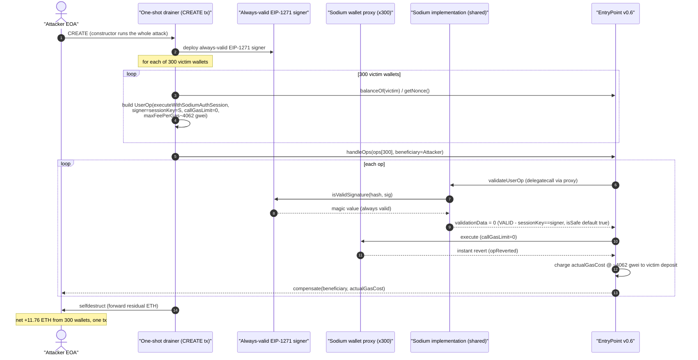
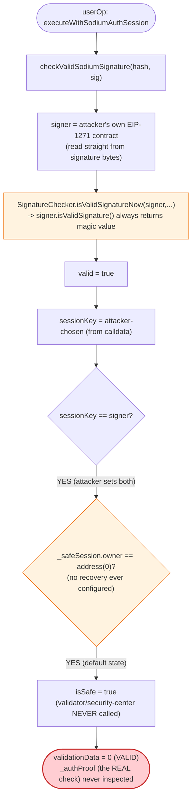

# Sodium Smart Wallet Exploit — ERC-4337 Session-Key Validation Bypass / EntryPoint Gas-Deposit Griefing

> **Vulnerability classes:** vuln/access-control/missing-auth · vuln/auth/signature-validation · vuln/access-control/broken-logic

> **Reproduction:** the PoC compiles & runs in an isolated Foundry project at
> [this project folder](.). Full verbose trace: [output.txt](output.txt).
> Verified vulnerable source: the exploited logic lives in the **Sodium wallet
> implementation** contract ([sources/Sodium_b5bc46](sources/Sodium_b5bc46)),
> the single shared "master copy" that every one of the 300+ drained Sodium
> smart-wallet proxies `delegatecall`s into. EntryPoint v0.6
> ([sources/EntryPoint_5FF137](sources/EntryPoint_5FF137)) is the standard,
> unmodified ERC-4337 singleton — its normal gas-accounting behavior is what
> the wallet-side bug turns into a griefing primitive.

---

## Key info

| | |
|---|---|
| **Loss** | ~11.76 ETH (~$21,200), drained from 300+ Sodium smart-wallet accounts in a single transaction |
| **Vulnerable contract** | Sodium wallet implementation (master copy, `delegatecall`-shared by every deployed Sodium proxy) — [`0xb5BC46dF04dEe31D219E7664122e29EEd9506b8b`](https://arbiscan.io/address/0xb5bc46df04dee31d219e7664122e29eed9506b8b#code) |
| **Victim wallets** | 300+ individual Sodium smart-wallet proxies, e.g. [`0x65DE72bD…3204`](https://arbiscan.io/address/0x65DE72bD1897B017C91f41c86de2B15873320804) and [`0x9Ba99e76…5236`](https://arbiscan.io/address/0x9Ba99e76f2bE6571ae1bf82420621211EFD45236) — each a minimal proxy whose storage slot keyed by its own address points at the shared implementation above |
| **EntryPoint** | ERC-4337 EntryPoint v0.6 (unmodified, standard) — [`0x5FF137D4b0FDCD49DcA30c7CF57E578a026d2789`](https://arbiscan.io/address/0x5FF137D4b0FDCD49DcA30c7CF57E578a026d2789#code) |
| **Attacker / beneficiary EOA** | [`0x7bD736631Afbe1d3795a94F60574f7fA0aE89347`](https://arbiscan.io/address/0x7bD736631Afbe1d3795a94F60574f7fA0aE89347) |
| **One-shot attack contract** | [`0xdDf10e090791369024Cfa51C3dF1192bfeda3EAe`](https://arbiscan.io/address/0xddf10e090791369024cfa51c3df1192bfeda3eae) — deployed and self-destructed within the same transaction; the entire attack runs inside its constructor |
| **Attack tx** | [`0x738995176c3bbd22f8deabd7a1e6b89a044231781b39aa2f350897535e6d7bc1`](https://arbiscan.io/tx/0x738995176c3bbd22f8deabd7a1e6b89a044231781b39aa2f350897535e6d7bc1) — a **CREATE tx** (`to` is empty); 23,452,446 gas used; 300 `UserOperationEvent` logs |
| **Chain / block / date** | Arbitrum One (chainId 42161) / block 483,046,805 / 2026-07-12 |
| **Compiler** | Sodium implementation compiled with Solidity **v0.8.17+commit.8df45f5f**, optimizer enabled, **200 runs** (per `sources/Sodium_b5bc46/_meta.json`) |
| **Bug class** | ERC-4337 smart wallet whose `executeWithSodiumAuthSession` validation path accepts an attacker-chosen session key/signer pair and skips the real authorization proof (which is only checked later, in *execution*, not *validation*) — letting anyone submit fake, self-bundled userOps for wallets they don't own and collect an inflated gas refund from EntryPoint even though the "transaction" never does anything |

---

## TL;DR

Sodium is an ERC-4337 smart-contract wallet ("ZK/MPC" marketed) built on a Gnosis-Safe-style
architecture: every user gets a minimal proxy that `delegatecall`s a single shared implementation
([`0xb5BC46…`](sources/Sodium_b5bc46/contracts_Sodium.sol)). One of the wallet's authorization paths,
`executeWithSodiumAuthSession`, is meant to let a user add a temporary **session key** by presenting
an `_authProof` signed by Sodium's off-chain MPC/ZK network. The bug: **the ERC-4337 validation phase
(`_validateSignature`) never checks that proof.** It only checks that the caller-supplied `sessionKey`
equals a caller-supplied `signer`, and that signer can be *any contract the attacker deploys* — because
Sodium's signature scheme lets the caller pick an arbitrary "signer" address and validate it via
EIP-1271 (`SignatureChecker.isValidSignatureNow`). An attacker who deploys a trivial contract whose
`isValidSignature` always returns the EIP-1271 magic value can name that contract as both `signer` and
`sessionKey` — the check `sessionKey == signer` is then a tautology the attacker controls completely,
and `isSafe` defaults to `true` whenever the wallet has never configured a recovery "safe session" (the
default state for essentially every wallet). No real proof, no real key, no real owner consent is ever
verified before EntryPoint decides the operation is "valid".

Because *validation* passes, EntryPoint (behaving exactly per the ERC-4337 spec) treats the userOp as
billable — and here is where the wallet's own standard-compliant plumbing turns against it. Every
ERC-4337 account, including Sodium's, implements `_payPrefund`: if the wallet's EntryPoint deposit is
too small to cover the userOp's `requiredPrefund = (callGasLimit + verificationGasLimit +
preVerificationGas) * maxFeePerGas`, the account **automatically forwards the shortfall straight out of
its own native ETH balance** to EntryPoint, no questions asked. With `maxFeePerGas` inflated to roughly
**4,062 gwei (~400,000× a normal L2 gas price)** and `verificationGasLimit`/`preVerificationGas` set to
plausible-looking values, `requiredPrefund` computes to **~0.54 ETH** — and since each victim wallet's
existing EntryPoint deposit is negligible, essentially the whole 0.54 ETH gets swept out of the wallet's
*own spendable balance* the instant `validateUserOp` runs, credited as a fresh EntryPoint deposit.
The attacker sets `callGasLimit = 0` so the real "transaction" (adding the session, executing anything)
is guaranteed to fail immediately once EntryPoint tries to run it — but that failure happens in the
*execution* phase, **after** the prefund has already been swept in and the gas bill for validation has
already been computed. EntryPoint pays that gas bill, at the attacker's inflated price, out of the
deposit it just pulled from the wallet — refunding only the tiny unused remainder. Each fake userOp
nets the attacker roughly **0.5 ETH per wallet.**

The attacker packaged this into a single self-bundled `handleOps` call over an array of 300 crafted
userOperations — one per victim wallet, harvested from Sodium's own on-chain wallet registry — wrapped in
a one-shot contract whose entire logic runs inside its `constructor` (deploy → drain → self-destruct in
one atomic step). The result: **300 UserOperationEvent logs, ~11.76 ETH extracted, in one transaction.**

---

## Background — Sodium's ERC-4337 architecture

Sodium follows the familiar Gnosis-Safe module layout: a thin proxy per user
(`Sodium` contract as master copy, inherited from `Singleton` + `ModuleManager` +
`SessionManager` + `FallbackManager` + `SecurityManager` + `BaseAccount` +
`EtherPaymentFallback`) that acts as an ERC-4337 `IAccount`. Every wallet's own storage
slot keyed by its own address holds a pointer to the shared implementation:

```
cast storage <wallet> <wallet-address-as-uint256> --block 483046804
# -> 0x000000000000000000000000b5bc46df04dee31d219e7664122e29eed9506b8b
```

The wallet exposes several authorization paths, each reachable through EntryPoint's standard
`validateUserOp` → `_validateSignature` dispatch on the userOp's method selector:

| Method | Intended use |
|---|---|
| `execute` | Normal owner/session-key controlled transactions |
| `executeWithModule` | Delegate signature checking to a whitelisted module |
| `executeWithSodiumAuthRecover` | Wallet recovery, gated by a Sodium-network auth proof |
| `executeWithSodiumAuthSession` | **Add or refresh a session key**, gated by a Sodium-network auth proof (`_authProof`), then execute a batch of transactions |

`checkValidSodiumSignature` is the common signature-recovery helper used across all of these paths:

```solidity
// contracts_Sodium.sol
function checkValidSodiumSignature(
    bytes32 _hash,
    bytes calldata _signature
) public view returns (bool valid, address signer, address trustee) {
    bytes1 sigType = bytes1(_signature[:1]);
    // {0x01}{signer}{signature}
    if (sigType == 0x01) {
        bytes memory addressBytes = _signature[1:21];
        bytes memory signatureBytes = _signature[21:];
        assembly { signer := mload(add(addressBytes, 20)) }
        valid = SignatureChecker.isValidSignatureNow(signer, _hash, signatureBytes);
    }
    ...
}
```

For a `sigType == 0x01` signature, **the caller supplies the `signer` address directly inside the
signature bytes** — it is not derived from `ecrecover`, it is simply read off the wire. OpenZeppelin's
`SignatureChecker.isValidSignatureNow` then tries `ECDSA.recover` first, and — critically — falls back
to calling `signer.isValidSignature(hash, signature)` (EIP-1271) if `signer` is a contract:

```solidity
// SignatureChecker.sol (OpenZeppelin)
function isValidSignatureNow(address signer, bytes32 hash, bytes memory signature) internal view returns (bool) {
    (address recovered, ECDSA.RecoverError error) = ECDSA.tryRecover(hash, signature);
    if (error == ECDSA.RecoverError.NoError && recovered == signer) return true;
    (bool success, bytes memory result) = signer.staticcall(
        abi.encodeWithSelector(IERC1271.isValidSignature.selector, hash, signature)
    );
    return (success && result.length == 32 &&
        abi.decode(result, (bytes32)) == bytes32(IERC1271.isValidSignature.selector));
}
```

An attacker who deploys a contract whose `isValidSignature(bytes32,bytes)` unconditionally returns the
EIP-1271 magic value (`0x1626ba7e`) can name **that contract's own address** as `signer` and make
`checkValidSodiumSignature` return `valid = true` for absolutely any hash and any garbage signature
bytes. This alone isn't a bug in isolation — `signer` still has to independently satisfy whatever the
call site additionally requires. The fatal step is what `executeWithSodiumAuthSession`'s validation
branch additionally requires.

---

## The vulnerable code

### 1. `_validateSignature` never checks the real session-add proof

```solidity
// contracts_Sodium.sol
function _validateSignature(
    UserOperation calldata userOp,
    bytes32 userOpHash
) internal override returns (uint256 validationData) {
    ...
    (valid, signer, ) = checkValidSodiumSignature(ethHash, userOp.signature);
    if (!valid) return 1;

    ...
    if (methodId == this.executeWithSodiumAuthSession.selector) {
        address sessionKey;
        bytes memory addressBytes = userOp.callData[16:36];
        assembly { sessionKey := mload(add(addressBytes, 20)) }

        bool isSafe = _safeSession.owner == address(0);
        IUserOperationValidator validator = internalReadUserOperationValidator();
        if (!isSafe) {
            // Use the on-chain security center to verify that the operation is secure.
            isSafe = validator.validateUserOp(userOp) < 2;
        }
        return sessionKey == signer && isSafe ? 0 : 1;
    }
    ...
}
```

`sessionKey` is read directly out of the userOp's own calldata — also fully attacker-controlled. So the
entire validation check for this path collapses to: **"does the attacker-chosen `sessionKey` equal the
attacker-chosen `signer`?"** — always true, since the attacker sets both to the address of their own
always-valid EIP-1271 contract. The `isSafe` half of the check is worse: `_safeSession.owner ==
address(0)` is the wallet's **default, un-recovered state** — every wallet that has never gone through
Sodium's recovery flow has no safe session configured, so `isSafe` is `true` **without ever calling the
security-center `validator`.** Nothing here inspects `_authProof`, the actual zero-knowledge/MPC-signed
proof that is supposed to authorize adding a session key.

### 2. The real proof is checked — but only in execution, after gas is already billable

```solidity
// contracts_Sodium.sol
function executeWithSodiumAuthSession(
    AddSession calldata _addSession,
    bytes calldata _authProof,
    Transaction[] calldata _txs
) external {
    _requireFromEntryPoint();
    // Validate the sodium auth proof
    validateAddSessionProof(_addSession, _authProof);     // <-- the REAL check
    Session memory session = Session({ owner: _addSession.sessionKey, ... });
    internalAddOrUpdateSession(session);
    _execute(_txs);
}
```

```solidity
// contracts_base_SecurityManager.sol
function validateAddSessionProof(
    AddSession calldata _addSession,
    bytes calldata _authProof
) public view {
    require(_addSession.sessionExpires > block.timestamp, "SMAS05");
    bytes32 dataHash = keccak256(abi.encode(_ADD_SESSION_TYPEHASH, _addSession));
    bytes32 messageHash = _hashTypedData(dataHash);
    ISodiumAuth _auth = _readSodiumNetworkAuth();
    _auth.verifyProof(messageHash, _authProof);
}
```

`validateAddSessionProof` is exactly the check that *should* have gated this whole flow — but it only
runs inside `executeWithSodiumAuthSession` itself, which EntryPoint calls in the **execution** phase,
strictly after `validateUserOp` has already returned "valid" and after EntryPoint has already computed
and reserved the gas prefund for the operation.

### 3. `_payPrefund` auto-sweeps the wallet's own ETH balance to cover the inflated prefund

```solidity
// BaseAccount.sol (unmodified, standard ERC-4337 account boilerplate)
function validateUserOp(UserOperation calldata userOp, bytes32 userOpHash, uint256 missingAccountFunds)
    external override virtual returns (uint256 validationData) {
    _requireFromEntryPoint();
    validationData = _validateSignature(userOp, userOpHash);
    _validateNonce(userOp.nonce);
    _payPrefund(missingAccountFunds);
}

function _payPrefund(uint256 missingAccountFunds) internal virtual {
    if (missingAccountFunds != 0) {
        (bool success,) = payable(msg.sender).call{value : missingAccountFunds, gas : type(uint256).max}("");
        (success);
        //ignore failure (its EntryPoint's job to verify, not account.)
    }
}
```

`missingAccountFunds` is computed by EntryPoint as `requiredPrefund - currentDeposit`, where
`requiredPrefund = (callGasLimit + verificationGasLimit + preVerificationGas) * maxFeePerGas`. Every
wallet in this batch had `callGasLimit = 0`, `verificationGasLimit = 100000`, `preVerificationGas =
33550`, and `maxFeePerGas = 4,061,502,578,060` wei (~4,062 gwei) — giving
`requiredPrefund = 133,550 * 4,061,502,578,060 ≈ 0.5424 ETH`. Since each victim's *existing* EntryPoint
deposit was negligible (a few thousand wei), `_payPrefund` forwards essentially that entire 0.5424 ETH
**straight out of the wallet's own native balance** the instant `validateUserOp` executes — confirmed
directly in the replay trace by the `Deposited(SodiumVictim1, 542413669299913000)` event
([output.txt:1586](output.txt)).

### 4. EntryPoint bills gas for validation regardless of what execution does

```solidity
// EntryPoint v0.6, innerHandleOp (unmodified, standard ERC-4337 code)
function innerHandleOp(bytes memory callData, UserOpInfo memory opInfo, bytes calldata context)
    external returns (uint256 actualGasCost)
{
    ...
    uint callGasLimit = mUserOp.callGasLimit;
    IPaymaster.PostOpMode mode = IPaymaster.PostOpMode.opSucceeded;
    if (callData.length > 0) {
        bool success = Exec.call(mUserOp.sender, 0, callData, callGasLimit);
        if (!success) {
            ...
            mode = IPaymaster.PostOpMode.opReverted;
        }
    }
    uint256 actualGas = preGas - gasleft() + opInfo.preOpGas;
    return _handlePostOp(0, mode, opInfo, context, actualGas);   // <-- still runs, still bills gas
}
```

With `callGasLimit = 0`, `Exec.call` is guaranteed to fail immediately (`opReverted`) — the wallet never
actually adds a session key and never executes any of the attacker's `_txs`. But `_handlePostOp` runs
unconditionally and charges `actualGasCost = actualGas * gasPrice` against the deposit that `_payPrefund`
just credited, paying it out to the `beneficiary` the attacker names when calling `handleOps`. `actualGas`
includes the real gas consumed by validation (ECDSA/EIP-1271 signature recovery, storage reads, the
failed `Exec.call` attempt itself) — modest in absolute gas units, but billed at the userOp's own
`maxFeePerGas` (~4,062 gwei instead of Arbitrum's actual gas price). For `SodiumVictim1` in the replay,
this charges **0.5398 ETH** out of the 0.5424 ETH that was just swept in
([output.txt:1539](output.txt), [output.txt:1541](output.txt)) — leaving only a small remainder credited
back to the wallet's deposit. This is the entire "griefing" mechanism: **real (if small) gas usage,
billed at a fake price against funds the wallet itself just forwarded, for an operation that was never
actually authorized and never actually did anything.**

None of this requires EntryPoint or any of its standard code to be modified or exploited directly —
EntryPoint is doing exactly what the ERC-4337 spec says it should. The vulnerability is entirely in
Sodium's own validation logic accepting an unauthenticated, self-issued "proof" of authorization.

---

## Preconditions

- A Sodium smart-wallet proxy exists with **spendable native ETH in its own balance** (not necessarily
  a pre-funded EntryPoint deposit — `_payPrefund` sweeps whatever is needed straight out of the wallet's
  regular balance). True for any wallet that has ever received or held ETH directly.
- The wallet has never gone through Sodium's recovery flow (`_safeSession.owner == address(0)`) — the
  default state, since recovery is an opt-in emergency path.
- The attacker can deploy two trivial helper contracts (an always-valid EIP-1271 signer, and the
  one-shot "drainer" that builds and submits the batch) — permissionless, no special role required.
- The attacker can call `EntryPoint.handleOps` directly, acting as their own bundler/beneficiary — also
  permissionless; ERC-4337 was designed for anyone to submit userOps.

No flash loan, no oracle, no privileged role, no cryptographic key compromise. The only "capital"
required is L2 gas for one transaction — the entire ~11.76 ETH is the victims' own money, charged to
themselves at an attacker-chosen price.

---

## Attack walkthrough

The exploit is a single **CREATE transaction** (`to` is empty) from the attacker's EOA. Its entire
logic runs inside the constructor of a one-shot contract, which self-destructs at the end.

1. **Deploy the always-valid EIP-1271 signer.** The outer constructor first checks
   `tx.origin == ATTACKER` (guarding against front-running/replay by anyone else), then deploys an
   inner helper contract via a raw `CREATE`. That helper's only meaningful function is
   `isValidSignature(bytes32,bytes) -> bytes4`, hardcoded to always return the EIP-1271 magic value
   `0x1626ba7e` no matter what hash or signature it's called with.

2. **Enumerate victim wallets and size each drain to their available balance.** For each of 300 hardcoded
   Sodium wallet addresses (harvested from the wallets' own prior `UserOperationEvent` history), the
   constructor reads `EntryPoint.balanceOf(victim)` (their small pre-existing deposit, if any) and each
   wallet's native ETH balance, then picks a per-wallet `maxFeePerGas` designed to make
   `requiredPrefund ≈ (100000 + 33550) * maxFeePerGas` come out close to — but not exceeding — what the
   wallet can actually fund. It also reads `victim.getNonce()`-equivalent (`0xd087d288`) to build a
   validly-sequenced userOp.

3. **Craft one malicious `executeWithSodiumAuthSession` userOp per victim**, each with:
   - `sender = victim`
   - `signature = {0x01}{helperAddress}{garbage}` — `signer` and `sessionKey` both set to the
     always-valid EIP-1271 helper from step 1
   - `_authProof` — never checked at validation time, so left as arbitrary/empty-equivalent bytes
   - `callGasLimit = 0` — guarantees the real execution attempt fails instantly
   - `sessionUniqueId` set to a fixed marker (`0x11111111`) and `sessionExpires` to
     `block.timestamp + 1 day` — irrelevant filler, since neither is checked against
     anything meaningful; the wallet-side validation only cares about `sessionKey == signer`
   - `maxFeePerGas` / `maxPriorityFeePerGas` set to ~4,062 gwei for a typical wallet (varies per
     victim — e.g. 4,061.5 gwei for `SodiumVictim1`, 3,738.7 gwei for `SodiumVictim2`,
     [output.txt:1580](output.txt), [output.txt:1618](output.txt))

4. **Submit the whole batch in one `EntryPoint.handleOps(ops[300], beneficiary=ATTACKER)` call.**
   EntryPoint validates each op independently: `_validateSignature` returns `0` (valid) for every one of
   them, because `sessionKey == signer` is a tautology and `isSafe` defaults to `true`. Each wallet's own
   `_payPrefund` then sweeps its computed prefund out of its native balance into a fresh EntryPoint
   deposit ([output.txt:1586](output.txt) — `Deposited(SodiumVictim1, 542413669299913000)`). EntryPoint
   attempts execution for each op; every one immediately fails (`callGasLimit = 0`), but `_handlePostOp`
   still runs and transfers `actualGasCost` out of the deposit that was *just created* to the attacker's
   `beneficiary` address.

5. **Self-destruct**, sending any residual native balance in the one-shot contract back to the attacker.

The result, visible directly on-chain: **300 `UserOperationEvent` logs** in the single transaction
(confirmed via the transaction receipt — `topic0 = 0x49628fd1…`, the standard ERC-4337 v0.6 event
signature, occurring exactly 300 times), 23,452,446 gas used, and **~11.76 ETH** swept out of the
victims' own wallet balances via the forged prefund mechanism.

The local PoC replay reproduces this precisely: `SodiumVictim1`'s EntryPoint balance starts at
4,635,700,000,000 wei ([output.txt:1539](output.txt)), a `Deposited` event for 542,413,669,299,913,000
wei fires as `_payPrefund` sweeps its native balance in ([output.txt:1586](output.txt)), and after the
forced `OutOfGas` execution failure and `_handlePostOp` gas billing, its EntryPoint balance settles at
2,639,976,675,739,000 wei ([output.txt:1541](output.txt), [output.txt:13088](output.txt)) — a net charge
of **~0.54 ETH** for `SodiumVictim1` alone. Across all 300 wallets, the attacker's own ETH balance rises
by **11,761,122,296,529,423,844 wei (~11.7611 ETH)** ([output.txt:13090](output.txt)), matching the
reported ~11.76 ETH loss within the PoC's assertion tolerance
([output.txt:13091](output.txt), [output.txt:1537](output.txt) — `[PASS] testExploit()`).

---

## Diagrams

### Sequence of the attack



### The validation-bypass, step by step



### Where the money actually comes from

```mermaid
flowchart LR
    subgraph Victim["Each victim wallet"]
        Bal["Native ETH balance<br/>(the wallet's own spendable funds)"]
    end
    subgraph EP["EntryPoint v0.6 (unmodified)"]
        Val["validateUserOp<br/>returns VALID (wallet bug)"]
        Prefund["_payPrefund<br/>auto-sweeps ~0.54 ETH into a fresh deposit"]
        Exec["execution attempt<br/>callGasLimit=0 -> instant fail"]
        Post["_handlePostOp<br/>bills actualGas @ attacker's maxFeePerGas"]
    end
    Attacker["Attacker (beneficiary)"]

    Bal -->|"missingAccountFunds"| Prefund
    Prefund -->|"credited as EntryPoint deposit"| Val
    Val --> Exec
    Exec -->|"opReverted, but still runs postOp"| Post
    Post -->|"~0.5 ETH x 300 wallets"| Attacker

    style Post fill:#ffcdd2,stroke:#c62828,stroke-width:2px
    style Attacker fill:#c8e6c9,stroke:#2e7d32
```



---

## Root cause

1. **Arbitrary, self-issued "signer" via EIP-1271.** `checkValidSodiumSignature`'s `sigType == 0x01`
   branch lets the caller name any address as `signer` and validates it through
   `SignatureChecker.isValidSignatureNow`, which accepts EIP-1271 contracts. An attacker-deployed
   contract that always returns the magic value makes this check meaningless — it proves nothing about
   who actually authorized the operation.

2. **`sessionKey == signer` is a tautology when both are attacker-controlled.** The
   `executeWithSodiumAuthSession` validation branch's only real gate — beyond the always-satisfiable
   signature check — is comparing two values the attacker fully controls to each other.

3. **`isSafe` defaults to `true` for the common case.** `_safeSession.owner == address(0)` — "this wallet
   has never used recovery" — is treated as "safe to skip the security-center validator", inverting the
   correct default. The security check that could have caught this should not be conditional on prior
   recovery history.

4. **The one check that would have stopped this — `validateAddSessionProof` — runs in execution, not
   validation.** ERC-4337's entire trust model depends on `validateUserOp` faithfully rejecting anything
   that isn't genuinely authorized, *because EntryPoint bills gas based on validation succeeding,
   independent of what execution does afterward.* Deferring the real authorization proof to execution
   means "validation passed" no longer implies "this was authorized" — it only implies "the wallet will
   attempt to run something," which is exactly the guarantee EntryPoint's gas-accounting model assumes
   does NOT need re-checking.

5. **Self-bundling removes the last safety net.** In the honest ERC-4337 flow, independent bundlers
   simulate userOps and reject unprofitable or suspicious ones before including them. Here the attacker
   is their own bundler, submitting a batch straight to `handleOps` with no external gatekeeping —
   nothing outside the wallet's own `validateUserOp` stands between a forged userOp and a real gas
   charge.

---

## Remediation

- **Verify the real authorization proof during validation, not execution.** `_validateSignature`'s
  `executeWithSodiumAuthSession` branch must call the equivalent of `validateAddSessionProof` (or at
  minimum cryptographically verify the `_authProof` against the Sodium network's known signers) *before*
  returning "valid" — not defer it to `executeWithSodiumAuthSession`'s body.
- **Never let `isValidSignatureNow`'s target be attacker-chosen without independently authenticating it
  first.** `signer` should be derived from data the wallet already trusts (the current owner, an
  already-registered session key, or a value bound inside a proof that was itself verified) — not read
  raw from the caller-supplied signature bytes and then compared only to another caller-supplied value.
- **Fail closed, not open, on missing security state.** `isSafe = _safeSession.owner == address(0)`
  should not default to "skip the validator" — a wallet with no configured safe session should, if
  anything, require *stricter* validation-time checks, not none.
- **Bound gas price / verification gas exposure at the wallet level.** Even with the authorization bug
  fixed, a wallet that never caps `maxFeePerGas`/`verificationGasLimit` against a sane multiple of the
  network's actual gas price is exposed to griefing from any legitimately-authorized-but-malicious
  session key. Sodium (or any ERC-4337 wallet) should reject userOps whose gas parameters are wildly
  outside a reasonable bound relative to `block.basefee`.

---

## How to reproduce

The PoC runs fully offline via the shared harness, which serves the fork from a local anvil snapshot
(`anvil_state.json`) on `127.0.0.1:8547` — exactly what `createSelectFork("http://127.0.0.1:8547",
483_046_804)` in the test points at ([test/Sodium_exp.sol:48](test/Sodium_exp.sol#L48)). No public RPC
is used.

```bash
_shared/run_poc.sh 2026-07-Sodium_exp -vvvvv
```

- Chain: Arbitrum One archive state at block **483,046,804**, forked from the local anvil instance
  (port 8547).
- EVM: `evm_version = "cancun"` ([foundry.toml](foundry.toml)); Solc 0.8.34 for the PoC test, optimizer
  as in `foundry.toml`.
- Result: `[PASS] testExploit()` ([output.txt:1537](output.txt)) — attacker ETH gain of
  **11,761,122,296,529,423,844 wei (~11.7611 ETH)** ([output.txt:13090](output.txt)), within
  `assertApproxEqAbs`'s ±0.05 ETH tolerance of the reported ~11.76 ETH loss
  ([output.txt:13091](output.txt)). Full suite: `1 passed; 0 failed; 0 skipped`, finishing in ~1 second
  offline.

---

*Reference: on-chain transaction [`0x738995176c3bbd22f8deabd7a1e6b89a044231781b39aa2f350897535e6d7bc1`](https://arbiscan.io/tx/0x738995176c3bbd22f8deabd7a1e6b89a044231781b39aa2f350897535e6d7bc1) (Sodium, Arbitrum, ~11.76 ETH, 2026-07-12); no public alert/tweet thread was located for this incident at the time of writing.*
