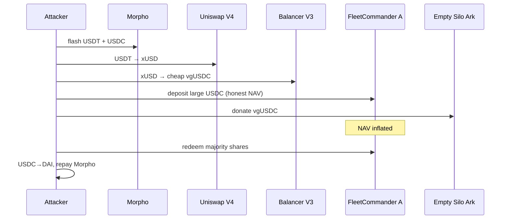

# Summer.fi FleetCommander — NAV Inflation via Empty-Ark Donation of Undervalued vgUSDC

> **Vulnerability classes:** vuln/defi/donation-attack · vuln/oracle/price-manipulation · vuln/defi/flash-loan-attack

> **Reproduction:** offline Foundry project at [this folder](.). Trace: [output.txt](output.txt).
> Sources: [FleetCommander](sources/FleetCommander_98C49e/), [SiloManagedVaultArk](sources/SiloManagedVaultArk_61d706/),
> [SiloVault / vgUSDC](sources/SiloVault_8399C8/).

---

## Key info

| | |
|---|---|
| **Loss** | **~5.60M DAI** reproduced on FleetA (`5597682112787981084159961` wei); full incident ~6.02M incl. FleetB |
| **Vulnerable contract** | FleetCommander A — [`0x98C49e13bf99D7CAd8069faa2A370933EC9EcF17`](https://etherscan.io/address/0x98c49e13bf99d7cad8069faa2a370933ec9ecf17#code) |
| **Empty ark** | SiloManagedVaultArk — [`0x61d7063041d83C8ca3E42c39181dFd14B3Bc76c2`](https://etherscan.io/address/0x61d7063041d83c8ca3e42c39181dfd14b3bc76c2) |
| **Undervalued vault** | Silo vgUSDC — [`0x8399C8Fc273bD165C346Af74A02e65f10e4FD78F`](https://etherscan.io/address/0x8399c8fc273bd165c346af74a02e65f10e4fd78f) (counts depegged xUSD at par) |
| **Attacker** | [`0x7BF716167B48CF527725722C6d79494b45B3BDCa`](https://etherscan.io/address/0x7bf716167b48cf527725722c6d79494b45b3bdca) |
| **Attack contract** | [`0x0514F827C129C16418a0933E03C99A6AF982FC61`](https://etherscan.io/address/0x0514f827c129c16418a0933e03c99a6af982fc61) |
| **Attack tx** | [`0x0db528c44f23fc7fa4544684a2fab81096450a14aae8bc89f42cd0592d43da12`](https://etherscan.io/tx/0x0db528c44f23fc7fa4544684a2fab81096450a14aae8bc89f42cd0592d43da12) |
| **Chain / block** | Ethereum / 25,471,347 / July 2026 |
| **Bug class** | Fleet NAV = live sum of ark `totalAssets()` with **no manipulation guard**; donating cheap vgUSDC into an **empty** ark inflates share price for a dominant depositor who then redeems against other LPs |

---

## TL;DR

1. Summer.fi Lazy Summer `FleetCommander` prices shares from the **sum of each ark's `totalAssets()`** with no smoothing, donation resistance, or empty-ark gate.

2. One FleetA ark was a SiloManagedVault pointing at Silo **vgUSDC**, which still valued depegged Stream **xUSD** collateral near par. That made vgUSDC mintable far below the value the fleet would later attribute to it.

3. Attack (Morpho flash USDT + USDC):
   - Force liquidity out of Morpho-backed VaultV2 arks (`forceDeallocate`) so the later redeem can be served.
   - Mint cheap vgUSDC: USDT → xUSD (Uniswap V4) → vgUSDC (Balancer V3).
   - Deposit a **dominant** FleetA position at honest NAV (~64.8M USDC path).
   - **Donate** the cheap vgUSDC into the empty SiloManagedVault ark → Fleet NAV jumps.
   - Redeem inflated shares → drain other LPs' USDC.
   - Convert surplus USDC → DAI via Curve 3pool; repay Morpho.

4. Reproduced profit: **5,597,682.11 DAI** ([output.txt](output.txt)); PoC asserts `> 5_000_000e18`. Remaining ~0.4M of the public 6.02M figure came from a second fleet leg not in this PoC.

---

## Root cause

```text
Fleet share price ∝ Σ ark.totalAssets()
empty ark accepts raw vgUSDC donation → totalAssets jumps
no max deposit / no virtual offset / no same-block NAV freeze
attacker holds majority shares minted pre-donation → redeems post-donation at inflated price
```

Compounded by vgUSDC treating depegged xUSD as full-value collateral (oracle/asset-quality failure in the Silo vault).

---

## Attack flow



---

## Recommendation

1. Ignore empty arks (or require governance activation) until they have verified strategy deposits.
2. Use manipulation-resistant NAV (internal accounting, not raw token balances in arks).
3. Same-block / same-tx deposit+redeem guards; max share of supply per deposit.
4. Ensure underlying vaults (vgUSDC) do not value depegged collateral at par.

---

## References

- Attack tx: https://etherscan.io/tx/0x0db528c44f23fc7fa4544684a2fab81096450a14aae8bc89f42cd0592d43da12
- Upstream PoC notes in `test/SummerFi_exp.sol`
