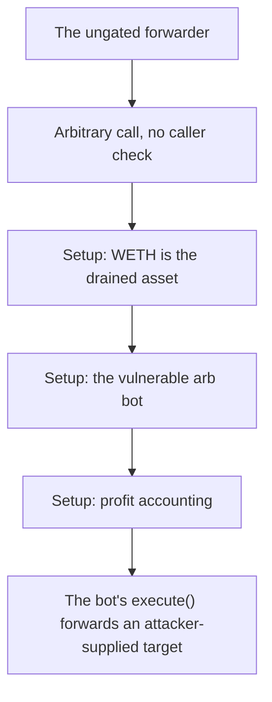

# UnprotectedArbBot: ungated forwarder drains a pre-granted allowance

<!-- source-defihacklabs: https://github.com/SunWeb3Sec/DeFiHackLabs/pull/1209 (UnprotectedArbBot_exp.sol) -->
<!-- defihacklabs-sol: https://github.com/SunWeb3Sec/DeFiHackLabs/blob/main/src/test/2026-07/UnprotectedArbBot_exp.sol -->

> **Vulnerability classes:** vuln/logic · vuln/access-control

> **Reproduction:** a self-contained, faithful reconstruction of the incident's core
> bug — local deploy, **no fork** — both gates green (registry `forge test` PASS +
> browser Playground `VERDICT: PASS`). Basis: [DeFiHackLabs PR #1209](https://github.com/SunWeb3Sec/DeFiHackLabs/pull/1209)
> ([`UnprotectedArbBot_exp.sol`](https://github.com/SunWeb3Sec/DeFiHackLabs/blob/main/src/test/2026-07/UnprotectedArbBot_exp.sol), the upstream fork replay).

---

## Key info

| | |
|---|---|
| **Loss** | ~16.623 WETH (~$31.7K) |
| **Chain** | Base |
| **Vulnerable contract** | `0xce01759b…` (Finding #2026: ArbBot) |
| **Bug class** | Finding #2026: ArbBot |

---

## Root cause

The bot's execute() forwards an attacker-supplied target+calldata via a low-level CALL with NO access-control check, then sweeps the named token's balance to msg.sender. A different entrypoint IS onlyOwner-gated, so the omission on execute() is the bug. The attacker makes the bot call WETH.transferFrom(owner, bot, 16.623 WETH) against an allowance the owner had pre-granted the bot, then the same call sweeps that WETH to the attacker - 16.623 WETH (~$31.7K) drained from the owner EOA.

```solidity
    // @> VULN: no access control. Anyone can make the bot run an arbitrary call
```

## Why it's exploitable here

The bot's execute() forwards an attacker-supplied target+calldata via a low-level CALL with NO access-control check, then sweeps the named token's balance to msg.sender. A different entrypoint IS onlyOwner-gated, so the omission on execute() is the bug. The attacker makes the bot call WETH.transferFrom(owner, bot, 16.623 WETH) against an allowance the owner had pre-granted the bot, then the same call sweeps that WETH to the attacker - 16.623 WETH (~$31.7K) drained from the owner EOA.

## Attack path



## Marked-line walkthrough (Playground)

The EVM Playground pins each step to the exact executed source line:

1. **L73** — The ungated forwarder: execute() is public with no caller check - unlike the contract's onlyOwner-gated sweep.
2. **L75** — Arbitrary call, no caller check: Root cause: the attacker-supplied call WETH.transferFrom(owner, bot, 16.623 WETH) runs on a pre-granted allowance, then the same call sweeps the WETH to the attacker.
3. **L88** — Setup: WETH is the drained asset: Setup: WETH is the token the owner pre-approved to the bot and that the attacker walks away with.
4. **L90** — Setup: the vulnerable arb bot: Setup: the arbitrary-call forwarder bot - its execute() entrypoint has no access control.
5. **L93** — Setup: profit accounting: Setup: the exploit tracks the WETH it sweeps out of the owner.
6. **L95** — Setup: wire the scenario: Setup: deploy WETH, the owner wallet, and the bot for the reproduction.
7. **L96** — Setup: deploy WETH: Setup: WETH is minted to the owner, who has a standing allowance to the bot.

## PoC

Registry (Foundry, local deploy — faithful reconstruction + harm-asserting test):

```bash
cd 2026-07-UnprotectedArbBot_exp
forge test -vvv
```

The browser Playground replays the same synthetic opcode-for-opcode and measures the
harm. Both gates are green (registry `forge test` PASS + Playground `_verify-poc`
**VERDICT: PASS**).

## Sources

- **Basis / upstream PoC:** [DeFiHackLabs PR #1209 — UnprotectedArbBot_exp.sol](https://github.com/SunWeb3Sec/DeFiHackLabs/blob/main/src/test/2026-07/UnprotectedArbBot_exp.sol) (fork replay of the on-chain tx).
- DeFiHackLabs incident collection: [SunWeb3Sec/DeFiHackLabs](https://github.com/SunWeb3Sec/DeFiHackLabs).
