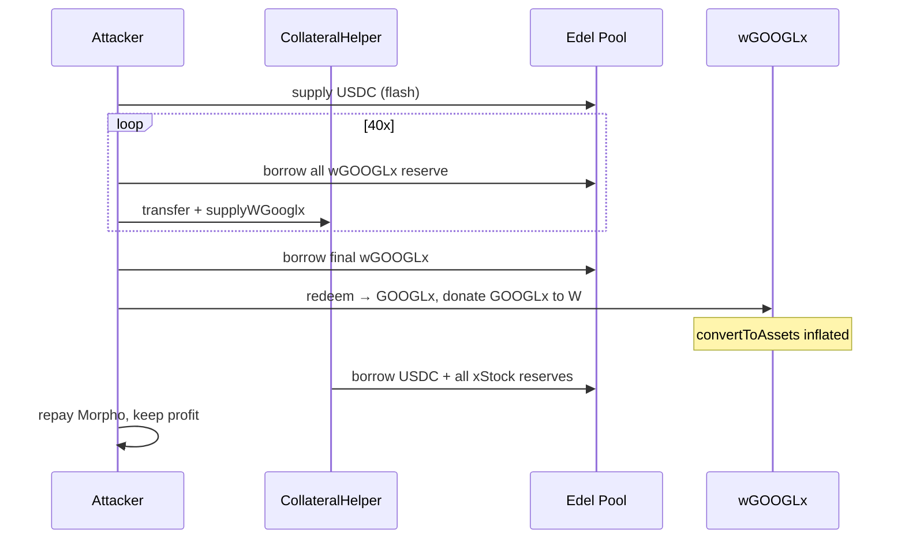

# Edel xStock — ERC4626 convertToAssets Donation Inflates Collateral and Drains Reserves

> **Vulnerability classes:** vuln/defi/donation-attack · vuln/oracle/price-manipulation · vuln/defi/flash-loan-attack

> **Reproduction:** offline Foundry project at [this folder](.). Trace: [output.txt](output.txt).
> Sources: [AaveOracle](sources/AaveOracle_Bd497e/), [WrappedBackedToken (wGOOGLx)](sources/WrappedBackedTokenProxy_1630F0/),
> pool proxy [0x3EEeB3…](https://etherscan.io/address/0x3EEeB3cd20f844a578807fc457388Ceb9A67fAa6).

---

## Key info

| | |
|---|---|
| **Loss** | **204,215.57 USDC** + multi-asset xStock wrappers (wSPYx/wQQQx/wMSTRx/wNVDAx/wTSLAx) |
| **Vulnerable surface** | Edel lending pool (Aave-style) + oracle that values **wGOOGLx** via ERC4626 `convertToAssets()` |
| **Oracle** | [`0xBd497eE429D9D3E46446339286271b3714a83B29`](https://etherscan.io/address/0xBd497eE429D9D3E46446339286271b3714a83B29#code) |
| **wGOOGLx** | [`0x1630F08370917E79df0B7572395a5e907508bBBc`](https://etherscan.io/address/0x1630F08370917E79df0B7572395a5e907508bBBc) |
| **Attacker** | [`0x58428161bB55c14A413945f06cbDeC157F411C76`](https://etherscan.io/address/0x58428161bB55c14A413945f06cbDeC157F411C76) |
| **Attack tx** | [`0xe2320086b2815d21b0927839bd0e306466c29a68d38d5361e99dd21ec5472612`](https://etherscan.io/tx/0xe2320086b2815d21b0927839bd0e306466c29a68d38d5361e99dd21ec5472612) |
| **Chain / block** | Ethereum / 25,434,061 / July 2026 |
| **Bug class** | Collateral oracle trusts mutable ERC4626 exchange rate; **direct GOOGLx donation** into the wrapper inflates `convertToAssets()` and thus borrow power in the same transaction |

---

## TL;DR

1. Edel markets treat wrapped xStock tokens (e.g. wGOOGLx) as collateral. Pricing goes through an AaveOracle path that ultimately depends on the wrapper's **live** `convertToAssets()` rate.

2. wGOOGLx is a standard ERC4626-style vault over GOOGLx. Donating GOOGLx to the vault **increases assets without minting shares**, so `convertToAssets(shares)` jumps.

3. Attack:
   - Morpho-flash 180,000 USDC, supply as USDC collateral on Edel.
   - Loop 40×: borrow all wGOOGLx reserve → re-supply via a helper (recursive leverage of the wrapper reserve).
   - Final borrow of remaining wGOOGLx → `redeem` to GOOGLx → **donate GOOGLx back to wGOOGLx**.
   - Helper now has massively inflated collateral value → borrow remaining USDC + all other wrapped xStock reserves → repay Morpho.

4. Reproduced balances after attack ([output.txt](output.txt)):
   - USDC: **204,215.572188**
   - wSPYx: **122.20**, wQQQx: **62.97**, wMSTRx: **293.12**, wNVDAx: **99.85**, wTSLAx: **37.59**

---

## Root cause

```text
oracle price(wGOOGLx) ∝ convertToAssets(1 share)
convertToAssets ← totalAssets / totalSupply
totalAssets includes unsolicited GOOGLx transfers  ← donation inflates price
```

No virtual-offset / totalAssets accounting separation, no max rate change per block, no TWAP on the wrapper rate.

---

## Attack flow



---

## Recommendation

1. Price ERC4626 collateral with a **manipulation-resistant** rate (internal accounting, virtual shares/assets, or rate capped per block / TWAP).
2. Do not use raw `convertToAssets` after a same-block donation can move it.
3. Limit recursive borrow/re-supply loops against a single reserve (utilization caps, single-block borrow caps).

---

## References

- Attack tx: https://etherscan.io/tx/0xe2320086b2815d21b0927839bd0e306466c29a68d38d5361e99dd21ec5472612
- Analysis: https://x.com/TenArmorAlert/status/2072130807356129726
