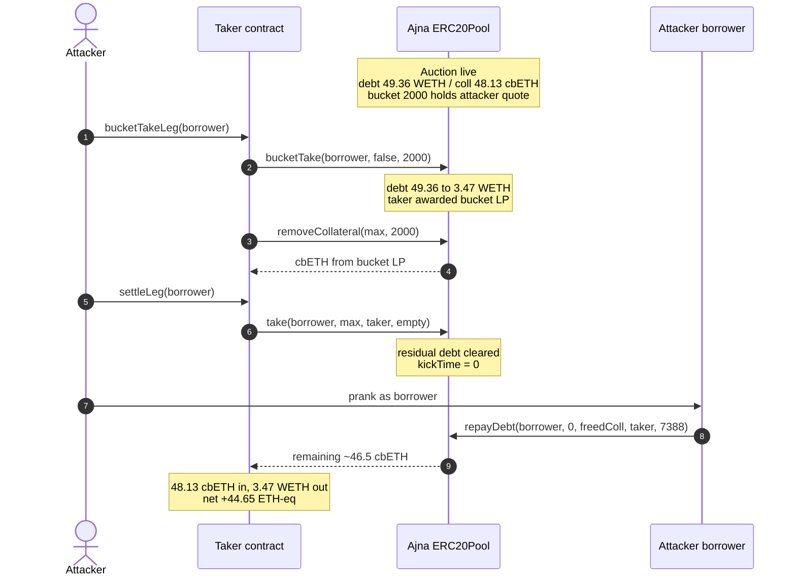
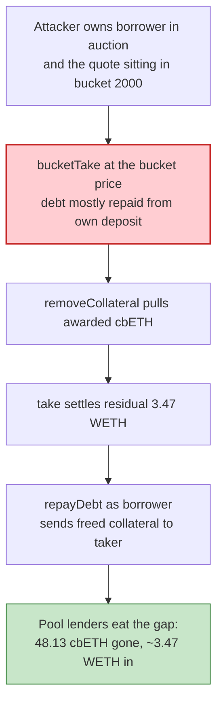

# Ajna Finance — self-controlled liquidation via `bucketTake` / `take` accounting

> **Vulnerability classes:** vuln/logic/liquidation-logic · vuln/oracle/missing-validation · vuln/logic/missing-check

> **Reproduction:** the PoC compiles & runs in an isolated Foundry project at
> [this project folder](.). Full verbose trace: [output.txt](output.txt).
> Source test: [test/AjnaFinance_exp.sol](test/AjnaFinance_exp.sol).

---

## Key info

| | |
|---|---|
| **Loss** | ~$775K campaign across 7 Ajna ERC20 pools. This PoC is the cbETH/WETH instance: **48.127 cbETH** seized for **~3.47 WETH** paid, net **44.653 ETH-equivalent** (~$124.8K) [output.txt](output.txt) |
| **Vulnerable contract** | Ajna ERC20Pool (cbETH/WETH) — [`0xad24FC773e125Edb223C38a39657cB64bc7C178e`](https://etherscan.io/address/0xad24FC773e125Edb223C38a39657cB64bc7C178e) (logic impl [`0x05bB4F63…21`](https://etherscan.io/address/0x05bB4F6362B02F17C1A3F2B047A8b23368269A21)) |
| **Attacker EOA** | [`0x6F2f5236b10FE7162Da077A2779f8b5f04b7827e`](https://etherscan.io/address/0x6F2f5236b10FE7162Da077A2779f8b5f04b7827e) |
| **Attacker-controlled borrower** | [`0x02D329Ebb1DA079A89988366b777aF300DB96F5f`](https://etherscan.io/address/0x02D329Ebb1DA079A89988366b777aF300DB96F5f) |
| **Attack tx** | [`0x12dfde527ef62882bfabb64362c9ae0e6bfb628363bd298d0d0956c9a114e4f5`](https://etherscan.io/tx/0x12dfde527ef62882bfabb64362c9ae0e6bfb628363bd298d0d0956c9a114e4f5) (block **25,854,888**) |
| **Chain / block / date** | Ethereum / fork **25,854,887** (attack−1) / 2026-08-28 |
| **Compiler** | Ajna ERC20Pool (verified Solidity 0.8.18-era pool impl) |
| **Bug class** | Oracle-free liquidation: an attacker who owns both the underwater borrower *and* the taker/lender shapes internal bucket prices and walks out with more collateral than quote paid |

---

## TL;DR

Ajna is permissionless and **oracle-free by design**. Auction and bucket prices come only from the pool's own Fenwick/bucket state. An attacker who controls **both sides** of a liquidation — its own over-leveraged borrower *and* the taker that liquidates it — can `bucketTake` that borrower against a bucket whose quote deposit the attacker also owns, repay most of the debt at a self-chosen internal price, `removeCollateral` the awarded LP, `take` the residual, then as the borrower `repayDebt(..., collateralAmountToPull, taker, ...)` and pull the freed collateral out.

On this cbETH/WETH pool the standing state at the fork already had borrower `0x02D329` in an active Dutch auction (debt **49.36 WETH**, collateral **48.13 cbETH**) and Fenwick bucket **2000** holding **~49.34 WETH** of the attacker's own deposit. After `bucketTake` + `take` + `repayDebt` the taker holds **48.127 cbETH** having spent only **~3.47 WETH**. Net **44.653 ETH-eq**. Same pattern hit syrupUSDC, wstETH, rETH, cbETH, WBTC, WETH/USDC, sDAI the same day.

`bucketTake`, `take`, `removeCollateral`, and `repayDebt` are all plain public functions. The `validate(...)` staticcall seen in the live tx is the attacker contract's own `tx.origin` check, not an Ajna gate.

---

## Background

Ajna v2 is a peer-to-pool lending protocol: each pool is one collateral / one quote pair, with lenders depositing quote into price-indexed **buckets** (a Fenwick tree) and borrowers drawing against their collateral. There is **no governance, no pause, no external price feed**. Liquidations are Dutch auctions whose start price and `bucketTake` settlement price are functions of pool-internal state.

That architecture is a feature for censorship resistance. It is a bug when one actor can:

1. Open an over-leveraged borrower and get it kicked into auction.
2. Sit as a lender in a chosen bucket.
3. `bucketTake` itself at that bucket's price, converting most of the debt into bucket LP (collateral claim) while leaving a dust remainder.
4. Settle the auction with a tiny `take`, then as the borrower pull the now-unencumbered collateral.

The loss lands on the pool's *other* lenders: they still see a "repaid" loan, but the collateral that should have covered it has left.

Campaign breakdown (same bug class, seven pools):

| Pool | Reported loss |
|---|---:|
| syrupUSDC | $173.7K |
| wstETH | $159.8K |
| rETH | $127.4K + $15.6K |
| **cbETH (this PoC)** | **$124.8K + $12.1K** |
| WBTC | $101.8K |
| WETH/USDC | $42.0K |
| sDAI | $18.0K |
| **Total** | **~$775K** |

---

## The vulnerable code

Ajna's pool impl is verified; the economic bug is in **who is allowed to compose** `bucketTake` / `take` / `repayDebt`, not a missing `onlyOwner`. Reconstructing the public surface the PoC actually calls ([test/AjnaFinance_exp.sol](test/AjnaFinance_exp.sol)):

```solidity
interface IAjnaPool {
    function bucketTake(address borrower, bool depositTake, uint256 index) external;
    function removeCollateral(uint256 maxAmount, uint256 index) external returns (uint256, uint256);
    function take(address borrower, uint256 maxAmount, address callee, bytes calldata data) external;
    function repayDebt(
        address borrower,
        uint256 maxQuoteTokenAmountToRepay,
        uint256 collateralAmountToPull,
        address collateralReceiver,
        uint256 limitIndex
    ) external;
}
```

`bucketTake(borrower, depositTake=false, index=2000)` consumes the bucket's quote deposit to repay the auctioned debt at the **bucket's** price and awards the taker bucket LP. There is no check that the taker is independent of the borrower, no external price bound, and no minimum quote-in / collateral-out ratio against a feed.

`repayDebt` after the auction is settled (`kickTime == 0`) lets the **borrower** pull remaining collateral to an arbitrary `collateralReceiver`. Combined with a self-take that already cleared the debt at a sweetheart price, that pull is the drain.

---

## Root cause

Three design choices compose into a critical:

1. **No external price.** Bucket 2000's price is whatever the attacker arranged in earlier setup txs (already sitting at the fork). Nothing can say "this collateral is worth ~1:1 with WETH, you cannot settle 48 cbETH for 3.5 WETH."
2. **No identity separation.** The protocol cannot tell that the borrower, the bucket depositor, and the taker are the same economic actor. Self-dealing is in-protocol.
3. **Auction settlement frees the rest.** After `take` clears the residual 3.47 WETH, `repayDebt(borrower, 0, collateral, taker, idx)` is a legitimate "I repaid, give me my collateral" path — except the collateral was never paid for at a fair price.

The live attacker funded the residual `take` through a Balancer flash loan plus a cbETH→WETH swap. That financing is economically neutral; the PoC `deal`s 100 WETH as working capital and asserts the same net value.

---

## Preconditions

- A borrower position already in an **active auction** (here: debt 49.36 WETH, collateral 48.13 cbETH, `kickTime != 0`).
- A Fenwick bucket the attacker owns with enough quote to `bucketTake` most of that debt (bucket 2000 ≈ 49.34 WETH).
- Working capital for the residual `take` (~3.5 WETH; flash-loanable).
- Ability to `prank` / actually control the borrower for the final `repayDebt`. In the live campaign the attacker deployed and funded that borrower in earlier txs.

---

## Attack walkthrough (numbers from [output.txt](output.txt))

Standing state at block 25,854,887:

| Item | Value |
|---|---:|
| Borrower debt | 49.36 WETH |
| Borrower collateral | 48.13 cbETH |
| Bucket 2000 quote | ~49.34 WETH (attacker) |

| # | Step | Effect |
|---|---|---|
| 1 | `bucketTake(borrower, false, 2000)` | Bucket quote repays debt 49.36 → **3.47 WETH**; taker is awarded bucket LP. |
| 2 | `removeCollateral(max, 2000)` | First cbETH slice pulled from the bucket LP. |
| 3 | `take(borrower, max, taker, "")` | Residual 3.47 WETH cleared; auction settles (`kickTime == 0`). |
| 4 | `prank(borrower); repayDebt(borrower, 0, freedCollateral, taker, 7388)` | Remaining ~46.5 cbETH sent to the taker. |

PoC result:

```
taker cbETH gained: 48.127374524782937205
taker WETH spent:    3.474032191998137190
net ETH-equivalent drained: 44.653342332784800015
[PASS] testExploit()
```

On-chain the same value was split as ~43.75 cbETH + ~1.5 WETH net because of the flash-loan + swap path. Net ETH-eq matches.

---

## Diagrams

### Sequence



### Why self-dealing beats an oracle-free pool



---

## Remediation

1. **Bound `bucketTake` / `take` against an independent price.** Even an oracle-free protocol can refuse a take whose implied collateral/quote ratio is outside a TWAP or a slow-moving internal EMA by more than X%.
2. **Separate identities.** Disallow the borrower (or an address it authorizes) from being the taker on its own auction; or require the taker to post quote that did not originate from the same bucket the borrower just interacted with in-tx.
3. **Haircut self-takes.** If `msg.sender` of `bucketTake` is the borrower or a known affiliate, settle at a penal price, not at the bucket's posted price.
4. **Don't free leftover collateral to the underwater borrower after a sweetheart take.** Residual collateral after a take that repaid less than a fair value of the seized collateral should stay in the pool (or go to lenders), not `repayDebt` out.
5. **Pause / migration path.** Ajna v2 has no governance pause; users had to withdraw themselves. A next version needs an emergency switch or immutable but bounded take math.

---

## How to reproduce

```bash
_shared/run_poc.sh 2026-08-AjnaFinance_exp --mt testExploit -vvvvv
```

Expected tail:

```
taker cbETH gained: 48.127374524782937205
net ETH-equivalent drained: 44.653342332784800015
[PASS] testExploit()
```

---

*Reference: https://x.com/ajnafi/status/2093730105713377452*
