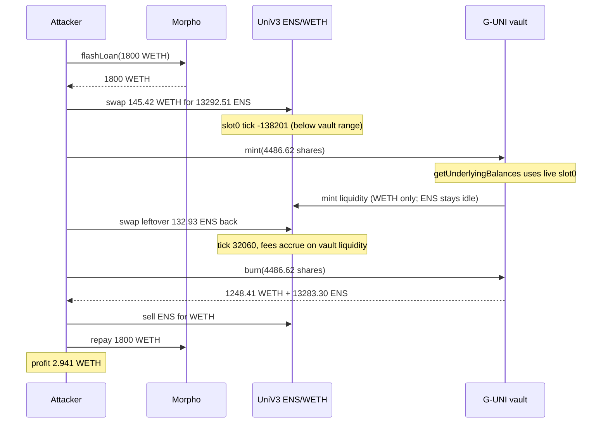
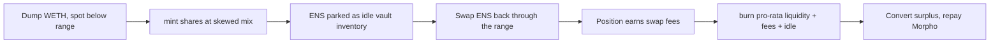

# Arrakis Finance G-UNI — Uniswap V3 mint/burn sandwich with no same-tx snapshot

<!-- non-defihacklabs: Crypto Training original detection & analysis (Twitter hack alerting) -->

> **Vulnerability classes:** vuln/defi/sandwich-attack · vuln/oracle/spot-price · vuln/oracle/missing-circuit-breaker

> **Reproduction:** the PoC compiles & runs in an isolated Foundry project at
> [this project folder](.). The fork is served offline from the bundled
> `anvil_state.json` (local anvil at `127.0.0.1:8545`), so no public RPC is required.
> Full verbose trace: [output.txt](output.txt).
> Verified sources: [ArrakisVaultV1](sources/ArrakisVaultV1_d68b05/contracts_ArrakisVaultV1.sol),
> [EIP173Proxy](sources/EIP173Proxy_7c687f/contracts_vendor_proxy_EIP173Proxy.sol),
> [UniswapV3Pool](sources/UniswapV3Pool_b9C4a5/contracts_UniswapV3Pool.sol),
> [Morpho](sources/Morpho_BBBBBb/src_Morpho.sol).

---

## Key info

| | |
|---|---|
| **Loss** | **2.941350352900037140 WETH** (~$7,170) from the legacy G-UNI ENS–WETH vault |
| **Vulnerable contract** | G-UNI ENS–WETH vault proxy [`0x7c687f775A3b73BBAb0E15832F24caaB5D53bDDe`](https://etherscan.io/address/0x7c687f775A3b73BBAb0E15832F24caaB5D53bDDe#code) |
| **Implementation** | ArrakisVaultV1 [`0xd68b055fb444D136e3aC4df023f4C42334F06395`](https://etherscan.io/address/0xd68b055fb444d136e3ac4df023f4c42334f06395#code) |
| **Attacker EOA** | [`0xa3B096e4df1247794599a37Af8F5b8CB05D5EB44`](https://etherscan.io/address/0xa3B096e4df1247794599a37Af8F5b8CB05D5EB44) |
| **Attacker contract** | [`0x028d9C17B1a097e7e115A6400203df86339BAf4a`](https://etherscan.io/address/0x028d9C17B1a097e7e115A6400203df86339BAf4a) (unverified) |
| **Attack tx** | [`0x6ae3af4b2f25a56594de99cfb31369150dd9ac059c49efe04b9e3e0163dbc672`](https://etherscan.io/tx/0x6ae3af4b2f25a56594de99cfb31369150dd9ac059c49efe04b9e3e0163dbc672) — block **25,817,966** |
| **Chain / block / date** | Ethereum (chainId 1) / PoC fork block **25,817,965** / 2026-08-23 |
| **Compiler** | Solidity **v0.8.4**, optimizer **1 run** |
| **Bug class** | State-dependent Uniswap V3 mint/burn accounting with no same-transaction snapshot: shares are valued off live `pool.slot0()`, so an unprivileged attacker can sandwich mint and burn after skewing spot price and accruing fees |

---

## TL;DR

1. **Arrakis V1 / G-UNI is a shared Uniswap V3 LP token.** `mint()` and `burn()` size deposits and redemptions from `getUnderlyingBalances()`, which reads the pool's **live** `slot0()` sqrt price and tick. There is no TWAP, no deviation guard, and no "mint and burn in the same tx" lock on that path.

2. **The only TWAP check is on keeper `rebalance()`.** `_checkSlippage` uses `pool.observe(gelatoSlippageInterval)` — and it is called only from Gelato's `rebalance()`, never from user `mint`/`burn`.

3. **Atomic sandwich.** Flash-loan 1,800 WETH from Morpho Blue, dump **145.416963504083295148 WETH** into the ENS/WETH 0.3% pool (spot falls to tick **-138201**, below the vault range 32000–60000), `mint` **4,486.619135659964587643** shares against that out-of-range mix, swap ~1% of the dumped ENS back through the newly minted liquidity (fees accrue), `burn` the shares for a richer mix, convert leftover ENS, repay Morpho.

4. **Profit is exact.** Offline PoC: **2.941350352900037140 WETH**. The live attacker unwrapped and tipped 0.05 ETH to the builder; Arrakis confirmed only this deprecated 2021 G-UNI vault was hit, not Arrakis Pro.

---

## Background

Arrakis Finance (formerly G-UNI / Gelato Uniswap) shipped **ArrakisVaultV1** in 2021: an ERC-20 wrapper around a single Uniswap V3 position. Depositors call `mint(mintAmount, receiver)` and receive fungible G-UNI shares; `burn` returns a pro-rata slice of:

- liquidity currently in the Uni V3 range (`lowerTick`, `upperTick`);
- uncollected fees inside that range;
- idle token0/token1 sitting on the vault (leftover from rebalances).

The ENS–WETH vault `0x7c687f77…` is an EIP-173 proxy to implementation `0xd68b055f…`. Manager and upgrade roles were later **renounced**; the contract is immutable. Arrakis announced V1/V2 deprecation and moved customers to Arrakis Pro. Dust remained in this public G-UNI vault — enough for a flash-loan sandwich to extract ~2.94 WETH.

The economic assumption is that `mint` and `burn` in the same block see "the same" pool. That is true for honest, non-atomic flow. It is false when the caller can move `slot0` around the vault's ticks inside one transaction.

---

## The vulnerable code

### `mint()` values shares off live `slot0` / `getUnderlyingBalances`

```solidity
// sources/ArrakisVaultV1_d68b05/contracts_ArrakisVaultV1.sol
function mint(uint256 mintAmount, address receiver)
    external
    nonReentrant
    returns (uint256 amount0, uint256 amount1, uint128 liquidityMinted)
{
    require(mintAmount > 0, "mint 0");
    uint256 totalSupply = totalSupply();
    (uint160 sqrtRatioX96, , , , , , ) = pool.slot0();

    if (totalSupply > 0) {
        (uint256 amount0Current, uint256 amount1Current) =
            getUnderlyingBalances();

        amount0 = FullMath.mulDivRoundingUp(
            amount0Current, mintAmount, totalSupply
        );
        amount1 = FullMath.mulDivRoundingUp(
            amount1Current, mintAmount, totalSupply
        );
    }
    // ... transferFrom amount0/amount1, then pool.mint using the same sqrtRatioX96
}
```

### `getUnderlyingBalances()` is a spot read

```solidity
function getUnderlyingBalances()
    public
    view
    returns (uint256 amount0Current, uint256 amount1Current)
{
    (uint160 sqrtRatioX96, int24 tick, , , , , ) = pool.slot0();
    return _getUnderlyingBalances(sqrtRatioX96, tick);
}
```

`_getUnderlyingBalances` converts the Uni V3 position to token amounts at **that** sqrt price, adds uncollected fees computed at **that** tick, then adds idle ERC-20 balances. When spot is below `lowerTick`, the position is 100% token0 (WETH here). Idle token1 (ENS) is still counted, so a minter must deposit a large ENS slug that **never enters the Uni V3 mint** (the callback's `amount1Owed` is 0). That ENS sits as idle inventory until `burn`.

### `burn()` pays out the post-sandwich mix

```solidity
function burn(uint256 burnAmount, address receiver) external nonReentrant ...
{
    (uint128 liquidity, , , , ) = pool.positions(_getPositionID());
    _burn(msg.sender, burnAmount);
    uint256 liquidityBurned_ =
        FullMath.mulDiv(burnAmount, liquidity, totalSupply);
    (uint256 burn0, uint256 burn1, uint256 fee0, uint256 fee1) =
        _withdraw(lowerTick, upperTick, liquidityBurned);
    // amount0/amount1 = burned liquidity + pro-rata idle balances
}
```

After the restoring swap, the position is **in range**, has earned swap fees, and still holds the idle ENS from mint. The attacker burns a large fraction of total supply and takes that richer basket.

### TWAP exists — but only for Gelato `rebalance()`

```solidity
function rebalance(...) external gelatofy(feeAmount, paymentToken) {
    if (swapAmountBPS > 0) {
        _checkSlippage(swapThresholdPrice, zeroForOne);
    }
    ...
}

function _checkSlippage(uint160 swapThresholdPrice, bool zeroForOne) private view {
    secondsAgo[0] = gelatoSlippageInterval;
    (int56[] memory tickCumulatives, ) = pool.observe(secondsAgo);
    // require swapThresholdPrice within gelatoSlippageBPS of TWAP
}
```

User `mint`/`burn` never call `_checkSlippage`. There is also no `require(mintAmount minted this tx == 0)` (or similar) on `burn`.

---

## Root cause

Share issuance and redemption are **linear in a spot-valued inventory**. Uniswap V3 inventory is not invariant under an intra-transaction price move:

- Below the range, added liquidity is 100% WETH; the paired ENS is parked idle on the vault.
- A swap that walks the price back through 32000–60000 pays fees to **all** liquidity in that range, including the attacker's freshly minted liquidity **and** the leftover of other LPs.
- `burn` then returns burned liquidity + fees (minus admin BPS) + pro-rata idle balances at the **new** composition.

That is a same-transaction mint/burn sandwich, not a standalone oracle-manipulation or share-overmint bug. The missing control is a snapshot (or a "no burn of shares minted this tx" guard, or a TWAP/deviation check on the user path).

---

## Preconditions

1. The G-UNI vault is live, unrestricted (`restrictedMintToggle != 11111`), and still holds a Uni V3 position plus idle balances. This vault had **6.233955217024577008 WETH** and **924.325242674023187320 ENS** idle before the attack ([output.txt](output.txt):550–553).
2. Anyone can `mint`/`burn`. Manager/upgrade roles are renounced, so the code cannot be patched.
3. The underlying Uniswap V3 pool (ENS/WETH, `0xb9C4a552…`) has enough depth that ~145 WETH of exact-input dump pushes spot **below** `lowerTick` (32000).
4. Morpho Blue (`0xBBBB…FFCb`) will flash-loan 1,800 WETH with **zero fee** to an unprivileged contract.
5. No Arrakis Pro / V2 vault is required — this is strictly the 2021 G-UNI wrapper.

---

## Attack walkthrough

Numbers from the offline `[PASS]` run in [output.txt](output.txt). Fork is block **25,817,965** (attack tx minus one). The PoC matches the live mint/burn amounts and the **2.941350352900037140 WETH** profit exactly.

1. **Flash-loan 1,800 WETH** from Morpho Blue ([output.txt:413](output.txt)). Zero fee; Morpho pulls repayment via `transferFrom` after `onMorphoFlashLoan`.

2. **Dump 145.416963504083295148 WETH → 13,292.512773372132065449 ENS** on the Uni V3 pool, `zeroForOne = true`, limit `MIN_SQRT_RATIO + 1` ([output.txt:432](output.txt), [output.txt:451](output.txt)). Spot lands at tick **-138201**, in-range liquidity **0**. The vault's 32000–60000 position is now 100% WETH.

3. **`getMintAmounts(1654.58 WETH, 13159.59 ENS)`** then **`mint(4486.619135659964587643)`** ([output.txt:532](output.txt), [output.txt:556](output.txt)).
   - Vault pulls **1,253.394683838271695411 WETH** + **13,159.587645638410744793 ENS**.
   - Uni V3 `mint` consumes **all 1,253.39 WETH** and **0 ENS** (callback `amount1Owed = 0`, [output.txt:597](output.txt)). The ENS stays idle on the vault.
   - Liquidity added: **8,239.613915896373616875**.

4. **Swap the leftover 132.925127733721320656 ENS back** (`zeroForOne = false`, [output.txt:627](output.txt)). Price walks into the vault range (tick **32060**, liquidity **8,790.990161363577423792**). The vault's position earns fees: `FeesEarned` **0.876294188959229206 WETH** + **68.688258428861202817 ENS** ([output.txt:699](output.txt)).

5. **`burn(4486.619…)`** ([output.txt:659](output.txt)). Burns **8,197.616881627642323742** liquidity, collects **1,242.917531455451174205 WETH** + **193.153318550807283420 ENS** from the pool, then transfers the pro-rata basket to the attacker: **1,248.407278620612918512 WETH** + **13,283.298507313887894451 ENS** ([output.txt:704](output.txt)–[output.txt:716](output.txt)).

6. **Sell the redeemed ENS** for **145.912552914211066480 WETH**, approve Morpho, repay 1,800 WETH.

7. **Forward leftover WETH** to the attacker EOA: **2.941350352900037140 WETH** ([output.txt:373](output.txt)). Vault idle WETH falls from **6.233955217024577008** to **0.744208051862832701**.

Net vs mint: the attacker deposited 1,253.39 WETH + 13,159.59 ENS and withdrew 1,248.41 WETH + 13,283.30 ENS, plus captured sandwich-swap inventory. After converting ENS and repaying the flash loan, **2.941 WETH** remains.

---

## Diagrams





---

## Remediation

1. **Snapshot inventory at mint and refuse same-tx burn of those shares.** Track `mintedThisBlock[msg.sender]` (or a global mint-epoch) and revert `burn` of shares issued since the last snapshot.
2. **Value mint/burn off a TWAP (or a bounded deviation from TWAP),** reusing `_checkSlippage` / `pool.observe(gelatoSlippageInterval)` on the user path — not only on Gelato `rebalance()`.
3. **Do not treat idle balances as freely sandwichable inventory.** Require deposits that match the *in-range* liquidity ratio, or auto-compound idle tokens into the position before mint/burn.
4. **Cap mint size vs existing `totalSupply`** and/or add a short delay / withdrawal queue so a flash loan cannot mint-and-burn atomically.
5. **Sunset leftover G-UNI vaults.** Arrakis Pro is unaffected; remaining V1 dust is a standing bounty on an immutable contract. A public `burn`-to-withdraw for remaining LPs (or a migration) is safer than leaving the wrapper live.

---

## How to reproduce

```bash
cd evm-hack-registry
_shared/run_poc.sh 2026-08-ArrakisFinance_exp -vvvvv
```

Expect `[PASS] testExploit()`, `Vault WETH before: 6.233955217024577008`, `Vault WETH after: 0.744208051862832701`, and `Attacker WETH profit: 2.941350352900037140`. The test forks `http://127.0.0.1:8545` at block `25_817_965` from `anvil_state.json`.

*Reference: https://x.com/SlowMist_Team/status/2091738634210996429*
