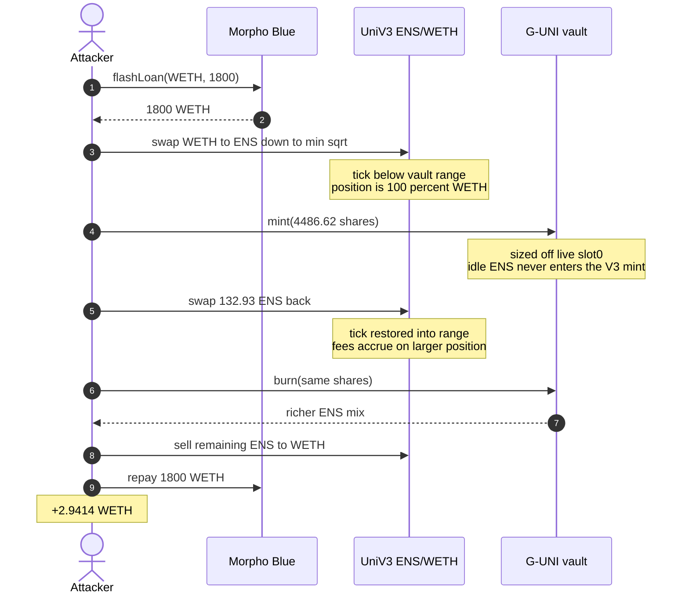
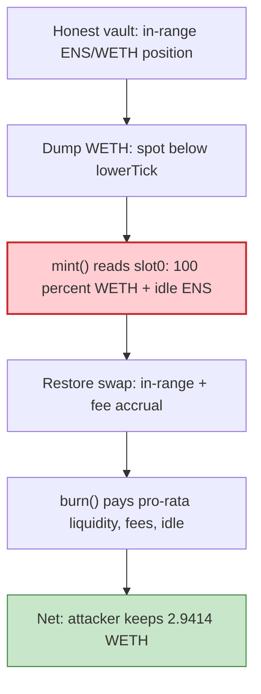

# Arrakis V1 G-UNI — Uniswap V3 spot-priced `mint`/`burn` sandwich (typed reconstruction)

> **Vulnerability classes:** vuln/defi/sandwich-attack · vuln/oracle/spot-price · vuln/oracle/missing-circuit-breaker

> **Reproduction:** the PoC compiles & runs in an isolated Foundry project at
> [this project folder](.). Full verbose trace: [output.txt](output.txt).
> Source test: [test/ArrakisGUNI_exp.sol](test/ArrakisGUNI_exp.sol).
> Sibling exact-source writeup of the **same incident**: [`2026-08-ArrakisFinance_exp`](../2026-08-ArrakisFinance_exp/ArrakisFinance_exp.md) (verified ArrakisVaultV1 / Uni V3 / Morpho sources live there).

---

## Key info

| | |
|---|---|
| **Loss** | **2.941350352900037140 WETH** (~$7,170) from the legacy G-UNI ENS/WETH vault [output.txt](output.txt) |
| **Vulnerable contract** | G-UNI ENS/WETH vault proxy [`0x7c687f775A3b73BBAb0E15832F24caaB5D53bDDe`](https://etherscan.io/address/0x7c687f775A3b73BBAb0E15832F24caaB5D53bDDe#code) |
| **Implementation** | ArrakisVaultV1 [`0xd68b055fb444D136e3aC4df023f4C42334F06395`](https://etherscan.io/address/0xd68b055fb444d136e3ac4df023f4c42334f06395#code) |
| **Attacker EOA** | [`0xa3B096e4df1247794599a37Af8F5b8CB05D5EB44`](https://etherscan.io/address/0xa3B096e4df1247794599a37Af8F5b8CB05D5EB44) |
| **Attacker contract** | [`0x028d9C17B1a097e7e115A6400203df86339BAf4a`](https://etherscan.io/address/0x028d9C17B1a097e7e115A6400203df86339BAf4a) (unverified; **not** replayed here) |
| **Attack tx** | [`0x6ae3af4b2f25a56594de99cfb31369150dd9ac059c49efe04b9e3e0163dbc672`](https://etherscan.io/tx/0x6ae3af4b2f25a56594de99cfb31369150dd9ac059c49efe04b9e3e0163dbc672) — block **25,817,966** |
| **Chain / block / date** | Ethereum / fork **25,817,965** / 2026-08-23 |
| **Compiler** | Solidity **v0.8.4**, optimizer **1 run** (ArrakisVaultV1) |
| **Bug class** | Permissionless `mint`/`burn` value the Uni V3 position off live `pool.slot0()`; TWAP/deviation wraps only keeper `rebalance()` |

This folder is the **typed-call reconstruction**: ordinary `IArrakisVaultV1.mint` / `burn` / `IUniV3Pool.swap` / Morpho `flashLoan` with the exact on-chain amounts. No bytecode blob, no redeploy of `0x028d9C17…`. Arrakis Pro is unaffected.

---

## TL;DR

Arrakis V1 (G-UNI) is a shared Uniswap V3 LP token. `mint()` and `burn()` size deposits and redemptions from `getUnderlyingBalances()`, which reads the pool's **instantaneous** `slot0()` sqrt price. The contract's TWAP / slippage guard wraps only the manager `rebalance()` path.

The attacker, in one Morpho flash loan of **1,800 WETH**:

1. Swaps **150 WETH** into the ENS/WETH 0.3% pool down to the min-price bound (~145.42 WETH in, ~13,292.5 ENS out) — tick walks below the vault range.
2. `vault.mint(4_486.619135659964587643, this)` — deposits ~1,253.39 WETH + ~13,159.59 ENS priced at the skewed spot.
3. Swaps ~132.93 ENS back (partial tick restore; fees accrue on the now-larger position).
4. `vault.burn` the same shares — redeems ~1,248.41 WETH + ~13,283.30 ENS (WETH-poorer, ENS-richer).
5. Sells all ENS back to WETH, repays Morpho. Surplus **2.9414 WETH**.

---

## Background

ArrakisVaultV1 (2021, formerly Gelato Uniswap / G-UNI) wraps a single Uni V3 position as an ERC-20. Depositors call `mint(mintAmount, receiver)`; `burn` returns a pro-rata slice of in-range liquidity, uncollected fees, and idle token0/token1.

This ENS–WETH vault is an EIP-173 proxy onto `0xd68b055f…`. Manager and upgrade roles were later **renounced**. Dust remained — enough for a flash-loan sandwich.

token0 = WETH, token1 = ENS. Vault range at the attack: ticks 32000–60000. Dumping WETH pushes spot below `lowerTick`, so the position is 100% WETH; idle ENS is still counted in `getUnderlyingBalances`, so a minter must deposit ENS that **never enters** the Uni V3 mint.

---

## The vulnerable code

Verified ArrakisVaultV1 (quoted from the sibling registry sources; same bytecode):

```solidity
function mint(uint256 mintAmount, address receiver)
    external nonReentrant
    returns (uint256 amount0, uint256 amount1, uint128 liquidityMinted)
{
    require(mintAmount > 0, "mint 0");
    uint256 totalSupply = totalSupply();
    (uint160 sqrtRatioX96, , , , , , ) = pool.slot0();   // live spot

    if (totalSupply > 0) {
        (uint256 amount0Current, uint256 amount1Current) = getUnderlyingBalances();
        amount0 = FullMath.mulDivRoundingUp(amount0Current, mintAmount, totalSupply);
        amount1 = FullMath.mulDivRoundingUp(amount1Current, mintAmount, totalSupply);
    }
    // transferFrom amount0/amount1, then pool.mint using the same sqrtRatioX96
}

function getUnderlyingBalances() public view returns (uint256 amount0Current, uint256 amount1Current) {
    (uint160 sqrtRatioX96, int24 tick, , , , , ) = pool.slot0();
    return _getUnderlyingBalances(sqrtRatioX96, tick);
}
```

`_checkSlippage` / `pool.observe(gelatoSlippageInterval)` is **only** called from Gelato `rebalance()`. User `mint`/`burn` have no TWAP, no deviation band, no "same-tx mint+burn" lock.

---

## Root cause

`mint` and `burn` in the same transaction do **not** see "the same" pool if the caller can move `slot0` around the vault ticks first. Out-of-range mint issues shares against a 100% WETH position plus idle ENS; restoring the tick puts the (now larger) position in range, accrues the restoring swap's fees, and `burn` pays a richer mix.

No privileged role is required. Morpho `flashLoan` + Uni V3 `swap` + vault `mint`/`burn` are all public.

---

## Preconditions

- Vault still has idle inventory / in-range liquidity worth sandwiching (~dust, but 2.94 WETH).
- Attacker can move the ENS/WETH 0.3% pool across the vault's tick range inside one tx (1,800 WETH flash is ample).
- `restrictedMintToggle` is not locking mint to the (renounced) manager.

---

## Attack walkthrough (on-chain amounts from the PoC header)

| # | Step | Amounts |
|---|---|---|
| 1 | Morpho flashLoan WETH | 1,800 WETH |
| 2 | Uni V3 `swap` zeroForOne to `MIN_SQRT` | 150 WETH in bound; ~145.42 WETH actually swapped, ~13,292.5 ENS out |
| 3 | `vault.mint(4486619135659964587643, this)` | ~1,253.39 WETH + ~13,159.59 ENS in |
| 4 | Uni V3 `swap` oneForZero | 132.925127733721320656 ENS in (partial restore) |
| 5 | `vault.burn` same shares | ~1,248.41 WETH + ~13,283.30 ENS out |
| 6 | Sell remaining ENS → WETH, repay Morpho | surplus **2.941350352900037140 WETH** |

The live attack contract skimmed a fixed 0.05 ETH builder tip; this PoC measures the raw WETH surplus and omits the skim.

```
attacker WETH surplus: 2.941350352900037140
[PASS] testExploit()
```

---

## Diagrams





---

## Remediation

1. **Snapshot valuation at the start of the tx** (or use a manipulation-resistant TWAP) for both `mint` and `burn`. Do not read `pool.slot0()` to size a share issue the same account can sandwich.
2. **Extend `_checkSlippage` to `mint`/`burn`**, not only `rebalance()`.
3. **Reject mint+burn in the same transaction** from the same address, or lock newly minted shares for N blocks.
4. **Deprecate leftover V1 vaults** (Arrakis already moved to Arrakis Pro); withdraw remaining TVL.

---

## How to reproduce

```bash
_shared/run_poc.sh 2026-08-ArrakisGUNI_exp --mt testExploit -vvvvv
```

Expected: `[PASS] testExploit()` with `attacker WETH surplus: 2.941350352900037140`.

---

*Reference: https://x.com/SlowMist_Team/status/2091738634210996429*
