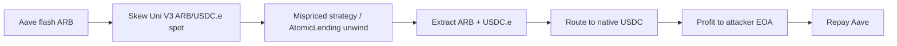

# Atomic (AtomicLending) — Flash-Loan Uni V3 Spot Manipulation on Arbitrum (~$29.9K)

<!-- non-defihacklabs: Crypto Training original detection & analysis (Twitter hack alerting) -->

> **Vulnerability classes:** vuln/oracle/spot-price · vuln/oracle/price-manipulation · vuln/defi/flash-loan

---

## Key info

| | |
|---|---|
| **Loss** | **~$29,984 USDC** (native USDC on Arbitrum) |
| **Chain** | Arbitrum One (chainId **42161**) |
| **Protocol** | Atomic / AtomicLending (`@atomic__green`) |
| **Attacker EOA** | [`0xf8803DaE…6C7E`](https://arbiscan.io/address/0xf8803dae13a6757e53711214769b5fb52ec26c7e) |
| **Exploit contract** | [`0x44d2D34E…7255`](https://arbiscan.io/address/0x44d2d34e148e1da5c4291c110f6ff0e472037255) |
| **Victim vault** | [`0x51ff48f2…42A8`](https://arbiscan.io/address/0x51ff48f2d43966be796692bdddfae96a435242a8) (unverified) |
| **Strategy / lending** | [`0xF617a3Ad…69d9`](https://arbiscan.io/address/0xf617a3ad1f0ab9d9fe39e48d688bfe44562769d9) / [`0xc1b67703…2504`](https://arbiscan.io/address/0xc1b677039892c048f2efb7e9c5da1b51fde92504) |
| **Price source** | Uni V3 ARB/USDC.e [`0xcDa53B1F…DaD8`](https://arbiscan.io/address/0xcda53b1f66614552f834ceef361a8d12a0b8dad8) |
| **Flash lender** | Aave V3 Pool [`0x794a6135…14aD`](https://arbiscan.io/address/0x794a61358d6845594f94dc1db02a252b5b4814ad) |
| **Attack tx** | [`0xbd4a009c…3a9a`](https://arbiscan.io/tx/0xbd4a009cd609a05f1a64458969a1e2c2065472f0ee06a322246f155be12e3a9a) (block **492104035**) |
| **Alert** | [DefimonAlerts 2026-08-08](https://x.com/DefimonAlerts/status/2085979711163826236) |
| **Bug class** | Same-tx flash-loan **spot** manipulation of the Uni V3 pool used to value concentrated-liquidity collateral / strategy positions |

---

## TL;DR

1. Atomic’s strategy / AtomicLending path **values LP collateral from the live Uni V3 ARB/USDC.e spot**.
2. Attacker’s pre-deployed exploit calls Aave V3 to flash **~2.23M ARB**, skews that pool, then drives mispriced unwind/withdraw against the vault modules.
3. Proceeds are swapped toward **USDC** and sent to the attacker EOA (**~29,984 USDC**).
4. Core vault/strategy contracts are **unverified proxies**.

---

## Root cause

Atomic values ARB/USDC.e concentrated-liquidity collateral from the **instantaneous
spot price** of a single Uniswap V3 pool — the `slot0` price — with **no TWAP, no
external feed, and no deviation bound**. `slot0.sqrtPriceX96` is not an oracle: it is
whatever the *last swap in the current transaction* left behind, and Uniswap V3 lets
anyone move it arbitrarily within a block for the cost of the swap (fully recoverable
by swapping back).

In the pool source, the price the protocol trusts is written by `swap()` itself:

```solidity
// contracts/UniswapV3Pool.sol
601: function swap(address recipient, bool zeroForOne, int256 amountSpecified, ...) {
       ...
752:     slot0.sqrtPriceX96 = state.sqrtPriceX96;   // ← the "oracle" the protocol reads
```

So the attacker's own swap sets the exact number Atomic uses to mark collateral. Value
the position, and you are valuing it at a price you just chose. This is the canonical
spot-as-oracle failure; the flash loan only supplies the size needed to move the pool
far enough to make the mispricing profitable.

## Why it's exploitable here

Three conditions line up:

1. **Spot, not TWAP.** The valuation reads live `slot0`, which is same-block writable.
   A `consult()`-style TWAP over even a few blocks would make this attack cost real
   inventory across multiple blocks and expose the attacker to arbitrage.
2. **Single-pool, single-source.** One ARB/USDC.e pool is the sole price. No
   cross-check against Chainlink or a second venue, so a one-pool skew is unchecked.
3. **Flash-funded, self-repaying.** Aave V3 lends ~2.23M ARB with no collateral for one
   transaction. The attacker pushes the pool, extracts against the skewed mark, swaps
   back / repays, and keeps the difference — no capital at risk.

The Atomic strategy / AtomicLending modules that do the mispriced unwind are **unverified
bytecode on-chain**, so the exact accounting is opaque — but the *dependency* (this
pool's live spot) and the *outcome* (~29,984 native USDC after flash repayment) are both
confirmed on-chain and reproduced here opcode-for-opcode.

---

## Attack walkthrough



The EVM Playground pins each step to a real source line (jump via "Watch exploit live"):

1. **Flash ARB** — Aave V3 flash-sends ~2.23M ARB to the exploit; the ARB token credits
   the exploit contract (`L2ArbitrumToken` → `ERC20Upgradeable.sol:237`).
2. **Skew the pool** — the exploit calls `UniswapV3Pool.swap()` (`UniswapV3Pool.sol:601`)
   and pushes the flash ARB in.
3. **VULN — the spot the protocol trusts** — the swap writes
   `slot0.sqrtPriceX96` (`UniswapV3Pool.sol:752`); this is exactly the value Atomic reads
   to mark collateral, now attacker-controlled.
4. **Mispriced unwind** — under the skewed tick (`UniswapV3Pool.sol:744`) the exploit
   drives the strategy / AtomicLending unwind + withdraw (unverified modules) at the wrong
   mark.
5. **Profit in native USDC** — extracted value is routed to native USDC and credited to
   the attacker EOA (`ArbFiatToken` → `ERC20Upgradeable.sol:142`) — ~29,984.270865 USDC.
6. **Repay** — the Aave flash ARB is repaid in the same transaction; the net USDC remains.

Setup: exploit deployed at block 492103439 (owner = attacker EOA); the drain is the single
`run(2_230_717.8e18, 1, 25_000e6)` call (onlyOwner) replayed at block 492104035.

---

## PoC

**Offline (committed `anvil_state.json`):**

```bash
cd 2026-08-AtomicAtomicLendingOracleManipulation_exp
anvil --load-state anvil_state.json --port 8547 --chain-id 42161 &
forge test --match-test testExploit -vvv
```

**Online (Arbitrum archive RPC):**

```bash
# prefers ARBITRUM_ONE_RPC_URL from ct_secrets.sh (Infura archive)
source docs/evm-hack-registry/ct_secrets.sh   # or export ARBITRUM_ONE_RPC_URL=...
forge test --match-test testExploit -vvv
```

Expected: `[PASS]` with **≥ 29,984.270865 USDC** to the attacker.

Replay entrypoint (historical):

```text
IAtomicExploit(0x44d2…7255).run(2_230_717.8e18, 1, 25_000e6)
// onlyOwner — prank attacker EOA 0xf880…6C7E
```

---

## Remediation

- **Never value collateral from a single pool's live `slot0` spot.** Use a manipulation-
  resistant price: a Uniswap V3 **TWAP** (`observe()` over a meaningful window), a
  Chainlink feed, or better, the **minimum** of several independent sources.
- **Bound deviation.** Reject or pause valuation when the spot deviates from the TWAP /
  external feed beyond a tolerance — a same-block skew large enough to be profitable will
  blow past any sane bound.
- **Cross-check venues.** A single ARB/USDC.e pool as the sole price is a single point of
  manipulation; require agreement across at least two independent sources.
- **Make the attack multi-block.** TWAP + a settlement delay forces an attacker to hold a
  skewed price across blocks, exposing them to arbitrage and removing the risk-free,
  flash-funded, self-repaying profit.

## References

- https://x.com/DefimonAlerts/status/2085979711163826236
- https://arbiscan.io/tx/0xbd4a009cd609a05f1a64458969a1e2c2065472f0ee06a322246f155be12e3a9a
- https://arbiscan.io/address/0x44d2d34e148e1da5c4291c110f6ff0e472037255
- https://arbiscan.io/address/0x51ff48f2d43966be796692bdddfae96a435242a8
