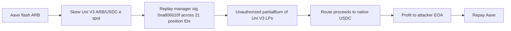

# Atomic (AtomicLending) — Signature Replay + Flash-Loan Spot Manip on Arbitrum (~$29.9K)

<!-- non-defihacklabs: Crypto Training original detection & analysis (Twitter hack alerting) -->

> **Vulnerability classes:** vuln/auth/signature-replay · vuln/oracle/spot-price · vuln/oracle/price-manipulation · vuln/defi/flash-loan

---

## Key info

| | |
|---|---|
| **Loss** | **~$29,984 USDC** (native USDC on Arbitrum) |
| **Chain** | Arbitrum One (chainId **42161**) |
| **Protocol** | Atomic / AtomicLending (`@atomic__green`) |
| **Attacker EOA** | [`0xf8803DaE…6C7E`](https://arbiscan.io/address/0xf8803dae13a6757e53711214769b5fb52ec26c7e) |
| **Exploit contract** | [`0x44d2D34E…7255`](https://arbiscan.io/address/0x44d2d34e148e1da5c4291c110f6ff0e472037255) |
| **Victim vault** | [`0x51ff48f2…42A8`](https://arbiscan.io/address/0x51ff48f2d43966be796692bdddfae96a435242a8) (unverified) |
| **Position manager / strategy** | [`0xF617a3Ad…69d9`](https://arbiscan.io/address/0xf617a3ad1f0ab9d9fe39e48d688bfe44562769d9) |
| **Business logic (sig check)** | [`0x62cc5522…4a0a`](https://arbiscan.io/address/0x62cc552215303341f9651e89db40e7336a394a0a) — selector **`0xa806010f`** |
| **AtomicLending** | [`0xc1b67703…2504`](https://arbiscan.io/address/0xc1b677039892c048f2efb7e9c5da1b51fde92504) |
| **Price source** | Uni V3 ARB/USDC.e [`0xcDa53B1F…DaD8`](https://arbiscan.io/address/0xcda53b1f66614552f834ceef361a8d12a0b8dad8) |
| **Flash lender** | Aave V3 Pool [`0x794a6135…14aD`](https://arbiscan.io/address/0x794a61358d6845594f94dc1db02a252b5b4814ad) |
| **Attack tx** | [`0xbd4a009c…3a9a`](https://arbiscan.io/tx/0xbd4a009cd609a05f1a64458969a1e2c2065472f0ee06a322246f155be12e3a9a) (block **492104035**) |
| **Alert** | [SlowMist TI](https://x.com/SlowMist_Team/status/2086042810265055619) (root cause) · [DefimonAlerts](https://x.com/DefimonAlerts/status/2085979711163826236) |
| **Bug class** | **Signature replay** on manager-authorized `partialBurn` (`0xa806010f`) — digest missing position ID, manager, caller, nonce, deadline, chain ID — combined with same-tx Uni V3 **spot** manip under flash loan |

---

## TL;DR

1. **Auth bug (primary, SlowMist):** a manager signature for Uni V3 LP operations did **not bind** position ID / manager / caller / nonce / deadline / chain ID, so the **same signature was replayed across 21 position IDs** to authorize full burns (`partialBurn` / `0xa806010f`).
2. **Oracle bug (amplifier):** burns / valuation run under a **flash-loan-skewed** Uni V3 ARB/USDC.e spot (no TWAP / slippage guard).
3. Attacker flash-borrows **~2.23M ARB** via Aave V3, executes the replayed burns under the skewed mark, routes proceeds to **~29,984 USDC**.
4. Core vault / strategy / business logic are **unverified** (or proxy-only) on-chain.

---

## Root cause

**Primary root cause (SlowMist TI): signature replay in `0xa806010f`.**

Business logic at [`0x62cc5522…4a0a`](https://arbiscan.io/address/0x62cc552215303341f9651e89db40e7336a394a0a)
implements manager-authorized Uni V3 LP burns via selector **`0xa806010f`**
(`partialBurn` path). The **signed digest did not bind** fields that must be unique per
authorization:

| Missing in digest | Why it matters |
|---|---|
| **Position ID** | One sig authorizes **any** NFT / LP id |
| **Position manager** | Cross-manager reuse |
| **Caller** | Anyone can submit the sig |
| **Nonce** | Unlimited replay |
| **Deadline** | No expiry |
| **Chain ID** | Cross-chain replay risk |

The **same manager signature was replayed across 21 different position IDs**, authorizing
unauthorized full Uni V3 LP burns. A correctly bound EIP-712 (or equivalent) digest would
have limited that signature to a single position, caller, chain, and one-time use.

**Economic amplifier (not the primary auth bug):** burns / settlement also trust the **live
Uniswap V3 ARB/USDC.e `slot0` spot** (no TWAP / slippage bound). Aave V3 flash-lends
~2.23M ARB so the attacker can skew that spot in the same transaction, maximizing what
the replayed burns extract. Flash is repaid in-tx; attacker keeps ~29,984 native USDC.

```solidity
// contracts/UniswapV3Pool.sol — amplifier only (spot the protocol reads under the burns)
601: function swap(...) { ... }
752:     slot0.sqrtPriceX96 = state.sqrtPriceX96;
```

Business logic / strategy modules are largely **unverified bytecode**, so the exact digest
layout is opaque on explorers — but the *selector*, *logic address*, *21× replay*
(SlowMist), *flash + spot path*, and *USDC outcome* are confirmed on-chain. This PoC
replays historical exploit `run(...)` end-to-end.

## Why it's exploitable here

1. **Root cause — unbound manager signature on `0xa806010f`** → one sig is a skeleton key for many position IDs.
2. **Amplifier — spot, not TWAP** → same-block writable price for burn / valuation accounting.
3. **Flash-funded** → no capital at risk; self-repaying within one transaction.

---

## Attack walkthrough



1. **Flash ARB** — Aave V3 flash-sends ~2.23M ARB to the historical exploit.
2. **Skew the pool (amplifier)** — exploit swaps into Uni V3 ARB/USDC.e so live `slot0`
   moves (no TWAP guard on settlement).
3. **VULN — signature replay `0xa806010f`** — same manager signature is submitted for
   **many** position IDs against business logic `0x62cc…4a0a` (digest missing positionId /
   manager / caller / nonce / deadline / chainId).
4. **Unauthorized LP burns** — `partialBurn` fully burns positions the attacker was not
   legitimately authorized for, under the skewed mark.
5. **Profit in native USDC** — extracted value → attacker EOA (~29,984.270865 USDC).
6. **Repay** — Aave flash ARB repaid in the same transaction.

Setup: exploit at `0x44d2…7255` (owner = attacker EOA); drain is
`run(2_230_717.8e18, 1, 25_000e6)` at block 492104035.

---

## PoC

**Offline (committed `anvil_state.json`):**

```bash
cd 2026-08-AtomicAtomicLendingOracleManipulation_exp
anvil --load-state anvil_state.json --port 8547 --chain-id 42161 &
forge test --match-test testExploit -vvv
```

**Online (Arbitrum archive RPC):**

```bash
# prefers ARBITRUM_ONE_RPC_URL from ct_secrets.sh (Infura archive)
source docs/evm-hack-registry/ct_secrets.sh   # or export ARBITRUM_ONE_RPC_URL=...
forge test --match-test testExploit -vvv
```

Expected: `[PASS]` with **≥ 29,984.270865 USDC** to the attacker.

Replay entrypoint (historical):

```text
IAtomicExploit(0x44d2…7255).run(2_230_717.8e18, 1, 25_000e6)
// onlyOwner — prank attacker EOA 0xf880…6C7E
```

---

## Remediation

**Signatures / authorization**

- Bind **every** security-critical field in the signed digest: `positionId`, `positionManager`,
  `msg.sender` (or explicit caller), **nonce**, **deadline**, **chainId**, and action
  parameters (amounts, token ids, burn mode).
- Prefer **EIP-712** domain separation; invalidate nonces on use; reject expired deadlines.
- Never accept a manager sig that can authorize **full burn** across unbounded ids.

**Oracle / settlement**

- **Never value collateral from a single pool's live `slot0` spot.** Use a Uni V3 **TWAP**,
  Chainlink, or the **minimum** of several independent sources.
- **Bound deviation / slippage** on burn / withdraw paths so a same-block skew cannot
  maximize extractable value.
- Make profitable manip **multi-block** (TWAP window + settlement delay).

---

## References

- https://x.com/SlowMist_Team/status/2086042810265055619 — SlowMist TI: signature replay in `0xa806010f` (primary root cause)
- https://x.com/DefimonAlerts/status/2085979711163826236 — DefimonAlerts initial drain alert
- https://arbiscan.io/tx/0xbd4a009cd609a05f1a64458969a1e2c2065472f0ee06a322246f155be12e3a9a
- https://arbiscan.io/address/0x62cc552215303341f9651e89db40e7336a394a0a
- https://arbiscan.io/address/0x44d2d34e148e1da5c4291c110f6ff0e472037255

## References

- https://x.com/DefimonAlerts/status/2085979711163826236
- https://arbiscan.io/tx/0xbd4a009cd609a05f1a64458969a1e2c2065472f0ee06a322246f155be12e3a9a
- https://arbiscan.io/address/0x44d2d34e148e1da5c4291c110f6ff0e472037255
- https://arbiscan.io/address/0x51ff48f2d43966be796692bdddfae96a435242a8
