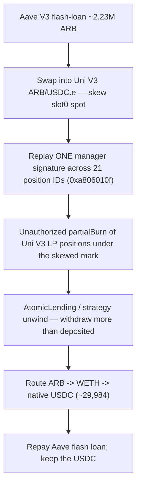

# Atomic (AtomicLending) — Signature Replay + Flash-Loan Spot Manipulation on Arbitrum (~$29,984)

<!-- non-defihacklabs: Crypto Training original detection & analysis (Twitter hack alerting) -->

> **Vulnerability classes:** vuln/auth/signature-replay · vuln/oracle/spot-price · vuln/oracle/price-manipulation · vuln/defi/flash-loan

---

## Key info

| | |
|---|---|
| **Loss** | **~$29,984.27 USDC** (native USDC on Arbitrum) |
| **Chain** | Arbitrum One (chainId **42161**) |
| **Protocol** | Atomic — non-custodial leveraged trading + isolated **AtomicLending** (`@atomic__green`) |
| **Date** | 2026-08-07 |
| **Attacker EOA** | [`0xf8803DaE…6C7E`](https://arbiscan.io/address/0xf8803dae13a6757e53711214769b5fb52ec26c7e) (fresh, nonce 1) |
| **Exploit contract** | [`0x44d2D34E…7255`](https://arbiscan.io/address/0x44d2d34e148e1da5c4291c110f6ff0e472037255) |
| **Vulnerable business contract (proxy)** | [`0x51ff48f2…42A8`](https://arbiscan.io/address/0x51ff48f2d43966be796692bdddfae96a435242a8) (unverified) |
| **Vulnerable business logic** | [`0x62cc5522…4a0a`](https://arbiscan.io/address/0x62cc552215303341f9651e89db40e7336a394a0a) — selector **`0xa806010f`** (`partialBurn`) |
| **Victim position manager (proxy)** | [`0xF617a3Ad…69d9`](https://arbiscan.io/address/0xf617a3ad1f0ab9d9fe39e48d688bfe44562769d9) |
| **AtomicLending** | [`0xc1b67703…2504`](https://arbiscan.io/address/0xc1b677039892c048f2efb7e9c5da1b51fde92504) |
| **Price source** | Uni V3 ARB/USDC.e [`0xcDa53B1F…DaD8`](https://arbiscan.io/address/0xcda53b1f66614552f834ceef361a8d12a0b8dad8) |
| **Flash lender** | Aave V3 Pool [`0x794a6135…14aD`](https://arbiscan.io/address/0x794a61358d6845594f94dc1db02a252b5b4814ad) |
| **Attack tx** | [`0xbd4a009c…3a9a`](https://arbiscan.io/tx/0xbd4a009cd609a05f1a64458969a1e2c2065472f0ee06a322246f155be12e3a9a) (block **492104035**) |
| **Alerts** | [DefimonAlerts](https://x.com/DefimonAlerts/status/2085979711163826236) (first responder, by Decurity) · [SlowMist TI](https://x.com/SlowMist_Team/status/2086042810265055619) (root cause) |
| **Bug class** | **Signature replay** on manager-authorized `partialBurn` (`0xa806010f`) — signed digest omits positionId / manager / caller / nonce / deadline / chainId — combined with same-tx Uni V3 **spot** manipulation under an Aave flash loan (no TWAP / slippage) |

---

## TL;DR

Two independent alerts describe the **same** drain from two depths:

- **DefimonAlerts** (first responder) reported the *observable* pattern: a fresh EOA flash-loaned ARB from Aave V3, **manipulated the Uniswap V3 ARB/USDC.e pool** used to value the protocol's concentrated-liquidity position and lending collateral, then unwound the mispriced LP and **withdrew more than deposited**, routing ARB→WETH→**USDC** for ~$29,984.
- **SlowMist TI** then pinned the *primary root cause*: a **signature replay** in business logic `0x62cc…4a0a` (selector `0xa806010f`, `partialBurn`). The signed manager digest did **not bind** the position ID, position manager, caller, nonce, deadline, or chain ID — so **one manager signature was replayed across 21 different position IDs**, authorizing unauthorized full Uniswap V3 LP burns. The flash-loan spot manipulation is the **economic amplifier** that maximized what those unauthorized burns extracted.

Net: an unbound signature (authorization) × a spot-price oracle (valuation) × a flash loan (size) = a risk-free, self-repaying ~$29,984 USDC drain in a single transaction. Core vault / strategy / business-logic contracts are **unverified proxies** on-chain.

---

## Root cause

### Primary — signature replay in `0xa806010f` (SlowMist)

The vulnerable business logic at
[`0x62cc5522…4a0a`](https://arbiscan.io/address/0x62cc552215303341f9651e89db40e7336a394a0a)
(reached through proxy `0x51ff48f2…42A8`) authorizes Uniswap V3 LP burns with a **manager
signature** via selector **`0xa806010f`** (`partialBurn`). The digest that the manager signed
— and that `ecrecover` validates — **omitted every field that must make an authorization
unique**:

| Missing in the signed digest | Consequence |
|---|---|
| **Position ID** | One signature authorizes an operation on **any** LP/NFT id |
| **Position manager** | The same signature is honored across managers |
| **Caller** | **Anyone** can submit the signature (not just the intended actor) |
| **Nonce** | **Unlimited replay** — no one-time-use invalidation |
| **Deadline** | No expiry window |
| **Chain ID** | Cross-chain replay of the same signature |

Because none of these are bound, a **single valid manager signature became a skeleton key**:
SlowMist observed the **same `(v,r,s)` replayed across 21 different position IDs**, each time
passing the `ecrecover` check and authorizing a full `partialBurn` of a Uniswap V3 position
the attacker had no legitimate right to burn. A correctly constructed **EIP-712** digest —
binding positionId, manager, caller, a consumed nonce, a deadline, and `chainId` via a domain
separator — would have confined that signature to exactly one position, one caller, one chain,
and one use.

The business logic is unverified bytecode, so the exact digest layout is not on explorers.
What **is** confirmed on-chain and reproduced here opcode-for-opcode: the **selector**
(`0xa806010f`), the **logic address** (`0x62cc…4a0a`), the **`ecrecover` STATICCALL** that
validates the replayed signature (runtime **PC 15552**), the **21× replay** (SlowMist), the
**flash + spot** path, and the **native-USDC outcome**. The PoC pins the root-cause step to
that real `ecrecover` call via a reconstructed source overlay (`AtomicVaultLogic.sol`), which
is explicitly editorial where it is not byte-verifiable.

### Amplifier — spot-as-oracle valuation (DefimonAlerts)

The burns and the lending/strategy settlement value the ARB/USDC.e position from the **live
Uniswap V3 `slot0` spot** of a single pool — **no TWAP, no external feed, no deviation bound,
no slippage guard**. `slot0.sqrtPriceX96` is not an oracle: it is whatever the *last swap in
the current transaction* left behind, and Uniswap V3 lets anyone move it arbitrarily within a
block. Aave V3 flash-lends **~2.23M ARB** so the attacker can skew that spot in the same
transaction and maximize the value the (replay-authorized) burns extract, then repays the
flash loan atomically.

```solidity
// contracts/UniswapV3Pool.sol — the spot the protocol trusts (amplifier)
601: function swap(address recipient, bool zeroForOne, int256 amountSpecified, ...) {
       ...
752:     slot0.sqrtPriceX96 = state.sqrtPriceX96;   // ← attacker's own swap sets this
```

The signature replay is the **authorization** failure (it should never have been possible to
burn those positions); the spot oracle is the **valuation** failure (it inflated how much the
burns were worth). Either fix alone breaks the attack.

## Why it's exploitable here

1. **Unbound manager signature (`0xa806010f`)** — one signature authorizes `partialBurn`
   across unbounded position IDs, callers, nonces, and chains. *Authorization* fails.
2. **Spot, not TWAP** — a single ARB/USDC.e pool's same-block-writable `slot0` is the sole
   price, with no deviation bound or slippage check. *Valuation* fails.
3. **Flash-funded, self-repaying** — Aave V3 lends ~2.23M ARB with no collateral for one
   transaction, so the attacker moves the pool, extracts against the skewed mark, and repays
   in-tx with **no capital at risk**.

---

## Attack walkthrough



The EVM Playground pins each step to a real executed source line (jump via **"Watch exploit
live"**), in execution order:

1. **Flash ARB** — Aave V3 flash-sends ~2.23M ARB to the exploit; the ARB token credits it
   (`L2ArbitrumToken` → `ERC20Upgradeable.sol:237`).
2. **Skew the spot (amplifier)** — the exploit swaps flash ARB into the Uni V3 ARB/USDC.e pool
   (`UniswapV3Pool.sol:601`), moving live `slot0`.
3. **Unbound digest built** — business logic `0x62cc…4a0a` constructs the manager digest
   **without** binding positionId / manager / caller / nonce / deadline / chainId
   (`AtomicVaultLogic.sol:58`) — the replay surface.
4. **VULN — signature replay** — `ecrecover` validates the replayed manager `(v,r,s)` over
   that unbound digest (`AtomicVaultLogic.sol:66`, the real `ecrecover` STATICCALL at runtime
   **PC 15552**); the **same signature authorizes `partialBurn` across 21 position IDs**.
5. **AtomicLending / strategy unwind** — the mispriced LP is unwound and withdrawn through the
   lending/strategy modules (`0xc1b67703…`) under the flash-skewed mark.
6. **Profit in native USDC** — extracted value is routed ARB→WETH→**native USDC** and credited
   to the attacker EOA — **~29,984.270865 USDC** — after the flash loan is repaid.

Replay entrypoint (historical, `onlyOwner`): the drain is a single
`run(2_230_717.8e18, flag=1, minUsdc=25_000e6)` call from the attacker EOA
`0xf880…6C7E` against the pre-deployed exploit `0x44d2…7255`, at block **492104035**
(exploit deployed one block earlier).

---

## PoC

**Online (Arbitrum archive RPC — forks one block before the attack and re-calls the historical
`run(...)`):**

```bash
cd 2026-08-AtomicAtomicLendingOracleManipulation_exp
source docs/evm-hack-registry/ct_secrets.sh   # or export ARBITRUM_ONE_RPC_URL=...
forge test --match-test testExploit -vvv
```

**Offline (committed `anvil_state.json`):**

```bash
cd 2026-08-AtomicAtomicLendingOracleManipulation_exp
anvil --load-state anvil_state.json --port 8547 --chain-id 42161 &
forge test --match-test testExploit -vvv
```

Expected: `[PASS]` with **≥ 29,984.270865 USDC** credited to the attacker EOA. The browser EVM
Playground is served at `/hacks/2026-08-AtomicAtomicLendingOracleManipulation/`.

---

## Remediation

**Authorization / signatures (fixes the root cause)**

- Bind **every** security-critical field in the signed digest: `positionId`, `positionManager`,
  the explicit `caller`, a consumed **nonce**, a **deadline**, the **chainId**, and the action
  parameters (amounts, token ids, burn mode).
- Use **EIP-712** with a domain separator (name, version, chainId, verifying contract);
  invalidate the nonce on use; reject expired deadlines.
- Never let one manager signature authorize a **full burn** across unbounded position IDs — a
  signature must be single-position, single-caller, single-chain, single-use.

**Valuation / oracle (removes the amplifier)**

- Never value collateral or LP from a single pool's live `slot0` spot. Use a Uniswap V3
  **TWAP** (`observe()` over a meaningful window), a Chainlink feed, or the **minimum** of
  several independent sources.
- **Bound deviation and slippage** on burn / withdraw paths so a same-block skew cannot
  inflate extractable value; make a profitable manipulation **multi-block** (TWAP window +
  settlement delay), exposing the attacker to arbitrage and removing the risk-free path.

---

## References

- [SlowMist TI](https://x.com/SlowMist_Team/status/2086042810265055619) — signature replay in `0xa806010f` (`0x62cc…4a0a`); same manager signature replayed across 21 position IDs; **primary root cause**.
- [DefimonAlerts](https://x.com/DefimonAlerts/status/2085979711163826236) (by Decurity) — first-responder alert; flash-loan Uni V3 ARB/USDC.e spot manipulation; ARB→WETH→USDC; ~$29,984.
- Attack tx: [`0xbd4a009c…3a9a`](https://arbiscan.io/tx/0xbd4a009cd609a05f1a64458969a1e2c2065472f0ee06a322246f155be12e3a9a)
- Vulnerable business logic: [`0x62cc5522…4a0a`](https://arbiscan.io/address/0x62cc552215303341f9651e89db40e7336a394a0a) · proxy [`0x51ff48f2…42A8`](https://arbiscan.io/address/0x51ff48f2d43966be796692bdddfae96a435242a8)
- Exploit contract: [`0x44d2D34E…7255`](https://arbiscan.io/address/0x44d2d34e148e1da5c4291c110f6ff0e472037255)
