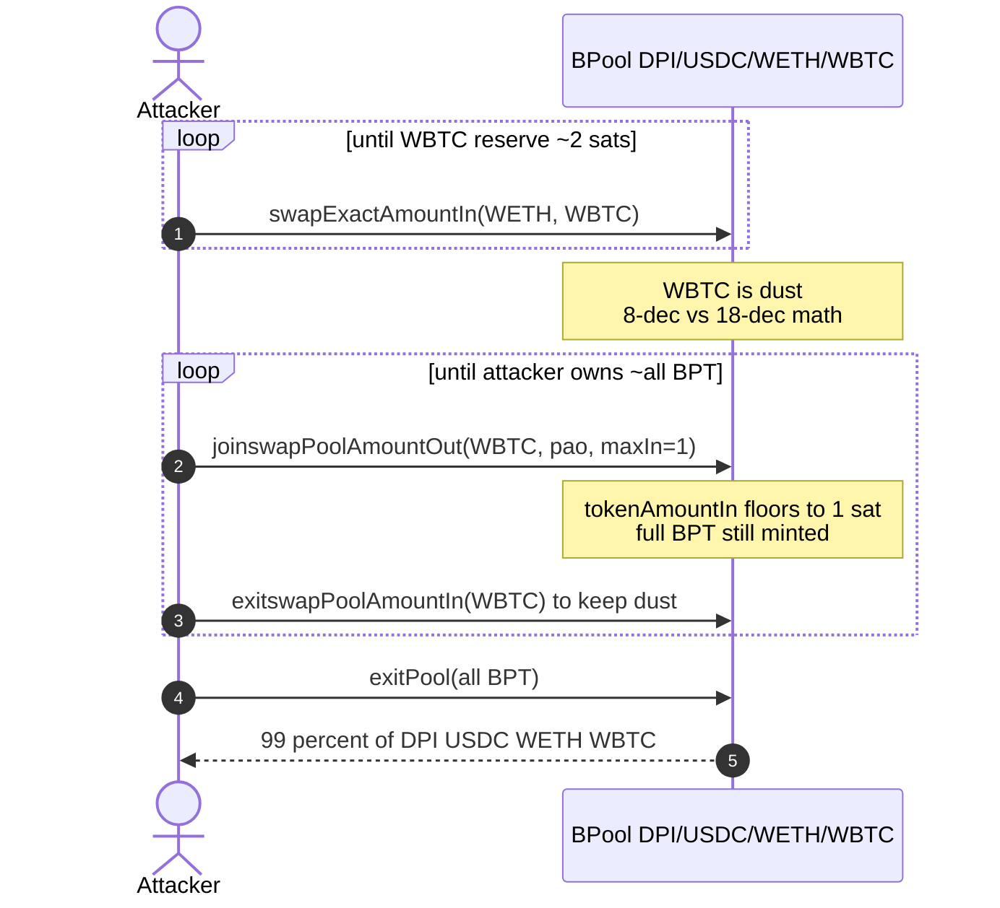
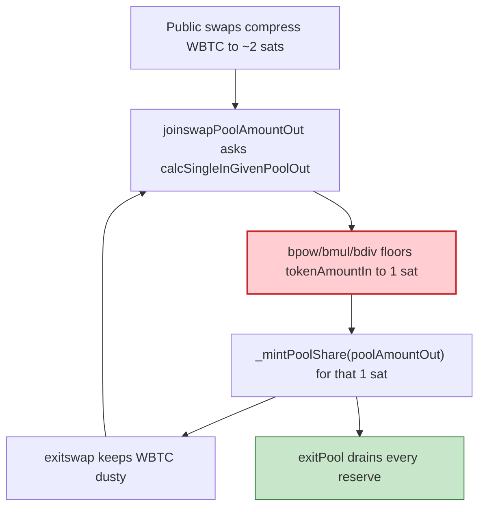

# Balancer V1 BPool — `joinswapPoolAmountOut` rounding drain (empirical reconstruction)

> **Vulnerability classes:** vuln/arithmetic/rounding · vuln/arithmetic/precision-loss · vuln/arithmetic/decimal-mismatch · vuln/logic/price-calculation

> **Reproduction:** the PoC compiles & runs in an isolated Foundry project at
> [this project folder](.). Full verbose trace: [output.txt](output.txt).
> Source test: [test/BalancerV1BPool_exp.sol](test/BalancerV1BPool_exp.sol).
>
> **Keep distinct from** [`2026-08-BalancerV1JoinswapRounding_exp`](../2026-08-BalancerV1JoinswapRounding_exp/BalancerV1JoinswapRounding_exp.md): that sibling replays the **live attack schedule** (exact join sizes, flash stand-in, ~$234k residual accounting). This folder reconstructs the **same primary pool and same bug** as an empirical join/exit loop that converges to ≥99% of every reserve (~$110,839 for this pool). It is **not** the Nov-2025 Balancer V2 Composable Stable campaign.

---

## Key info

| | |
|---|---|
| **Loss** | This pool ~**$110,839** (99% of DPI/USDC/WETH/WBTC). SlowMist ~$234k is the **five-pool** aggregate. PoC: profit USD **110,975.05** [output.txt](output.txt) |
| **Vulnerable contract** | Balancer V1 `BPool` — [`0x2257aaac34BcB27900291f7B84eE2565A6cbaC57`](https://etherscan.io/address/0x2257aaac34bcb27900291f7b84ee2565a6cbac57#code) |
| **Attacker EOA** | [`0x338C7Ec9BefbB451d66Fd8A468c32184f5689a41`](https://etherscan.io/address/0x338C7Ec9BefbB451d66Fd8A468c32184f5689a41) |
| **Attack contract** | [`0x9cAa8d0E44b22f50057d2F4ce0D1446529e11be3`](https://etherscan.io/address/0x9cAa8d0E44b22f50057d2F4ce0D1446529e11be3) |
| **Attack tx** | [`0x72510b257cc09bde8435b83ac1636f9498ffc353583330600b5b8da43d0d1aff`](https://etherscan.io/tx/0x72510b257cc09bde8435b83ac1636f9498ffc353583330600b5b8da43d0d1aff) (block **25,872,274**) |
| **Chain / block / date** | Ethereum / fork **25,872,273** / 2026-08-31 |
| **Compiler** | Solidity 0.5.12 (verified Balancer core) |
| **Bug class** | After public swaps compress 8-decimal WBTC to dust, `calcSingleInGivenPoolOut` floors `tokenAmountIn` to 1 sat while the full caller-chosen BPT is still minted |

---

## TL;DR

Balancer V1 `joinswapPoolAmountOut` lets the caller **name the BPT out**; the pool reverse-computes the single-token deposit via 18-decimal `bmul`/`bdiv`/`bpow`. `MIN_BALANCE` is only enforced in `bind`/`rebind`. Once public swaps drive the pool's **WBTC (8 decimals)** reserve to a couple of satoshi, that reverse formula rounds `tokenAmountIn` down to **1 sat**, and the only lower bound is `tokenAmountIn != 0`.

This PoC:

1. Compresses WBTC to ~2 sats with `swapExactAmountIn(WETH → WBTC)` (MAX_OUT_RATIO bounded).
2. Loops `joinswapPoolAmountOut(WBTC, pao, maxIn=1)` + `exitswapPoolAmountIn(WBTC, pai, minOut=1)` until it owns ~the entire BPT supply (~322 joins here vs ~100 in the live tx).
3. `exitPool`s the BPT for a proportional cut of DPI / USDC / WETH / WBTC.

Working capital is `deal`ed (stand-in for nested Spark/Aave + Morpho + Uni V3 flash loans that net to zero). Asserts ≥99% of every original reserve and USD value ≈ $110,839.

---

## Background

Balancer V1 `BPool` is a constant-product AMM with denormalized weights. This pool is four-asset **DPI / USDC / WETH / WBTC**, equal 12.5e18 denorm weights. Single-sided liquidity:

- `joinswapExternAmountIn` — specify token in, compute BPT out.
- `joinswapPoolAmountOut` — specify **BPT out**, compute token in.

The second path is the bug: caller-chosen mint, reverse math that truncates on dusty 8-decimal balances.

On-chain the drain tx made **290 BPool calls**: 38× `swapExactAmountIn` + 3× `swapExactAmountOut` to compress WBTC; ~100× join/exitSwap pairs; 44× `swapExactAmountOut` + 1× `exitPool` to redeem.

---

## The vulnerable code

Verified BPool / BMath (same sources as the JoinswapRounding sibling):

```solidity
function joinswapPoolAmountOut(address tokenIn, uint poolAmountOut, uint maxAmountIn)
    external returns (uint tokenAmountIn)
{
    Record storage inRecord = _records[tokenIn];
    tokenAmountIn = calcSingleInGivenPoolOut(
        inRecord.balance, inRecord.denorm, _totalSupply, _totalWeight, poolAmountOut, _swapFee
    );
    require(tokenAmountIn != 0, "ERR_MATH_APPROX");
    require(tokenAmountIn <= maxAmountIn, "ERR_LIMIT_IN");
    // ...
    _mintPoolShare(poolAmountOut);
    _pushPoolShare(msg.sender, poolAmountOut);
    _pullUnderlying(tokenIn, msg.sender, tokenAmountIn);
}
```

```solidity
function calcSingleInGivenPoolOut(...) public pure returns (uint tokenAmountIn) {
    uint normalizedWeight = bdiv(tokenWeightIn, totalWeight);
    uint newPoolSupply = badd(poolSupply, poolAmountOut);
    uint poolRatio = bdiv(newPoolSupply, poolSupply);
    uint boo = bdiv(BONE, normalizedWeight);
    uint tokenInRatio = bpow(poolRatio, boo);
    uint newTokenBalanceIn = bmul(tokenInRatio, tokenBalanceIn);
    uint tokenAmountInAfterFee = bsub(newTokenBalanceIn, tokenBalanceIn);
    uint zar = bmul(bsub(BONE, normalizedWeight), swapFee);
    tokenAmountIn = bdiv(tokenAmountInAfterFee, bsub(BONE, zar)); // floors to 1 sat on dusty WBTC
}
```

`require(tokenAmountIn != 0)` plus `maxAmountIn = 1` is a 1-sat pass. Full `poolAmountOut` is minted.

---

## Root cause

18-decimal fixed-point power/ratio math against an **8-decimal** reserve of a handful of sats truncates `tokenAmountIn` to 1 wei. `MIN_BALANCE` does not apply after `finalize`. `exitswapPoolAmountIn` has the symmetric rounding, so a 1-sat exit keeps the reserve dusty for the next join. Repeat until BPT supply is captured, then `exitPool`.

Every entrypoint used is permissionless. No signer / admin path.

---

## Preconditions

- A finalized V1 BPool that still binds a low-decimal token (WBTC, 8 dp).
- Enough WETH (or another 18-dp token) to compress that reserve via public swaps down to a few wei.
- Tiny WBTC inventory for the 1-sat joins (100 sats `deal`ed here).

---

## Attack walkthrough

PoC phases ([test/BalancerV1BPool_exp.sol](test/BalancerV1BPool_exp.sol)):

1. **Compress.** `while (WBTC reserve > 2) swapExactAmountIn(WETH, WETH_bal/2, WBTC, 0, max)`.
2. **Mint for 1 sat.** `joinswapPoolAmountOut(WBTC, supply/8, 1)` with shrink-on-revert; then `exitswapPoolAmountIn` until WBTC is dusty again. Stop when BPT held ≥ 99.9999999% of supply.
3. **Redeem.** `exitPool(entire BPT, minOut=0)`.

Trace:

```
join iterations:  (empirical, ~322)
profit USD: 110975.052542697949574504
[PASS] testExploit()
```

DPI/USDC/WETH/WBTC each ≥99% of the pre-attack reserve. USD uses Chainlink ETH/USD + BTC/USD at the fork plus the pool-implied DPI price.

---

## Diagrams





---

## Remediation

1. **Round token-in up, BPT-out down.** Reverse-computed deposits must never floor to 1 wei for a material mint.
2. **Enforce `MIN_BALANCE` (or a relative-error bound) on join/swap**, not only `bind`/`rebind`.
3. **Reject `joinswapPoolAmountOut` when `tokenAmountIn` is dust relative to `poolAmountOut`.**
4. Prefer specifying token-in (`joinswapExternAmountIn`) as the only public join path.

---

## How to reproduce

```bash
_shared/run_poc.sh 2026-08-BalancerV1BPool_exp --mt testExploit -vvvvv
```

Gas is high (~106M) because of the empirical loop. Expected: `[PASS] testExploit()` with profit USD ≈ 110,975.

---

*Reference: https://x.com/SlowMist_Team/status/2094272540193722744*
