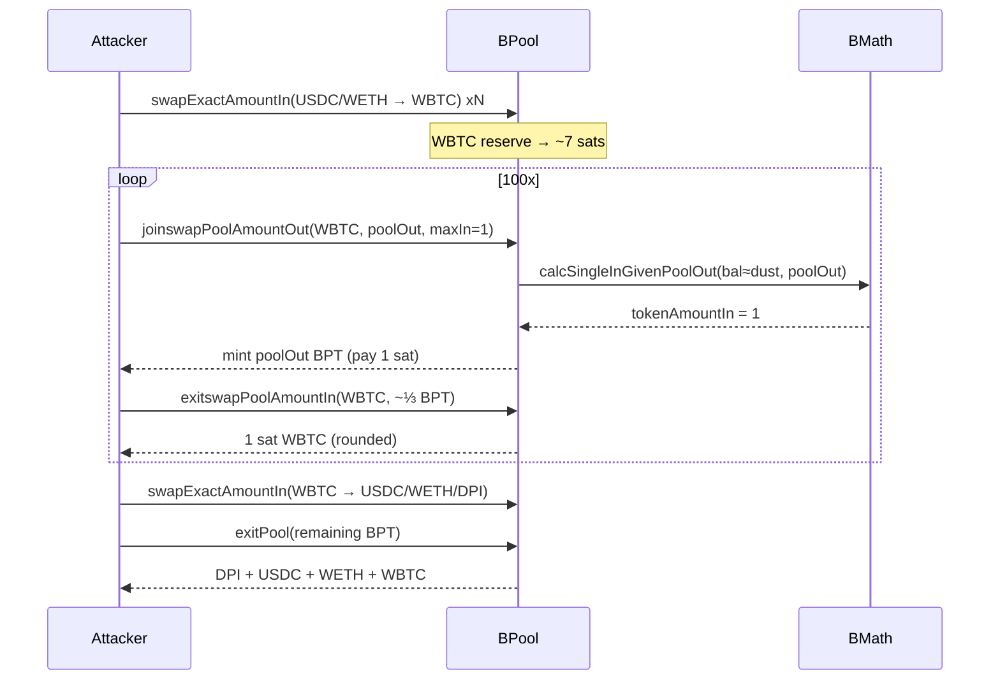

# Balancer V1 BPool `joinswapPoolAmountOut` rounding — mint BPT for 1 satoshi WBTC after dust compression

<!-- non-defihacklabs: Crypto Training original detection & analysis (Twitter hack alerting) -->

> **Vulnerability classes:** vuln/arithmetic/rounding · vuln/arithmetic/precision-loss · vuln/arithmetic/decimal-mismatch · vuln/logic/price-calculation
> **Reproduction:** the PoC compiles & runs in an isolated Foundry project at [this project folder](.). Full verbose trace: [output.txt](output.txt). Verified Balancer V1 sources are in [sources/BPool_2257aa/](sources/BPool_2257aa/).

---
## Key info
| | |
|---|---|
| **Loss** | ~$234k USD across DPI / USDC / WETH / WBTC. PoC residual after flash stand-in repay: **546.26 DPI + 11.45 WETH + 27,710 USDC + 0.357 WBTC** [output.txt](output.txt) |
| **Vulnerable contract** | Balancer V1 `BPool` — [`0x2257aaac34BcB27900291f7B84eE2565A6cbaC57`](https://etherscan.io/address/0x2257aaac34bcb27900291f7b84ee2565a6cbac57#code) (siblings: [`0x1373E57F…`](https://etherscan.io/address/0x1373E57F764a7944bDd7A4BD5ca3007D496934DA), [`0x9B208194…`](https://etherscan.io/address/0x9B208194Acc0a8cCB2A8dcafEACfbB7dCc093F81)) |
| **Attacker EOA** | [`0x338C7Ec9BefbB451d66Fd8A468c32184f5689a41`](https://etherscan.io/address/0x338C7Ec9BefbB451d66Fd8A468c32184f5689a41) |
| **Attack contract** | [`0x9cAa8d0E44b22f50057d2F4ce0D1446529e11be3`](https://etherscan.io/address/0x9cAa8d0E44b22f50057d2F4ce0D1446529e11be3) |
| **Attack tx** | [`0x72510b257cc09bde8435b83ac1636f9498ffc353583330600b5b8da43d0d1aff`](https://etherscan.io/tx/0x72510b257cc09bde8435b83ac1636f9498ffc353583330600b5b8da43d0d1aff) (block **25,872,274**) |
| **Chain / block / date** | Ethereum / fork **25,872,273** (attack−1) / 2026-08-31 |
| **Compiler** | Solidity 0.5.12 (verified Balancer core) |
| **Bug class** | Fixed-point rounding in `BMath.calcSingleInGivenPoolOut` / `BPool.joinswapPoolAmountOut`: after dust-compressing an 8-decimal WBTC reserve, specified BPT out is minted while computed `tokenAmountIn` floors to 1 wei |

## TL;DR

Balancer V1’s `joinswapPoolAmountOut` lets a caller **choose how much BPT to mint** and then reverse-computes the required single-token deposit via `calcSingleInGivenPoolOut`. That math is 18-decimal `bmul`/`bdiv`/`bpow` arithmetic. After the attacker compresses the pool’s **8-decimal WBTC** balance to ~7 sats with public swaps, the reverse formula rounds `tokenAmountIn` down to **1 satoshi** for multi-ether BPT outs. One hundred such joins (interleaved with 1-sat `exitswapPoolAmountIn` skims) mint ~6,687 BPT while paying ~100 sats total; ~4,408.8 BPT is kept and later `exitPool`’d. Held WBTC from the compression phase is then dumped back into the imbalanced pool (each sat extracts up to `MAX_OUT_RATIO` of USDC/WETH), and the final exit drains DPI/USDC/WETH/WBTC — about **$234k** on the primary pool.

This is **not** the Nov-2025 Balancer V2 Composable Stable rounding campaign (`2025-11-BalancerV2_exp`). It is a **V1 BPool** join-path bug on dusty low-decimal reserves.

## Background

Balancer V1 `BPool` is a constant-product AMM with denormalized weights. Each pool token has an internal `_records[token].balance` and denorm weight. Single-sided liquidity entry has two APIs:

- `joinswapExternAmountIn` — caller specifies token in; pool computes BPT out.
- `joinswapPoolAmountOut` — caller specifies **BPT out**; pool computes token in via `calcSingleInGivenPoolOut`.

`MIN_BALANCE` is only enforced in `bind`/`rebind`. Once finalized, public swaps can drive a reserve arbitrarily low (subject to `MAX_OUT_RATIO`). That matters for **WBTC (8 decimals)** inside an otherwise 18-decimal fixed-point world: when the recorded balance is a handful of sats, 18-decimal power/ratio math truncates hard.

## The vulnerable code

Verified sources: [sources/BPool_2257aa/BPool.sol](sources/BPool_2257aa/BPool.sol), [sources/BPool_2257aa/BMath.sol](sources/BPool_2257aa/BMath.sol).

### 1. Caller-chosen BPT out, reverse-computed input ([BPool.sol:584–617](sources/BPool_2257aa/BPool.sol))

```solidity
function joinswapPoolAmountOut(address tokenIn, uint poolAmountOut, uint maxAmountIn)
    external
    returns (uint tokenAmountIn)
{
    Record storage inRecord = _records[tokenIn];

    tokenAmountIn = calcSingleInGivenPoolOut(
                        inRecord.balance,
                        inRecord.denorm,
                        _totalSupply,
                        _totalWeight,
                        poolAmountOut,
                        _swapFee
                    );

    require(tokenAmountIn != 0, "ERR_MATH_APPROX");
    require(tokenAmountIn <= maxAmountIn, "ERR_LIMIT_IN");
    // ...
    _mintPoolShare(poolAmountOut);
    _pushPoolShare(msg.sender, poolAmountOut);
    _pullUnderlying(tokenIn, msg.sender, tokenAmountIn);
}
```

The only lower bound on `tokenAmountIn` is `!= 0`. With `maxAmountIn = 1`, any computed input of exactly 1 wei passes — and the full `poolAmountOut` is minted.

### 2. Truncating reverse math ([BMath.sol:156–181](sources/BPool_2257aa/BMath.sol))

```solidity
function calcSingleInGivenPoolOut(
    uint tokenBalanceIn,
    uint tokenWeightIn,
    uint poolSupply,
    uint totalWeight,
    uint poolAmountOut,
    uint swapFee
) public pure returns (uint tokenAmountIn) {
    uint normalizedWeight = bdiv(tokenWeightIn, totalWeight);
    uint newPoolSupply = badd(poolSupply, poolAmountOut);
    uint poolRatio = bdiv(newPoolSupply, poolSupply);
    uint boo = bdiv(BONE, normalizedWeight);
    uint tokenInRatio = bpow(poolRatio, boo);
    uint newTokenBalanceIn = bmul(tokenInRatio, tokenBalanceIn);
    uint tokenAmountInAfterFee = bsub(newTokenBalanceIn, tokenBalanceIn);
    uint zar = bmul(bsub(BONE, normalizedWeight), swapFee);
    tokenAmountIn = bdiv(tokenAmountInAfterFee, bsub(BONE, zar));
    return tokenAmountIn;
}
```

`bmul`/`bdiv`/`bpow` are 18-decimal floor ops. When `tokenBalanceIn` is ~7 sats, `bmul(tokenInRatio, tokenBalanceIn)` barely moves above the old balance for surprisingly large `poolAmountOut`, so `tokenAmountInAfterFee` (and thus `tokenAmountIn`) collapses to **1**.

Missing: minimum effective input relative to BPT value, minimum live balance for joins, and relative-error checks. `MIN_BALANCE` never applies after finalize.

## Root cause

1. **Direction of API**: specifying output (BPT) and deriving input lets rounding favor the caller on the input side.
2. **Decimal mismatch**: 8-decimal WBTC balances interact poorly with 18-decimal pool math once the reserve is dust.
3. **No dust floor on joins**: swaps may empty a reserve; joins still accept `tokenAmountIn == 1`.

Together: compress WBTC → mint huge underpriced BPT for 1 sat → skim / dump / exit the other legs.

## Preconditions

- Finalized public V1 `BPool` with a low-decimal token (here WBTC) and material value in other legs (DPI/USDC/WETH).
- Ability to flash-borrow enough USDC/WETH to compress WBTC to dust under `MAX_IN_RATIO` / `MAX_OUT_RATIO`.
- Capital to pay 1 sat per join (trivial once WBTC was bought during compression).

## Attack walkthrough

Primary tx at block **25,872,274** (PoC forks **25,872,273**). Schedule replayed from the live calldata/logs in [src/AttackSchedule.sol](src/AttackSchedule.sol) / [test/BalancerV1JoinswapRounding_exp.sol](test/BalancerV1JoinswapRounding_exp.sol).

1. **Flash / fund** — stand-in for Spark/Morpho/Uniswap V3: 95M USDC + 17k WETH.
2. **Compress** — 20× USDC→WBTC then 21× WETH→WBTC geometric swaps until recorded WBTC ≈ **7 sats**.
3. **Join/exitswap flywheel (100 joins, 104 exitswaps)** — each `joinswapPoolAmountOut(WBTC, poolOut, 1)` pays 1 sat and mints growing BPT (0.30 → 440 BPT). Interleaved `exitswapPoolAmountIn(WBTC, ~⅓·poolOut)` returns only **1 sat** out (same rounding), keeping the reserve dusty while accumulating ~**4,408.8 BPT**.
4. **Dump held WBTC** — 41 geometric WBTC→USDC/WETH/DPI swaps; with dusty WBTC each sat extracts up to ⅓ of a quote balance.
5. **`exitPool`** — burn remaining BPT for proportional DPI/USDC/WETH/WBTC.
6. **Repay & profit** — PoC sinks flash principal and forwards residuals to the attacker EOA:

| Asset | PoC profit |
|---|---|
| DPI | 546.257565286935420823 |
| WETH | 11.447667518174463645 |
| USDC | 27,710.408579 |
| WBTC | 0.35710643 |

Matches the live attack-contract net (~545 DPI, ~11.45 WETH, ~27.7k USDC, ~0.357 WBTC).

## Diagrams




## Remediation

- Round **against** the caller on join inputs: require `tokenAmountIn` to cover a minimum value relative to `poolAmountOut`, or round `calcSingleInGivenPoolOut` up.
- Enforce a live `MIN_BALANCE` (or minimum non-dust balance) before joins/swaps that mint BPT.
- Prefer `joinswapExternAmountIn` (input-specified) for low-decimal tokens, or scale balances to 18 decimals before power math.
- Pause / migrate remaining V1 pools with low-decimal legs; the Nov-2025 V2 campaign does not cover this surface.

## How to reproduce

```bash
cd /path/to/evm-hack-registry
_shared/run_poc.sh 2026-08-BalancerV1JoinswapRounding_exp -vvvvv
# → [PASS] testExploit(); DPI/WETH/USDC/WBTC profits as in output.txt
```

Offline: `anvil_state.json` is served by `_shared/run_poc.sh` on `http://127.0.0.1:8545`. Online rebuild forks Ethereum at block `25_872_273` via `https://eth.drpc.org`.

*Reference: https://x.com/SlowMist_Team/status/2094272540193722744*
