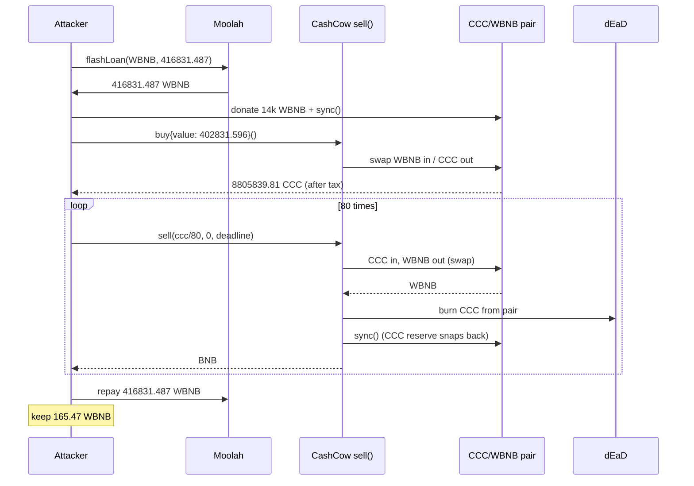
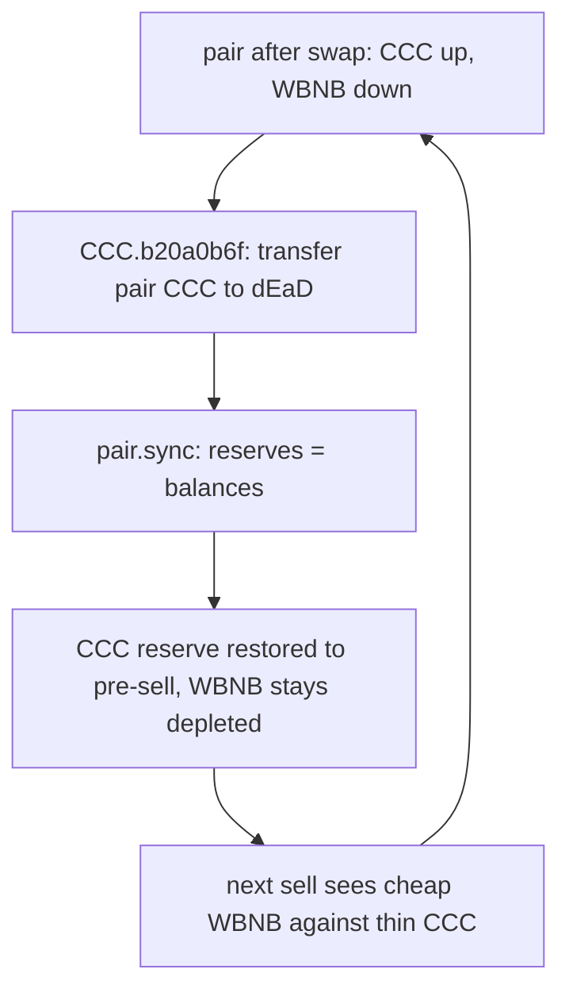

# CashCowCoin (CCC) — `sell()` burns LP inventory then `sync()`, draining the CCC/WBNB pair

<!-- non-defihacklabs: Crypto Training original detection & analysis (Twitter hack alerting) -->

> **Vulnerability classes:** vuln/logic/incorrect-state-transition · vuln/logic/missing-check · vuln/oracle/price-manipulation · vuln/governance/flash-loan-attack

> **Reproduction:** the PoC compiles & runs in an isolated Foundry project at
> [this project folder](.). Full verbose trace: [output.txt](output.txt).
> Verified sources: [PancakePair.sol](sources/PancakePair_1dbe94/PancakePair.sol)
> (the AMM that `sync()`s the desynced balances),
> [Moolah.sol](sources/Moolah_932158/src_moolah_Moolah.sol) (flash-loan source),
> [TransparentUpgradeableProxy](sources/TransparentUpgradeableProxy_f52322/) (CashCow sell proxy).
> The `sell()` implementation at `0x4287…a9ac` and the CCC token itself are **unverified**.

---

## Key info

| | |
|---|---|
| **Loss** | **~$117K** (**165.471928251512413319 WBNB** in the PoC and the live tx — [output.txt:456](output.txt)) |
| **Vulnerable contract** | CashCow sell proxy — [`0xF523224c6171f81C54b93F474ed4c78dE91241C7`](https://bscscan.com/address/0xf523224c6171f81c54b93f474ed4c78de91241c7#code) (EIP-1967 → impl [`0x4287742E50fAd6d3351000fD31632412ab29A9ac`](https://bscscan.com/address/0x4287742e50fad6d3351000fd31632412ab29a9ac) at attack time; later upgraded to `0x370c…043E`) |
| **Token / LP** | `CCC` (CashCowCoin) — [`0xb9B845F718C32f37E8aF8b887ae4eEc816c93CCC`](https://bscscan.com/token/0xb9b845f718c32f37e8af8b887ae4eec816c93ccc) · CCC/WBNB Pancake pair — [`0x1DBE9458A6840784d5DEfD62C6b71386100097c0`](https://bscscan.com/address/0x1dbe9458a6840784d5defd62c6b71386100097c0) |
| **Attacker EOA** | [`0x7977BDeeE3A79Dc85Cc18739692e796B5D2513C4`](https://bscscan.com/address/0x7977bdeee3a79dc85cc18739692e796b5d2513c4) |
| **Attack contract** | [`0x7738b4d7c25e9a7092ae1Ab402343b20340DaeAF`](https://bscscan.com/address/0x7738b4d7c25e9a7092ae1ab402343b20340daeaf) |
| **Flash-loan source** | Lista **Moolah** — [`0x8F73b65B4caAf64FBA2aF91cC5D4a2A1318E5D8C`](https://bscscan.com/address/0x8f73b65b4caaf64fba2af91cc5d4a2a1318e5d8c) (impl [`0x9321587EA0DC8247f8F03E8696C047b2713bB79A`](https://bscscan.com/address/0x9321587ea0dc8247f8f03e8696c047b2713bb79a)) |
| **Attack tx** | [`0x89d8050641019a5a75fa3dafb4f64fb153e4dd30c0f1f51d06a6cc206d3ead43`](https://bscscan.com/tx/0x89d8050641019a5a75fa3dafb4f64fb153e4dd30c0f1f51d06a6cc206d3ead43) |
| **Chain / block / date** | BSC (chainId 56) / **118,384,061** (fork PoC at **118,384,060**) / 2026-08-27 ~12:31 UTC |
| **Compiler** | Sell impl **unverified**. Proxy: Solidity **v0.8.29**. PancakePair: **v0.5.16**. Moolah: **v0.8.34** |
| **Bug class** | Public `sell()` swaps CCC into the Pancake pair, then burns those CCC **out of the LP** and `sync()`s — reserves keep a collapsed CCC balance while WBNB has already left |

---

## TL;DR

1. CashCowCoin exposes a public `sell(uint256,uint256,uint256)` on an upgradeable proxy. Anyone who holds CCC can sell through it.

2. Each `sell()` (RECONSTRUCTED from the trace):
   - `transferFrom`s CCC in, takes tax, and swaps the rest into the CCC/WBNB Pancake pair for WBNB/BNB.
   - Then calls a CCC helper (`b20a0b6f(pair, dead, amountIn)`) that **moves the just-sold CCC from the pair to `0x…dEaD`** and immediately `pair.sync()`.

3. After the swap, pair balances are `{CCC_up, WBNB_down}`. After the burn+`sync()`, reserves become `{CCC_original, WBNB_down}` — the AMM invariant is rewritten so CCC looks scarce and WBNB looks cheap to extract.

4. The attacker flash-loaned **416.831487011304318246517 WBNB** from Lista Moolah, donated **13.999890970633457505314 WBNB** into the pair and `sync()`’d, bought **8,805,839.807721103467515041 CCC** via `buy()`, then looped `sell()` **80** times ([output.txt:625](output.txt)).

5. First sell already pulls **100.901317430994236850588 WBNB** ([output.txt:691](output.txt)) while CCC reserve snaps back to the post-buy **326,767.607907075184883477**. Repeat 79 more times until the pair is dust.

6. PoC offline result ([output.txt:456](output.txt)): **165.471928251512413319 WBNB** profit — identical to the live tx (~$117K). Flash loan is repaid in the same callback ([Moolah.sol:638](sources/Moolah_932158/src_moolah_Moolah.sol#L638)).

---

## Background

CashCowCoin (`CCC`) launched on BSC as a “liquidity protocol” token with a custom buy/sell proxy in front of a PancakeSwap V2 CCC/WBNB pair (`token0 = CCC`, `token1 = WBNB`). `buy()` and `sell()` take `(amount, minOut, deadline)` and route through the Pancake router, applying transfer taxes to two fee wallets (`0x57Fc…4b0b`, `0x1b52…0dE6`).

A healthy Uniswap-V2-style pair keeps `reserve0 * reserve1 ≈ k` in lockstep with token balances. `swap()` updates reserves from post-swap balances; `sync()` is the permissionless “set reserves = current balances” hatch ([PancakePair.sol:491-493](sources/PancakePair_1dbe94/PancakePair.sol#L491-L493)). If a token can burn the pair’s own inventory **after** a swap has already sent the other asset out, `sync()` commits a one-sided reserve collapse. That is this bug.

The sell implementation is unverified. After the incident the proxy was upgraded from `0x4287…a9ac` (vulnerable, in use at blocks 118,384,060–118,384,100) to `0x370c…043E`.

---

## The vulnerable code

### 1. `pair.sync()` commits whatever balances the pair currently holds

```solidity
// sources/PancakePair_1dbe94/PancakePair.sol:490-493
// force reserves to match balances
function sync() external lock {
    _update(IERC20(token0).balanceOf(address(this)), IERC20(token1).balanceOf(address(this)), reserve0, reserve1);
}
```

This is not itself a bug — it is the standard Uniswap V2 hatch. It becomes lethal when a caller can first pull WBNB out via `swap()`, then destroy CCC that is sitting in the pair, then `sync()`.

### 2. `sell()` (RECONSTRUCTED from [output.txt:625-723](output.txt))

The implementation at `0x4287…a9ac` is unverified. The first `sell(110072997596513793343938, 0, deadline)` in the PoC does:

1. `CCC.transferFrom(attacker, sellProxy, 1.1007e23)` ([output.txt:627](output.txt)).
2. Tax transfers to the two fee wallets, then `CCC.transfer(pair, 1.0457e23)` and `pair.swap(0, 1.0090e23 WBNB, router, "")` ([output.txt:685-687](output.txt)). Post-swap balances: CCC **431.337e21**, WBNB **316.096e21**.
3. `CCC.b20a0b6f(pair, 0x…dEaD, 1.0457e23)` ([output.txt:705](output.txt)) — a CCC-token helper that:
   - `Transfer`s **1.0457e23 CCC from the pair to `dEaD`** ([output.txt:706](output.txt));
   - calls `pair.sync()` ([output.txt:707-712](output.txt));
   - emits `TreasuryRefilled(dEaD, 1.0457e23)` ([output.txt:716](output.txt)).
4. Forwards the **100.901 WBNB** of BNB to the seller ([output.txt:721](output.txt)) and emits `Sold`.

After step 3, reserves are CCC **326.768e21** (back to the post-`buy()` CCC reserve) and WBNB **316.096e21** (the depleted WBNB). The tokens the seller “paid” never stay in the pool.

### 3. Moolah flash loan (funding, not the bug)

```solidity
// sources/Moolah_932158/src_moolah_Moolah.sol:628-638
function flashLoan(address token, uint256 assets, bytes calldata data) external whenNotPaused {
    IERC20(token).safeTransfer(msg.sender, assets);
    IMoolahFlashLoanCallback(msg.sender).onMoolahFlashLoan(assets, data);
    IERC20(token).safeTransferFrom(msg.sender, address(this), assets);
}
```

Zero fee. The attacker borrows **416,831.487 WBNB**, uses it inside `onMoolahFlashLoan`, and repays from the drained WBNB.

---

## Root cause

**`sell()` treats the Pancake pair as a burn sink, not as an AMM inventory.** After the swap has already delivered WBNB, the sold CCC is removed from the pair and `sync()` publishes the new (CCC-poor, WBNB-poor) reserves. The constant-product invariant is reset against a stolen CCC balance.

That is an **incorrect state transition**: a sell should increase the pair’s CCC reserve (or at least leave it), not decrease it. There is **no check** that the burn target is not the live LP, and no check that post-burn reserves still satisfy the pre-swap `k`. Combined with a public `sell()` and a zero-fee flash loan, the pair’s WBNB can be loop-drained in one transaction.

---

## Preconditions

- The CashCow sell proxy still points at the vulnerable impl (`0x4287…a9ac` at the fork block).
- The CCC/WBNB pair holds meaningful WBNB (~165.49 WBNB before the donate; ~417k WBNB after the attacker’s buy).
- `sell()` is callable by any CCC holder (no whitelist / trading delay that stops a contract).
- CCC’s `b20a0b6f` helper will burn from the pair and call `sync()` when invoked by the sell proxy.
- A WBNB flash-loan venue with ≥ ~417k WBNB (Lista Moolah did).

---

## Attack walkthrough

Numbers below are from the offline `-vvvvv` run ([output.txt](output.txt)). They match the live tx.

1. **Flash-loan 416.831487011304318246517 WBNB** from Moolah ([output.txt:498](output.txt)). Callback is `onMoolahFlashLoan`.

2. **Donate 13.999890970633457505314 WBNB** into the pair and `sync()` ([output.txt:508-519](output.txt)). Reserves become CCC **9,596,072.668666131466478257** / WBNB **14,165.380832150314071330**.

3. **Unwrap remaining 402.831596040670860741203 WBNB** and `buy{value}(amount, 0, deadline)` ([output.txt:534](output.txt)). `buy()` wraps via the Pancake router and `swap`s **9,269,305.060759056281594780 CCC** out of the pair ([output.txt:557](output.txt)); after tax the seller receives **8,805,839.807721103467515041 CCC** ([output.txt:598](output.txt)). Pair CCC reserve is now **326,767.607907075184883477**.

4. **Approve CCC** and loop `sell(cccBalance / 80, 0, deadline)` 80 times ([output.txt:625](output.txt)). Each iteration:
   - Swaps ~1.0457e23 CCC in for WBNB out (first sell: **100.901317430994236850588 WBNB**, [output.txt:691](output.txt)).
   - Burns that CCC from the pair to `dEaD` and `sync()`s CCC reserve **back to 326,767.61** ([output.txt:706-712](output.txt)).
   - Subsequent sells see the same CCC reserve and a falling WBNB reserve, so each WBNB-out is smaller, but they keep going until the pair is dust.

5. **Wrap leftover BNB, repay the 416.831487 WBNB flash loan**, transfer the remainder to the attacker EOA ([output.txt:456](output.txt)).

**Profit: 165.471928251512413319 WBNB** (~$117K). Live tx gas 11,824,820; PoC gas 12,439,475 (new exploit contract + 80-loop shape).

---

## Diagrams





---

## Remediation

- **Never burn (or `transfer` to `dEaD`) the pair’s token balance as part of a user sell.** If a burn tax is required, burn from the *seller’s* amount *before* sending the remainder to the pair, and do not call `sync()` afterwards.
- If LP inventory must be reduced, do it through `pair.burn` / a controlled `skim` with governance, not from `sell()`.
- Remove or tightly ACL the CCC helper that can `transfer` from the pair (`b20a0b6f`). An arbitrary-from burn on the LP address is an AMM-killing primitive.
- Do not expose `sell()` until the burn/sync path is gone; pause + upgrade (this proxy later moved to `0x370c…043E`).
- Optional circuit-breaker: revert `sell()` if `pair.balanceOf(CCC)` would fall, or if spot price moves more than a bound inside one tx.

---

## How to reproduce

```bash
# from evm-hack-registry/
_shared/run_poc.sh 2026-08-CashCowCoin_exp -vvvvv
```

The test forks BSC block **118,384,060** from `anvil_state.json` (no RPC). Expected log:

```
Attacker profit (WBNB): 165.471928251512413319
[PASS] testExploit()
```

Fork block is one before [attack tx `0x89d80506…ead43`](https://bscscan.com/tx/0x89d8050641019a5a75fa3dafb4f64fb153e4dd30c0f1f51d06a6cc206d3ead43) at **118,384,061**.

---

*Reference: [https://x.com/TenArmorAlert/status/2093164984092274886](https://x.com/TenArmorAlert/status/2093164984092274886)*
