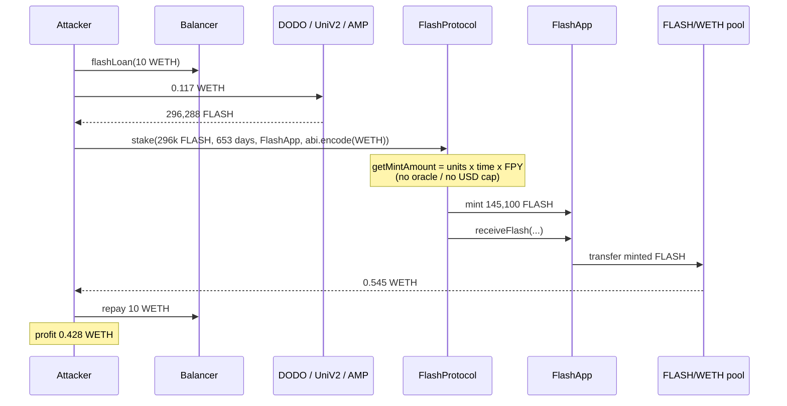
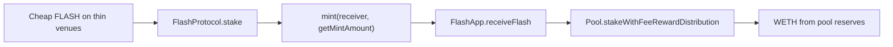

# Flashstake V2 — Unit-based instant rewards dump into a mispriced FLASH/WETH pool

<!-- non-defihacklabs: Crypto Training original detection & analysis (Twitter hack alerting) -->

> **Vulnerability classes:** vuln/logic/reward-calculation · vuln/oracle/missing-validation · vuln/logic/missing-check

> **Reproduction:** the PoC compiles & runs in an isolated Foundry project at
> [this project folder](.). The fork is served offline from the bundled
> `anvil_state.json` (local anvil at `127.0.0.1:8545`), so no public RPC is required.
> Full verbose trace: [output.txt](output.txt).
> Verified sources: [FlashProtocol](sources/FlashProtocol_15EB0c/FlashProtocol.sol),
> [FlashApp](sources/FlashApp_b0aeae/FlashApp.sol),
> [FLASH/WETH Pool](sources/Pool_C9fc5a/Pool.sol).

---

## Key info

| | |
|---|---|
| **Loss** | **0.545290142368948672 WETH** drained from the FLASH/WETH reward pool (~$886); attacker net **0.428499986522887148 WETH** (~$696) |
| **Vulnerable contract** | FlashProtocol [`0x15EB0c763581329C921C8398556EcFf85Cc48275`](https://etherscan.io/address/0x15EB0c763581329C921C8398556EcFf85Cc48275#code) |
| **Instant-sell path** | FlashApp [`0xb0aeae6E204Bd95911EaD25263d7078954fb7fB0`](https://etherscan.io/address/0xb0aeae6E204Bd95911EaD25263d7078954fb7fB0#code) `receiveFlash()` |
| **Victim pool** | FLASH/WETH reward pool [`0xC9fc5a6007c9801ebae1813D4D03208C4E85be44`](https://etherscan.io/address/0xC9fc5a6007c9801ebae1813D4D03208C4E85be44) |
| **Attacker EOA** | [`0xa521f8c249eb055796B765642Eed78c01CD620D1`](https://etherscan.io/address/0xa521f8c249eb055796B765642Eed78c01CD620D1) |
| **Attacker contract** | [`0xfA9D717678DdAf60A123c6Ba0506521e923793d0`](https://etherscan.io/address/0xfA9D717678DdAf60A123c6Ba0506521e923793d0) (unverified) |
| **Attack tx** | [`0xe3a7bd727174526096ebb51672cd3f801fc03ff984d351673373df6b0c166393`](https://etherscan.io/tx/0xe3a7bd727174526096ebb51672cd3f801fc03ff984d351673373df6b0c166393) — block **25,798,654** |
| **Chain / block / date** | Ethereum (chainId 1) / PoC fork block **25,798,653** / 2026-08-20 |
| **Compiler** | Solidity **v0.7.4**, optimizer 200 runs |
| **Bug class** | Economic design / mispriced reward: `FlashProtocol.stake()` mints FLASH from quantity × duration × FPY with no market valuation; `FlashApp.receiveFlash()` immediately sells those units into a WETH pool with no vesting, cooldown, or payout cap |

---

## TL;DR

1. **Flashstake V2 pays yield up front.** A user locks FLASH for a chosen number of seconds. `getMintAmount()` sizes the minted FLASH as `amountIn * expiry * FPY / (1e18 * 365 days)` — a function of token *units*, lock duration, and the fraction of supply already locked. It never reads an oracle or a market price.

2. **FlashApp turns those units into WETH in the same call.** If the stake receiver is FlashApp, `receiveFlash()` forwards the freshly minted FLASH into the FLASH/WETH pool and `stakeWithFeeRewardDistribution()` pays the staker WETH from pool reserves.

3. **Cheap FLASH on thin venues is the input.** The attacker spent **0.116790155846061524 WETH** to buy **296,288.326868092461648081** legacy FLASH via DODO, Uniswap V2 FLASH/WETH, and AMP → FlashApp.swap.

4. **A 653-day lock minted ~145k FLASH and sold it for 0.545 WETH.** After repaying the flash loan the attacker kept **0.428499986522887148 WETH**. No oracle was manipulated — the mispriced reward pool itself was the extraction sink.

---

## Background

Flashstake (Blockzero Labs) is an “instant upfront yield” protocol on Ethereum. Users lock FLASH (or other principal) and receive minted FLASH immediately, rather than streaming rewards over time. The V2 stack is:

- **FlashProtocol** — locks principal, computes `getMintAmount` / `getFPY`, mints reward FLASH to a receiver, and (if the receiver is a contract) callbacks `receiveFlash`.
- **FlashApp** — a receiver that routes minted FLASH into per-token AMM-style **Pool** contracts (FLASH paired with WETH, AMP, …).
- **Pool** — holds `reserveFlashAmount` / `reserveAltAmount` and pays the ALT side (here WETH) out of reserves using a constant-product quote (`getAPYStake`).

The economic assumption is that minted FLASH is “worth” the time-value of locking principal. That only holds if FLASH cannot be sourced far below the implied pool price, or if the WETH payout is vested / capped. By 2026 the token traded thinly on leftover DODO / Uni V2 / AMP routes while the FLASH/WETH reward pool still held real WETH.

A 2023-11 incident against a different Flashstake-related LP-share product (`2023-11-Burntbubba_exp`) is **not** this bug.

---

## The vulnerable code

### Reward size ignores market price — `FlashProtocol.getMintAmount`

```solidity
// sources/FlashProtocol_15EB0c/FlashProtocol.sol
function getMintAmount(uint256 _amountIn, uint256 _expiry) public view override returns (uint256) {
    return _amountIn.mul(_expiry).mul(getFPY(_amountIn)).div(PRECISION * SECONDS_IN_1_YEAR);
}

function getFPY(uint256 _amountIn) public view override returns (uint256) {
    return (PRECISION.sub(getPercentageStaked(_amountIn))).div(2);
}

function getPercentageStaked(uint256 _amountIn) public view override returns (uint256) {
    uint256 locked = IFlashToken(FLASH_TOKEN).balanceOf(address(this)).add(_amountIn);
    return locked.mul(PRECISION).div(IFlashToken(FLASH_TOKEN).totalSupply());
}
```

`FPY` is `(1e18 − percent-of-supply-locked) / 2`. A long `_expiry` (up to `MAX_FPY_FOR_1_YEAR * 365 days / FPY`, with `MAX_FPY_FOR_1_YEAR = 0.5e18`) therefore mints a large fraction of the deposited units. There is no TWAP, no USD notional, no max-payout versus pool WETH.

`_stake` then mints that amount to the receiver and immediately callbacks:

```solidity
mintedAmount = getMintAmount(_amountIn, _expiry);
IFlashToken(FLASH_TOKEN).transferFrom(staker, address(this), _amountIn);
IFlashToken(FLASH_TOKEN).mint(_receiver, mintedAmount);
if (_receiver.isContract()) {
    IFlashReceiver(_receiver).receiveFlash(id, _amountIn, expiration, mintedAmount, staker, _data);
}
```

### Instant dump — `FlashApp.receiveFlash`

```solidity
// sources/FlashApp_b0aeae/FlashApp.sol
function receiveFlash(...) external override onlyProtocol returns (uint256) {
    (address token, uint256 expectedOutput) = abi.decode(_data, (address, uint256));
    address pool = pools[token];
    IERC20(FLASH_TOKEN).safeTransfer(pool, _mintedAmount);
    uint256 reward = IPool(pool).stakeWithFeeRewardDistribution(_mintedAmount, _staker, expectedOutput);
    stakerReward[_id] = reward;
}
```

`_data = abi.encode(WETH, minOut)`. The pool is the FLASH/WETH reward pool.

### Pool pays WETH from reserves

```solidity
// sources/Pool_C9fc5a/Pool.sol
function stakeWithFeeRewardDistribution(
    uint256 _amountIn,
    address _staker,
    uint256 _expectedOutput
) public override lock onlyFactory returns (uint256 result) {
    result = getAPYStake(_amountIn);
    require(_expectedOutput <= result, "Pool:: EXPECTED_IS_GREATER");
    calcNewReserveStake(_amountIn, result);
    IERC20(token).safeTransfer(_staker, result);
}
```

`getAPYStake` is a Uniswap-v2-style quote against `reserveFlashAmount` / `reserveAltAmount`. The newly minted FLASH is treated as a swap input and WETH leaves the pool — no vesting, no cooldown, no cap versus pool inventory.

---

## Root cause

The protocol prices **time-locked FLASH units** as if they were a claim on **WETH in a live AMM**. Those are different assets:

- Mint formula: `units × seconds × FPY` — independent of the external FLASH market.
- Payout: constant-product sale into a WETH reserve — fully liquid in the same transaction.

Once FLASH can be bought cheaper on DODO / Uni V2 / AMP than the implied pool price, `stake(FlashApp, WETH)` is an atomic arb: cheap FLASH in, real WETH out. The missing controls are an oracle (or at least a max FLASH/WETH rate), a payout cap, and a vesting/cooldown on `receiveFlash`.

---

## Preconditions

1. FlashProtocol and FlashApp are live; `pools[WETH]` is the victim FLASH/WETH pool with non-trivial WETH reserves.
2. FLASH still has thin external liquidity (DODO DVM, Uni V2 FLASH/WETH, AMP/FLASH via FlashApp.swap) so a modest WETH spend buys a large FLASH inventory.
3. `calculateMaxStakePeriod(amountIn)` allows a long lock (here **56,429,000 seconds ≈ 653.11 days**, the value from the live `Staked` event).
4. The attacker can flash-borrow WETH (Balancer in the PoC; Uniswap V4 PoolManager for 10 ETH in the live tx) so the path is zero-capital.

---

## Attack walkthrough

Numbers from the offline `[PASS]` run in [output.txt](output.txt). Fork is block **25,798,653** (attack tx minus one).

1. **Flash-borrow 10 WETH** from the Balancer Vault (`0xBA12…F2C8`). The live attacker unlocked 10 ETH from Uniswap V4 PoolManager; only ~0.117 WETH of inventory is spent either way.

2. **Buy cheap FLASH.**
   - 0.06064 WETH → **153,318.610974105426579371 FLASH** on DODO (`0x4D48…EefE`).
   - 0.01336 WETH → **38,872.978842327830134399 FLASH** on Uni V2 FLASH/WETH (`0x31d9…9C47`).
   - 0.042790155846061524 WETH → 250,000 AMP on Uni V2 AMP/WETH (`0x0865…3293`), then `FlashApp.swap` → **104,096.737051659204934311 FLASH**.
   - Total FLASH: **296,288.326868092461648081**. Total WETH spent: **0.116790155846061524**.

3. **`FlashProtocol.stake(296288.32 FLASH, 56419200, FlashApp, abi.encode(WETH, 1))`.**  
   `getMintAmount` mints **~145,125 FLASH** to FlashApp (plus the 15% match mint to the protocol match receiver).

4. **`FlashApp.receiveFlash` dumps the minted FLASH** into the FLASH/WETH pool. `stakeWithFeeRewardDistribution` pays **0.545290142368948672 WETH** to the exploit contract.

5. **Repay the Balancer flash loan** (zero fee). Leftover **0.428499986522887148 WETH** is transferred to the attacker EOA.

The live tx is the same economic path (same FLASH inventory, same 653-day lock, same pool dump); it netted 0.428499986522887147 ETH after wrapping/unwrapping around a 10 ETH Uni V4 flash. The PoC uses a 10 WETH Balancer flash instead of Uni V4.

---

## Diagrams





---

## Remediation

1. **Price the reward in the payout asset.** Size minted FLASH (or the WETH sent) from an oracle / TWAP of FLASH/WETH, not from raw units × seconds.
2. **Cap `receiveFlash` payouts** against pool WETH (e.g. max X% of `reserveAltAmount` per tx / per day) and revert if the implied FLASH/WETH rate is above a bound.
3. **Do not sell in the same transaction.** Vest or delay the WETH (or minted FLASH) so a flash-loaned inventory cannot be converted atomically.
4. **Kill-switch / pause `stake` to FlashApp** while FLASH trades at a deep discount to the pool.
5. **Sunset leftover V2 pools** if the product has moved on — idle WETH in a unit-priced AMM is a standing bounty.

---

## How to reproduce

```bash
cd evm-hack-registry
_shared/run_poc.sh 2026-08-FlashstakeV2_exp -vvvvv
```

Expect `[PASS] testExploit()`, `Pool WETH drained: 0.545290142368948672`, and `Attacker WETH profit: 0.428499986522887148`. The test forks `http://127.0.0.1:8545` at block `25_798_653` from `anvil_state.json`.

*Reference: https://x.com/exvulsec/status/2090628004586324111*
