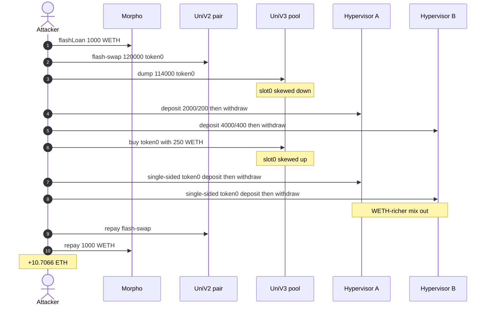
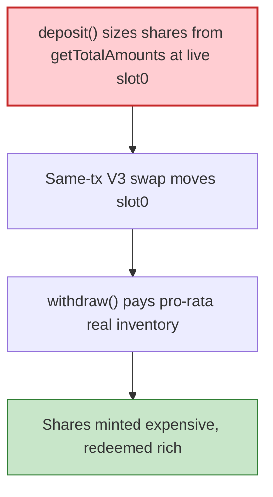

# Float Protocol Hypervisor — Uniswap V3 spot-priced deposit/withdraw sandwich

> **Vulnerability classes:** vuln/defi/sandwich-attack · vuln/oracle/spot-price · vuln/oracle/missing-circuit-breaker

> **Reproduction:** the PoC compiles & runs in an isolated Foundry project at
> [this project folder](.). Full verbose trace: [output.txt](output.txt).
> Source test: [test/FloatProtocol_exp.sol](test/FloatProtocol_exp.sol).

---

## Key info

| | |
|---|---|
| **Loss** | **10.706591043820923462 ETH** (~$28K) [output.txt](output.txt) |
| **Vulnerable contracts** | Hypervisor A [`0x85CBeD52…A70C`](https://etherscan.io/address/0x85CBeD523459b7f6F81C11e710DF969703a8A70C) · Hypervisor B [`0xc86B1e7F…1153`](https://etherscan.io/address/0xc86B1e7FA86834CaC1468937cdd53ba3cCbC1153) (Gamma/Visor-style) |
| **Deposit proxies** | UniProxy A [`0x38037294…a28`](https://etherscan.io/address/0x3803729416AA5207FE801C1C565B906F6f3f8a28) · UniProxy B [`0x7CF8431E…75f`](https://etherscan.io/address/0x7CF8431E086e1bcdC9524fd305f7D5d8622CD75f) |
| **Attacker EOA** | [`0xAEA29218262dc6b0904Ca077f6527C49dfd426D9`](https://etherscan.io/address/0xAEA29218262dc6b0904Ca077f6527C49dfd426D9) |
| **Attack contract** | [`0xb46655eb5b77de277063a75586d1883e951b6c54`](https://etherscan.io/address/0xb46655eb5b77de277063a75586d1883e951b6c54) |
| **Attack tx** | [`0x3d7549db65344da2a41067e17791b17fac16ec6b8e5132e82e243f6541de5cff`](https://etherscan.io/tx/0x3d7549db65344da2a41067e17791b17fac16ec6b8e5132e82e243f6541de5cff) (block **25,874,402**) |
| **Chain / block / date** | Ethereum / fork **25,874,401** / 2026-08-31 |
| **Bug class** | LP shares minted off live Uni V3 `slot0`; `withdraw` redeems a pro-rata slice of real tokens. Same-tx tick move turns deposit→withdraw into a drain. |

---

## TL;DR

Float's Hypervisor (Gamma/Visor concentrated-liquidity vault) prices LP shares off `getTotalAmounts()`, which values the Uni V3 position at the pool's **instantaneous** `slot0` — no TWAP, no deviation guard on the permissionless `deposit`/`withdraw` path (whitelist disabled). Two hypervisors share one pool, so one tick move prices both.

Inside a Morpho 1,000 WETH flash + a V2 flash-swap of 120,000 token0:

1. V3 dump **114,000 token0 → WETH** (skew `slot0` down).
2. Deposit (2000 / 200) into Hypervisor A and (4000 / 400) into B via DepositProxy; immediately withdraw those shares (mint at the skewed price).
3. V3 buy token0 with **250 WETH** (skew back up).
4. Single-sided token0 deposits (**395,035** and **394,911**) into A and B, then withdraw — redeeming a **WETH-richer** mix than deposited.
5. Repay the V2 flash-swap, dump leftover token0, settle surplus token0 into ~8.26 WETH via a second V2 swap, repay Morpho, unwrap to ETH.

Net **10.7066 ETH** to the attacker EOA.

---

## Background

Gamma/Visor Hypervisors wrap a Uni V3 position. Users `deposit(amount0, amount1, to)` through a UniProxy; shares are sized from `getTotalAmounts()`. `withdraw(shares, to, from)` burns shares for a proportional slice of the vault's real token0/token1.

token0 = `0xb050…7cb9` (Float pair token, 18 dp), token1 = WETH. Both hypervisors and both DepositProxies are source-verified; `deposit(uint256,uint256,address)` and `withdraw(uint256,address,address)` are the real 3-arg signatures.

This is the same *class* as Arrakis G-UNI (spot-priced mint/burn) on a different wrapper.

---

## The vulnerable code

Verified Hypervisor `getTotalAmounts()` (conceptual; Gamma public source):

```solidity
function getTotalAmounts() public view returns (uint256 total0, uint256 total1) {
    // reads pool.positions + pool.slot0() / currentTick
    // converts in-range liquidity at the INSTANTANEOUS sqrt price
    // plus idle balances sitting on the hypervisor
}
```

`deposit` mints `shares = f(amount0, amount1, getTotalAmounts(), totalSupply)` with **no TWAP**. `withdraw` pays `shares/totalSupply` of the **actual** token balances (and burned V3 liquidity), not of the tick that was used at mint.

Move the tick between those two public calls and the share is issued against a lie.

---

## Root cause

Mint is spot-priced; redeem is inventory-priced. An unprivileged caller with a flash loan:

- Pushes `slot0` so `getTotalAmounts()` over-states one side.
- Deposits at that valuation (cheap shares).
- Pushes `slot0` back.
- Withdraws a mix whose WETH leg exceeds what was deposited.

Two vaults on one pool double the surface: the same two swaps reprice A and B.

---

## Preconditions

- Deposit whitelist disabled (it was).
- Shared Uni V3 pool thin enough that 114k token0 / 250 WETH moves the tick across a useful range.
- Flash liquidity: 1,000 WETH (Morpho) + 120,000 token0 (V2 pair).

---

## Attack walkthrough

Exact amounts from [test/FloatProtocol_exp.sol](test/FloatProtocol_exp.sol):

| # | Call | Detail |
|---|---|---|
| 1 | Morpho `flashLoan(WETH, 1000e18)` | working capital |
| 2 | V2 `swap(120_000e18, 0, this, "run")` | token0 flash-swap |
| 3 | V3 `swap(..., true, 114_000e18, MIN_SQRT)` | dump token0, skew down |
| 4 | UniProxy A `deposit(2000e18, 200e18)` then Hyper A `withdraw(222.63e18)` | mint/redeem at skew |
| 5 | UniProxy B `deposit(4000e18, 400e18)` then Hyper B `withdraw(3703.21e18)` | same on B |
| 6 | V3 `swap(..., false, 250e18, MAX_SQRT)` | buy token0, skew up |
| 7 | A `deposit(395_035.55e18, 0)` / `withdraw(4298.63e18)` | single-sided extract |
| 8 | B `deposit(394_911.86e18, 0)` / `withdraw(11687.20e18)` | single-sided extract |
| 9 | Repay V2 120,361.08 token0; V3 dump leftover token0 | |
| 10 | V2 swap leftover token0 → 8.262 WETH; repay Morpho; unwrap | |

```
attacker ETH profit: 10.706591043820923462
[PASS] testExploit()
```

---

## Diagrams





---

## Remediation

1. Price deposits and withdrawals off a **TWAP** (or a same-tx snapshot taken once).
2. **Deviation / max-tick-move guard** on `deposit`/`withdraw`, not only on rebalance.
3. **Same-tx lock**: newly minted shares cannot be withdrawn until a later block.
4. Re-enable the deposit whitelist or cap deposits vs pool depth.

---

## How to reproduce

```bash
_shared/run_poc.sh 2026-08-FloatProtocol_exp --mt testExploit -vvvvv
```

Expected: `[PASS] testExploit()` with `attacker ETH profit: 10.706591043820923462`.

---

*Reference: https://x.com/exvulsec/status/2094361997311877399*
