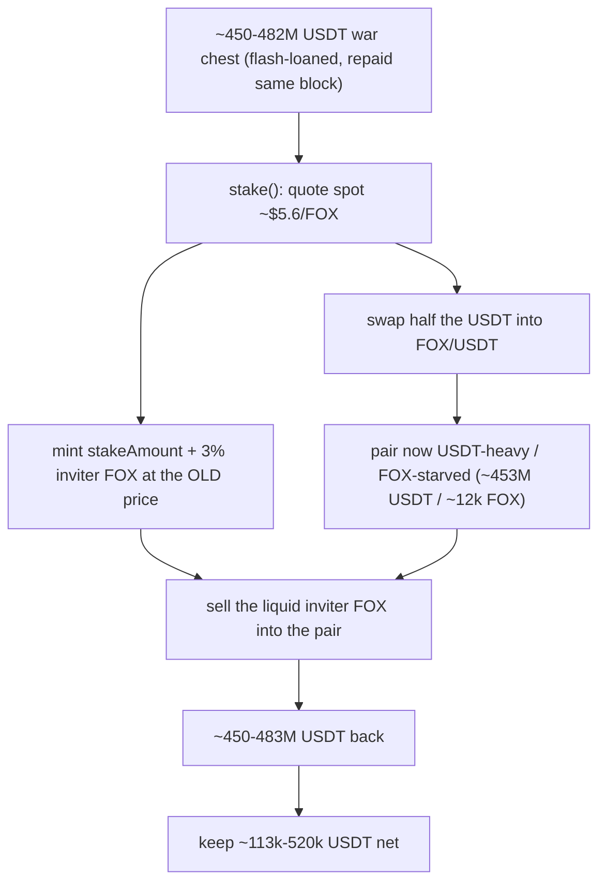

# Fox Market — LP-bond mint priced from a manipulable FOX/USDT spot

<!-- source-defihacklabs: https://github.com/SunWeb3Sec/DeFiHackLabs/pull/1209 (FoxLpBondsPool_exp.sol) -->
<!-- defihacklabs-sol: https://github.com/SunWeb3Sec/DeFiHackLabs/blob/main/src/test/2026-08/FoxLpBondsPool_exp.sol -->

> **Vulnerability classes:** vuln/oracle/spot-price · vuln/oracle/price-manipulation · vuln/logic/price-calculation · vuln/governance/flash-loan-attack

> **Reproduction:** a self-contained, verbatim-source reproduction — the vulnerable
> `FoxLpBondsPool.getSwapPrice` / `stake` and `Treasury.lpBonds` are reproduced
> **verbatim** from the verified BSC source (impl `0x58E2A853…` / `0x87614D97…`),
> against a faithful PancakeSwap V2 double seeded with the **real pre-attack reserves**
> (2,786,697.20 USDT / 496,041.72 FOX). Local deploy, **no fork** — both gates green
> (registry `forge test` PASS + browser Playground `VERDICT: PASS`). Basis:
> [DeFiHackLabs PR #1209](https://github.com/SunWeb3Sec/DeFiHackLabs/pull/1209)
> (`FoxLpBondsPool_exp.sol`, an exact-tx fork replay) plus the live SlowMist / TenArmor /
> DefimonAlerts / ShiroCipher alerts.

---

## Key info

| | |
|---|---|
| **Loss** | **~$118.7K** (**112,976.12 USDT** net to the attack contract, per the on-chain trace / DeFiHackLabs PR #1209). This self-contained PoC nets **519,604.19 USDT** from a 450M USDT war chest against the real pre-attack pool — the *same drain*, without the live attacker's flash-loan fee stack or the FOX 2.5% sell tax |
| **Vulnerable contract** | `FoxLpBondsPool` proxy [`0x9fa6D8a13b35E051BFc145918db0111dEc13D1A0`](https://bscscan.com/address/0x9fa6d8a13b35e051bfc145918db0111dec13d1a0#code) → impl [`0x58E2A853BB14e46BefD3148bd4280370fEA4655A`](https://bscscan.com/address/0x58e2a853bb14e46befd3148bd4280370fea4655a#code) |
| **Treasury (minter)** | [`0x361d08ff43761E6a7E8Fcabe48048AE9010801cc`](https://bscscan.com/address/0x361d08ff43761e6a7e8fcabe48048ae9010801cc#code) → impl [`0x87614D97808DcDEcB069fe8489848fa1C001e04D`](https://bscscan.com/address/0x87614d97808dcdecb069fe8489848fa1c001e04d#code) |
| **Token** | `FOX` — [`0xdF81d50c6657487D19B66A1b5375E35A804Abb93`](https://bscscan.com/address/0xdf81d50c6657487d19b66a1b5375e35a804abb93) |
| **Victim pool** | FOX/USDT PancakeV2 pair — [`0xAAb18bCDEe287AEA288c0560612cAadf7c328803`](https://bscscan.com/address/0xaab18bcdee287aea288c0560612caadf7c328803) |
| **Attacker EOA** | [`0x5670d36f00bc7F6860B6AfdDb288E3668efc0ef9`](https://bscscan.com/address/0x5670d36f00bc7f6860b6afddb288e3668efc0ef9) |
| **Attacker contract** | [`0x3A82A2A77061017927e5331fFFd07c0308a1D2DA`](https://bscscan.com/address/0x3a82a2a77061017927e5331fffd07c0308a1d2da) |
| **Attack tx** | [`0x8e1775cbfd44db29744cc6687ff1822d2c47321de6e94062f789ad6181ad5514`](https://bscscan.com/tx/0x8e1775cbfd44db29744cc6687ff1822d2c47321de6e94062f789ad6181ad5514) |
| **Chain / block / date** | BSC / 116,169,049 (fork replay forks **116,169,048**) / 2026-08-15 |
| **Bug class** | **Spot-priced LP-bond mint**: `stake()` sizes FOX as `usdt / getAmountsOut(1 FOX)` against the live Pancake FOX/USDT pair, then swaps half the USDT into that same pair; `Treasury.lpBonds` mints a liquid 3% inviter reward against the stale amount, which is sold back into the inflated pool |

---

## TL;DR

Fox Market is a two-week-old Olympus-style rebase/bond product on BSC. Its 540-day
LP-bond path, `FoxLpBondsPool.stake()`, **prices the mint from a manipulable AMM
spot quote of the very pair it is about to trade**, then pays a **liquid 3% inviter
FOX reward** in the same transaction. An attacker aggregated ~half a billion USDT of
flash liquidity (Lista, Venus, Aave, Pancake — all repaid in the same block),
deposited it through `stake()`, and sold the mispriced inviter FOX back into the
reserve-smashed pool. Net take: **~112,976 USDT (~$118.7K)**.

Root cause, confirmed by [SlowMist](https://x.com/SlowMist_Team/status/2089196291800908164),
[TenArmor](https://x.com/TenArmorAlert/status/2089170318049132843),
[DefimonAlerts](https://x.com/DefimonAlerts/status/2089236577616560383), and
[ShiroCipher](https://x.com/ShiroCipher/status/2089184731883864409), and reproduced in
[DeFiHackLabs PR #1209](https://github.com/SunWeb3Sec/DeFiHackLabs/pull/1209):

> `FoxLpBondsPool.stake()` calculated and **fixed `_stakeAmount` from a manipulable
> Pancake AMM spot quote before executing its own large USDT→FOX swap**. That swap
> materially skewed the pair reserves, but `_stakeAmount` is never recomputed from
> the assets actually deposited or the fair value of the minted LP.

---

## The vulnerable code (verbatim)

### 1. Spot quote used as the mint oracle

```solidity
function getSwapPrice(uint256 _timestamp) public view returns (uint256, uint256){
    if(_timestamp == 0){
        _timestamp = block.timestamp / TIME_BASE * TIME_BASE;
    }
    uint256[] memory amountsOut = ISwapRouter(swapRouter).getAmountsOut(1e18, foxToUsdtPath); // @> single-block spot read of the FOX/USDT pair
    uint256 swapPrice = amountsOut[1];
    if(discountRateTo > 0){
        swapPrice = swapPrice * (BASE_100 - getDiscountRate(_timestamp)) / BASE_100;
    }
    return (swapPrice, amountsOut[1]);
}
```

`getAmountsOut(1 FOX)` is a **same-block reserve read** of the pair `stake()` is about
to trade — not a TWAP, not a Chainlink/RedStone feed, not the post-trade execution
price.

### 2. Mint is sized, *then* the pool is moved

```solidity
uint256 stakeAmount = _usdtAmount * 1e18 / swapPrice;  // @> VULN: frozen at the PRE-trade price

ISwapRouter(swapRouter).swapExactTokensForTokens(_usdtAmount / 2, 0, usdtToFoxPath, address(this), block.timestamp);
// ... addLiquidity(the rest) ...

inviterRewardAmount = stakeAmount * INVITER_REWARD_RATIO / BASE_100; // 300/10000 = 3%
ITreasury(treasury).lpBonds(liquidity, stakeAmount, stakeDays, inviterAddress, inviterRewardAmount);
```

The quote is taken first, so a whale deposit does **not** shrink the mint. The 50%
swap then **empties the FOX side** of the thin pool; the pre-trade `stakeAmount` (and
the 3% inviter FOX derived from it) is minted as if the deposit had converted at the
*old* price.

### 3. Treasury trusts the pool's `_stakeAmount` and pays liquid FOX in the same call

```solidity
function lpBonds(uint256 _lpFoxAmount, uint256 _stakeAmount, uint256 _stakeDays,
                 address inviterAddress, uint256 inviterRewardAmount) external onlyStakingPool {
    IERC20(lpFoxToken).safeTransferFrom(msg.sender, DEAD, _lpFoxAmount);          // LP burned to dead
    IMintableERC20(foxToken).mint(address(this), _stakeAmount + inviterRewardAmount);
    IMintableERC20(stakedFoxToken).mint(msg.sender, _stakeAmount);
    if (_stakeDays >= 180) { IMintableERC20(rewardFoxToken).mint(foxDistributor, _stakeAmount * REWARD_RATIO / BASE_100); }
    if (inviterRewardAmount > 0) { IERC20(foxToken).safeTransfer(inviterAddress, inviterRewardAmount); } // @> liquid, same-tx
}
```

No re-quote, no TWAP, no cap. The 3% inviter FOX is transferred to an
attacker-controlled referral address in the same call, and sold the next statement.

---

## Root cause

The LP-bond treats a **manipulable spot AMM** as both a price oracle **and** the
execution venue, in that order, inside one function:

1. **Read** `getAmountsOut(1 FOX)` → decide how many FOX the deposit is "worth".
2. **Trade** half the deposit through the same pool → the reserves that produced (1) no longer exist.
3. **Mint** the pre-trade FOX amount (plus 3% liquid inviter FOX) as if the deposit had converted at the *old* price.
4. **Leave** the newly minted inviter FOX free to sell into the *new* (USDT-heavy, FOX-starved) curve.

Step 2 does not update step 1; step 3 never looks at how much FOX the swap actually
bought. This is the classic "mint against a spot you are about to move" Olympus-bond
failure mode. A TWAP, a dedicated pricing pool the bond is forbidden to trade, or
minting `stakeAmount` from the **post-trade** FOX actually acquired would have closed it.

---

## Why it's exploitable here — the numbers

Pre-attack the FOX/USDT pair held only **~2,786,697 USDT / ~496,042 FOX**
(spot ≈ $5.6/FOX). Against that thin pool the live attacker deployed ~half a billion
USDT of flash liquidity. From the DeFiHackLabs PR #1209 trace (18-dec):

| Step | On-chain (live) |
|---|---|
| Swap half the war chest USDT → FOX | 240,987,392 USDT in → **490,357 FOX** out |
| Add the rest as one-sided LP | 240,987,392 USDT + **5,619 FOX** → 1,162,001 LP |
| Treasury mints FOX at the stale amount | **91,319,059 FOX** |
| Liquid 3% inviter FOX → attacker referral | **2,659,778 FOX** |
| Sell inviter FOX back into the pair | 2,593,283 FOX → **482,652,334 USDT** |
| **Net to the attack contract** | **+112,976.12 USDT** |

This self-contained PoC reproduces the same mechanism on the real pre-attack reserves
with a 450M USDT war chest (no flash-loan fees, plain FOX with no 2.5% sell tax), and
nets **519,604.19 USDT** — the *same drain*, cleaner:

```
war chest USDT in:                        450,000,000
inviter FOX (minted at pre-trade price):    2,409,074
USDT held after selling inviter FOX:      450,519,604
net profit (USDT):                            519,604
```

---

## Attack path



---

## Marked-line walkthrough (Playground)

The EVM Playground pins each step to the exact executed source line in the verbatim
`FoxLpBondsPool`:

1. **L339** — Permissionless deposit enters the bond: `stake()` is open to any referred address; the attacker deposits a flash-loaned ~450M USDT war chest.
2. **L354** — Mint frozen at the pre-trade price: **Root cause** — `stakeAmount` is sized from the pre-trade spot quote and never recomputed from what the swap buys.
3. **L356** — Half the deposit smashes the pair: `stake()` swaps half the war chest into the same pair, buying almost all the FOX.
4. **L360** — Add the rest as one-sided liquidity: the remaining USDT is added at the skewed ratio, pushing the pair toward ~453M USDT / ~12k FOX.
5. **L364** — Leftover USDT refunded to the staker: USDT the add couldn't pair is returned — the attacker gets part of its war chest straight back.
6. **L369** — Inviter reward sized at the stale price: the 3% inviter reward (~2.4M FOX) is computed from the pre-trade `stakeAmount`.
7. **L372** — Treasury mints and pays liquid FOX: `Treasury.lpBonds` trusts the stale amount, burns the LP, mints the FOX, and transfers the liquid inviter FOX in the same call.
8. **L376** — Attacker walks with sellable FOX: dumping ~2.4M liquid FOX back into the reserve-smashed pair returns ~450.5M USDT for a ~519,604 USDT net.

---

## Remediation

- **Do not price a mint from the same spot pool the function trades.** Use a TWAP, a Chainlink/RedStone feed, or a dedicated deep pool the bond is not allowed to touch.
- **Mint from execution, not a pre-trade quote.** `stakeAmount` should be the FOX actually received from the swap (or a conservative function of post-trade reserves), never `usdt / getAmountsOut(1)`.
- **Do not pay a liquid inviter reward in the same tx as the LP-bond.** Vest it, pay it in sFOX, or delay it past a rebase window so a same-tx dump is impossible.
- **Cap `_stakeAmount` / inviter FOX per block and vs TVL.** A 450M clip against a 2.8M pool should have reverted.
- **Circuit-breaker on reserve movement:** if the FOX/USDT pair moves more than X% inside `stake()`, abort.

---

## PoC

Registry (Foundry, local deploy — verbatim vulnerable source + harm-asserting test):

```bash
cd 2026-08-FoxMarket_exp
forge test -vvv
```

The browser Playground replays the same synthetic opcode-for-opcode and measures the
harm. Both gates are green (registry `forge test` PASS + Playground `_verify-poc`
**VERDICT: PASS**, net **519,604.19 USDT**).

---

## Sources & further analysis

- **Basis / canonical PoC:** [DeFiHackLabs PR #1209 — FoxLpBondsPool_exp.sol](https://github.com/SunWeb3Sec/DeFiHackLabs/pull/1209) (exact-tx fork replay, asserts ~112,976 USDT).
- [SlowMist TI alert](https://x.com/SlowMist_Team/status/2089196291800908164) — root cause: stale `_stakeAmount` from a manipulable Pancake AMM spot quote; loss 118.7k USD.
- [TenArmor alert](https://x.com/TenArmorAlert/status/2089170318049132843) — ~$120k, attack tx.
- [DefimonAlerts](https://x.com/DefimonAlerts/status/2089236577616560383) — Oracle / Price Manipulation, `stakeAmount = usdtAmount * 1e18 / swapPrice`.
- [ShiroCipher thread](https://x.com/ShiroCipher/status/2089184731883864409) — "looks like someone drained half a billion dollars. They didn't" — Lista/Venus/Aave flash liquidity all repaid same block; the thing that broke is Fox Market.
- Attack transaction: [bscscan](https://bscscan.com/tx/0x8e1775cbfd44db29744cc6687ff1822d2c47321de6e94062f789ad6181ad5514).
