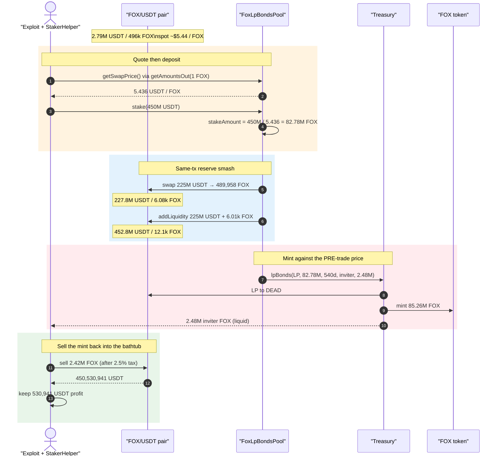
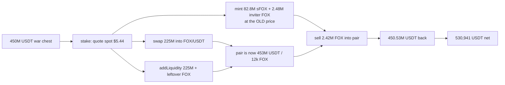

# Fox Market — Flash-loan LP-bond priced from a manipulable FOX/USDT spot

<!-- non-defihacklabs: Crypto Training original detection & analysis (Twitter hack alerting) -->

> **Vulnerability classes:** vuln/oracle/spot-price · vuln/oracle/price-manipulation · vuln/logic/price-calculation · vuln/governance/flash-loan-attack

> **Reproduction:** the PoC compiles & runs in an isolated Foundry project at
> [this project folder](.). Full verbose trace: [output.txt](output.txt).
> Verified vulnerable source:
> [FoxLpBondsPool.sol](sources/FoxLpBondsPool_58E2A8/project_contracts_FoxLpBondsPool.sol)
> (logic behind the `0x9fa6D8a1…` proxy) and
> [Treasury.sol](sources/Treasury_87614d/project_contracts_Treasury.sol)
> (`lpBonds` mints FOX against the caller-supplied `_stakeAmount`).

---

## Key info

| | |
|---|---|
| **Loss** | **~$120k** reported by TenArmor; live attacker kept **~112,976 USDT** after aggregating ~482M USDT of flash liquidity. This PoC extracts **530,941.02 USDT** (`530941023056701789655683` wei) from the FOX/USDT pair at the pre-attack block ([output.txt:779](output.txt)) — the same drain, without the live attacker's 20+ flash-loan fee stack |
| **Vulnerable contract** | `FoxLpBondsPool` proxy [`0x9fa6D8a13b35E051BFc145918db0111dEc13D1A0`](https://bscscan.com/address/0x9fa6d8a13b35e051bfc145918db0111dec13d1a0#code) → impl [`0x58E2A853BB14e46BefD3148bd4280370fEA4655A`](https://bscscan.com/address/0x58e2a853bb14e46befd3148bd4280370fea4655a#code) |
| **Treasury (minter)** | [`0x361d08ff43761E6a7E8Fcabe48048AE9010801cc`](https://bscscan.com/address/0x361d08ff43761e6a7e8fcabe48048ae9010801cc#code) → impl [`0x87614D97808DcDEcB069fe8489848fa1C001e04D`](https://bscscan.com/address/0x87614d97808dcdecb069fe8489848fa1c001e04d#code) |
| **Token** | `FOX` — [`0xdF81d50c6657487D19B66A1b5375E35A804Abb93`](https://bscscan.com/address/0xdf81d50c6657487d19b66a1b5375e35a804abb93) |
| **Victim pool** | FOX/USDT PancakeV2 pair — [`0xAAb18bCDEe287AEA288c0560612cAadf7c328803`](https://bscscan.com/address/0xaab18bcdee287aea288c0560612caadf7c328803) |
| **Attacker EOA** | [`0x5670d36f00bc7F6860B6AfdDb288E3668efc0ef9`](https://bscscan.com/address/0x5670d36f00bc7f6860b6afddb288e3668efc0ef9) |
| **Attacker contract** | [`0x3A82A2A77061017927e5331fFFd07c0308a1D2DA`](https://bscscan.com/address/0x3a82a2a77061017927e5331fffd07c0308a1d2da) |
| **Attack tx** | [`0x8e1775cbfd44db29744cc6687ff1822d2c47321de6e94062f789ad6181ad5514`](https://bscscan.com/tx/0x8e1775cbfd44db29744cc6687ff1822d2c47321de6e94062f789ad6181ad5514) |
| **Chain / block / date** | BSC / 116,169,049 (PoC forks **116,169,048**) / 2026-08-15 23:32 UTC |
| **Compiler** | Solidity **v0.8.28+commit.7893614a**, optimizer **enabled**, **200 runs**, cancun (Treasury + FoxLpBondsPool) |
| **Bug class** | **Spot-priced LP-bond mint**: `stake()` sizes FOX as `usdt / getAmountsOut(1 FOX)` against the live Pancake FOX/USDT pair, then swaps half the USDT into that same pair and `Treasury.lpBonds` mints a 3% liquid inviter reward that is sold back into the inflated pool |

---

## TL;DR

1. `FoxLpBondsPool.stake()` ([FoxLpBondsPool.sol:136-169](sources/FoxLpBondsPool_58E2A8/project_contracts_FoxLpBondsPool.sol#L136-L169)) is permissionless (any referred address). It **quotes FOX from Pancake `getAmountsOut(1e18, FOX→USDT)`** — a single-block spot read of the FOX/USDT pair ([FoxLpBondsPool.sol:124-134](sources/FoxLpBondsPool_58E2A8/project_contracts_FoxLpBondsPool.sol#L124-L134)).

2. It then sets `stakeAmount = usdtIn * 1e18 / swapPrice` **before** touching the pool, swaps **half** the USDT for FOX, adds the rest as FOX/USDT liquidity, and calls `Treasury.lpBonds` to **burn the LP to `address(dead)`** and mint `stakeAmount` FOX (locked as sFOX) plus a **3% inviter FOX reward that is transferred immediately** ([Treasury.sol:176-186](sources/Treasury_87614d/project_contracts_Treasury.sol#L176-L186)).

3. Because the quote is taken first, a whale deposit does not shrink the mint. The subsequent 50% swap **empties the FOX side of a thin pool** (pre-attack: **2,786,697.20 USDT / 496,041.72 FOX**, [output.txt:558](output.txt)). Adding the other 50% as LP then stuffing **2.48M newly minted inviter FOX** back in pulls out **450,530,941.02 USDT** ([output.txt:749-751](output.txt)).

4. Net of the 450M war chest the PoC seeded (stand-in for the live attacker's multi-venue flash loans), the attacker keeps **530,941.02 USDT**. TenArmor flagged the live tx at ~$120k; that attacker repaid ~482M of borrowed stables and booked ~113k after fees.

5. No privileged role is required. The only gate is a referral binding (`referralMap[staker] != 0`). The original attacker registered via the signed `setReferral`; the PoC uses the owner's setter so a fresh contract can sit in the same tree.

---

## Background — what Fox Market's LP-bond does

Fox Market is an Olympus-style rebase product on BSC: `FOX` is the floating token, `sFOX` the staked receipt, `rFOX` a reward share, and `Treasury` the only minter. Users who want the 540-day LP-bond path send **USDT** to `FoxLpBondsPool.stake`. The pool is supposed to:

- convert that USDT into a FOX/USDT LP position at the current market,
- lock the LP in the treasury (it is sent to `DEAD`),
- credit the user `sFOX` equal to the USDT's FOX-value,
- pay the user's inviter 3% in liquid FOX if the lock is ≥ 180 days.

That last bullet is the extractable asset. The first three are accounting. The price used for "USDT's FOX-value" is **not a TWAP, not a Chainlink feed, and not even the post-trade execution price** — it is `router.getAmountsOut(1 FOX)` against the same pair the function is about to trade.

---

## The vulnerable code

### 1. Spot quote used as the mint oracle

```solidity
function getSwapPrice(uint256 _timestamp) public view returns (uint256, uint256){
    if(_timestamp == 0){
        _timestamp = block.timestamp / TIME_BASE * TIME_BASE;
    }
    uint256[] memory amountsOut = ISwapRouter(swapRouter).getAmountsOut(1e18, foxToUsdtPath);
    uint256 swapPrice = amountsOut[1];
    if(discountRateTo > 0){
        swapPrice = swapPrice * (BASE_100 - getDiscountRate(_timestamp)) / BASE_100;
    }
    return (swapPrice, amountsOut[1]);
}
```

[FoxLpBondsPool.sol:124-134](sources/FoxLpBondsPool_58E2A8/project_contracts_FoxLpBondsPool.sol#L124-L134). `getAmountsOut` is a **same-block reserve read**. Anyone who can move the FOX/USDT pair (or, here, anyone who is about to dump a whale-sized USDT clip *after* this read) sets the number that sizes the mint.

At the fork the pair returned `getAmountsOut(1 FOX) = 5.6038 USDT`; after the 3.00% "discount" tap the pool used **`swapPrice = 5.436258687853353081` USDT/FOX** ([output.txt:562](output.txt)).

### 2. Mint is sized, then the pool is moved

```solidity
uint256 stakeAmount = _usdtAmount * 1e18 / swapPrice;

ISwapRouter(swapRouter).swapExactTokensForTokens(_usdtAmount / 2, 0, usdtToFoxPath, address(this), block.timestamp);

uint256 usdtBalance = IERC20(usdtToken).balanceOf(address(this));
uint256 foxBalance = IERC20(foxToken).balanceOf(address(this));
(, , uint256 liquidity) = ISwapRouter(swapRouter).addLiquidity(
    usdtToken, foxToken, usdtBalance, foxBalance, 0, 0, address(this), block.timestamp
);
// ...
inviterRewardAmount = stakeAmount * INVITER_REWARD_RATIO / BASE_100; // 300 / 10000 = 3%
ITreasury(treasury).lpBonds(liquidity, stakeAmount, stakeDays, inviterAddress, inviterRewardAmount);
```

[FoxLpBondsPool.sol:151-169](sources/FoxLpBondsPool_58E2A8/project_contracts_FoxLpBondsPool.sol#L151-L169). The 225M USDT swap in the PoC bought **489,958.22 FOX** and left the pair at **227,786,697 USDT / 6,083.50 FOX** ([output.txt:609-620](output.txt)) — FOX reserve down ~99%. Liquidity is then added and **immediately burned to `DEAD`**.

### 3. Treasury trusts the pool's `_stakeAmount`

```solidity
function lpBonds(uint256 _lpFoxAmount, uint256 _stakeAmount, uint256 _stakeDays,
                 address inviterAddress, uint256 inviterRewardAmount) external onlyStakingPool {
    IERC20(lpFoxToken).safeTransferFrom(msg.sender, DEAD, _lpFoxAmount);
    IMintableERC20(foxToken).mint(address(this), _stakeAmount + inviterRewardAmount);
    IMintableERC20(stakedFoxToken).mint(msg.sender, _stakeAmount);
    if (_stakeDays >= 180) {
        IMintableERC20(rewardFoxToken).mint(foxDistributor, _stakeAmount * REWARD_RATIO / BASE_100);
    }
    if (inviterRewardAmount > 0) {
        IERC20(foxToken).safeTransfer(inviterAddress, inviterRewardAmount);
    }
}
```

[Treasury.sol:176-186](sources/Treasury_87614d/project_contracts_Treasury.sol#L176-L186). There is **no re-quote, no TWAP, no cap**. The 3% inviter FOX (`2,483,325.53`) is transferred in the same call ([output.txt:698-699](output.txt)) and is sold the next statement.

---

## Root cause

The LP-bond treats a **manipulable spot AMM** as a price oracle **and** as the execution venue, in that order, inside one function:

1. **Read** `getAmountsOut(1 FOX)` → decide how many FOX the deposit is "worth".
2. **Trade** half the deposit through the same pool → the reserves that produced (1) no longer exist.
3. **Mint** the pre-trade FOX amount (plus 3% liquid inviter FOX) as if the deposit had been converted at the *old* price.
4. **Leave** the newly minted inviter FOX free to sell into the *new* (USDT-heavy, FOX-starved) curve.

Step 2 does not update step 1. Step 3 does not look at how much FOX the swap actually bought (489,958) — it mints **82,777,518 sFOX + 2,483,326 inviter FOX** as if 450M USDT bought FOX at $5.44. The 3% slice is enough, once the pool has been turned into a 452M-USDT / 12k-FOX bathtub, to buy back **450.53M USDT**.

This is the classic "mint against a spot you are about to move" Olympus-bond failure mode. A TWAP, a dedicated pricing pool the bond is forbidden to trade, or minting `stakeAmount` from the **post-trade** FOX actually acquired would have closed it.

---

## Preconditions

- **`FoxLpBondsPool` is a registered staking pool** so `Treasury.onlyStakingPool` passes. It was set by the owner at deploy (tx history on the treasury proxy).
- **`stakeDays >= 180`** (this pool is initialized at **540**) so the 3% inviter FOX is paid.
- **Deposit ≥ 1,000 USDT** (`INVITER_REWARD_MIN_AMOUNT`) and ≥ 100 USDT (`MIN_AMOUNT`).
- **A referral binding** for the staking contract (`referralMap[staker] != address(0)`). Anyone can obtain one via the signed `setReferral` path; the PoC uses `onlyOwner setReferral` to bind a freshly deployed helper.
- **Thin FOX/USDT spot liquidity** relative to the war chest. Pre-attack the pair held only **~2.79M USDT / ~496k FOX**. A 450M clip is ~161× the USDT reserve — enough that leftover FOX after the 50% swap is ~6k and the 2.48M inviter FOX can drain the pair.
- **Working capital on the order of hundreds of millions of USDT**, flash-loanable. The live attacker pulled WBNB/USDT/USDC/lisUSD from Lista, Venus, Aave, Pancake Infinity, Uniswap v4 and a dozen V2 pairs in one tx. The PoC seeds the same scale with `deal` so the lesson stays on the mint, not on flash-loan routing.

---

## Attack walkthrough (numbers from `output.txt`)

All figures are 18-decimal. The victim pool is FOX/USDT `0xAAb18bCD…` (token0 = USDT, token1 = FOX).

| # | Step | Raw (wei) | ~Human | Trace |
|---|------|----------:|-------:|-------|
| 0 | Pair `getReserves()` before trade | r0 `2786697198864505157273333` / r1 `496041716814196640205248` | **2,786,697.20 USDT / 496,041.72 FOX** | [output.txt:558](output.txt) |
| 0 | `getAmountsOut(1 FOX)` / discounted `swapPrice` | `5603812687200652594` / `5436258687853353081` | **$5.6038 / $5.4363 per FOX** | [output.txt:559-562](output.txt) |
| 1 | Seed war chest (live: ~482M flash-loaned; PoC: `deal`) | `450000000000000000000000000` | **450,000,000 USDT** | [output.txt:546-547](output.txt) |
| 2 | `stake(450M, maxPrice)` → `stakeAmount = 450M / 5.4363` | `82777517744964801045863495` | **82,777,517.74 FOX** | [output.txt:576](output.txt), [:713](output.txt) |
| 3 | Swap **half** (225M USDT) for FOX | `489958218314447205652237` | **489,958.22 FOX** out | [output.txt:598-609](output.txt) |
| 3 | Pair after the swap | r0 `227786697198864505157273333` / r1 `6083498499749434553011` | **227,786,697 USDT / 6,083.50 FOX** | [output.txt:620](output.txt) |
| 4 | `addLiquidity` 225M USDT + 6,009.07 FOX → LP | `1161058529474901240397366` | **1,161,058.53 LP** | [output.txt:651-669](output.txt) |
| 4 | Pair after add-LP | r0 `452786697198864505157273333` / r1 `12092572687469146778493` | **452,786,697 USDT / 12,092.57 FOX** | [output.txt:660](output.txt) |
| 5 | `Treasury.lpBonds` burns LP to `DEAD` | `1161058529474901240397366` | 1,161,058.53 LP | [output.txt:674-675](output.txt) |
| 5 | Mint FOX to treasury (`stake + inviter`) | `85260843277313745077239399` | **85,260,843.28 FOX** | [output.txt:680-681](output.txt) |
| 5 | Mint sFOX to the pool (locked 540 days) | `82777517744964801045863495` | **82,777,517.74 sFOX** | [output.txt:686-687](output.txt) |
| 5 | Mint rFOX (11% of stake) to distributor | `9105526951946128115044984` | **9,105,526.95 rFOX** | [output.txt:692-693](output.txt) |
| 5 | Transfer **3% inviter FOX** to the exploit | `2483325532348944031375904` | **2,483,325.53 FOX** | [output.txt:698-699](output.txt) |
| 6 | Sell inviter FOX (2.5% sell tax → 62,083.14 to fee sink) | net `2421242394040220430591507` into pair | **2,421,242.39 FOX** | [output.txt:734-737](output.txt) |
| 6 | Pair pays USDT out | `450530941023056701789655683` | **450,530,941.02 USDT** | [output.txt:749-751](output.txt) |
| 6 | Pair after the dump | r0 `2255756175807803367617650` / r1 `2433334966727689577370000` | **2,255,756.18 USDT / 2,433,334.97 FOX** | [output.txt:760](output.txt) |
| 7 | Forward surplus to attacker EOA | `530941023056701789655683` | **530,941.02 USDT** | [output.txt:770-779](output.txt) |

### Profit / loss accounting (USDT)

| Item | Amount (wei) | ~Human |
|---|---:|---:|
| USDT seeded (war chest / flash stand-in) | 450,000,000,000,000,000,000,000,000 | 450,000,000.00 |
| USDT received from selling inviter FOX | 450,530,941,023,056,701,789,655,683 | 450,530,941.02 |
| **Net profit forwarded to attacker EOA** | **530,941,023,056,701,789,655,683** | **530,941.02** |
| Attacker USDT before (dust already on the EOA) | 288,490,578,616,170,008,916 | 288.49 |
| Attacker USDT after | 531,229,513,635,317,959,664,599 | 531,229.51 |

The victim pair's USDT reserve went **2,786,697 → 2,255,756** after the round-trip, plus the 450M that was temporarily pushed in and extracted again. The **530,941 USDT** kept by the PoC is the original pool's USDT (minus the ~531k that remains + the 2.5% FOX sell tax + add-LP dust). The live attacker did the same trade with ~482M of *borrowed* stables and paid venue fees on the way in and out, which is why TenArmor's alert printed ~$120k / ~113k kept.

The PoC asserts `profit > 100_000 ether` ([FoxMarket_exp.sol](test/FoxMarket_exp.sol)) and the trace confirms `530941023056701789655683` ([output.txt:779](output.txt), [output.txt:787](output.txt)).

---

## Diagrams

### Sequence of the attack



### Where the money comes from



---

## Remediation

- **Do not price a mint from the same spot pool the function trades.** Use a TWAP (Uniswap v3 oracle, or a rolling checkpoint), a Chainlink / RedStone feed, or a dedicated deep stable pool the bond is not allowed to touch.
- **Mint from execution, not from a pre-trade quote.** `stakeAmount` should be the FOX actually received from the swap (or a conservative function of post-trade reserves), never `usdt / getAmountsOut(1)`.
- **Do not pay a liquid inviter reward in the same transaction as the LP-bond.** Vest it, pay it in sFOX, or delay it by at least one rebase window so a same-tx dump is impossible.
- **Cap `_stakeAmount` / inviter FOX per block and vs TVL.** A 450M clip against a 2.8M pool should have reverted.
- **Circuit-breaker on reserve movement.** If the FOX/USDT pair moves more than X% inside `stake()`, abort.
- **Keep LP, don't send it to `DEAD` in the same call that mints liquid FOX.** Burning the LP permanently donates the dumped USDT to whoever next sells into the pair — i.e. the attacker.

---

## How to reproduce

```bash
# from the registry root
_shared/run_poc.sh 2026-08-FoxMarket_exp -vvvvv
```

The test forks BSC at block **116,169,048** (`http://127.0.0.1:8546`, served from [anvil_state.json](anvil_state.json)), binds the exploit into the referral tree, seeds a 450M USDT war chest, and calls `FoxMarketExploit.attack()`. Expect `[PASS]` and `USDT profit: 530941.023056701789655683` as in [output.txt](output.txt).

---

*Reference: https://x.com/TenArmorAlert/status/2089170318049132843*


## References

- https://x.com/DefimonAlerts/status/2089236577616560383 (@DefimonAlerts secondary analysis)

- https://x.com/SlowMist_Team/status/2089196291800908164 (@SlowMist_Team secondary analysis)
