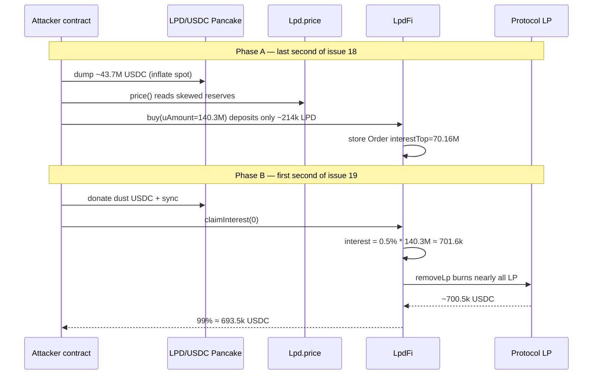
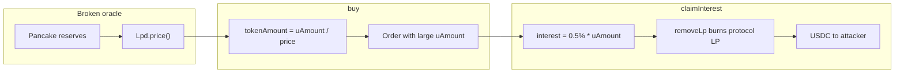

# LpdFi — Spot-Oracle Price Manipulation Drains Protocol LP via claimInterest

<!-- non-defihacklabs: Crypto Training original detection & analysis (Twitter hack alerting) -->

> **Vulnerability classes:** vuln/oracle/spot-price · vuln/oracle/price-manipulation · vuln/oracle/single-source · vuln/logic/price-calculation

> **Reproduction:** the PoC compiles & runs in an isolated Foundry project at
> [this project folder](.). The fork is served offline from the bundled
> `anvil_state.json` (local anvil at `127.0.0.1:8546`), so no public RPC is required.
> Full verbose trace: [output.txt](output.txt).
> Verified sources: [LpdFi](sources/LpdFi_cE6A6e/project_contracts_LpdFi.sol),
> [Lpd](sources/Lpd_38763E/project_contracts_Lpd.sol).

---

## Key info

| | |
|---|---|
| **Loss** | **~693,529.79 USDC** (~$690K) drained from protocol LPD/USDC LP in the claim tx; public reports ~$690K |
| **Vulnerable contract** | LpdFi [`0xcE6A6e4413D85A136bBaC8AaE6fB46eAa77F295e`](https://bscscan.com/address/0xce6a6e4413d85a136bbac8aae6fb46eaa77f295e#code) |
| **Vulnerable oracle** | `Lpd.price()` on LPD [`0x38763EebE58a69C9CC91876947D9fB83e1273604`](https://bscscan.com/address/0x38763eebe58a69c9cc91876947d9fb83e1273604#code) — unguarded PancakeSwap LPD/USDC spot reserves |
| **LPD/USDC pair** | [`0x85346d31743796F7d00D675629e32783A968F210`](https://bscscan.com/address/0x85346d31743796f7d00d675629e32783a968f210) |
| **Attacker EOA** | [`0x5d289266d85EF671561bA3F253FB79327C193f33`](https://bscscan.com/address/0x5d289266d85ef671561ba3f253fb79327c193f33) |
| **Attacker contract** | [`0x7f5AD0A998Dcb3f5006F0D152BEBC055979EF711`](https://bscscan.com/address/0x7f5ad0a998dcb3f5006f0d152bebc055979ef711) (unverified) |
| **Setup tx (buy)** | [`0xbb5b8573d7203e00f8fb9d4839dbeea46a8efd367eac8bed81e4ece2341c3588`](https://bscscan.com/tx/0xbb5b8573d7203e00f8fb9d4839dbeea46a8efd367eac8bed81e4ece2341c3588) — block **113,613,923** (issue 18, last second) |
| **Attack tx (claim)** | [`0x70bbe0aa3c7ef149ecb6128a06025885deaa8fef3f393a505d447d28ab3315d6`](https://bscscan.com/tx/0x70bbe0aa3c7ef149ecb6128a06025885deaa8fef3f393a505d447d28ab3315d6) — block **113,613,924** (issue 19, first second) |
| **Chain / block / date** | BNB Chain (chainId 56) / PoC fork block **113,613,923** / 2026-08-02 |
| **Compiler** | Solidity **v0.8.28**, multi-file (`project/contracts/…`) |
| **Bug class** | Spot-price oracle manipulation: `buy()` sizes the LPD deposit as `uAmount / Lpd.price()` from live Pancake reserves; one issue later `claimInterest` pays `0.5% * uAmount` by burning protocol LP |

---

## TL;DR

1. **LpdFi is a staking product.** Users deposit LPD, open an “order” denominated in a notional `uAmount` (USDC units), and earn 0.5%/day interest (capped at 50% of `uAmount`). Interest is paid by burning the protocol’s LPD/USDC LP tokens via `removeLp` and sending **99%** of the USDC to the caller.

2. **`Lpd.price()` is a naked spot read.** It returns `reserve_usdc * 1e18 / reserve_lpd` from the Pancake LPD/USDC pair with **no TWAP, no circuit breaker, no manipulation guard**.

3. **Buy-side: inflate spot → open a huge notional with tiny LPD.** In block `113,613,923` (last second of issue 18) the attacker flash-borrowed tens of millions of USDC (Venus + multi-market), dumped ~43.7M USDC into the LPD/USDC pair, and called `buy(uAmount ≈ 140.3M)` while depositing only **~214,171 LPD**. At the manipulated price that tiny deposit “paid for” a 140M notional and a **70.16M** interest cap.

4. **Claim-side: one second later, drain the LP.** At the first second of issue 19 the order accrues one full day of interest: `0.5% × 140.3M ≈ 701,623.66 USDC`. `claimInterest(0)` burns essentially **all** of LpdFi’s LP (`~1.678e24` LP tokens) and pays **~693,529.79 USDC** (99%) to the attacker.

5. **PoC reproduces the claim drain offline.** Fork at post-buy state, warp +1s across the issue boundary, etch a clean exploit over the attack contract (so `msg.sender` is still the order owner), `claimInterest(0)`, forward USDC to the EOA. Profit: **693,529.790339395390761215 USDC** ([output.txt](output.txt)).

---

## Background

LpdFi (token symbol **LPD**, “LOOPSDAO”) is a BNB Chain staking / “finance” product:

- Users must be **bound** in a referral tree (`Binding.bind`) before `buy`.
- `buy(uAmount)` pulls `tokenAmount = uAmount * 1e18 / token.price()` LPD from the user, records an `Order` with `interestRate = 0.5%/day` and `interestTop = 50% * uAmount`, and increases `investedUAmount`.
- Each “issue” is a 1-day period (`ISSUE_PERIOD = 1 days`, day boundary offset 16 hours UTC).
- `claimInterest` realises accrued interest by burning protocol-owned LP for USDC.

The protocol treasury that pays interest is the LPD/USDC Pancake LP held by LpdFi — not a separate USDC vault. That makes interest payouts a direct function of LP inventory and pair reserves.

---

## The vulnerable code

### Spot oracle — `Lpd.price()`

```solidity
// sources/Lpd_38763E/project_contracts_Lpd.sol
function price() public view returns (uint256) {
    (uint256 r0, uint256 r1, ) = IPancakePair(pair).getReserves();
    (address token0, ) = PancakeLibrary.sortTokens(address(this), USDC_ADDRESS);
    if (token0 == address(this)) {
        return (r1 * 1e18) / r0;
    }
    return (r0 * 1e18) / r1;
}
```

No TWAP, no observation window, no max-deviation check. A same-block (or prior-block) reserve skew fully controls the reported price.

### Order sizing uses that price

```solidity
// sources/LpdFi_cE6A6e/project_contracts_LpdFi.sol — buy()
uint256 tokenAmount = (uAmount * 1e18) / token.price();
if (token.balanceOf(msg.sender) < tokenAmount) {
    revert BalanceNotEnough();
}
IERC20(token).safeTransferFrom(msg.sender, address(this), tokenAmount);
// … stores Order with uAmount, interestTop = uAmount * INTEREST_TOP / BASE …
```

Inflate `price()` → fewer LPD required for the same `uAmount` → under-collateralised notional.

### Interest is paid from protocol LP

```solidity
// sources/LpdFi_cE6A6e/project_contracts_LpdFi.sol — claimInterest()
Order memory order = getOrder(msg.sender, id);
// interestClaimable = rate * uAmount * (issue - lastIssue) / BASE  (capped at interestTop)
…
(,uint256 amountB) = removeLp(order.interestClaimable);
uint256 a = (amountB * 99) / 100;
IERC20(USDC_ADDRESS).safeTransfer(msg.sender, a);
IERC20(USDC_ADDRESS).safeTransfer(feeAddress, amountB - a);
```

```solidity
function removeLp(uint256 usdcAmount) private returns (uint256 amountA, uint256 amountB) {
    uint256 lpTotalSupply = IERC20(pair).totalSupply();
    (uint256 r0, uint256 r1, ) = IPancakePair(pair).getReserves();
    // needLpAmount sized so the USDC leg ≈ usdcAmount
    …
    (amountA, amountB) = IPancakeRouter01(ROUTER_ADDRESS).removeLiquidity(…);
}
```

The interest amount is **notional USDC**, independent of how little LPD was deposited. One day of 0.5% on a 140M notional is ~701k USDC — enough to empty the protocol’s LP.

---

## Root cause

1. **Single-source spot oracle** for a critical accounting input (`buy` deposit size).
2. **Notional (`uAmount`) is trusted forever** for interest, even though the LPD deposited can be arbitrarily reduced by a temporary price spike.
3. **Interest is paid by burning shared LP**, so one underfunded whale order can liquidate the entire LP treasury in a single `claimInterest`.

The issue-boundary timing (last second of day N → first second of day N+1) is an optimisation, not a requirement — any order that accrues ≥1 issue of interest can drain proportionally.

---

## Preconditions

- LpdFi is live with material LPD/USDC LP held by the protocol (here ~all of the pair’s protocol-side LP ≈ 1.678e24 LP tokens / ~700k+ USDC side).
- Attacker can flash-borrow large USDC (Venus / multi-pool) and trade the LPD/USDC pair.
- Attacker can `Binding.bind` and hold some LPD for the (small) deposit.
- At least one issue period elapses after `buy` before `claimInterest` (here: 1 second across the day boundary).

---

## Attack walkthrough

### Phase A — buy (block 113,613,923, issue 18)

On-chain setup tx [`0xbb5b8573…`](https://bscscan.com/tx/0xbb5b8573d7203e00f8fb9d4839dbeea46a8efd367eac8bed81e4ece2341c3588):

1. Flash-borrow USDC from multiple markets (~730k from one vault plus Venus-style sources totaling tens of millions).
2. Dump **~43.71M USDC** into the LPD/USDC pair, receiving **~4.79M LPD**.
3. `buy` with `uAmount = 140,324,732e18`, depositing only **214,171.515 LPD** into LpdFi.
4. Sell leftover LPD back to USDC, repay flash loans.
5. Leave **~3,440.995 USDC** dust on the attack contract (used next tx).

Resulting order (read at fork block in the PoC):

| Field | Value |
|---|---|
| `tokenAmount` | 214,171.515 LPD |
| `uAmount` | 140,324,732 USDC units |
| `interestTop` | 70,162,366 USDC units |
| `interestRate` | 500,000 / 1e8 = **0.5%/issue** |
| `startIssue` / `lastIssue` | 18 / 18 |

Fair value of 214k LPD at pre-manip price (~0.127 USDC) is only ~**$27k**, yet the order’s first-day interest alone is **~$701k**.

### Phase B — claim (block 113,613,924, issue 19) — what the PoC replays

1. **Warp** across the issue boundary (`timestamp 1785686399 → 1785686400`).
2. **Donate residual USDC** (~3,440.995) into the pair + `sync()` so `removeLp(interest)`’s `needLp` fits within the protocol’s LP balance.
3. **`claimInterest(0)`** as the attack contract:
   - Accrues `interestClaimable = 701,623.66 USDC`
   - `removeLp` burns ~all protocol LP
   - Sends **99%** = **693,529.790339395390761215 USDC** to the caller ([output.txt](output.txt))
   - Sends **1%** fee to `feeAddress`
4. Forward USDC to the attacker EOA.

PoC assertion: profit **> 690,000 USDC**. Observed: **693,529.79 USDC**.

---

## Diagrams





---

## Remediation

1. **Replace spot `price()` with a manipulation-resistant oracle** — Uniswap/Pancake v2/v3 TWAP with a sufficient window, Chainlink, or a median of multiple sources. Reject updates beyond a max deviation.
2. **Do not let notional `uAmount` exceed the fair value of deposited LPD** at a robust price; re-mark orders or use LPD-denominated interest.
3. **Cap per-order / per-block interest redemption** relative to LP inventory and TVL; circuit-break if a single claim would remove more than X% of protocol LP.
4. **Separate the interest reserve** from AMM LP so spot skew cannot change how much USDC a given LP burn releases in unexpected ways; pay interest from a dedicated USDC vault sized by actual deposits.
5. **Same-block / same-tx guards** — refuse `buy` if the pair was synced/swapped in the current block (basic, not sufficient alone).

---

## How to reproduce

```bash
# Offline (bundled anvil_state.json — no RPC keys required)
cd /path/to/evm-hack-registry
_shared/run_poc.sh 2026-08-LpdFi_exp -vvvvv
# expect: [PASS] testExploit — Attacker USDC profit ≈ 693,529.79
```

PoC entry: [test/LpdFi_exp.sol](test/LpdFi_exp.sol) — forks block `113,613,923`, warps +1s, etches `LpdFiExploit` over the real attack contract (preserving `msg.sender` as the order owner), calls `attack()` → `claimInterest(0)`.

---

*Reference: [DefimonAlerts — LpdFi ~$690K oracle/price manipulation (2026-08-02)](https://x.com/DefimonAlerts/status/2084157533204197380)*
