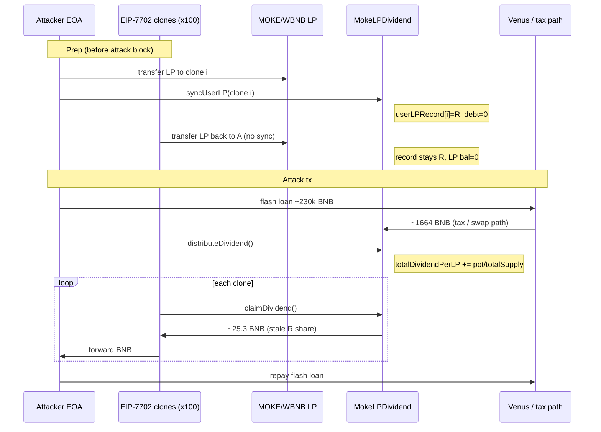
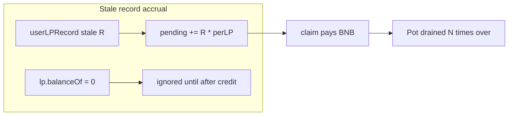

# MOKE LP Dividend Drain — Stale `userLPRecord` Double-Claim via Unsynced LP Transfers

<!-- non-defihacklabs: Crypto Training original detection & analysis (Twitter hack alerting) -->

> **Vulnerability classes:** vuln/logic/reward-calculation · vuln/logic/incorrect-state-transition · vuln/logic/missing-check · vuln/governance/flash-loan-attack

> **Reproduction:** the PoC compiles & runs in an isolated Foundry project at
> [this project folder](.). Full verbose trace: [output.txt](output.txt).
> Verified vulnerable source:
> [MokeLPDividend.sol](sources/MokeLPDividend_5ae569/project_contracts_MokeLPDividend.sol)
> and the fee-on-transfer token [MokeToken.sol](sources/MokeToken_1a35c1/project_contracts_MokeToken.sol).

---

## Key info

| | |
|---|---|
| **Loss** | **~$907.7K** (~**1,546.5 BNB** net to the attacker in the live tx; PoC drains **~1,639 BNB** of a **1,664.6 BNB** pot via stale LP records — [output.txt:456](output.txt)) |
| **Vulnerable contract** | `MokeLPDividend` — [`0x5ae569d8a0539a6a603e96a26ac8caea7ceba377`](https://bscscan.com/address/0x5ae569d8a0539a6a603e96a26ac8caea7ceba377#code) |
| **Token / LP** | `MOKE` — [`0x1a35c16ce21903bc17fd020c4ed73fedc70c1b2a`](https://bscscan.com/token/0x1a35c16ce21903bc17fd020c4ed73fedc70c1b2a) · MOKE/WBNB LP — [`0xBA6a49A97Cc725B3C39d6C5ea6dEfFddb64fe6b8`](https://bscscan.com/address/0xBA6a49A97Cc725B3C39d6C5ea6dEfFddb64fe6b8) |
| **Attacker EOA** | [`0xE454a9BAC1a44868e4A9Cbe1a4B5ac231D0DCF8a`](https://bscscan.com/address/0xe454a9bac1a44868e4a9cbe1a4b5ac231d0dcf8a) |
| **Claim clones** | ~100 EIP-7702 delegated EOAs (designator `0xef0100…` → helper `0x8dbbedc9…`), each pre-synced with the same stale `userLPRecord` |
| **Flash-loan source** | Venus vBNB — [`0xA07c5B74C9B40447A954e1466938B865b6BBea36`](https://bscscan.com/address/0xa07c5b74c9b40447a954e1466938b865b6bbea36) (~230,000 BNB) |
| **Attack tx** | [`0x0776048b1b58064fb31b6513721811e7b44d6bdbe7bf5833158b241ca6756a8f`](https://bscscan.com/tx/0x0776048b1b58064fb31b6513721811e7b44d6bdbe7bf5833158b241ca6756a8f) |
| **Chain / block / date** | BSC (chainId 56) / **113,652,609** (fork PoC at **113,652,608**) / 2026-08-02 ~20:50 UTC |
| **Compiler** | Solidity **v0.8.28+commit.7893614a** (MokeLPDividend, verified) |
| **Bug class** | LP-dividend tracker credits claims from **stale `userLPRecord`** after LP is transferred without re-sync — same LP share is claimed many times |

---

## TL;DR

1. `MokeLPDividend` pays BNB dividends **proportional to MOKE/WBNB LP holdings**, using a MasterChef-style debt model: `userLPRecord`, `userDividendDebt`, and global `totalDividendPerLP` ([MokeLPDividend.sol:43-46](sources/MokeLPDividend_5ae569/project_contracts_MokeLPDividend.sol#L43-L46)).

2. Records are updated **only** in `_syncUserLP` ([MokeLPDividend.sol:131-149](sources/MokeLPDividend_5ae569/project_contracts_MokeLPDividend.sol#L131-L149)). **Pancake LP ERC-20 transfers never call sync.** MokeToken only syncs on *MOKE* transfers that touch a market pair — not on LP moves.

3. Before the attack, the attacker held **~1,334.18 LP** and walked that balance through **~100 EIP-7702 clones**, calling `syncUserLP` on each while `totalDividendPerLP == 0`. Every clone stored `userLPRecord = 1.334e21` and `debt = 0`, then sent the LP away **without** re-syncing. On the fork block each clone still has that stale record and **zero** LP balance.

4. The live attack flash-loaned **~230k BNB** from Venus, forced a large taxed MOKE volume so **~1,664.6 BNB** landed in the dividend contract, then called `distributeDividend()`. Accrual used the **real** `lpToken.totalSupply()` as the denominator ([MokeLPDividend.sol:168-175](sources/MokeLPDividend_5ae569/project_contracts_MokeLPDividend.sol#L168-L175)).

5. Each clone then `claimDividend()` → `_syncUserLP` credits `pending += recordedLP * totalDividendPerLP / 1e18` from the **stale** record ([MokeLPDividend.sol:135-139](sources/MokeLPDividend_5ae569/project_contracts_MokeLPDividend.sol#L135-L139)) and pays ~**25.32 BNB** per clone — as if each still held the full LP. Sum of stale records ≫ real total supply → the pot is drained.

6. PoC offline result ([output.txt:456-457](output.txt)): **1,639.29 BNB** claimed via clones; **1,665.62 BNB** attacker balance (includes returned seed capital). Live incident net ~**1,546.5 BNB** (~$907.7K).

---

## Background

MOKE is a tax token on BSC. Sell/buy taxes (2% LP dividend + 2% NFT + 1% marketing) accumulate on `MokeToken`, are swapped to BNB, and the LP share is forwarded to `MokeLPDividend` via `receive()` → `unprocessedBNB`. Anyone may call `distributeDividend()` to convert pending BNB (and any MOKE sitting on the dividend contract) into an increase of `totalDividendPerLP`. LP holders then `claimDividend()`.

The design assumes `userLPRecord[user]` always tracks `lpToken.balanceOf(user)`. That invariant is **not enforced on LP transfers**.

---

## The vulnerable code

### 1. Accrual uses stale `recordedLP` before refreshing the record

```solidity
// sources/MokeLPDividend_5ae569/project_contracts_MokeLPDividend.sol:131-149
function _syncUserLP(address user) internal {
    uint256 currentLP = lpToken.balanceOf(user);
    uint256 recordedLP = userLPRecord[user];

    if (recordedLP > 0) {
        uint256 accumulated = recordedLP * totalDividendPerLP / 1e18;
        uint256 debt = userDividendDebt[user];
        if (accumulated > debt) {
            userPendingDividend[user] += accumulated - debt; // credits STALE share
        }
    }
    // ... then finally:
    userLPRecord[user] = currentLP;
    userDividendDebt[user] = currentLP * totalDividendPerLP / 1e18;
}
```

If `recordedLP` was set when the user briefly held LP, and they later transferred it away without calling `syncUserLP`, the next sync/claim still pays out as if they held `recordedLP` for the entire distribution window.

### 2. Distribution uses real total supply (fair denominator, unfair numerators)

```solidity
// sources/MokeLPDividend_5ae569/project_contracts_MokeLPDividend.sol:168-175
uint256 totalLP = lpToken.totalSupply();
uint256 perLP = bnbAmount * 1e18 / totalLP;
totalDividendPerLP += perLP;
```

`perLP` is correct for honest holders. Multiplied by **N copies** of the same historical LP amount across clones, total claim rights become `N * attackerLP / totalSupply` — here `N ≈ 100` and `attackerLP / totalSupply ≈ 1.52%`, so claim rights exceed 100% of the pot. First claimers win; the contract's BNB balance is the only cap.

### 3. `claimDividend` always syncs then pays

```solidity
// sources/MokeLPDividend_5ae569/project_contracts_MokeLPDividend.sol:180-191
function claimDividend() external override nonReentrant whenNotPaused {
    _syncUserLP(msg.sender);
    uint256 pending = userPendingDividend[msg.sender];
    require(pending > 0, "No dividend");
    userPendingDividend[msg.sender] = 0;
    (bool sent,) = payable(msg.sender).call{value: pending}("");
    require(sent, "Transfer failed");
}
```

No check that `pending` is consistent with current LP or with sum of all records ≤ totalSupply.

---

## Root cause

**Missing LP-transfer hooks + debt accrual on stale records.**  
Eligibility is stored in `userLPRecord` / `userDividendDebt` but is never updated when Pancake LP tokens move. An attacker can:

1. Hold LP amount `R`, with `totalDividendPerLP = 0` so `debt = 0` after sync.
2. Transfer `R` to clone B, `syncUserLP(B)`, transfer back — repeat for many clones.
3. Trigger (or wait for) a large `distributeDividend`.
4. Have every clone claim `R / totalSupply` of the pot.

This is a classic **share-token reward double-dip** / **stale snapshot** bug, amplified by EIP-7702 claim automation and flash-loan-sized tax volume.

---

## Preconditions

- Attacker (or prep txs) can obtain MOKE/WBNB LP and call `syncUserLP` freely (permissionless).
- `totalDividendPerLP` is still low/zero at prep time so `debt` stays 0 after each sync.
- A non-trivial BNB pot will enter `MokeLPDividend` (protocol tax, donated MOKE swap, or — as in the live tx — flash-loan-driven volume).
- Many addresses (EOAs / EIP-7702 delegates) available to hold stale records and call `claimDividend`.

On block **113,652,608** those prep conditions were already on-chain: 100 clones each with `userLPRecord = 1334183807563777105758` and `debt = 0`, while only the attacker EOA still held the real LP.

---

## Attack walkthrough

Numbers from the offline PoC ([output.txt](output.txt)) unless noted as live-tx.

1. **Fork pre-attack** at block `113,652,608`. Confirm clone #0: `userLPRecord == attacker LP`, `debt == 0`, `lp.balanceOf(clone) == 0`; `totalDividendPerLP == 0`.

2. **Seed the dividend pot** with the **1,664.616… BNB** observed entering `MokeLPDividend` in the live attack (stand-in for Venus flash-loan → taxed MOKE flow + internal MOKE→BNB swap). `receive()` credits `unprocessedBNB`.

3. **`distributeDividend()`** ([output.txt:521](output.txt)):
   - `bnbAmount = 1664616180024096154954`
   - `totalLP = 87707736520595878692798`
   - `perLP ≈ 1.897e16` (emitted as `DividendDistributed`)

4. **Claim loop** over 65 poisoned clones (subset of the 100 in the attack calldata). Each:
   - `_syncUserLP`: `recordedLP = 1.334e21`, `currentLP = 0` → `UserLPSynced` then pending ≈ **25.3216 BNB**
   - Pays clone, test forwards to attacker EOA

5. **Attacker EOA claim** (still holds live LP) takes another ~25.32 BNB share.

6. **Result** ([output.txt:456-459](output.txt)):
   - Claimed via clones: **1,639.294828337604995436 BNB**
   - Attacker profit (incl. returned seed dust): **1,665.616470889346105615 BNB**
   - Dividend leftover: **49339 wei** (~empty)

Live tx net to attacker was ~**1,546.5 BNB** after flash-loan fees / path differences; same bug, same drain class.

---

## Diagrams





---

## Remediation

1. **Hook LP transfers** — use a custom LP wrapper, or require claims/sync only through a vault that updates debt on every balance change. Plain Pancake LP cannot callback on transfer; design must not trust external LP balances without continuous sync.

2. **Accrue from `min(recorded, current)` or always set record from `balanceOf` before multiplying** — never pay on a recorded amount higher than current balance for the period after the last sync. Safer pattern: snapshot at distribution time into a claimable merkle/bitmap, or use a pull-based share token minted 1:1 with deposited LP.

3. **Cap claims** — track `totalClaimable` / `totalDistributed` and require `sum(pending) ≤ contract.balance` with pro-rata scaling, or maintain `totalRecordedLP` invariant `==` eligible supply.

4. **Force sync on claim paths only is not enough** if sync itself trusts stale `recordedLP` for the accrual step — fix the accrual order/math (credit based on LP held *during* the epoch, not the pre-transfer snapshot after exit).

5. **Operational** — pause `claimDividend` / `distributeDividend` if `sum(userLPRecord)` diverges from `lp.totalSupply()` by a threshold.

---

## How to reproduce

```bash
# Offline (anvil loads anvil_state.json — no RPC required)
cd /path/to/evm-hack-registry
_shared/run_poc.sh 2026-08-MOKE_exp -vvvvv
# Expect: [PASS] testExploit — ~1639 BNB claimed via clones
```

PoC entry: [test/MOKE_exp.sol](test/MOKE_exp.sol). Fork block `113_652_608`, chain port `8546` (BSC).

---

*Reference: https://x.com/TenArmorAlert/status/2084102947500368164*
