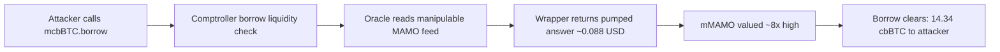

# Moonwell MAMO Thin-Market Oracle Manipulation — Borrow Real Assets Against Inflated Collateral

<!-- non-defihacklabs: Crypto Training original detection & analysis (Twitter hack alerting) -->

> **Vulnerability classes:** vuln/oracle/spot-price · vuln/oracle/thin-liquidity · vuln/oracle/missing-validation

---

## Key info

| | |
|---|---|
| **Loss** | **~$8.7M–$10M** (ExVul: ~71.36 cbBTC / ~$5.7M from mcbBTC alone; SlowMist totals ~$8.7M incl. stables/ETH) |
| **Chain** | Base |
| **Protocol** | Moonwell (`@MoonwellDeFi`) |
| **Attacker EOA** | [`0x719eae70…919D`](https://basescan.org/address/0x719eae70d4a83f35bf82a2740699f5db84be919d) (EIP-7702) |
| **Collateral market** | `mMAMO` [`0x2F90Bb22…dA32`](https://basescan.org/address/0x2f90bb22eb3979f5ffad31ea6c3f0792ca66da32) |
| **MAMO underlying** | [`0x7300B37D…219fE`](https://basescan.org/address/0x7300B37DfdfAb110d83290A29DfB31B1740219fE) |
| **Borrow market (PoC)** | `mcbBTC` [`0xF877ACaF…5976`](https://basescan.org/address/0xf877acafa28c19b96727966690b2f44d35ad5976) → cbBTC |
| **Oracle** | Moonwell `ChainlinkOracle` [`0xEC942bE8…a9d0`](https://basescan.org/address/0xEC942bE8A8114bFD0396A5052c36027f2cA6a9d0) |
| **MAMO/USD feed** | OEV wrapper [`0xDBD37C27…afe6`](https://basescan.org/address/0xDBD37C274A70A8A3f92A227c843a6a8d3203afe6) |
| **Largest borrow tx** | [`0xafb6f0fa…798f`](https://basescan.org/tx/0xafb6f0fa257b115a5c813bf787b4c1535e63888b1d0dbeb1f3788f557f51798f) (~14.34 cbBTC) |
| **Fork block** | **50,516,531** (pre largest borrow @ 50,516,532) |
| **Alert** | [SlowMist](https://x.com/SlowMist_Team/status/2092949807912689915) · [ExVul](https://x.com/exvulsec/status/2092912846036402674) |
| **Bug class** | Thin-market collateral + manipulable oracle price → over-borrow |

---

## TL;DR

1. Moonwell listed **MAMO** as collateral and priced it through a feed that tracks a **thin** MAMO/USD market.
2. Attacker **pumped** MAMO ~$0.0105 → ~$0.088 (~**8×**), so `getUnderlyingPrice(mMAMO)` reported the inflated value.
3. Attacker supplied large **mMAMO** collateral and **borrowed real assets** (cbBTC, USDC, …) from Moonwell markets.
4. This PoC forks after the pump / collateral post and replays the **largest historical cbBTC borrow** (14.33812576 cbBTC).

**Not the same incident as** `2025-11-Moonwell_exp` (wrsETH composite oracle) or `2026-02-Moonwell_exp` (cbETH Chainlink bad round). Shared `mcbBTC` address in the Feb write-up is the same market contract reused across time — **not** this Aug 2026 MAMO attack.

---

## Root cause

The on-chain flaw is in **`ChainlinkOracle.getChainlinkPrice`**: it consumes the MAMO/USD feed answer with **no deviation, TWAP, or thin-liquidity bound** — only `answer > 0` and `updatedAt != 0`:

```solidity
function getChainlinkPrice(AggregatorV3Interface feed) internal view returns (uint256) {
    (, int256 answer, , uint256 updatedAt, ) = AggregatorV3Interface(feed).latestRoundData();
    require(answer > 0, "Chainlink price cannot be lower than 0");
    require(updatedAt != 0, "Round is in incompleted state");
    // scales to 1e18 — whatever the feed says, no sanity bound
    uint256 decimalDelta = uint256(18).sub(feed.decimals());
    return decimalDelta > 0 ? uint256(answer).mul(10 ** decimalDelta) : uint256(answer);
}
```

The MAMO/USD feed (OEV wrapper `0xDBD37C27…`) tracks a **thin, manipulable MAMO market**. An ~8× pump ($0.0105 → $0.088, feed answer `8807216`) therefore flows straight through `getUnderlyingPrice(mMAMO)` = `0.088072160000000000` (1e18) into the Comptroller's collateral valuation. The inflated `mMAMO` collateral clears the borrow liquidity check, letting the attacker borrow real **cbBTC / USDC / ETH** against soon-worthless MAMO debt (~$8.7M total per SlowMist; ExVul measured ~71.36 cbBTC / ~$5.7M from `mcbBTC` alone).

The failure is two-sided: (1) **listing** a thin-market token (MAMO) as collateral, and (2) an **oracle path with no sanity bound** on the feed answer. A deviation/TWAP guard — or simply not listing thin MAMO — would have blocked it.

---

## Attack walkthrough

Off-chain the attacker first **pumped the thin MAMO market ~8×** and posted the inflated MAMO as `mMAMO` collateral. The PoC forks Base at **50,516,531** (that inflated collateral already on-chain) and replays the **largest single borrow** — the exact on-chain path every borrow took:



### Marked-line walkthrough (Playground)

1. **mcbBTC.borrow** (`src/MErc20Delegator.sol:177`) — attacker borrows 14.33812576 cbBTC.
2. **Comptroller** (`src/core/Unitroller.sol:138`) — borrow routes through the account-liquidity check, which values mMAMO via the oracle.
3. **VULN — `ChainlinkOracle.getChainlinkPrice`** (`src/core/Oracles/ChainlinkOracle.sol:100`) — reads the MAMO/USD feed answer with only `answer>0` / `updatedAt!=0`, no deviation guard.
4. **OEV wrapper** (`src/oracles/ChainlinkOEVWrapper.sol:216`) — the MAMO/USD feed returns `8807216` (≈ $0.088), ~8× the pre-pump ~$0.0105.
5. **Price scaled to 1e18** (`src/core/Oracles/ChainlinkOracle.sol:106`) — `getUnderlyingPrice(mMAMO)` = 0.088072160000000000.
6. **Borrow clears** (`src/MErc20Delegator.sol:189`) — 14.34 real cbBTC leaves Moonwell against inflated MAMO collateral.

Both gates green: registry `forge test` PASS + Playground `_verify-poc` **VERDICT: PASS** (14.33812576 cbBTC).

---

## How to reproduce

```bash
cd 2026-08-MoonwellMamoOracleManipulation_exp
# uses [rpc_endpoints].base in foundry.toml (override with BASE_RPC_URL / MOONWELL_MAMO_FORK_URL)
forge test --match-test testExploit -vv
# or offline:
# anvil --load-state anvil_state.json --port 8548 --chain-id 8453
# MOONWELL_MAMO_FORK_URL=http://127.0.0.1:8548 forge test --match-test testExploit -vv
```

Observed PoC output:

```text
[PASS] testExploit()
Oracle MAMO underlying price (1e18): 0.088072160000000000
Attacker mMAMO collateral: 735602515.50279382
Attacker cbBTC borrowed (profit): 14.33812576
```

---

## Remediation

- Do not list thin-market tokens as collateral without TWAP / deep liquidity / hard deviation bounds.
- Cap borrowable value vs observed depth; circuit-break on abrupt oracle moves.
- Prefer resilient oracle designs (multiple venues, liquidity-weighted, L2 sequencer-aware delays).

---

## References

- https://x.com/SlowMist_Team/status/2092949807912689915
- https://x.com/exvulsec/status/2092912846036402674
- https://basescan.org/tx/0xafb6f0fa257b115a5c813bf787b4c1535e63888b1d0dbeb1f3788f557f51798f
