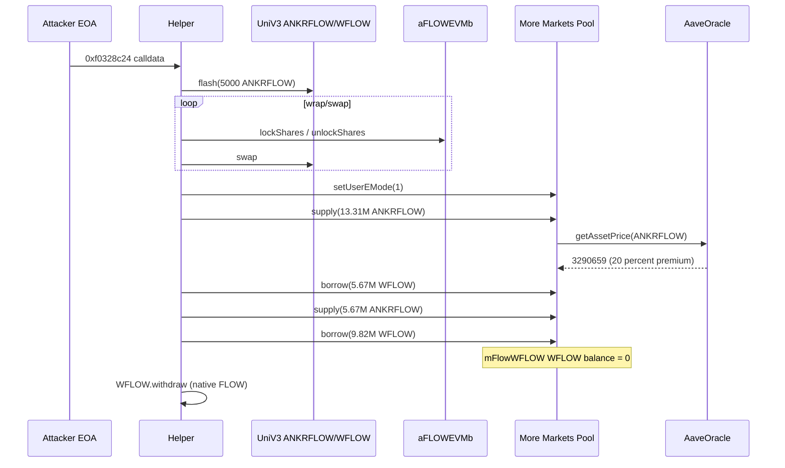
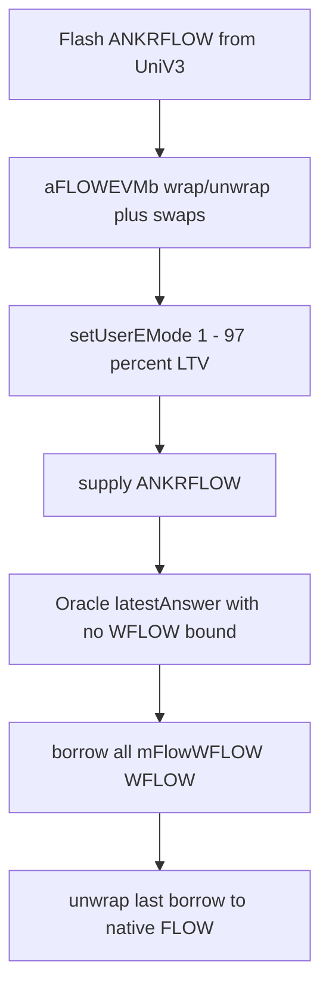

# More Markets (Flow EVM) — Ankr bonded LST + 97% E-mode drains the WFLOW reserve

<!-- non-defihacklabs: Crypto Training original detection & analysis (Twitter hack alerting) -->

> **Vulnerability classes:** vuln/oracle/wrong-feed · vuln/oracle/missing-validation · vuln/logic/price-calculation

> **Reproduction:** isolated Foundry project at [this folder](.). Full verbose trace: [output.txt](output.txt).
> The PoC replays the live helper calldata from attack tx [`0x2b2e6ea6…`](https://evm.flowscan.io/tx/0x2b2e6ea6cc7dabeec83941abfdc22dd7fa53a58f327af0fccb73a0ed8a3f66c9) against fork block **76,986,327**.

---

## Key info

| | |
|---|---|
| **Loss** | **15,488,124.145 WFLOW** emptied from `mFlowWFLOW` (~**$9.3M** detector impact at Blockaid's print). Helper keeps **9,819,641.048 native FLOW** after unwrapping the last borrow plus **13,307,608.86 aANKRFLOW** collateral left in the pool. |
| **Vulnerable contract** | More Markets Pool proxy [`0xbC92aaC2…2c8d`](https://evm.flowscan.io/address/0xbC92aaC2DBBF42215248B5688eB3D3d2b32F2c8d) → impl [`Pool`](https://evm.flowscan.io/address/0x91eB147463a84112a57DAd27a180cDfDd628806B) ([sources/Pool_91eB14](sources/Pool_91eB14)); pricing via [`AaveOracle`](https://evm.flowscan.io/address/0x7287f12c268d7Dff22AAa5c2AA242D7640041cB1) ([sources/AaveOracle_7287f1](sources/AaveOracle_7287f1)) |
| **Drained aToken** | `mFlowWFLOW` [`0x02BF4bd0…c059`](https://evm.flowscan.io/address/0x02BF4bd075c1b7C8D85F54777eaAA3638135c059) |
| **Collateral** | Ankr Staked FLOW (`ANKRFLOW` / `ankrFLOWEVM`) [`0x1b97100e…4bdb`](https://evm.flowscan.io/address/0x1b97100eA1D7126C4d60027e231EA4CB25314bdb); bonded LST `aFLOWEVMb` [`0xd6Fd0216…8d4A`](https://evm.flowscan.io/address/0xd6Fd021662B83bb1aAbC2006583A62Ad2Efb8d4A) |
| **Attacker EOA** | [`0xa1E4B05F…A7Cc`](https://evm.flowscan.io/address/0xa1E4B05F9A0425136045D8fC8A4978B25bB6A7Cc) |
| **Attack helper** | [`0xA0C2fe72…3702`](https://evm.flowscan.io/address/0xA0C2fe72aD9b640994A9c4252F25Fb058DDb3702) (unverified; deploy [`0xca9cf3f4…`](https://evm.flowscan.io/tx/0xca9cf3f4600f337027611d69fad7392093afc21e2f195364269a6d3ddbfc971c) @ 76,984,490) |
| **Attack tx** | [`0x2b2e6ea6cc7dabeec83941abfdc22dd7fa53a58f327af0fccb73a0ed8a3f66c9`](https://evm.flowscan.io/tx/0x2b2e6ea6cc7dabeec83941abfdc22dd7fa53a58f327af0fccb73a0ed8a3f66c9) @ block **76,986,328** |
| **Chain / block / date** | Flow EVM (chainId **747**) / fork **76,986,327** / 2026-08-31 |
| **Compiler** | Pool impl Solidity **v0.8.10+commit.fc410830**, optimizer **100000 runs**, evm **berlin** (per Blockscout `_meta.json`) |
| **Bug class** | Aave v3 MOST Mode (E-mode cat 1, **97% LTV**) + Ankr bonded LST wrap against a FLOW-correlated oracle — attacker supplies `ANKRFLOW` and empties the WFLOW reserve |
| **Alert** | [Blockaid](https://x.com/blockaid_/status/2094317778719142172) · [thread](https://x.com/blockaid_/status/2094317956498850146) |

---

## TL;DR

1. More Markets is an **Aave v3 fork** on Flow EVM. `ANKRFLOW` and `WFLOW` sit in **MOST Mode / E-mode category 1** with **97% LTV / 97.5% LT**.
2. `AaveOracle.getAssetPrice` returns the ANKRFLOW aggregator `latestAnswer()` with **no LST/WFLOW exchange-rate sanity check**. At the fork the feed prints ANKRFLOW **$0.03290659** vs WFLOW **$0.02742558** (~**20% premium**), i.e. the Ankr ratio feed × FLOW.
3. The attacker helper flashes **5,000 ANKRFLOW** from the 1-bp UniV3 pool, loops `aFLOWEVMb.lockShares` / `unlockShares` + UniV3 swaps to scale an ANKRFLOW inventory, then `setUserEMode(1)`, **supplies 13.31M ANKRFLOW**, and **borrows the entire 15.49M WFLOW reserve** in two borrows (5.67M + 9.82M).
4. This PoC forks one block before the drain and replays the live helper calldata. Trace: reserve **15,488,124.145 → 0 WFLOW**; helper **+9,819,641.048 native FLOW** (last borrow unwrapped) ([output.txt](output.txt)).

---

## Background

[More Markets](https://docs.more.markets/more-markets/openapi) is More Labs' Aave v3 market on Flow EVM (`Pool-Proxy-Flow` `0xbC92aaC2…`). **MOST Mode** is Aave E-mode: correlated assets share a high LTV so a user can borrow WFLOW against ankrFLOW as if they were the same FLOW risk.

Ankr's Flow LST is the usual two-token design:

| Token | Address | Role |
|---|---|---|
| `ANKRFLOW` (share / cert) | `0x1b97100e…` | Non-rebasing share; `ratio ≈ 0.8355` so 1 share ≈ 1.20 FLOW |
| `aFLOWEVMb` (bond / bearing) | `0xd6Fd0216…` | Rebasing bond; `lockShares` / `unlockShares` convert certs ↔ bonds at `ratio()` plus a swap fee |

`FlowStakingPool` (`0xFE8189A3…`) `stakeCerts` / `stakeBonds` mint those tokens against native FLOW. The ANKRFLOW/WFLOW UniV3 pool (`0xbB577ac5…`, fee **100 = 1 bp**) held **46.8M WFLOW vs 0.83M ANKRFLOW** pre-attack — extremely unbalanced.

---

## The vulnerable code

Verified `AaveOracle` ([sources/AaveOracle_7287f1](sources/AaveOracle_7287f1)):

```solidity
function getAssetPrice(address asset) public view override returns (uint256) {
    AggregatorInterface source = assetsSources[asset];
    if (asset == BASE_CURRENCY) {
        return BASE_CURRENCY_UNIT;
    } else if (address(source) == address(0)) {
        return _fallbackOracle.getAssetPrice(asset);
    } else {
        int256 price = source.latestAnswer();
        if (price > 0) {
            return uint256(price); // no LST ratio / WFLOW deviation bound
        } else {
            return _fallbackOracle.getAssetPrice(asset);
        }
    }
}
```

ANKRFLOW's source `0xb9C94fC6…` is a ratio adapter: `getRatioFor(ANKRFLOW) * FLOW/USD`. The oracle accepts any positive answer. Combined with E-mode 97% LTV on the Pool:

```solidity
function borrow(...) public virtual override {
    BorrowLogic.executeBorrow(
        ...,
        DataTypes.ExecuteBorrowParams({
            ...
            userEModeCategory: _usersEModeCategory[onBehalfOf],
            ...
        })
    );
}
```

`setUserEMode(1)` switches the helper into the 97% LTV FLOW basket ([Pool.sol:687](sources/Pool_91eB14/contracts_protocol_pool_Pool.sol)). After that, `supply(ANKRFLOW)` + `borrow(WFLOW)` is sized against the 20% premium feed, not against the UniV3 spot or a circuit breaker.

The bonded-token wrap is not itself a mint bug — `aFLOWEVMb.ratio()` is **1e18** at this block and `lockShares`/`unlockShares` convert 1:1 minus the Ankr swap fee — but it is the **bridge the helper uses** to recycle ANKRFLOW through UniV3 while growing inventory.

---

## Root cause

Three config/oracle choices stacked:

1. **MOST Mode 97% LTV** treats ANKRFLOW as highly correlated with WFLOW (Aave's e-mode assumption: LST ≈ underlying).
2. **Oracle is a single ratio×FLOW feed** (`latestAnswer() > 0` only). It does not cap ANKRFLOW vs WFLOW, does not read Ankr unstake liquidity, and does not look at UniV3.
3. **ANKRFLOW was borrowable-against at that LTV while the WFLOW reserve was 15.5M**. One helper tx can flash-mint/swap a large ANKRFLOW inventory, post it as e-mode collateral, and take the whole reserve.

The protocol is then left holding 13.31M ANKRFLOW as collateral against 15.49M WFLOW variable debt. WFLOW lenders see a 100% utilization empty reserve. That is the drain Blockaid reported.

---

## Preconditions

- `ANKRFLOW` listed as collateral in E-mode category 1 (LTV 9700 bps).
- `AaveOracle` ANKRFLOW source live and printing a premium to WFLOW (here 3,290,659 vs 2,742,558, 8-dec USD).
- `mFlowWFLOW` has **≥ 15.5M WFLOW** available (`IERC20(WFLOW).balanceOf(aToken)`).
- Helper already deployed (nonce-0 create at block 76,984,490).
- 1-bp ANKRFLOW/WFLOW UniV3 pool exists for the flash + wrap loop.

---

## Attack walkthrough

Replay of helper calldata `0xf0328c24…` as the attacker EOA ([output.txt](output.txt)):

1. **Flash 5,000 ANKRFLOW** from UniV3 `flash(helper, 5000e18, 0, data)` ([output.txt:458](output.txt)).
2. **Bonded-LST recycle loop** — dozens of `aFLOWEVMb.unlockShares` / UniV3 `swap` cycles grow the ANKRFLOW inventory (e.g. unlock 5,000.5 → 998.75 → 1,198.47 → … → tens of millions; [output.txt:562](output.txt)–[output.txt:2808](output.txt)).
3. **`setUserEMode(1)`** — helper joins MOST Mode ([output.txt:7044](output.txt), `UserEModeSet(helper, 1)`).
4. **Supply 7,639,125.76 ANKRFLOW** as e-mode collateral ([output.txt:7150](output.txt)).
5. **Borrow 5,668,483.10 WFLOW** ([output.txt:7310](output.txt)).
6. **Restake/supply that 5.67M** as more ANKRFLOW ([output.txt:7564](output.txt)).
7. **Borrow the remaining 9,819,641.05 WFLOW** — reserve goes to **0** ([output.txt:7695](output.txt)).
8. **Unwrap the last borrow** to native FLOW on the helper (`WFLOW.withdraw`).

PoC numbers ([output.txt](output.txt) `[PASS] testExploit()`):

| Metric | Value |
|---|---|
| Oracle WFLOW | 2,742,558 (USD 8 dec) |
| Oracle ANKRFLOW | 3,290,659 (USD 8 dec) |
| Reserve before | 15,488,124.145039037279216226 WFLOW |
| Reserve after | 0 |
| Drained | **15,488,124.145039037279216226 WFLOW** |
| Helper native FLOW | **9,819,641.048248619079430997** |
| Gas | 9,717,833 |

---

## Diagrams





---

## Remediation

- **Delist or freeze ANKRFLOW as e-mode collateral** until the LST oracle is a bounded WFLOW/FLOW adapter with a max premium (e.g. 2–5%) and a liquidity cap versus the WFLOW reserve.
- **Do not pair 97% LTV e-mode with a ratio feed** that can print ANKRFLOW 20% above WFLOW while Ankr unstake is queued/illiquid.
- Add a **borrow cap** on WFLOW tightly below the amount one LST inventory can theoretically take: `borrowCap <= ANKRFLOW_supply_cap * ltv * oraclePremium`.
- Pause `supply`/`borrow` on the FLOW basket via the emergency admin (`0x1a638EdA…`) when utilization spikes or UniV3 ANKRFLOW/WFLOW skews.
- Circuit-break `getAssetPrice` if `ANKRFLOW/WFLOW − 1` exceeds a governance parameter.

---

## How to reproduce

```bash
cd evm-hack-registry
# offline (anvil --load-state), after anvil_state.json is present:
_shared/run_poc.sh 2026-08-MoreMarkets_exp -vvvvv

# online archive fork (Flow EVM public RPC):
cd 2026-08-MoreMarkets_exp
FLOW_RPC_URL=https://mainnet.evm.nodes.onflow.org forge test --match-test testExploit -vvvvv
```

Fork block **76,986,327**. The test `vm.prank`s the attacker EOA into the already-deployed helper with the historical calldata.

Verified sources live under [sources/](sources/) (pulled from Flow Blockscout; Etherscan V2 does not list chainId 747).

---

*Reference: https://x.com/blockaid_/status/2094317778719142172*
