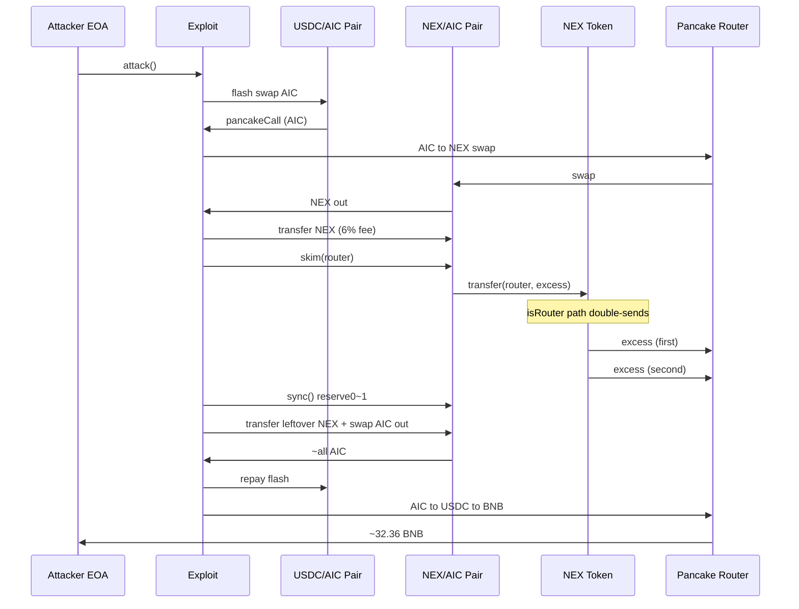
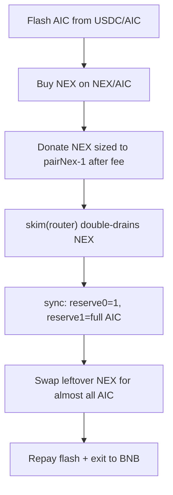

# NEX/AIC FoT Skim — Router Double-Transfer + Sell Fee Lets skim() Empty the Pair

<!-- non-defihacklabs: Crypto Training original detection & analysis (Twitter hack alerting) -->

> **Vulnerability classes:** vuln/logic/incorrect-state-transition · vuln/defi/fee-manipulation · vuln/logic/missing-check

> **Reproduction:** the PoC compiles & runs in an isolated Foundry project at
> [this project folder](.). Full verbose trace: [output.txt](output.txt).
> Verified vulnerable source: [NEX flatten](sources/NEX_ae04ae/contracts_flatten_nexus_nex.sol).

---

## Key info

| | |
|---|---|
| **Loss** | **~32.36 BNB (~$19.1K)** (`32361267289208020008` wei) — exact match to the live attack tx |
| **Vulnerable contract** | `NEX` (fee-on-transfer ERC20) — [`0xaE04AE29bdB7aB7Eb249d3aFa7Bc3D37564e8Cf9`](https://bscscan.com/address/0xae04ae29bdb7ab7eb249d3afa7bc3d37564e8cf9#code) |
| **Victim pool** | PancakeV2 NEX/AIC — [`0x974C0078740480aE830D379fDB8d5f441C9dDC75`](https://bscscan.com/address/0x974c0078740480ae830d379fdb8d5f441c9ddc75) |
| **Flash-loan source** | PancakeV2 USDC/AIC — [`0xe89636FB73D04Db51e5Fbd0Ce1379fb8d2b96415`](https://bscscan.com/address/0xe89636fb73d04db51e5fbd0ce1379fb8d2b96415) |
| **Attacker EOA** | [`0xC3cB0872C42BFA5EB3B0258D7EEA2cCaF6a49475`](https://bscscan.com/address/0xc3cb0872c42bfa5eb3b0258d7eea2ccaf6a49475) |
| **Attack contract** | [`0x29977d9B8a888B17BFfA2958b003956a5E8BE69A`](https://bscscan.com/address/0x29977d9b8a888b17bffa2958b003956a5e8be69a) (deployed in the attack tx) |
| **Attack tx** | [`0x905cc861bcc525d3a8e699583943831b97500bbac11c92dc20ed6edbddd69f87`](https://bscscan.com/tx/0x905cc861bcc525d3a8e699583943831b97500bbac11c92dc20ed6edbddd69f87) |
| **Chain / block / date** | BSC / 113,782,391 (pre-attack) · attack mined in 113,782,392 / 2026-08-03 |
| **Compiler** | Solidity v0.8.18+commit.87f61d96, optimizer **enabled**, **200 runs** |
| **Bug class** | Missing `return` after the router fee-exemption branch in `_transfer` causes a **double ERC20 transfer** whenever `from`/`to` is the Pancake router; combined with a 6% AMM sell fee, `skim(router)` drains 2× excess NEX from the pair so `sync()` freezes a ~1-wei NEX reserve and leftover NEX buys nearly all AIC |

---

## TL;DR

1. NEX is a fee-on-transfer token with a **6% dao sell fee** when the recipient is an AMM pair, and a special branch that is meant to **skip fees** when either side of the transfer is the Pancake router ([contracts_flatten_nexus_nex.sol:1720-1743](sources/NEX_ae04ae/contracts_flatten_nexus_nex.sol#L1720-L1743)).

2. The router branch calls `super._transfer` and then **falls through** into the unconditional final `super._transfer` — there is no `return`. Every transfer that touches the router therefore **moves the amount twice**.

3. The attacker flash-borrows the USDC/AIC pair's AIC reserve, buys NEX on NEX/AIC, then donates NEX into the pair sized so the after-fee credit equals (pair NEX balance − 1).

4. They call `pair.skim(pancakeRouter)`. Skim tries to send the excess NEX to the router; the double-transfer bug sends it **twice**, emptying the pair's NEX balance down to 1 wei. `sync()` freezes `reserve0 ≈ 1`, `reserve1 ≈ full AIC`.

5. Leftover NEX is sold with a direct `pair.swap` against that near-zero NEX reserve, draining essentially the entire AIC side. After repaying the flash loan, remaining AIC is routed AIC → USDC → BNB for **32.361267289208020008 BNB**.

---

## Background

NEX (`0xaE04…8Cf9`) is a BSC ERC20 ("NEX") that pairs with AIC (`0xc0DC…cE74`) on PancakeSwap V2. On construction it creates the NEX/AIC pair and marks it as an automated market maker pair. Owner-configurable `daoFee` / `nodeFee` (at attack time **6% + 0%**) are charged on sells into AMM pairs and sent to `daoAddress` / `nodeAddress` (both set to `0x0f7e…7CB5`).

A second branch is intended to exempt the Pancake router from fees so multi-hop routing does not break. That branch is where the critical control-flow bug lives.

---

## The vulnerable code

```solidity
// sources/NEX_ae04ae/contracts_flatten_nexus_nex.sol (excerpt)
function _transfer(address from, address to, uint256 amount) internal override {
    // ...
    bool isSell = automatedMarketMakerPairs[to];
    bool isRouter = (from == uniswapV2Router || to == uniswapV2Router);

    if (isRouter){
        super._transfer(from, to, amount);   // first send
    } else if (isSell){
        uint256 daoTokens = amount.mul(daoFee).div(100);
        uint256 nodeTokens = amount.mul(nodeFee).div(100);
        amount = amount.sub(daoTokens).sub(nodeTokens);
        if (daoTokens > 0) super._transfer(from, daoAddress, daoTokens);
        if (nodeTokens > 0) super._transfer(from, nodeAddress, nodeTokens);
    }

    super._transfer(from, to, amount);       // ALWAYS runs — doubles the router path
}
```

**Bug:** the `isRouter` branch does not `return`. The final `super._transfer` always executes, so router-touching transfers debit the sender **twice**.

**Sell fee (intended):** when `to` is the NEX/AIC pair, 6% goes to the dao wallet and 94% reaches the pair. That alone is not catastrophic for a supporting-fee router path, but it is load-bearing for the skim sizing below.

---

## Root cause

Two interacting defects:

1. **Double-transfer on router path** — control-flow fall-through after the fee-exemption branch. Any `token.transfer(router, x)` (including the internal transfer performed by UniswapV2 `skim(router)`) attempts to move `2x` out of the sender.

2. **Composable with pair accounting** — UniswapV2 `skim(to)` sends `balance − reserve` of each token to `to` without updating reserves. Pointing `to` at the router makes the pair the sender of a router-bound transfer, so the bug pulls **2× excess** NEX out of the pair. A carefully chosen donation makes `2 × excess ≈ balance`, leaving ~1 wei of NEX. `sync()` then freezes `reserve0 = 1` while `reserve1` still holds essentially the full AIC inventory. Constant-product math with `reserveIn = 1` lets a modest leftover NEX balance extract nearly all AIC.

This is a smart-contract logic bug (incorrect transfer control flow + FoT/AMM interaction), not key compromise or phishing.

---

## Preconditions

- NEX/AIC PancakeV2 pair exists and is marked `automatedMarketMakerPairs[pair] = true`.
- `daoFee = 6`, `nodeFee = 0` (or any positive sell fee that still leaves enough NEX to size the donation).
- Sufficient AIC in the USDC/AIC pair to flash-borrow a large notional (pre-attack ~42.98M AIC).
- Attacker can deploy a contract that implements `pancakeCall` and is willing to use `skim(router)` (public pair method).

---

## Attack walkthrough

Numbers from the offline PoC ([output.txt](output.txt)), which reproduces the live tx profit to the wei.

### 1. Flash-borrow AIC

`USDC/AIC.sync()` then `swap(0, aicBalance − 1, exploit, "1")` flash-borrows essentially the entire AIC reserve (~42.98M AIC).

### 2. Buy NEX

`swapExactTokensForTokensSupportingFeeOnTransferTokens(AIC → NEX)` spends the flash AIC for **~33.78M NEX**. After this swap the NEX/AIC pair holds ~31.74M NEX and ~83.26M AIC.

### 3. Donate + skim(router) + sync

Size a NEX transfer so that after the 6% sell fee the pair is credited with exactly `pairNex − 1`:

```text
sendAmount = (pairNex - 1) * 100 / 94
```

Then:

1. `NEX.transfer(pair, sendAmount)` — dao takes 6%, pair receives the rest.
2. `pair.skim(pancakeRouter)` — intended excess ≈ `pairNex − 1`; the double-transfer bug moves **2× that amount** to the router, leaving **1 wei NEX** in the pair.
3. `pair.sync()` — freezes `reserve0 = 1`, `reserve1 ≈ 83.26M AIC`.

### 4. Drain AIC

Transfer the attacker's remaining NEX into the pair (another 6% fee) and call `pair.swap(0, amountOut, exploit, "")` with Pancake's 0.25% `getAmountOut` formula. With `reserveIn = 1`, `amountOut` is almost the entire AIC reserve (~83.26M AIC).

### 5. Repay and exit

Repay the USDC/AIC flash (`amount1 * 10026 / 10000 + 1`), then `swapExactTokensForETHSupportingFeeOnTransferTokens(AIC → USDC → WBNB)` to the attacker EOA.

### 6. Profit

**32.361267289208020008 BNB** — identical to the live attack's net BNB transfer.

---

## Diagrams





---

## Remediation

1. **Fix control flow** — after the router exemption branch, `return` (or use `else if` / single exit). Never fall through into a second `super._transfer`.

```solidity
if (isRouter) {
    super._transfer(from, to, amount);
    return; // critical
} else if (isSell) {
    // fee logic ...
}
super._transfer(from, to, amount);
```

2. **Prefer balance-based AMM integrations** — if a token must take fees, document that only supporting-fee routers and pairs that re-measure balances are safe; still fix the double-send.

3. **Defensive pair ops** — protocols that hold FoT tokens should treat `skim`/`sync` as privileged and avoid allowing external actors to point skim at fee-sensitive addresses; the root fix remains in the token.

4. **Regression tests** — unit tests that `transfer(router, x)` moves exactly `x` (not `2x`), and that `pair.skim(router)` cannot empty the pair's token balance beyond the excess.

---

## How to reproduce

```bash
cd /path/to/evm-hack-registry
_shared/run_poc.sh 2026-08-NexAicFotSkim_exp -vvvvv
# expects [PASS] testExploit and ~32.36 BNB profit
```

Offline run uses `anvil_state.json` (fork block **113,782,391** on BSC). Online re-warm:

```bash
# with archive RPC in env
python3 _shared/run-poc/exhaustive_warm.py 2026-08-NexAicFotSkim_exp bsc "$BSC_RPC" --block=113782391
```

---

*Reference: https://x.com/TenArmorAlert/status/2084461507312857521*
