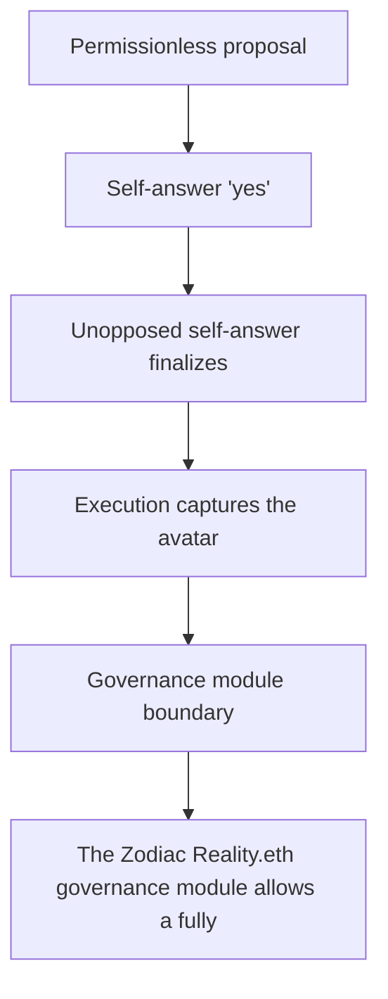

# Panther Protocol (Base): unopposed self-answered governance proposal captures the Safe

<!-- source-defihacklabs: https://github.com/SunWeb3Sec/DeFiHackLabs/pull/1209 (PantherBase_exp.sol) -->
<!-- defihacklabs-sol: https://github.com/SunWeb3Sec/DeFiHackLabs/blob/main/src/test/2026-08/PantherBase_exp.sol -->

> **Vulnerability classes:** vuln/logic · vuln/access-control

> **Reproduction:** a self-contained, faithful reconstruction of the incident's core
> bug — local deploy, **no fork** — both gates green (registry `forge test` PASS +
> browser Playground `VERDICT: PASS`). Basis: [DeFiHackLabs PR #1209](https://github.com/SunWeb3Sec/DeFiHackLabs/pull/1209)
> ([`PantherBase_exp.sol`](https://github.com/SunWeb3Sec/DeFiHackLabs/blob/main/src/test/2026-08/PantherBase_exp.sol), the upstream fork replay).

---

## Key info

| | |
|---|---|
| **Loss** | ~5.12M ZKP moved (pre-launch, no user funds lost) |
| **Chain** | Base |
| **Vulnerable contract** | `0xce01759b…` (Finding #2026: RealityModule) |
| **Bug class** | Finding #2026: RealityModule |

---

## Root cause

The Zodiac Reality.eth governance module allows a fully permissionless path with no safeguard against an unopposed self-answered proposal: anyone can (1) submit a governance proposal, (2) bond a yes answer to their OWN proposal, and (3) execute it once finalized. No competing no bond is required inside the challenge window, so an unopposed self-answer finalizes after the 12h timeout and executes - capturing the fund-holding Safe's authority to move ~5.12M ZKP to the attacker. No code bug and no stolen key; the missing safeguard is that the Reality.eth module was not disabled while there was no active governance proposal.

```solidity
    // @> VULN: anyone can bond a "yes" answer to their OWN question; there is no
```

## Why it's exploitable here

The Zodiac Reality.eth governance module allows a fully permissionless path with no safeguard against an unopposed self-answered proposal: anyone can (1) submit a governance proposal, (2) bond a yes answer to their OWN proposal, and (3) execute it once finalized. No competing no bond is required inside the challenge window, so an unopposed self-answer finalizes after the 12h timeout and executes - capturing the fund-holding Safe's authority to move ~5.12M ZKP to the attacker. No code bug and no stolen key; the missing safeguard is that the Reality.eth module was not disabled while there was no active governance proposal.

## Attack path



## Marked-line walkthrough (Playground)

The EVM Playground pins each step to the exact executed source line:

1. **L83** — Permissionless proposal: Anyone can submit a governance question to the Reality.eth / Zodiac module.
2. **L91** — Self-answer 'yes': The attacker bonds a 'yes' answer to their OWN proposal.
3. **L92** — Unopposed self-answer finalizes: Root cause: no safeguard requires a competing bond or an active proposal, so an unopposed self-answer simply finalizes after the 12h timeout.
4. **L95** — Execution captures the avatar: Once finalized, executeProposal runs the attacker's arbitrary call on the fund-holding Safe.
5. **L102** — Governance module boundary: The module is the only caller the Safe trusts - capturing it captures the funds.
6. **L108** — Exploit driver: The reproduction proposes, self-answers, advances past the timeout and executes.
7. **L113** — Setup: the fund-holding Safe: Setup: the pre-launch Safe holds the governance-controlled ZKP.
8. **L116** — Setup: capture accounting: Setup: the exploit tracks the ZKP it moves out of the Safe.

## PoC

Registry (Foundry, local deploy — faithful reconstruction + harm-asserting test):

```bash
cd 2026-08-PantherBase_exp
forge test -vvv
```

The browser Playground replays the same synthetic opcode-for-opcode and measures the
harm. Both gates are green (registry `forge test` PASS + Playground `_verify-poc`
**VERDICT: PASS**).

## Sources

- **Basis / upstream PoC:** [DeFiHackLabs PR #1209 — PantherBase_exp.sol](https://github.com/SunWeb3Sec/DeFiHackLabs/blob/main/src/test/2026-08/PantherBase_exp.sol) (fork replay of the on-chain tx).
- DeFiHackLabs incident collection: [SunWeb3Sec/DeFiHackLabs](https://github.com/SunWeb3Sec/DeFiHackLabs).
